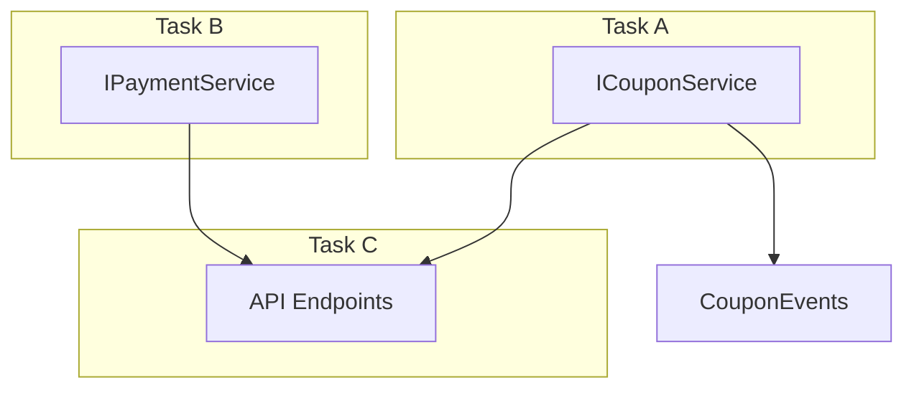

# Team Claude - 플러그인 스펙 문서

> Claude Code 플러그인으로 구현하는 멀티 에이전트 협업 시스템

---

## 1. 목적

### 1.1 비전

**사람은 설계와 판단에 집중하고, 구현은 완전히 위임하는 자동화된 개발 파이프라인 구축**

### 1.2 핵심 가치

| 가치 | 설명 |
|------|------|
| **컨텍스트 엔지니어링** | 단순 프롬프트가 아닌, 지속적인 맥락 공유와 피드백 루프 |
| **적절한 개입** | 모호한 부분은 사람이 판단, 명확한 부분은 AI가 실행 |
| **병렬 실행** | Contract 기반으로 독립적인 Task를 동시에 진행 |
| **시각적 확인** | Worker 진행 상황을 터미널에서 실시간 확인 |

### 1.3 역할 분담

```
┌─────────────────────────────────────────────────────────────┐
│                         사람 (Architect)                     │
│  • 아키텍처 설계                                              │
│  • 모호한 부분 판단 (UserAskQuestion 응답)                    │
│  • 최종 리뷰 승인                                            │
└─────────────────────────────────────────────────────────────┘
                              │
                              ▼
┌─────────────────────────────────────────────────────────────┐
│                    Main Claude (Orchestrator)                │
│  • 요구사항 → 스펙 구조화                                     │
│  • Task 분해 및 Worker 배분                                  │
│  • 결과 리뷰 및 피드백 생성                                   │
│  • 모호한 부분 에스컬레이션                                   │
└─────────────────────────────────────────────────────────────┘
                              │
                              ▼
┌─────────────────────────────────────────────────────────────┐
│                    Worker Claude (Executor)                  │
│  • Contract 기반 구현                                        │
│  • 테스트 작성                                               │
│  • 완료 조건 충족까지 반복                                    │
│  • 완료 보고                                                 │
└─────────────────────────────────────────────────────────────┘
```

### 1.4 기대 효과

```
Before: 사람 → 코드 → 리뷰 → 수정 → 반복 (모든 단계 직접 개입)

After:  사람 → 스펙 → [AI 병렬 구현] → 확인 → 승인
              ↑                    ↓
              └── 모호할 때만 개입 ──┘
```

---

## 2. Team Claude Workflow

### 2.1 전체 흐름 개요

```
┌─────────────────────────────────────────────────────────────────────────┐
│                        PHASE 1: 설치 및 환경설정                          │
│  ┌─────────────────────────────────────────────────────────────────┐    │
│  │  /team-claude:init                                              │    │
│  │  → 프로젝트 분석 → UserAskQuestion 인터뷰 → 에이전트 그룹 생성    │    │
│  │  → 완료 기준 정의 → Hook 설정 → 리뷰어 구성 → 터미널 설정         │    │
│  └─────────────────────────────────────────────────────────────────┘    │
└─────────────────────────────────────────────────────────────────────────┘
                                    │
                                    ▼
┌─────────────────────────────────────────────────────────────────────────┐
│                     PHASE 2: 요구사항 수집 및 정제                        │
│  ┌─────────────────────────────────────────────────────────────────┐    │
│  │  /team-claude:plan "요구사항"                                    │    │
│  │  → Outline 구조화 → Flow 도식화 (Mermaid)                        │    │
│  │  → Contract 정의 (Interface/Protocol)                           │    │
│  │  → Spec Review (에이전트) → QA 테스트 항목 도출                   │    │
│  │  → 병렬작업 가능성 검토 → Task 분해                               │    │
│  │                                                                 │    │
│  │  ↕ UserAskQuestion (모호한 부분은 사람에게 질문)                  │    │
│  └─────────────────────────────────────────────────────────────────┘    │
└─────────────────────────────────────────────────────────────────────────┘
                                    │
                                    ▼
┌─────────────────────────────────────────────────────────────────────────┐
│                       PHASE 3: 구현 및 피드백 루프                        │
│  ┌─────────────────────────────────────────────────────────────────┐    │
│  │  /team-claude:spawn task-a task-b task-c                        │    │
│  │  → Worktree 생성 → 터미널 세션 생성 (iTerm/tmux)                  │    │
│  │  → 각 Worker Claude 병렬 실행                                    │    │
│  │                                                                 │    │
│  │  Worker 완료 → Stop Hook → 서버 보고 → 사람에게 알림              │    │
│  │  사람 → Main에게 확인 요청 → 리뷰 → 피드백/머지                   │    │
│  │                                                                 │    │
│  │  ↕ 논의 필요 시 UserAskQuestion으로 에스컬레이션                  │    │
│  └─────────────────────────────────────────────────────────────────┘    │
└─────────────────────────────────────────────────────────────────────────┘
```

### 2.2 Phase 1: 설치 및 환경설정

```
/team-claude:init
        │
        ▼
┌───────────────────────────────────────┐
│      1. 프로젝트 자동 분석             │
│  • package.json, tsconfig 스캔        │
│  • 기존 테스트/린트 설정 감지          │
│  • 디렉토리 구조 파악                  │
└───────────────────────────────────────┘
        │
        ▼
┌───────────────────────────────────────┐
│      2. UserAskQuestion 인터뷰        │
│  • 프로젝트 도메인 (커머스? 금융?)      │
│  • 품질 기준 (성능? 안정성? 보안?)     │
│  • 팀 컨벤션 (코드스타일, PR 규칙)     │
└───────────────────────────────────────┘
        │
        ▼
┌───────────────────────────────────────┐
│      3. 에이전트 그룹 자동 생성        │
│  • Domain Expert (도메인 특화 리뷰)   │
│  • QA Agent (테스트 케이스 도출)      │
│  • Security Agent (보안 검토)        │
│  • Code Reviewer (코드 품질)         │
└───────────────────────────────────────┘
        │
        ▼
┌───────────────────────────────────────┐
│      4. 완료 조건 및 Hook 설정         │
│  • lint/typecheck 연동               │
│  • 테스트 커버리지 기준               │
│  • PR 템플릿 생성                    │
└───────────────────────────────────────┘
        │
        ▼
┌───────────────────────────────────────┐
│      5. 터미널 설정                   │
│  • iTerm2 / tmux / Terminal.app     │
│  • 레이아웃 (탭 / 화면분할)           │
└───────────────────────────────────────┘
```

### 2.3 Phase 2: 요구사항 수집 및 정제

```
User: "결제 시스템에 쿠폰 할인 기능 추가해줘"
        │
        ▼
┌───────────────────────────────────────┐
│   STEP 1: Outline 구조화              │
│                                       │
│   # 쿠폰 할인 기능                     │
│   ## 1. 쿠폰 등록/관리                 │
│   ## 2. 쿠폰 적용 로직                 │
│   ## 3. 결제 금액 계산                 │
│   ## 4. 쿠폰 사용 이력                 │
│                                       │
│   ↕ "쿠폰 중복 적용 가능?" → User 답변  │
└───────────────────────────────────────┘
        │
        ▼
┌───────────────────────────────────────┐
│   STEP 2: Flow 도식화 (Mermaid)       │
│                                       │
│   sequenceDiagram                     │
│     User->>API: 쿠폰 적용 요청         │
│     API->>CouponService: 유효성 검증   │
│     ...                               │
└───────────────────────────────────────┘
        │
        ▼
┌───────────────────────────────────────┐
│   STEP 3: Contract 정의               │
│                                       │
│   interface ApplyCouponRequest {      │
│     orderId: string;                  │
│     couponCode: string;               │
│   }                                   │
│                                       │
│   interface ApplyCouponResponse {     │
│     success: boolean;                 │
│     discountAmount: number;           │
│     finalAmount: number;              │
│   }                                   │
│                                       │
│   ↕ "할인 상한 있나요?" → User 답변     │
└───────────────────────────────────────┘
        │
        ▼
┌───────────────────────────────────────┐
│   STEP 4: Spec Review (에이전트)       │
│                                       │
│   Domain Expert:                      │
│     ✓ 결제 도메인 용어 일관성          │
│     ⚠️ 쿠폰 만료 처리 명시 필요        │
│                                       │
│   Security Agent:                     │
│     ⚠️ brute force 방지 필요          │
└───────────────────────────────────────┘
        │
        ▼
┌───────────────────────────────────────┐
│   STEP 5: QA 테스트 항목 도출          │
│                                       │
│   [정상] 유효한 쿠폰 적용              │
│   [예외] 만료된 쿠폰 에러              │
│   [엣지] 동시 사용 시도                │
└───────────────────────────────────────┘
        │
        ▼
┌───────────────────────────────────────┐
│   STEP 6: 병렬작업 가능성 검토         │
│                                       │
│   Task A: CouponService (독립)        │
│   Task B: PaymentService (독립)       │
│   Task C: API Endpoint (A,B 의존)     │
│   Task D: Admin UI (독립)             │
│                                       │
│   ✅ [A, B, D] 동시 시작 가능          │
│   ✅ C는 A,B Interface 확정 후 시작    │
└───────────────────────────────────────┘
```

### 2.4 Phase 3: 구현 및 피드백 루프

```
/team-claude:spawn task-a task-b task-d
        │
        ▼
┌───────────────────────────────────────────────────────────────┐
│                  Coordination Server                          │
│                                                               │
│  1. Worktree 생성                                             │
│     git worktree add ../worktrees/task-a -b feature/task-a   │
│                                                               │
│  2. Task Spec 작성                                            │
│     ../worktrees/task-a/CLAUDE.md ← Contract + 완료조건       │
│                                                               │
│  3. 터미널 세션 생성                                           │
│     iTerm/tmux에 새 탭/pane 열기                              │
│     cd ../worktrees/task-a && claude                         │
│                                                               │
│  4. 상태 기록                                                 │
│     workers["task-a"] = { status: "running", startedAt: ... } │
└───────────────────────────────────────────────────────────────┘
        │
        ▼
┌─────────────────────────────────────────────────────────────────┐
│                    터미널 (iTerm2 / tmux)                       │
│  ┌─────────────┐  ┌─────────────┐  ┌─────────────┐              │
│  │   Main      │  │  Worker A   │  │  Worker B   │              │
│  │  (탭 1)     │  │  (탭 2)     │  │  (탭 3)     │              │
│  │             │  │  구현 중... │  │  테스트 중..│              │
│  └─────────────┘  └──────┬──────┘  └─────────────┘              │
│                          │                                      │
│                     작업 완료                                    │
│                          │                                      │
│                     Stop Hook                                   │
│                          │                                      │
└──────────────────────────┼──────────────────────────────────────┘
                           ▼
┌───────────────────────────────────────────────────────────────┐
│                  Coordination Server                          │
│                                                               │
│  • 완료 보고 수신                                              │
│  • 상태 업데이트: workers["task-a"].status = "completed"      │
│  • 사람에게 알림 (macOS notification / Slack)                 │
└───────────────────────────────────────────────────────────────┘
                           │
                           ▼
                    [시스템 알림]
                  "Task-A 완료됨"
                           │
                           ▼
┌───────────────────────────────────────────────────────────────┐
│                     Main Claude 세션                          │
│                                                               │
│  User: "확인" (또는 /team-claude:status)                      │
│                                                               │
│  Main: "Task-A 완료됨. 리뷰할까요?"                            │
│  User: "응"                                                   │
│                                                               │
│  Main: [코드 리뷰 진행]                                        │
│        Domain Expert: ✓                                       │
│        Security: ⚠️ rate limiting 권장                        │
│                                                               │
│  Main: "rate limiting 추가할까요?"                             │
│  User: "응 추가해"                                             │
│                                                               │
│  Main: [Worker-A에 피드백 전달] or [직접 수정]                  │
└───────────────────────────────────────────────────────────────┘
```

### 2.5 완료 및 머지

```
모든 Task 완료
        │
        ▼
┌───────────────────────────────────────┐
│        최종 통합 검증                  │
│                                       │
│  Integration Test: ✓                  │
│  E2E Test: ✓                          │
│  Coverage: 85%                        │
│                                       │
│  전체 에이전트 최종 리뷰:              │
│    Domain Expert: ✓ 승인              │
│    Security: ✓ 승인                   │
│    QA: ✓ 모든 시나리오 통과            │
└───────────────────────────────────────┘
        │
        ▼
┌───────────────────────────────────────┐
│        완료 처리                       │
│                                       │
│  • 모든 PR → base branch 머지         │
│  • Worktree 정리                      │
│  • 완료 리포트 생성                   │
└───────────────────────────────────────┘
```

---

## 3. Slash Commands 상세 스펙

### 3.1 Command 목록 요약

| Command | 설명 | Phase |
|---------|------|-------|
| `/team-claude:init` | 프로젝트 초기 설정 | 1 |
| `/team-claude:setup` | 설정 변경 위자드 | 1 |
| `/team-claude:config` | 개별 설정 조회/수정 | 1 |
| `/team-claude:plan` | 요구사항 → 스펙 정제 | 2 |
| `/team-claude:spawn` | Worker 생성 및 실행 | 3 |
| `/team-claude:status` | Worker 상태 조회 | 3 |
| `/team-claude:review` | 완료된 Task 리뷰 | 3 |
| `/team-claude:feedback` | Worker에 피드백 전달 | 3 |
| `/team-claude:merge` | PR 머지 | 3 |
| `/team-claude:cleanup` | Worktree 정리 | 3 |

---

### 3.2 /team-claude:init

**목적**: 프로젝트 최초 설정. 프로젝트 분석 후 UserAskQuestion으로 인터뷰하여 최적화된 에이전트 그룹 구성.

**입력**
```
/team-claude:init
```

**동작**
1. 프로젝트 구조 자동 분석
   - package.json, tsconfig.json 파싱
   - 기존 lint/test 설정 감지
   - 디렉토리 구조 분석
2. UserAskQuestion 인터뷰
   - 도메인 영역
   - 품질 우선순위
   - 팀 컨벤션
3. 에이전트 그룹 생성
4. 완료 기준 정의
5. Hook 설정
6. 터미널 설정
7. `.team-claude/` 디렉토리에 설정 저장

**출력**
```
🔧 Team Claude 초기화 완료

📁 생성된 설정:
  .team-claude/
  ├── config.json
  ├── agents/
  │   ├── domain-expert.md (금융 도메인)
  │   ├── qa-agent.md
  │   └── security-agent.md
  ├── criteria/
  │   └── completion.json
  └── templates/
      └── worker.md

다음 단계: /team-claude:plan "요구사항"
```

---

### 3.3 /team-claude:setup

**목적**: 기존 설정 변경. 대화형 위자드로 설정 수정.

**입력**
```
/team-claude:setup [section]
```

**Arguments**
| Argument | 필수 | 설명 |
|----------|------|------|
| section | X | 특정 섹션만 설정 (server, worker, terminal, review, agents) |

**동작 (전체 설정 시)**
```
━━━ 1/5: 서버 설정 ━━━
서버 포트 [3847]: 
타임아웃 (초) [60]: 

━━━ 2/5: Worker 설정 ━━━
동시 Worker 최대 수 [5]: 
기본 템플릿 [standard]: 

━━━ 3/5: 터미널 설정 ━━━
실행 환경:
  1. iTerm2 (탭/분할)
  2. tmux (pane 분할)
  3. Terminal.app
  4. 수동
선택 [1]: 

레이아웃:
  1. tabs (탭으로 분리)
  2. split (화면 분할)
선택 [1]:

━━━ 4/5: 알림 설정 ━━━
완료 알림 방식:
  1. notification (시스템 알림)
  2. slack
  3. none
선택 [1]:

━━━ 5/5: 리뷰 설정 ━━━
리뷰 자동화 레벨:
  1. manual - 수동 리뷰 요청
  2. semi-auto - 완료 시 자동 리뷰
  3. full-auto - 피드백까지 자동
선택 [2]:
```

---

### 3.4 /team-claude:config

**목적**: 개별 설정 조회/수정

**입력**
```
/team-claude:config <action> [key] [value]
```

**Arguments**
| Argument | 필수 | 설명 |
|----------|------|------|
| action | O | get, set, list, reset |
| key | △ | 설정 키 (점 표기법) |
| value | △ | 설정 값 (set 시) |

**예시**
```bash
# 전체 설정 보기
/team-claude:config list

# 특정 값 조회
/team-claude:config get terminal.type

# 값 변경
/team-claude:config set worker.maxConcurrent 3

# 섹션 초기화
/team-claude:config reset terminal
```

---

### 3.5 /team-claude:plan

**목적**: 요구사항을 분석하여 구조화된 스펙과 Task로 분해

**입력**
```
/team-claude:plan "<요구사항>"
```

**Arguments**
| Argument | 필수 | 설명 |
|----------|------|------|
| 요구사항 | O | 자연어 요구사항 |

**동작**
1. Outline 구조화 (Outline Skill)
2. Flow 도식화 (Mermaid 생성)
3. Contract 정의 (Interface, Protocol, Payload)
4. Spec Review (에이전트 리뷰)
5. QA 테스트 항목 도출
6. 병렬작업 가능성 분석
7. Task 분해

**각 단계에서 모호한 부분은 UserAskQuestion으로 질문**

**출력**
```
📋 스펙 정제 완료

생성된 문서:
  .team-claude/specs/
  ├── outline.md
  ├── flows/
  │   └── main-flow.mermaid
  ├── contracts/
  │   ├── coupon-service.ts
  │   └── payment-service.ts
  └── tasks/
      ├── task-a.md (CouponService)
      ├── task-b.md (PaymentService)
      └── task-c.md (API Endpoint)

📊 병렬 실행 계획:
  Round 1: [task-a, task-b] 동시 시작
  Round 2: [task-c] (task-a, task-b 완료 후)

시작하시겠습니까? /team-claude:spawn task-a task-b
```

---

### 3.6 /team-claude:spawn

**목적**: Worker Claude 생성 및 실행

**입력**
```
/team-claude:spawn <task-id> [task-id...]
```

**Arguments**
| Argument | 필수 | 설명 |
|----------|------|------|
| task-id | O | 실행할 Task ID (복수 가능) |

**동작**
1. 각 Task에 대해:
   - Git worktree 생성
   - Task spec을 CLAUDE.md로 작성
   - 터미널 세션 생성 (설정에 따라 iTerm/tmux)
   - Claude 실행
2. Coordination Server에 상태 등록

**출력**
```
🚀 Worker 3개 시작

  [탭 2] task-a (CouponService)
         worktree: ../worktrees/task-a
         branch: feature/task-a
  
  [탭 3] task-b (PaymentService)
         worktree: ../worktrees/task-b
         branch: feature/task-b
  
  [탭 4] task-d (Admin UI)
         worktree: ../worktrees/task-d
         branch: feature/task-d

완료되면 알림을 보내드립니다.
상태 확인: /team-claude:status
```

---

### 3.7 /team-claude:status

**목적**: 전체 Worker 상태 조회

**입력**
```
/team-claude:status [task-id]
```

**Arguments**
| Argument | 필수 | 설명 |
|----------|------|------|
| task-id | X | 특정 Task만 조회 |

**출력**
```
📊 Worker 상태

┌────────────┬────────────┬──────────┬─────────────────────┐
│ Task       │ Status     │ Progress │ Note                │
├────────────┼────────────┼──────────┼─────────────────────┤
│ task-a     │ ✅ 완료     │ 100%     │ 리뷰 대기 중        │
│ task-b     │ 🔄 진행 중  │ 60%      │ 테스트 작성 중      │
│ task-c     │ ⏳ 대기     │ -        │ task-a,b 완료 대기  │
│ task-d     │ ✅ 완료     │ 100%     │ 리뷰 대기 중        │
└────────────┴────────────┴──────────┴─────────────────────┘

완료된 작업 리뷰: /team-claude:review task-a
```

---

### 3.8 /team-claude:review

**목적**: 완료된 Task 코드 리뷰

**입력**
```
/team-claude:review <task-id> [--agents=<agent-list>]
```

**Arguments**
| Argument | 필수 | 설명 |
|----------|------|------|
| task-id | O | 리뷰할 Task ID |
| --agents | X | 특정 에이전트만 사용 (쉼표 구분) |

**동작**
1. Task worktree의 git diff 수집
2. 설정된 에이전트들로 리뷰 실행
3. 피드백 분류 (auto-fixable / discussion-needed / blocking)
4. 결과 보고

**출력**
```
🔍 Task-A (CouponService) 리뷰 결과

📁 변경 사항:
  +src/services/coupon.service.ts (신규)
  +src/services/coupon.service.test.ts (신규)
  ~src/types/index.ts (수정)

🤖 에이전트 리뷰:

  Domain Expert:
    ✅ 금액 계산 로직 정확
    ✅ 도메인 용어 일관성
    
  Type Safety:
    ✅ strict null check 통과
    ✅ any 타입 없음
    
  Security:
    ⚠️ [L78] rate limiting 추가 권장
       → 자동 수정 가능
    
  QA:
    ✅ 테스트 커버리지 87%
    ✅ 엣지 케이스 포함

📋 요약:
  ✅ 통과: 4
  ⚠️ 권장: 1 (자동 수정 가능)
  ❌ 차단: 0

자동 수정을 적용할까요? [Y/n]
```

---

### 3.9 /team-claude:feedback

**목적**: Worker에 피드백 전달

**입력**
```
/team-claude:feedback <task-id> "<feedback>"
```

**Arguments**
| Argument | 필수 | 설명 |
|----------|------|------|
| task-id | O | 피드백 대상 Task |
| feedback | O | 피드백 내용 |

**동작**
1. 피드백 내용을 worktree의 `.claude/feedback.md`에 저장
2. Worker가 실행 중이면 다음 프롬프트에서 참조
3. Worker가 종료됐으면 재실행 필요 알림

**출력**
```
📤 피드백 전달 완료

대상: task-a (CouponService)
상태: 실행 중

피드백:
  "rate limiting 로직 추가해줘. 1분에 10회 제한."

Worker가 다음 동작에서 피드백을 확인합니다.
```

---

### 3.10 /team-claude:merge

**목적**: 완료된 Task PR 머지

**입력**
```
/team-claude:merge <task-id> [--squash] [--no-delete-branch]
```

**Arguments**
| Argument | 필수 | 설명 |
|----------|------|------|
| task-id | O | 머지할 Task ID |
| --squash | X | squash merge |
| --no-delete-branch | X | 머지 후 브랜치 유지 |

**동작**
1. 최종 검증 (lint, test, typecheck)
2. PR 머지 (base branch로)
3. 브랜치 정리 (옵션)
4. Worktree 정리 (옵션)

**출력**
```
✅ Task-A 머지 완료

  branch: feature/task-a → develop
  commits: 3
  files: +2, ~1
  
  worktree 정리됨: ../worktrees/task-a

남은 작업:
  - task-b: 진행 중
  - task-c: 대기 중 (task-b 완료 대기)
```

---

### 3.11 /team-claude:cleanup

**목적**: Worktree 및 리소스 정리

**입력**
```
/team-claude:cleanup [task-id | --all | --completed]
```

**Arguments**
| Argument | 필수 | 설명 |
|----------|------|------|
| task-id | X | 특정 Task만 정리 |
| --all | X | 모든 worktree 정리 |
| --completed | X | 완료된 것만 정리 |

**동작**
1. 대상 worktree 제거
2. 브랜치 정리 (옵션)
3. 서버 상태 정리

---

## 4. 계약 관련 스펙

### 4.1 계약 (Contract) 개념

**정의**: 구성 요소 간의 인터페이스 정의. 구현체 없이도 다른 Task가 작업을 시작할 수 있게 함.

```
┌─────────────────┐         ┌─────────────────┐
│    Task A       │         │    Task B       │
│  (구현체 작업)   │         │  (구현체 작업)   │
└────────┬────────┘         └────────┬────────┘
         │                           │
         ▼                           ▼
┌─────────────────────────────────────────────┐
│              Contract (Interface)            │
│                                             │
│  - 서로가 지켜야 할 약속                      │
│  - 구현 전에 합의                            │
│  - 이걸 기준으로 병렬 작업 가능               │
└─────────────────────────────────────────────┘
```

### 4.2 계약 유형

#### 4.2.1 Interface Contract

```typescript
// .team-claude/specs/contracts/coupon-service.ts

/**
 * 쿠폰 서비스 계약
 * 
 * 구현 Task: task-a
 * 사용 Task: task-b, task-c
 */
export interface ICouponService {
  /**
   * 쿠폰 유효성 검증
   * @throws CouponExpiredError - 만료된 쿠폰
   * @throws CouponUsedError - 이미 사용된 쿠폰
   */
  validate(code: string, orderId: string): Promise<CouponValidation>;
  
  /**
   * 쿠폰 적용
   * @throws CouponApplyError - 적용 실패
   */
  apply(code: string, orderId: string): Promise<ApplyResult>;
}

export interface CouponValidation {
  isValid: boolean;
  discountType: "percent" | "fixed";
  discountValue: number;
  maxDiscount?: number;  // 최대 할인 금액 (percent인 경우)
  minOrderAmount?: number;  // 최소 주문 금액
}

export interface ApplyResult {
  success: boolean;
  discountAmount: number;
  couponId: string;
}
```

#### 4.2.2 API Contract

```typescript
// .team-claude/specs/contracts/api-endpoints.ts

/**
 * API 엔드포인트 계약
 * 
 * 구현 Task: task-c
 */

/**
 * POST /api/orders/:orderId/coupon
 */
export interface ApplyCouponEndpoint {
  params: {
    orderId: string;
  };
  body: {
    couponCode: string;
  };
  response: {
    success: true;
    data: {
      discountAmount: number;
      finalAmount: number;
      couponId: string;
    };
  } | {
    success: false;
    error: {
      code: "COUPON_EXPIRED" | "COUPON_USED" | "COUPON_INVALID" | "MIN_ORDER_NOT_MET";
      message: string;
    };
  };
}
```

#### 4.2.3 Event Contract

```typescript
// .team-claude/specs/contracts/events.ts

/**
 * 이벤트 계약
 * 
 * 발행: task-a
 * 구독: task-b, 외부 시스템
 */
export interface CouponAppliedEvent {
  type: "coupon.applied";
  payload: {
    couponId: string;
    orderId: string;
    userId: string;
    discountAmount: number;
    appliedAt: string;  // ISO 8601
  };
}

export interface CouponExpiredEvent {
  type: "coupon.expired";
  payload: {
    couponId: string;
    expiredAt: string;
  };
}
```

### 4.3 계약 문서 구조

```
.team-claude/specs/contracts/
├── README.md                 # 계약 개요 및 의존성 그래프
├── interfaces/
│   ├── coupon-service.ts     # 쿠폰 서비스 인터페이스
│   └── payment-service.ts    # 결제 서비스 인터페이스
├── api/
│   ├── coupon-endpoints.ts   # 쿠폰 API 스펙
│   └── admin-endpoints.ts    # 어드민 API 스펙
├── events/
│   └── coupon-events.ts      # 쿠폰 관련 이벤트
└── types/
    └── common.ts             # 공통 타입 정의
```

### 4.4 계약 기반 Task 스펙

```markdown
# Task A: CouponService 구현

## 계약 (구현해야 할 것)
- `ICouponService` interface

## 의존 계약 (사용할 것)
- 없음 (독립 모듈)

## 파일 위치
- src/services/coupon.service.ts
- src/services/coupon.service.test.ts

## 완료 조건
- [ ] ICouponService 모든 메서드 구현
- [ ] 단위 테스트 커버리지 80% 이상
- [ ] 계약에 명시된 에러 타입 모두 처리
- [ ] lint/typecheck 통과

## 테스트 항목
1. validate() - 유효한 쿠폰
2. validate() - 만료된 쿠폰 → CouponExpiredError
3. validate() - 사용된 쿠폰 → CouponUsedError
4. apply() - 정상 적용
5. apply() - 동시 적용 시도 → 하나만 성공
```

### 4.5 계약 의존성 그래프

```
# .team-claude/specs/contracts/README.md

## 의존성 그래프



## 병렬 실행 가능 분석

| Task | 의존 | 병렬 가능 |
|------|------|----------|
| A (CouponService) | 없음 | ✅ Round 1 |
| B (PaymentService) | 없음 | ✅ Round 1 |
| C (API Endpoint) | A, B interface | ✅ Round 1 (interface만 필요) |
| D (Admin UI) | 없음 | ✅ Round 1 |

**참고**: Task C는 A, B의 **interface**만 있으면 시작 가능.
구현체는 나중에 연결.
```

### 4.6 계약 검증

```typescript
// .team-claude/scripts/validate-contracts.ts

/**
 * 계약 검증 스크립트
 * 
 * 실행: /team-claude:validate-contracts
 */

interface ValidationResult {
  task: string;
  contract: string;
  status: "pass" | "fail" | "partial";
  missing: string[];
  extra: string[];
}

// Worker 완료 시 자동 실행
// 구현체가 계약을 제대로 이행했는지 검증
```

---

## 5. Hook 이벤트 기반 알림 시스템

### 5.1 개요

Worker Claude의 상태를 **이벤트 기반**으로 감지하여 polling 없이 실시간 알림 구현.

```
┌─────────────────────────────────────────────────────────────┐
│                     Worker Claude 세션                       │
│                                                             │
│  작업 진행 중...                                             │
│         │                                                   │
│         ├── 질문 발생 ──→ AskUserQuestion 호출               │
│         │                      │                            │
│         │               PreToolUse Hook                     │
│         │                      │                            │
│         │                      ▼                            │
│         │              "Worker가 막혔음" 알림                 │
│         │                                                   │
│         └── 작업 완료 ──→ Stop 이벤트                        │
│                              │                              │
│                        Stop Hook                            │
│                              │                              │
│                              ▼                              │
│                      "Worker 완료" 알림                      │
│                                                             │
└─────────────────────────────────────────────────────────────┘
                               │
                               ▼
                    Coordination Server
                               │
                               ▼
                    사람에게 시스템 알림
```

### 5.2 감지 가능한 이벤트

| 이벤트 | Hook | 의미 | 알림 메시지 |
|--------|------|------|------------|
| 작업 완료 | `Stop` | Worker가 응답 완료 | "Task-A 완료됨" |
| 질문 발생 | `PreToolUse` (AskUserQuestion) | Worker가 판단 필요 | "Task-A가 질문 있음" |
| 장시간 대기 | `Notification` (idle_prompt) | 60초 이상 입력 대기 | "Task-A 응답 대기 중" |
| 권한 요청 | `Notification` (permission_prompt) | 권한 승인 필요 | "Task-A 권한 필요" |

### 5.3 Worker용 hooks.json

```json
{
  "hooks": {
    "Stop": [
      {
        "hooks": [
          {
            "type": "command",
            "command": "${CLAUDE_PLUGIN_ROOT}/hooks/scripts/worker-complete.sh"
          }
        ]
      }
    ],
    "PreToolUse": [
      {
        "matcher": "AskUserQuestion",
        "hooks": [
          {
            "type": "command",
            "command": "${CLAUDE_PLUGIN_ROOT}/hooks/scripts/worker-needs-help.sh"
          }
        ]
      }
    ],
    "Notification": [
      {
        "matcher": "idle_prompt",
        "hooks": [
          {
            "type": "command",
            "command": "${CLAUDE_PLUGIN_ROOT}/hooks/scripts/worker-idle.sh"
          }
        ]
      },
      {
        "matcher": "permission_prompt",
        "hooks": [
          {
            "type": "command",
            "command": "${CLAUDE_PLUGIN_ROOT}/hooks/scripts/worker-permission.sh"
          }
        ]
      }
    ]
  }
}
```

### 5.4 Hook 스크립트 상세

#### worker-complete.sh

```bash
#!/bin/bash
# Worker 작업 완료 시 실행

# stdin에서 이벤트 데이터 읽기
INPUT=$(cat)
SESSION_ID=$(echo "$INPUT" | jq -r '.session_id')
WORKTREE=$(basename "$CLAUDE_PROJECT_DIR")

# 서버에 완료 보고
curl -s -X POST "http://localhost:3847/complete" \
  -H "Content-Type: application/json" \
  -d "{
    \"worktree\": \"$WORKTREE\",
    \"sessionId\": \"$SESSION_ID\",
    \"status\": \"completed\",
    \"timestamp\": \"$(date -u +%Y-%m-%dT%H:%M:%SZ)\"
  }"

# macOS 알림
osascript -e "display notification \"$WORKTREE 작업 완료\" with title \"Team Claude\" sound name \"Glass\""
```

#### worker-needs-help.sh

```bash
#!/bin/bash
# Worker가 AskUserQuestion 호출 시 실행 (질문 발생)

INPUT=$(cat)
SESSION_ID=$(echo "$INPUT" | jq -r '.session_id')
QUESTION=$(echo "$INPUT" | jq -r '.tool_input.question // "질문 있음"')
WORKTREE=$(basename "$CLAUDE_PROJECT_DIR")

# 서버에 질문 보고
curl -s -X POST "http://localhost:3847/question" \
  -H "Content-Type: application/json" \
  -d "{
    \"worktree\": \"$WORKTREE\",
    \"sessionId\": \"$SESSION_ID\",
    \"question\": \"$QUESTION\",
    \"timestamp\": \"$(date -u +%Y-%m-%dT%H:%M:%SZ)\"
  }"

# macOS 알림 (긴급)
osascript -e "display notification \"$WORKTREE: 질문 있음\" with title \"Team Claude ⚠️\" sound name \"Ping\""
```

#### worker-idle.sh

```bash
#!/bin/bash
# 60초 이상 입력 대기 시 실행

INPUT=$(cat)
WORKTREE=$(basename "$CLAUDE_PROJECT_DIR")

# 서버에 idle 보고
curl -s -X POST "http://localhost:3847/status" \
  -H "Content-Type: application/json" \
  -d "{
    \"worktree\": \"$WORKTREE\",
    \"status\": \"idle\",
    \"timestamp\": \"$(date -u +%Y-%m-%dT%H:%M:%SZ)\"
  }"

# macOS 알림
osascript -e "display notification \"$WORKTREE 응답 대기 중\" with title \"Team Claude\""
```

### 5.5 Coordination Server API 확장

| Endpoint | Method | 설명 | Trigger |
|----------|--------|------|---------|
| `/complete` | POST | Worker 완료 보고 | Stop hook |
| `/question` | POST | Worker 질문 보고 | AskUserQuestion hook |
| `/status` | POST | Worker 상태 업데이트 | idle/permission hook |
| `/status` | GET | 전체 상태 조회 | Main Claude |
| `/pending` | GET | 대기 중인 알림 조회 | Main Claude |

### 5.6 Server의 Worker 상태 관리

```typescript
interface WorkerState {
  worktree: string;
  sessionId: string;
  status: "running" | "completed" | "waiting" | "idle" | "error";
  
  // 이벤트 히스토리
  events: WorkerEvent[];
  
  // 현재 대기 중인 질문 (있으면)
  pendingQuestion?: {
    question: string;
    timestamp: string;
  };
  
  // 완료 정보 (완료됐으면)
  completion?: {
    timestamp: string;
    summary?: string;
  };
}

interface WorkerEvent {
  type: "started" | "question" | "answered" | "idle" | "permission" | "completed";
  timestamp: string;
  data?: any;
}
```

### 5.7 알림 흐름 예시

```
┌─────────────────────────────────────────────────────────────────────┐
│  타임라인                                                            │
├─────────────────────────────────────────────────────────────────────┤
│                                                                     │
│  10:00  Worker-A 시작                                               │
│         └── SessionStart hook → 서버에 "running" 상태 등록           │
│                                                                     │
│  10:05  Worker-A가 AskUserQuestion 호출                              │
│         └── PreToolUse hook → 서버에 질문 보고                        │
│         └── 📱 알림: "Task-A: 질문 있음"                              │
│                                                                     │
│  10:06  사람이 Worker-A 탭으로 이동, 질문에 답변                       │
│         └── PostToolUse hook → 서버에 답변 완료 보고                  │
│                                                                     │
│  10:15  Worker-A 작업 완료                                           │
│         └── Stop hook → 서버에 완료 보고                              │
│         └── 📱 알림: "Task-A 완료됨"                                  │
│                                                                     │
│  10:16  사람이 Main 세션에서 "확인"                                   │
│         └── Main: "Task-A 완료됨. 리뷰할까요?"                        │
│                                                                     │
└─────────────────────────────────────────────────────────────────────┘
```

### 5.8 컨텍스트 엔지니어링과의 연결

이 이벤트 기반 시스템이 **컨텍스트 엔지니어링의 핵심 원칙**을 구현:

| 원칙 | 구현 |
|------|------|
| **모호한 부분은 사람이 판단** | AskUserQuestion → 즉시 알림 → 사람 개입 |
| **명확한 부분은 AI가 실행** | 질문 없이 진행 → Stop → 완료 알림 |
| **적절한 개입 타이밍** | 이벤트 발생 시점에 정확히 알림 |
| **불필요한 방해 최소화** | Polling 없음, 필요할 때만 알림 |

```
기존 (Polling):
  Main: "상태 확인" (30초마다)
  Main: "상태 확인" 
  Main: "상태 확인" 
  Main: "아, 질문이 있었네" (이미 5분 지남)

이벤트 기반:
  Worker: AskUserQuestion 호출
  → 즉시 알림
  → 사람 바로 개입
```

---

## 6. 부록

### 5.1 설정 파일 전체 스키마

```typescript
// .team-claude/config.json

interface TeamClaudeConfig {
  version: "1.0";
  
  server: {
    port: number;              // default: 3847
    host: string;              // default: "localhost"
    timeout: number;           // default: 60000 (ms)
  };
  
  worktree: {
    root: string;              // default: "../worktrees"
    branchPrefix: string;      // default: "feature/"
    cleanupOnMerge: boolean;   // default: true
  };
  
  worker: {
    maxConcurrent: number;     // default: 5
    defaultTemplate: string;   // default: "standard"
    timeout: number;           // default: 1800 (초)
  };
  
  terminal: {
    type: "iterm2" | "tmux" | "terminal" | "manual";
    layout: "tabs" | "split";
    maxPanes: number;          // default: 4
    sessionName: string;       // default: "team-claude"
  };
  
  notification: {
    method: "notification" | "slack" | "none";
    slack?: {
      webhookUrl: string;
      channel?: string;
    };
  };
  
  review: {
    autoLevel: "manual" | "semi-auto" | "full-auto";
    agents: string[];          // 사용할 에이전트 목록
    requireApproval: boolean;  // default: true
  };
  
  completion: {
    requiredChecks: string[];  // ["lint", "typecheck", "test"]
    coverageThreshold: number; // default: 80
  };
}
```

### 5.2 디렉토리 구조

```
project/
├── .team-claude/
│   ├── config.json              # 설정
│   ├── agents/                  # 커스텀 에이전트
│   │   ├── domain-expert.md
│   │   ├── qa-agent.md
│   │   └── security-agent.md
│   ├── templates/               # Worker 템플릿
│   │   └── worker.md
│   ├── criteria/                # 완료 기준
│   │   └── completion.json
│   └── specs/                   # 스펙 문서
│       ├── outline.md
│       ├── flows/
│       ├── contracts/
│       ├── qa/
│       └── tasks/
│
├── worktrees/                   # (프로젝트 외부)
│   ├── task-a/
│   ├── task-b/
│   └── task-c/
│
└── (기존 프로젝트 파일들)
```

---

*작성일: 2026-01-18*
*버전: 0.1.0-draft*