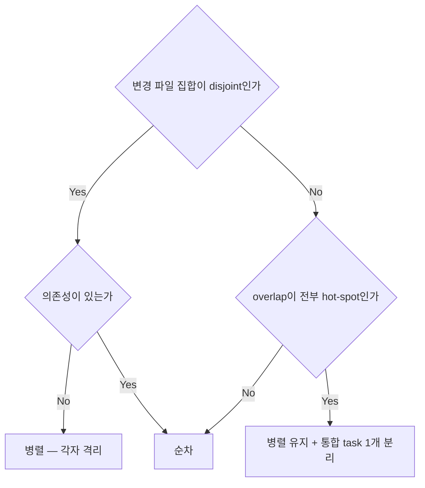

# Orchestrator — 결정 그래프 기반 스킬 재구조화

> **상태**: 설계 단계 — 협의체 검증 pass, 사용자 결정 8건(E1·E2·E5·E6·E7·E8·E10·E11) 대기 중, 구현 미착수
> **작성일**: 2026-09-07
> **계기**: 엣지케이스가 나올 때마다 산문이 덧붙어 결정 하나가 평균 10곳으로 파편화됐고, lazy loading 으로 일부 파일만 읽는 상황에서는 서로 어긋난 서술이 함께 살아남아 일관성이 깨진다. 구조를 **"결정 하나 = mermaid 그래프 하나 = 소유 파일 하나"** 로 바꿔 파편화를 기계적으로 막는다.
> **입력**: 조사 4건 — [`09a` 결정 인벤토리](09a-orchestrator-decision-inventory.md) · [`09b` 중복 지도](09b-orchestrator-duplication-map.md) · [`09c` 근거 인벤토리](09c-orchestrator-rationale-inventory.md) · [`09d` 외부 계약](09d-orchestrator-external-contracts.md). 관측 계기는 이슈 #883/#884 처리 런에서 나온 4곳 정합 사례.
> **문서 성격**: plan 이다 — [`plans/README.md`](../README.md) 의 "구현이 진행되면서 실제 구조와 어긋날 수 있으며, 어긋나도 업데이트하지 않습니다" 원칙이 그대로 적용된다. 현재 동작·정책의 신뢰 소스는 코드와 spec 이다.

---

- 범위: `plugins/atelier/skills/orchestrator/` (SKILL.md 230줄 + `references/` 10개 2,637줄 = 2,867줄) + **v2에서 추가**: 재발 방지 검증 스크립트(`scripts/`) 와 `Makefile` 연동 (E11)
- 입력: 조사 A(D01–D58) · B(X1–X13, B1–B5) · C(근거·안티패턴·체크리스트) · D(외부 계약·validator) · 심문 검증 verdict-v1.md(blocking 5 / major 14 / minor 9)
- 인용 규약: `파일:행`은 orchestrator 디렉토리 기준 상대경로. 조사 결과는 D/X/B/O-id, 심문 결과는 F-id 로 인용한다.
- 이 문서는 설계이며 repo 밖에 있다. 구현은 승인 후. *(작성 시점 서술 — 이후 `plans/atelier/09` 로 커밋됨)*

---

## 0. 문제 정의와 성공 기준

### 0.1 관측된 문제

1. **결정 하나가 평균 10곳에 흩어져 있다.** 서술 위치 3곳 이상인 결정이 58개 중 48개(83%) (A §요약 표). 최다 D03·D04 각 28곳 / 10파일.
2. **계약도 흩어져 있다.** 브랜치 네이밍 3파일(`branch:27-46`·`worktree:27`·`merge:57`), 보고 채널 3파일, 보고 형식 4파일 (F1-2).
3. **같은 규칙이 최대 5중.** 규칙 → 안티패턴(부정형) → 체크리스트(질문형) 3층이 파일마다 반복. "매 머지 직후 토폴로지 가드" 5곳 (C §4 말미).
4. **중복은 곧 모순이 된다.** 모순 13건(X1–X13). X1은 같은 문서 안 8 ↔ 7, X2는 금지된 연산을 복구 절차가 지시.
5. **참조가 조용히 깨진다.** 깨진 참조 5건(B1–B5), 번호 드리프트 26, 상대 지시 38. `references/` 실존 검사는 dead code (D §2 `path/validator.go:147-152`).
6. **lazy loading 과 상충한다.** SKILL.md 요지 5절이 본문과 어긋나기 시작하면 요지만 읽은 판정이 틀린다.

### 0.2 성공 기준

| # | 기준 | 측정 |
|---|---|---|
| S1 | 결정·계약·절차 **85개 항목**이 각각 정확히 한 파일에만 있다 | `## [DCP]##` heading 유일성 (§9.2 검사 1·2) |
| S2 | 새 엣지케이스를 넣을 자리가 기계적으로 결정되고, **위반이 CI 에서 잡힌다** | §8 메타 규칙 + §9.2 검사 6·7 (T19 로 repo 안 강제) |
| S3 | 모순 13건이 구조적으로 재발 불가능하다 | 소유가 하나면 두 곳이 다르게 말할 수 없다 + §9.4 grep |
| S4 | 외부 계약(절 이름 4·파일 3·용어 9·디렉터리명 1)이 살아 있다 | §9.3 grep |
| S5 | 3종 실런이 재구조화 전 기준선과 같은 게이트를 발동한다 | §9.5 (기준선 + 3종) |

토큰 감소는 결과일 뿐 목표가 아니다. 2,867 → **1,760~2,015줄**(평균 1,888, 34% 감소). 감량의 2/3는 안티패턴 91 + 체크리스트 142 삭제 (C §5).

---

## 1. 접근법 비교와 추천

### A안 — 결정별 파일 1:1 분할 (58~85개 파일)

- 장점: S1 이 정의상 성립. 소유 검증이 `ls` 로 끝난다.
- 버리는 이유:
  - 한 자리에서 내리는 결정들이 강제로 흩어진다. 표준 절차 3단계는 D14·D18·D19·D20 을 한 호흡에 정한다.
  - D17(서술 위치 1곳)·D55(2갈래)에 파일 하나를 주면 관리 포인트가 85개로 늘어난다 — **관리 포인트 축소 목표에 정면으로 반한다.**
  - 외부 참조 4개 절 이름·3개 파일명(D §6)을 유지할 자리가 사라져 전부 stub 이 필요하다.
  - `agent-design-principles/SKILL.md:92-96`(Skill 폭발 경고)·`:110`("줄 수 자체는 분리 판단 기준이 아니다")의 정신에 반한다.

### B안 — 결정 클러스터별 파일 (SKILL.md + references 10개) ★추천

- 클러스터 축: **"같은 시점에, 같은 입력 신호를 보고, 연달아 내리는 결정"**. 파일 = 판정 국면.
- 핵심: **소유의 입도(85)와 파일의 입도(11)를 분리**하고, 그 분리를 `owns:` 메타 + heading 규약 + repo 안 검증 스크립트로 기계화한다.
- 장점: 한 국면을 한 로드로 끝내면서 유일성을 강제한다. 외부 참조가 걸린 3개 파일명·4개 절 이름이 클러스터 경계와 일치해 stub 없이 보존된다(§2.3).

### C안 — 현 파일 유지 + 그래프만 삽입

- 버리는 이유: 중복의 원인("한 결정을 두 파일이 나눠 가짐", B §4.1 병합 후보 10주제)을 안 건드린다. 그래프를 넣으면 같은 결정의 그래프가 두 파일에 생겨 **모순이 그래프로 승격**된다. X11·B4 처럼 파일 경계 자체가 원인인 모순이 남는다.

### 추천: B안 + 검증 기제의 범위 내 편입

심문 지적(F2-1)의 핵심은 **"C안을 버린 근거가 B안 자신에게 되돌아온다"**였다. 문서 선언만으로는 파편화를 못 막는다. 따라서 v2 는 B안에 **T19(repo 안 검증 스크립트 + `make validate-ci` 연동)** 를 필수 구성요소로 편입한다. 이것 없이는 B안도 1회성 정리에 그친다.

---

## 2. 대상 구조

### 2.1 파일 목록과 소유 항목 (D 58 + C 16 + P 11 = 85)

`owns:` 는 파일 상단 HTML 주석에 둔다. 형식: `<!-- owns: D03 D04 … | C01 C16 | P01 -->`

| # | 파일 | 국면 | owns — 결정 | owns — 계약·절차 | 항목 | 예상 줄수 |
|---|---|---|---|---|---:|---:|
| F0 | `SKILL.md` | 항상 (라우터) | D01 D02 | P02 | 3 | 120~140 |
| F1 | `references/entry-gates.md` | 진입 즉시 — **필수** | D03 D04 D06 D07 **D45** D54 | C01 C16 / P01 | 9 | 175~195 |
| F2 | `references/architect-council.md` | 분해·설계 | D08 D09 D10 D12 D57 | C08 C09 **C14** / P04 | 9 | 165~185 |
| F3 | `references/dispatch-planning.md` | 실행 계획·위임 형태 | D05 D13 D14 D18 D19 D20 D25 D56 | C02 C03 / P10 | 11 | 210~235 |
| F4 | `references/investigation.md` | read-only 조사·원인분석 | D15 D16 D17 D23 D37 | — | 5 | 110~130 |
| F5 | `references/model-routing.md` | tier·자문 | D26 D27 D28 D29 | C07 C15 / P05 | 7 | 140~165 |
| F6 | `references/worktree-lifecycle.md` | 무거운 경로 확정 시 — **필수** | D21 D22 D51 | P06 P09 | 5 | 100~120 |
| F7 | `references/agent-monitor.md` | 진행 추적·보고 수령 | D33 D34 D35 D36 D38 D46 D55 | **C13** | 8 | 180~200 |
| F8 | `references/review-gates.md` | 검토·QA 게이트 | D24 D30 D31 D32 | P11 | 5 | 120~145 |
| F9 | `references/merge-coordinator.md` | 머지 조정 | D39 D40 D41 D42 D43 D44 D52 | C10 C11 C12 / P07 P08 | 12 | 215~245 |
| F10 | `references/autonomous-driving.md` | 자율 계약 수립·정지·종료 — 자율이면 **필수** | D11 D47 D48 D49 D50 D53 D58 | C04 C05 C06 / P03 | 11 | 225~255 |
| | **합계** | | **58** | **27** | **85** | **1,760~2,015** |

**v1 대비 변경**: D45(자율 vs HITL 모드)를 F10 → **F1** 로 이동 (F3-1). 필수 로드 조건의 자기참조가 사라진다 — 모드를 알려면 F10 을 열어야 하는데 F10 을 열지 말지를 모드가 정하던 순환이 끊긴다.

**58개 결정 전부 귀속, "결정 아님/삭제" 판정 0건.** 판정 메모 2건:
- **D55(Monitor)** — A 부록 B-8 이 "분기가 얕다"고 남겼다. 결정 유지, 그래프는 최소형(질문 1 + 종단 2). §3.4 상한에 걸리면 계약으로 강등.
- **D52(Authorship)** — 원문이 "author 보존은 프로젝트 판단"(A D52). 그 종단은 `→ D47` 로 닫는다 (E9, 협의체 종결).

**v3 판정 — C13 이동을 기본안으로 승격 (R-3)**: v2 는 F10 을 245~275 로 잡아 §3.4 파일 상한 260 을 상단에서 넘었고, C13 분리를 "예비안"으로만 뒀다. v3 는 이를 **기본안으로 확정**한다.

- 판정 기준은 "이 계약을 **쓰는 순간**이 어느 국면인가"다. C13 의 5개 항목(진입·진행·머지결과·fan-out 상태·종료) 중 3개가 루프 중 상시 발생하고, 그 국면을 소유한 것이 F7(진행 추적·보고 수령)이다. `monitor:119-132`·`:190-193` 이 이미 fan-out 상태 표와 정체·실패 보고 형식을 갖고 있던 것도 같은 사실을 가리킨다.
- 결과: F7 8항목 180~200 · F10 11항목 225~255 — **양쪽 다 파일 상한 260 안**이고, C13 의 **소유자는 여전히 1개**다. 진입·종료 보고를 쓰는 D45·D48·D50 종단은 `→ C13` 로 넘긴다(재서술 금지 준수).
- 함께 정정된 것: §2.2 C13 행 · §4.2 라우팅 표 두 행 · T9/T12 의 owns · §12.

### 2.2 계약 C01–C16 · 절차 P01–P11 의 소유 (F1-2)

출처는 A 부록 A2(계약 14) · A1(절차 11). 다중 서술이던 것은 **1곳으로 회수**한다.

| id | 계약 | 현행 위치 | 새 소유 | 비고 |
|---|---|---|---|---|
| C01 | 체크 0 — 조율 도구 스키마 확보 | `SKILL:49-51` · `delegation:188` · `autonomous:526` · `monitor:87` | F1 | 4곳 → 1. `InputValidationError` 고유 조각 회수(§6.1) |
| C02 | Prompt 필수 포함 요소 13개 | `delegation:47-62` | F3 | 3번 분기는 D56 |
| C03 | 보고 채널 계약 | `delegation:59,63-74` · `SKILL:224` · `monitor:39,247` | F3 | **3파일 → 1**. C02 11번에 통합 + 한 줄 근거 |
| C04 | **자율 계약 필드 + 예산·가드레일 값 표** | `autonomous:24-48`, `:334-346` | F10 | **모든 예산 값의 유일 소유처**(F9-2). B1·B2 가 지목한 `§자율 계약` heading 을 실제로 만든다 |
| C05 | decision log 기록 위치·시점·형식 | `autonomous:260-330` · `advisory:152-160` | F10 | 2파일 → 1 |
| C06 | 종료 핸드오프 기록 | `autonomous:470-482` | F10 | |
| C07 | 자문 입력 패킷 · 출력 계약 | `advisory:167-214` | F5 | |
| C08 | Task 도출 계약 | `council:102-114` | F2 | DB 접촉 필드가 D30 입력 |
| C09 | 설계 승인 마커 필수 필드 | `council:129-134` | F2 | 외부 용어 계약 |
| C10 | 브랜치 네이밍 규약 | `branch:27-46` · `worktree:27` · `merge:57` | F9 | **3파일 → 1** |
| C11 | 머지 방식 — rebase 후 `--ff-only` | `branch:136-157` | F9 | 원문이 "판정하지 않는다"(`branch:138`)라 계약 |
| C12 | 머지 직후 가드 불변식 목록 | `merge:80-86` | F9 | `merge:82` 유지보수 규칙 포함(§6.4) |
| C13 | 사용자 보고 형식 (진입·진행·머지결과·fan-out 상태·종료) | `SKILL:201-208` · `autonomous:486-497` · `merge:218-239` · `monitor:119-132,190-193` | **F7** | **4파일 → 1**. 각 결정 종단은 `→ C13`. **v3 에서 F10 → F7 이동(R-3)** |
| C14 | **대화 스킬의 자율 어댑테이션** | `council:57-68` | F2 | **A 부록 미수록 — v2 신설**. 외부 참조(`grill/SKILL.md:52`). 문장 단위 배정은 §6.6 |
| C15 | 자문 역할 제한(도구 보장 아님) · 수명 | `advisory:91-104`, `:226-233` | F5 | **A 부록 미수록 — v2 신설** |
| C16 | Task 시스템 사용법 (필드·의존성·owner) | `monitor:59-81` | F1 | **A 부록 미수록 — v2 신설**. D54 판정과 같은 파일 |

| id | 절차 | 현행 위치 | 새 소유 |
|---|---|---|---|
| P01 | 진입 절차 전체 흐름 | `SKILL:38-101` | F1 |
| P02 | 표준 절차 8단계 | `SKILL:105-116` | F0 (유일하게 순서 그래프를 갖는 절차) |
| P03 | 자율 실행 루프 의사코드 | `autonomous:56-107` | F10 |
| P04 | 협의체 루프 골격 | `council:70-93` | F2 |
| P05 | 자문 소집 절차 의사코드 | `advisory:116-144` | F5 |
| P06 | 병렬 dispatch 패턴 | `worktree:43-73` | F6 |
| P07 | 머지 표준 절차 8단계 | `merge:49-97` | F9 |
| P08 | 최종 통합 검증 게이트 4단계 | `merge:142-151` | F9 |
| P09 | 토폴로지 가드 복구 절차 | `merge:112-119` | F6 (D22 와 같은 파일 — X2 해소의 전제) |
| P10 | 충돌 위험 사전 분석 4단계 | `worktree:118-130` | F3 (D14 입력) |
| P11 | continuous review → improve 루프 (**A 부록 미수록 — v2 신설**) | `spec-review:73-97` | F8 |

A2 의 14번(안티패턴 목록 전부)과 A1 의 11번(체크리스트 전부)은 **삭제**이므로 id 를 부여하지 않는다 (§6.1·§6.2).

### 2.3 클러스터 경계의 축

축은 **판정 시점**이다. "이 항목들을 한 호흡에 쓰는가"가 유일한 기준이며 주제 유사성이 아니다.

| 파일 | 한 호흡의 근거 |
|---|---|
| F1 | `SKILL:38-101` 진입 절차가 체크 0 → 경로 게이트 → 체크 4 → 체크 5 를 연속 수행. 모드(D45)·Task 분리(D54)도 진입 직후 확정 (`SKILL:120-122`) |
| F2 | 표준 절차 1단계(`SKILL:107-108`): 소집(D08)→라운드(D09)→마커(D10)→분해 방식(D12). 루프 중 재분해(D57)가 같은 자리로 회귀 |
| F3 | 표준 절차 3단계(`SKILL:110`)가 병렬/순차·위임 형태를 한 번에 정하고 등급(D19)·isolation(D20)·spawn 확인(D05)·prompt 계약(C02·D56)이 이어짐 |
| F4 | 조사형 dispatch 하나를 설계하는 동안 관점 수(D15)·swarm 축(D16)·가설 진행(D17)·탐색 예산(D23)·증거 수용(D37)이 같은 계약에 얹힘 |
| F5 | `advisory:65-70`: 게이트 0(D27)이 트리거보다 먼저 평가되고 tier(D26)·관점(D28)·권고 처리(D29)가 같은 소집 안에서 이어짐 |
| F6 | dispatch 직전·직후에만 발동하는 가드 2개(D21·D22)와 수명의 끝(D51). 여는 시점이 다른 결정과 겹치지 않음 |
| F7 | `monitor:114-217`: dedup(D36)→idle(D34)→no-op(D35)→복원력(D38)→재위임(D33)이 한 판정 체인 |
| F8 | 게이트를 세우는 순간 구성(D30)·특수화(D32)·인프라 발견(D24)이 정해지고 verdict(D31)로 닫힘 |
| F9 | 머지 조정 8단계(`merge:49-97`)가 후보→순서→충돌→역방향→최종 검증→authorship 을 한 번에 돎 |
| F10 | 계약 수립 시점에 예산(D58)·spec 확정(D11)·integration_verify(D49)가 함께 확정되고 루프의 정지·종료(D47·D48·D50·D53)가 같은 계약을 읽음 |

**해체 4개**: `delegation-patterns.md`(461) · `branch-strategy.md`(226) · `advisory-consult.md`(283) · `spec-driven-review.md`(140).
근거(B §4): delegation 은 "9개 서로 다른 주제의 단일 출처를 한 파일이 가짐 — 실질 5~6개 문서의 합본"이며 in-degree 62 로 최대 허브인데 내부 응집이 없다. branch 는 자기 목차와 heading 이 3개 어긋난다(X11). advisory 는 "실질 3분할". spec-review 는 "고유 내용은 검증 질문 표와 `spec-unresolved` 뿐, 나머지 100줄은 재진술"이고 in=1 의 잎이다.

**신설 4개**: `entry-gates.md` · `dispatch-planning.md` · `investigation.md` · `review-gates.md`.

### 2.4 해체 4파일 전 구간 → 목적지 배정 (F7-1 blocking)

1,110줄 전량을 행 범위로 분할한다. 빈 구간이 없다. **writer task 는 목적지 파일의 소유 task 이며, 원본은 read-only 소스다**(F8-1).

#### `delegation-patterns.md` (461줄)

| 행 | 절 | 항목 | 목적지 |
|---|---|---|---|
| 1-11 | 서두·인용구 | — | T3 서두로 요약 흡수 |
| 12-42 | §단발 sub-agent vs agent team | D18 | T3 |
| 43-46 | §Prompt 작성 원칙 서두 | C02 | T3 |
| 47-62 | §필수 포함 요소 13개 | C02 (3번 분기 = D56) | T3 |
| 63-75 | §보고 채널을 빼면 생기는 일 | C03 근거 | **T15 plan 이관** + C03 한 줄 근거만 T3 (C 이관 후보 5위) |
| 76-83 | §안티패턴 (산문 블록) | **O5 Edit 절대경로 트랩** | O5 → **D20 종단 계약**(T3), 나머지 → T15 plan (F7-2) |
| 84-94 | §적용 사례 — 산문 → 블록 변환 | — | **T15 plan 이관** (C 이관 후보 6위) |
| 95-103 | §증거 계약 | D37 | T6 |
| 104-112 | §탐색 예산 | D23 | T6 |
| 113-128 | §테스트 인프라 발견 | D24 | **T10 단독** (v1 의 T6/T10 중복 해소, F8-1) |
| 129-141 | §isolation 결정 | D20 | T3 |
| 142-167 | §병렬 vs 순차 결정 트리 | D14 | T3 |
| 168-179 | §조사·감사 작업의 기본값 | D15 | T6 |
| 180-192 | §공유 전제 preflight | D06 | T4 |
| 193-222 | §경로 판정 경계 케이스 (유지·생략 표 197-208, 경계 209-222) | D03 (+ 산출 경로 계약 = D56) | T4 (D56 부분은 T3) |
| 223-238 | §경로 전환 (경량 → 무거운) | D07 | T4 |
| 239-248 | §위임 깊이 제한 (flat delegation) | D18 종단 계약 | T3 (결정 아님 — 종단 계약으로) |
| 249-276 | §계획 우선 게이트 | D25 | T3 |
| 277-317 | §근본원인 swarm (축 281 / 반환 계약 294 / 랭킹 300 / 진행 310) | D16 D17 (+ D37 적용형) | T6. `CLAUDE.md §Debugging` 참조 2건(:279 :308)은 **삭제**(대상 절 부재, B §1.3c) |
| 318-341 | §team mode 강제 등급 | D19 | T3. `:324-325` 두 근거는 **판정 노드로 승격**(§6.4) |
| 342-389 | §Agent team 사용 패턴 (주의 380) | D04 전제 → T4 / team 주의 → D18 종단 계약 → T3 | T4 · T3 |
| 390-421 | §spawn 확인 | D05 | T3. B5 참조는 `→ D04` 로 |
| **422-442** | **§모델 선택 (작업유형 → tier 표, `:426` 단일 출처 선언)** | **D26** | **T7** ← v1 미배정, blocking 해소 |
| 443-461 | §체크리스트 15항목 | — | **삭제** (§6.2) |

#### `branch-strategy.md` (226줄)

| 행 | 절 | 항목 | 목적지 |
|---|---|---|---|
| 1-26 | 서두·인용구·자기 목차 표(16-21) | — | 서두 요약 → T11. **목차 표 삭제**(X11 원인) |
| 27-49 | §1 브랜치 네이밍 (단일 출처) | C10 | T11 |
| 50-96 | §2 hot-spot 파일 (판정 절차 64 / 통합 task 81) | D13 | T3. `:62` "고정 목록 아님" 은 D13 입력 신호로(§6.4) |
| 97-135 | §3 base drift 전파 (A 103 / B 111 / 금지 128) | D39 | T11. `:130` 근거는 한 줄 축약 |
| 136-159 | §4 머지 방식 — rebase 후 ff | C11 | T11. `:147-151` 근거 3개 → T15 plan (1번만 한 줄 유지) |
| 160-178 | §5 epic ← main 역방향 drift | D43 | T11 |
| 179-195 | §6 충돌 반복 = 재분해 신호 | D42 | T11. `:190-191` 두 예산 구분은 D42 입력 신호 + C04 (§6.4) |
| 196-207 | §안티패턴 7항목 | — | **삭제** |
| 208-226 | §체크리스트 9항목 | — | **삭제** |

#### `advisory-consult.md` (283줄)

| 행 | 절 | 항목 | 목적지 |
|---|---|---|---|
| 1-14 | 서두 | — | T7 서두 |
| 15-27 | §전제 — team 필수 등급 | D19 참조 | T7 은 `→ D19` 만. 등급 본문은 T3 |
| 28-36 | §왜 team member 전용인가 | — | **T15 plan 이관** (`delegation:324-325` 가 단일 출처, C 이관 후보 8위) |
| 37-71 | §언제 소집하는가 — 게이트 0 (42) | D27 | T7. `:65-67` 순서 근거는 한 줄 축약 유지 |
| 72-90 | §트리거 4개 | D27 | T7. B4·X12 가 여기서 소멸 |
| 91-104 | §역할 제한은 계약이지 도구 보장이 아니다 | C15 | T7. `:102` 한계 고지 유지 |
| 105-115 | §정책·메커니즘 분리 | D28 | T7. `:112` 표 "왜" 열 → T15 plan |
| 116-145 | §소집 절차 의사코드 | P05 | T7 |
| 146-151 | §spawn 확인 (가드 1) | D05 참조 | T7 은 `→ D05`. 본문은 T3 |
| 152-166 | §기록 (가드 2) | C05 참조 | T7 은 `→ C05`. 본문은 T12 |
| 167-190 | §입력 계약 (자문 패킷) | C07 | T7 |
| 191-214 | §출력 계약 | C07 | T7 |
| 215-225 | §메인의 처리 의무 | D29 | T7 |
| 226-233 | §수명 | C15 | T7 |
| 234-266 | §안티패턴 10항목 | — | **삭제**. `:263`(자문자 수 상한) → **D28 판정 노드로 회수**. `:254-255`·`:257-259` → T15 plan |
| 267-283 | §체크리스트 15항목 | — | **삭제** |

#### `spec-driven-review.md` (140줄)

| 행 | 절 | 항목 | 목적지 |
|---|---|---|---|
| 1-22 | 서두·전제 | — | T10 서두. `:17` "예산·기록은 autonomous 소유" 는 `→ C04 → C05` 로 |
| 23-31 | §언제 진입하는가 | D32 | T10 |
| 32-47 | §두 게이트의 책임 분리 (검증 질문 표 36-39) | D30 D31 | T10 — **spec-review 의 고유 자산 1** |
| 48-56 | §게이트 중 spec 미결 발견 (`spec-unresolved`) | D31 (+ `→ D11`) | T10 — **고유 자산 2** |
| 57-72 | §팀 구성 / 폴백 | D30 종단 계약 (+ `→ D19`) | T10 |
| 73-97 | §continuous review → improve 루프 | P11 | T10 |
| 98-107 | §모델 분배 heuristic | D26 참조 | T10 은 `→ D26`. 본문은 T7 |
| 108-121 | §안티패턴 9항목 | — | **삭제** |
| 122-140 | §체크리스트 12항목 | — | **삭제** |

**검증 계약**(T16): 위 표의 모든 행에 대해 목적지가 "삭제"가 아닌 것은 목적지 파일에서 grep 으로 확인된다. 구체 명령은 §9.2 검사 (8).

### 2.5 "깨지면 안 되는 것"의 보존

가정 A1(§11.1)에 따라 이번 범위에서 orchestrator 밖 **문서**를 고치지 않는다. 따라서 보존이 유일한 안전책이며 stub 은 쓰지 않는다. (T19 의 `scripts/`·`Makefile` 은 문서가 아닌 검증 인프라이므로 E11 로 별도 승인.)

#### (a) 절 이름 4건 — 원래 파일에 원래 heading 유지

| 외부 참조 (D §1-A) | 지목 대상 | 새 자리 | 보존 방식 |
|---|---|---|---|
| `grill/SKILL.md:50` | `autonomous-driving.md §spec 확정 게이트` | F10 / D11 | `## D11. spec 확정 게이트 (hard stop)` |
| `grill/SKILL.md:52` | `architect-council.md §대화 스킬의 자율 어댑테이션` | F2 / C14 | `## C14. 대화 스킬의 자율 어댑테이션` — 문장 단위 배정은 §6.6 |
| `grill/SKILL.md:70` | `architect-council.md §설계 승인 마커` | F2 / D10 | `## D10. 설계 승인 마커 (implementer dispatch 게이트)` |
| `git/SKILL.md:124` | `merge-coordinator.md §머지 대상: epic 브랜치가 canonical` | F9 서두 | `## 머지 대상: epic 브랜치` (파일 스코프 선언 — id 없는 heading 화이트리스트, §3.6) |

#### (b) 파일 경로 3건 — 파일명 유지
`git/references/conflict-resolution.md:3` · `git/SKILL.md:184` → `references/merge-coordinator.md`(F9). `agent-design-principles/SKILL.md:142` → `references/` 디렉토리 존재. `grill/SKILL.md:50,52,70` → `autonomous-driving.md`·`architect-council.md`.

#### (c) 용어 9종 (D §6-8)
설계 승인 마커(F2 D10) · spec 확정 게이트·hard stop(F10 D11) · 자율 어댑테이션(F2 C14) · 에스컬레이션(F10 D47) · 머지 대상: epic 브랜치가 canonical(F9 서두) · 기본 자율 주행 / HITL opt-out(**F1 D45** — v2 에서 이동) · 아키텍트 협의체(F2 제목·D08) · 모델 배정 기준·재평가 절차 canonical(F5 서두) · 필수 포함 요소(F3 C02).

#### (d) 삭제 안전성
extraction invariant 토큰 10개는 전부 spec-write·git 도메인 (D §2) — 삭제 전 `grep -F` 확인(§9.3). 마크다운 링크 참조 0건(D §1-E)이라 파일 삭제가 `markdown-link` 검사를 깨지 않는다. 반대로 **새 구조에서 파일 간 참조를 마크다운 링크로 걸면 그때부터 CI 가 실존을 검증한다** — §3.5 규약으로 채택.

#### (e) marketplace·슬래시 계약 (F4-3, v2 신설)
D §6 하드 5번: 스킬 **디렉터리 이름 `orchestrator`** 가 `.claude-plugin/marketplace.json:17` · `README.md:47`(`/atelier:orchestrator`) · `plugins/atelier/README.md:35` · `tools/skilleval/README.md:26` 의 전제다. **변경 계획 없음**을 명시하고 §9.3 에 보존 grep 1행을 둔다.

---

## 3. 그래프 규약

### 3.1 결정 블록의 고정 형태

6요소를 이 순서로. 요소를 늘리거나 순서를 바꾸지 않는다.

````markdown
## D14. 병렬 vs 순차 판정

<!-- needs: D03 D12 D13 -->

**입력 신호**
- 변경 파일 집합을 추정했는가 (P10 사전 분석 산출)
- 집합이 disjoint 인가 · 의존성이 있는가
- overlap 이 전부 hot-spot 인가 (→ D13)



**종단별 행동 계약**
- 병렬 → isolation 판정(→ D20) · dispatch 는 한 메시지에 하나(→ D21)
- 순차 → 순서 근거를 decision log 에(→ C05)
- 병렬 + 통합 task → 통합 task 의 편집 금지 계약을 prompt 에(→ C02 12번)

**근거**: 판정을 못 하면 순차가 안전하지만, hot-spot 하나로 fan-out 전체가 순차로 떨어지는 손실이 더 크다.

**후속**: → D18 → D20
````

계약·절차 블록도 같은 형태를 쓰되 mermaid 와 종단 계약이 없다 (§3.6).

### 3.2 노드·엣지·종단 표기

| 요소 | 표기 | 규칙 |
|---|---|---|
| 판정 질문 | `D##_qN{"질문"}` 마름모 | 예/아니오 또는 열거로 닫히는 질문. "적절히 판단한다" 금지 |
| 분기 | `-->|라벨|` | 조건 그 자체. 한 노드에서 나가는 라벨은 상호배타 + 전수 |
| 행동 종단 | `D##_tN["행동"]` 사각 | 관찰 가능한 행동 1개. "검토한다" 금지, "dispatch 하지 않고 hard stop" 가능 |
| 다음 결정 종단 | `D##_nN(["→ D31"])` stadium | `→ D##` 문자열 필수 |
| 방향 | `flowchart TD` 고정 | 좌우 혼용 금지 (diff 노이즈) |
| 노드 id | `D##_` 접두 필수 | grep 기계 추출용 |

### 3.3 그래프 아래에 붙는 것 / 붙지 않는 것

| 붙는다 | 붙지 않는다 |
|---|---|
| 입력 신호 (불릿 ≤5, 관찰 가능한 것만) | 사고 서사 · 규칙 발생 히스토리 |
| 종단별 행동 계약 (종단 수만큼) | 안티패턴 목록 (§6.1 전면 삭제) |
| 한 줄 근거 (정확히 1줄, 생략 불가) | 체크리스트 (§6.2 전면 삭제) |
| `needs:` / `→ D##` `→ C##` `→ P##` | 실패 사례·선례·오탐 사례 (plan 이관) |
| — | **다른 항목의 판정 규칙 재요약 (절대 금지)** |

#### 예외 1 — 예산 값 (F9-2)

"재서술 금지"를 문자 그대로 적용하면 D23(탐색 예산)·D38(재시도)·D42(충돌 카운터)·D09(council 라운드)·D27(자문)·D31(재위임) 그래프가 기본값을 못 써서 실사용에서 각자 값을 다시 적게 되고, 그 순간 X4 형태의 모순이 부활한다. 규약을 다음과 같이 명문화한다.

> **값은 계약에서만, 이름은 어디서나.** 모든 예산·가드레일의 **수치**는 `C04 자율 계약 — 예산·가드레일 표` 한 곳에만 있다. 각 결정 그래프·종단 계약은 값 대신 **이름**(`탐색 예산`, `재시도 예산`, `충돌 카운터`)만 쓰고 `→ C04` 를 붙인다. 값을 적는 순간 재서술 금지 위반이며 §9.2 검사 (9)가 잡는다.

검사 (9): 결정 블록 안에서 `C04` 가 소유한 예산 이름 옆에 숫자 리터럴이 나타나면 실패.

#### 예외 2 — 계약 항목의 한 줄 근거 (F7-2)

계약 절도 **항목당 한 줄 근거 슬롯**을 갖는다. C 가 "축약 유지"로 판정한 근거 중 계약을 정당화하는 것(O5, `merge:82`, `advisory:102` 등)이 갈 자리가 없으면 그대로 유실되기 때문이다.

#### 한 줄 근거의 정의
"이 판정이 자의적이지 않은 이유"를 한 문장으로. 두 문장 이상 필요하면 근거가 아니라 배경이므로 plan 으로 간다.

### 3.4 크기 상한

| 대상 | 상한 | 넘으면 |
|---|---|---|
| mermaid 블록 | **15줄** | 결정이 둘이다 → id 를 쪼갠다 |
| 판정 질문 노드 | **6개** | 위와 동일 |
| 종단 | **6개** | 위와 동일 |
| 엣지 | **12개** | 위와 동일 |
| 결정 블록 전체 | **35줄** | 종단 계약이 계약 본문을 삼킨 것 → 계약 절로 내린다 |
| **계약·절차 블록 전체** | **40줄** (R-5) | 계약이 두 개다 → C##/P## 를 쪼갠다. 결정 블록보다 5줄 넉넉한 것은 계약이 항목 목록 형태라 그래프보다 행이 많기 때문 |
| 파일 하나 | **260줄** | 클러스터가 둘이다 → 파일을 쪼갠다 |
| SKILL.md | **50~500줄** (CI warning, `spec/validator.go:352`) | §4 목표 120~140 |

**열거형 판정의 단서 (F6-3)**: D47(에스컬레이션 8조건)처럼 "조건 n개 중 하나라도"인 판정은 **열거 노드 1개 + 종단 2개 + 엣지 n** 으로 센다. 이 형태에 한해 엣지 상한을 12까지 허용한다(노드·종단 상한은 그대로). D47 은 8조건 + critical 승격 = 엣지 9 → mermaid 12줄로 상한 안에 들어온다. 조건이 4개 더 늘면 상한에 닿고, 그때는 D47 을 "가역성 축 / 검증 축"으로 쪼개라는 신호다.

상한은 미관 규칙이 아니라 **축이 틀렸다는 신호기**다. 상한을 늘리는 대신 항목을 쪼갠다.

### 3.5 항목 간 참조

- 항목 간 참조는 **`→ D##` / `→ C##` / `→ P##` 형태로만** 한다. `§절 이름` 참조는 금지한다 (드리프트 26건·상대 지시 38건의 원인, B §1.3).
- 파일을 가로지르는 참조는 마크다운 링크로 건다: `[→ D31](review-gates.md#d31-게이트-verdict-판정)`. 이때 CI `markdown-link` 검사가 파일 실존을 잡아 준다 (D §2) — 지금 CI 가 못 잡는 구멍을 메우는 유일한 수단이다.
- 같은 파일 안에서는 `→ D31` 만으로 충분하다.

### 3.6 결정 · 계약 · 절차의 형태 차이

| 종류 | heading | 그래프 | 구성 |
|---|---|---|---|
| **결정** (분기가 있다) | `## D##. 이름` | 정확히 1개 | §3.1 6요소 |
| **계약** (출력 형식·필수 요소) | `## C##. 이름` | 없음 | 항목 목록 + **항목당 한 줄 근거(선택)** + `(→ D18 종단이 요구)` 표기 |
| **절차** (순서) | `## P##. 이름` | 없음. **예외: P02 표준 절차만** 순서 그래프 1개 | 번호 목록 + 각 단계에 `→ D##` |
| **구조 heading** | `## <이름>` (id 없음) | 없음 | 아래 **화이트리스트 6종만**. 내용을 담지 않고 항목 블록을 묶기만 한다 |

절차에 그래프를 주지 않는 이유: 절차는 분기가 없어 그래프가 직선이 되고, 직선 그래프는 번호 목록의 열화판이다. P02 만 예외인 것은 그것이 "지금 어느 단계인가 → 어느 항목인가"의 진입 지도이기 때문이다.

#### 구조 heading 화이트리스트 (R-1)

v2 는 "id 없는 `##` 은 파일당 1개"라는 **개수 상한**으로 규정했으나, 그러면 설계 자신이 만드는 라우터의 3개 절과 개편 파일의 `## 계약`·`## 절차` 가 전부 검사 (2)에 걸려 **CI 가 정당한 문서를 거부한다.** v3 는 개수 상한을 버리고 **열거(화이트리스트)** 로 바꾼다 — 열거는 새 배출구를 만들지 않으면서 정당한 구조를 허용한다.

| # | 허용 heading | 어디에 | 성격 |
|---|---|---|---|
| W1 | `## 필수 로드` | SKILL.md | 3행 인덱스 |
| W2 | `## 디스패치 전 게이트 인덱스` | SKILL.md | 8행 인덱스 |
| W3 | `## 결정 라우팅` | SKILL.md | 11행 표 |
| W4 | `## 계약` | 계약을 소유한 파일 | `## C##.` 블록들의 그룹 heading |
| W5 | `## 절차` | 절차를 소유한 파일 | `## P##.` 블록들의 그룹 heading |
| W6 | `## 머지 대상: epic 브랜치` | F9 | 외부 참조 보존(`git/SKILL.md:124`) — 파일 스코프 선언 |

**규약**: W1~W6 은 **내용을 담지 않는다.** 인덱스·표·그룹 heading 일 뿐이며, 판정 규칙·계약 본문은 반드시 id 블록 안에 있다. W6 만 예외적으로 파일 스코프 한두 줄을 갖는다(외부가 그 문장을 읽으러 오기 때문).

**화이트리스트에 항목을 추가하려면** §8.1-3 과 같은 절차를 밟는다 — 스크립트의 목록과 §3.6 표를 함께 고치고, 왜 id 블록으로 표현할 수 없는지를 근거로 남긴다. 이 마찰이 화이트리스트가 배출구가 되는 것을 막는다.

§9.2 검사 (2)가 "**화이트리스트에 없는 id 없는 `##` heading 이 1개라도 있으면 실패**"로 이를 강제한다.

---

## 4. SKILL.md 라우터 설계

### 4.1 구조

```
frontmatter (name / description / version — 전부 현행 유지)
# Orchestrator Skill
## D01. 트리거 판정 (When to use)          ← 그래프 1개 + 트리거 케이스 목록
## D02. 편집권 경계 (사고 모드)             ← 그래프 1개
## 필수 로드                                ← 3행
## P02. 표준 절차                           ← 순서 그래프 1개
## 디스패치 전 게이트 인덱스                 ← 8행 (이름 → id → 파일. 내용 없음)
## 결정 라우팅                              ← 표 11행
```

목표 **120~140줄**. 상한 근거는 lazy loading — 라우터가 200줄을 넘기면 모델이 라우터 자체를 부분만 읽는다. 하한 근거는 CI warning + `.claude/rules/plugin-skill.md:72`(50줄 이상).

**F8-2 해소**: `## When to use` / `## 사고 모드` 를 `## D01.` / `## D02.` 로 통일한다. 두 절의 사람 친화적 이름은 괄호로 보존한다(`## D01. 트리거 판정 (When to use)`). 외부에서 이 절 이름을 지목하는 참조는 D 조사표에 없다(`delegation:176` 만이 내부 참조이며 `→ D01` 로 치환된다).

### 4.2 결정 라우팅 표

행은 결정 단위가 아니라 **상황 단위**다 (85행이면 표가 라우터를 잡아먹는다). 계약·절차 열을 함께 둔다.

| 지금 무엇을 정하려는가 | 결정 | 계약·절차 | 파일 |
|---|---|---|---|
| 이 요청이 위임 대상인가 / 메인이 직접 할 수 있는 일인가 | D01 D02 | P02 | (이 파일) |
| tracked 변경을 만드는가 / 왕복 조율이 되는가 / 자율인가 HITL 인가 / Task 로 쪼갤 것인가 | D03 D04 D06 D07 D45 D54 | C01 C16 P01 | `references/entry-gates.md` |
| 분해를 협의체에 맡길 것인가 / 설계가 승인됐는가 / 재분해할 것인가 | D08 D09 D10 D12 D57 | C08 C09 C14 P04 | `references/architect-council.md` |
| 병렬인가 순차인가 / 단발인가 team 인가 / 격리할 것인가 / prompt 에 무엇을 넣는가 | D05 D13 D14 D18 D19 D20 D25 D56 | C02 C03 P10 | `references/dispatch-planning.md` |
| 조사를 몇 갈래로 벌릴 것인가 / 어떤 축으로 팔 것인가 / 보고를 수용할 것인가 | D15 D16 D17 D23 D37 | — | `references/investigation.md` |
| 이 dispatch 의 tier 는 / 상위 tier 자문을 부를 것인가 | D26 D27 D28 D29 | C07 C15 P05 | `references/model-routing.md` |
| worktree 가 실제로 생겼는가 / 메인이 제자리인가 / worktree 를 정리할 것인가 | D21 D22 D51 | P06 P09 | `references/worktree-lifecycle.md` |
| 보고가 중복인가 / 무보고를 언제 끊는가 / 재위임할 것인가 / 어떻게 보고하는가 | D33 D34 D35 D36 D38 D46 D55 | C13 | `references/agent-monitor.md` |
| 게이트를 몇 차원으로 세우는가 / verdict 를 어떻게 합치는가 | D24 D30 D31 D32 | P11 | `references/review-gates.md` |
| 언제·어떤 순서로 머지하는가 / 충돌을 어떻게 / 끝났다고 선언해도 되는가 | D39 D40 D41 D42 D43 D44 D52 | C10 C11 C12 P07 P08 | `references/merge-coordinator.md` |
| 예산은 / spec 이 확정됐는가 / 멈출 것인가 / 끝났는가 | D11 D47 D48 D49 D50 D53 D58 | C04 C05 C06 P03 | `references/autonomous-driving.md` |

11행 + 헤더 2 = 13줄. **D-id 합계 58**(라우터 자체 행 포함), C 16, P 11 — §9.2 검사 (10)이 전수를 확인한다.

### 4.3 디스패치 전 게이트 인덱스

현행 `SKILL:124-133` 은 6개 게이트를 1~2문장으로 **재요약**한다. 재요약을 없애고 **인덱스**로 바꾼다 — 내용이 없으므로 drift 가 생길 수 없다.

| 게이트가 발동하는 순간 | 항목 | 파일 |
|---|---|---|
| spec 입력 구현 dispatch 전 **(hard stop)** | D11 | `autonomous-driving.md` |
| implementer dispatch 전 | D10 | `architect-council.md` |
| 테스트 작성 포함 dispatch 전 | D24 | `review-gates.md` |
| 조사·리서치 dispatch 전 | D23 | `investigation.md` |
| 모든 dispatch 시 (기대 완료 시간) | D34 | `agent-monitor.md` |
| 보고 수용 전 (증거·중복) | D37 D36 | `investigation.md` · `agent-monitor.md` |
| **매 dispatch 직후 · 완료 알림 직후 (hard stop)** | D21 D22 | `worktree-lifecycle.md` |
| **루프 중 상시 (hard stop)** | D47 D49 | `autonomous-driving.md` |

**F3-2 해소**: D47(에스컬레이션)·D49(integration_verify) 행을 추가했다. HITL opt-out 으로 F10 을 필수 로드하지 않는 경로에서도 이 두 hard stop 의 존재가 라우터에서 보인다.

**F3-3 규약**: 게이트 인덱스와 hard stop 표식은 **게이트 이름 + 항목 id + 파일만** 쓴다. 발동 조건·판정 규칙·예외는 **절대 쓰지 않는다.** 조건을 한 줄이라도 쓰는 순간 그것이 두 번째 사본이 되고, X5·X6·X7 이 정확히 그 사고였다.

### 4.4 요지 절 5개의 처리

| 현행 요지 절 | 대체 |
|---|---|
| `SKILL:155-161` 병렬 vs 순차 | 라우팅 표 4행 (D14) |
| `SKILL:175-178` team mode 강제 등급 | 라우팅 표 4행 (D19) |
| `SKILL:180-184` 모델 라우팅 | 라우팅 표 6행 (D26 D27) |
| `SKILL:143-145` fan-out 복원력 | 라우팅 표 8행 (D38) |
| `SKILL:124-133` 디스패치 게이트 6개 | §4.3 게이트 인덱스 (8행으로 확장) |

추가로 사라지는 것: `§경로 판정 게이트` 트리(`:53-66` → F1 D03), `§분해는 충돌 경계로 쪼갠다`(`:147-153` → F2 D12), `§작업 케이스마다 검토·QA 필수`(`:135-141` → F8 D30), `§안티패턴` 19항목(`:210-229` → 삭제), `§References` 표(`:186-199` → 라우팅 표), 보고 형식(`:201-208` → C13/**F7**).

**비대칭 해소**: A 부록 B-11 이 지적한 "D49·D53 은 SKILL.md 에 요지가 없다"는 비대칭은 요지 자체가 사라지면서 소멸한다. D49 는 §4.3 게이트 인덱스에, D53 은 라우팅 표 마지막 행에 들어간다.

### 4.5 dependency 검사(error) 회피 — 정식 수단 우선 (F5-1)

`architecture/dependency.go:154-238` 이 **SKILL.md 에만** 적용되며 매칭 시 CI Failed 다. 금지 패턴 6종: `agents/<name>`, `commands/<name>`, `/plugin:command`, `Task\s*\(.*subagent`, `subagent_type\s*[=:]`, `(에이전트|agent)\s+(호출|실행|call|invoke|spawn|launch)`.

v1 은 mermaid 가 skip 되는 성질을 "안전한 그릇"으로 제도화했다. 심문 지적(F5-1)대로 이는 **검사 목적의 회피**로 읽히므로 철회하고, 아래 순서를 규약으로 한다.

1. **1순위 — 위험 어휘를 쓰지 않는다 (채택안 (b))**. D02 그래프의 노드·종단을 **역할 어휘**로 쓴다: `"결정적 사실 확인"` / `"본격 조사·통독"` / `"tracked 파일 변경"` / `"통합 명령"` → 종단 `"메인 직접 수행"` / `"위임"`. 도구 이름 + 동사 조합("에이전트 호출", "agent spawn")을 어디에도 쓰지 않는다. 검사 패턴은 도구 이름 단독(`Edit`·`Write`·`Agent`)에는 걸리지 않으므로 인라인 코드 표기는 안전하다.
2. **2순위 — 정식 예외**. 그래도 위험 어휘가 불가피하면 `<!-- arch-ignore -->` 주석 또는 frontmatter `arch-ignore: true` (D §2 가 명시한 정식 수단)를 쓰고, **왜 예외인지 한 줄 근거를 함께 남긴다.**
3. **부수 효과로만 기술** — mermaid·코드펜스·표 행이 skip 되는 것은 사실이나(D §4), 그것을 **어휘 선택의 이유로 삼지 않는다.** 결과적으로 그래프 안에 어휘가 들어가더라도 1순위를 통과한 어휘여야 한다.
4. responsibility 검사(warning)의 `병렬\s*(실행|처리|에이전트)` 를 피해 산문에서 "병렬" 단독으로 쓴다.
5. 위임 예시·prompt 스니펫은 라우터에 두지 않는다. 예시는 F3 의 C02 절(references — 검사 대상 아님)에만.
6. 현행 `SKILL:29` 의 `` `Agent`, `SendMessage`, `Monitor` — 위임과 조율 `` 는 패턴에 걸리지 않으므로 형태를 유지한다.

**검증**: T13 완료 후 `./bin/validate --skip-versions .` → Failed 0 / Warnings 0 (기준선: Passed 163 / Warnings 0 / Failed 0, D §기준 현황).

---

## 5. lazy loading 누락 위험 통제

### 5.1 위험
라우터가 "언제 열지"만 말하면 모델이 파일을 안 열고 판정할 위험이 생긴다. 특히 hard stop 계열(D11 D21 D22 D47 D49)은 놓치면 되돌릴 수 없다.

### 5.2 통제 수단 4개

**(1) 필수 로드 3개 — 조건이 자기참조 없이 결정적이어야 한다 (F3-1)**

| 조건 | 필수 로드 | 근거 |
|---|---|---|
| 진입 시 **항상** | `entry-gates.md` (F1) | D03·D04·D45 가 이후 모든 경로를 가른다. **v2 에서 D45 를 F1 로 옮겨** 모드 판정이 F10 로드 조건의 선행이 되게 했다 |
| **D03 종단이 무거운 경로**인 순간 | `worktree-lifecycle.md` (F6) | D21 은 dispatch 직후 즉시 발동한다. 필요해진 뒤 열면 이미 유출 이후다 (O1, `worktree:79`) |
| **D45 종단이 자율(기본)**인 순간 | `autonomous-driving.md` (F10) | 계약 수립(C04)이 첫 dispatch 보다 앞선다 |

세 조건 모두 **앞선 결정의 종단**이 트리거이며 순환이 없다.

**필수 로드 총량 (정직한 산정)**

| | 현행 | 새 구조 |
|---|---:|---:|
| 자율 · 무거운 경로 | SKILL 230 + autonomous-driving 564 + worktree 166 = **960** | 라우터 130 + F1 185 + F10 260 + F6 110 = **685** |
| 자율 · 경량 경로 | SKILL 230 + autonomous-driving 564 = **794** | 130 + 185 + 260 = **575** |
| HITL · 경량 (**하한**, R-6) | SKILL 230 = **230** | 130 + 185 = **315** |

**HITL·경량 행은 하한이다 (R-6)**: D11(spec 확정)·D47(에스컬레이션)·D49(integration_verify)는 **모드와 무관한 hard stop** 인데 F10 소유다. HITL 경량 런이라도 spec 입력이 있거나 에스컬레이션 조건에 닿으면 게이트 인덱스(§4.3)를 통해 F10 을 열게 되므로 실제 로드는 315줄보다 크다. 현행도 같은 성질이므로(그 경우 `autonomous-driving.md` 564줄을 연다) 비교의 방향은 바뀌지 않는다.

앞의 두 경로(실사용의 대부분)는 **28~29% 감소**하고, HITL 경량 경로만 85줄 증가한다. 증가분은 현행에서 SKILL.md 요지가 담당하던 것을 F1 이 판정 규칙째로 갖기 때문이며, 이는 요지-본문 어긋남(X5·X6·X7)을 없앤 대가다. 이 트레이드오프를 수용한다.

**(2) `needs:` 메타** — 각 항목 블록에 `<!-- needs: D03 D12 D13 -->`. 파일 하나만 열어도 선행 누락을 즉시 안다. A 의 "선행 결정" 필드를 기계 형태로 옮긴 것이며, §9.2 검사 (3)이 실존과 A 필드 일치를 확인한다 (F1-4).

**(3) 게이트 인덱스 8행** (§4.3) — 규칙 없이 "여기서 멈춰라"만.

**(4) hard stop 표식** — D11 D21 D22 D47 D49 는 heading 에 `(hard stop)` 을 붙이고 라우팅 표·게이트 인덱스에서 굵게. **이름과 id 만 쓰고 조건은 쓰지 않는다**(F3-3).

### 5.3 남는 위험 (수용)
파일을 안 열고 판정하는 것을 문서 구조로 완전히 막을 수는 없다. 현행 구조도 못 막았다(요지가 있어도 요지만 읽고 판정하면 X5·X7 이 재현된다). 측정은 §9.5 3종 실런이 하며, 회귀 지표는 **"라우터만 읽고 발동한 게이트 수"** 다.

---

## 6. 이관·삭제 규칙

### 6.1 안티패턴 91개 — 전면 삭제

근거: C **§3.1 총평 표**가 91항목 전부를 "중복(부정형)"으로, 고유 0으로 집계했고 C §7 이 "안티패턴·체크리스트 절은 전량 열람했으므로 §3·§4 의 수치와 판정은 완전하다"고 명시한다. C **§3.2** 는 SKILL.md 19항목 각각의 원 규칙을 1:1 로 대조한 표이고, C **§3.3** 은 reference 안티패턴 중 문장이 고유한 조각 5행을 따로 뽑은 표다 (F7-5 인용 정정).

그래프 구조에서 "하면 안 되는 것"은 엣지 라벨과 종단 계약으로 이미 표현되므로 부정형 목록은 세 번째 사본이다.

**회수 목록 — 7개 (v1 의 3+3 에 O5 추가, F7-2)**

| # | 출처 | 조각 | 회수 위치 |
|---|---|---|---|
| R1 | `advisory-consult.md:263` | "관점을 잘게 쪼개 무의미하게 늘리는 것도 비용만 늘린다 — 판단이 갈릴 축으로만 나눈다" | **D28 판정 노드** ("관점이 판단이 갈리는 축인가"). 본문에 상한 규칙이 없던 자리라 규칙으로 승격 |
| R2 | `SKILL.md:225` | deferred 도구를 이름만 보고 호출하면 `InputValidationError` | **C01 항목 + 한 줄 근거** |
| R3 | `autonomous-driving.md:516` | "silent stub 이 조용히 기본값으로 동작하는 척하면 스펙 불일치를 숨긴다" | **D53 종단 계약**(loud stub 종단의 요구). C 는 이를 plan 판정했으므로 **과회수**이나 안전 측면 손해가 없어 유지한다 (F7-5) |
| R4 | `worktree-lifecycle.md:153` | "변경 파일 집합을 추정했는가" | **D14 입력 신호 첫 줄** |
| R5 | `worktree-lifecycle.md:165` | "각 결과의 worktree 상태(변경 유무)를 파악했는가" | **D51 입력 신호** |
| R6 | `worktree-lifecycle.md:166` | "변경 있는 결과를 머지 단계로 넘겼는가" | **D51 종단 계약** (→ D41) |
| R7 | **`delegation-patterns.md:76-83` (O5)** | **Edit 절대경로 트랩** — "worktree 격리 sub-agent 라도 Edit 의 `file_path` 가 부모 repo 절대경로를 가리키면 격리를 우회한다" | **D20 종단 계약**(`isolation:"worktree"` 종단의 요구: "경로는 worktree 기준. Edit 는 Bash cwd 와 별개로 경로를 판정한다") + 상세는 T15 plan |

나머지 88개(안티패턴)와 139개(체크리스트)는 삭제한다. 삭제 전 1:1 대조표를 만든다 (T14).

### 6.2 체크리스트 142개 — 전면 삭제

근거: C §4 가 139/142 를 본문 규칙의 질문형 사본으로 확정했고 대부분이 괄호로 원 절을 자기 지목한다. 고유 3개는 R4·R5·R6 으로 회수한다 (§6.1 표).

### 6.3 근거·관찰 92문장 — 중첩 판정 (F7-3)

**C:145 원문**: "근거 문장 소계 **62개** (plan 이관 26 / 한 줄 축약 유지 24 / 규칙 자체라 유지 22 — **중첩 판정 포함**)". 26+24+22 = 72 > 62 이므로 **한 문장이 두 판정을 동시에 받는다.** v1 은 이를 배타 분류표로 옮겨, "plan 이관"으로 분류된 문장을 근거 1줄도 없이 삭제할 위험이 있었다. v2 는 **판정 플래그**로 재작성한다.

| 플래그 | 뜻 | 처리 |
|---|---|---|
| `PLAN` | 원문을 아카이브로 이동 | `plans/atelier/10-…` 에 출처와 함께 |
| `LINE` | 소유 항목에 근거 1줄을 남긴다 | 결정 블록의 `**근거**`, 또는 **계약 항목의 한 줄 근거**(§3.3 예외 2) |
| `RULE` | 근거가 아니라 규칙 요소다 | 입력 신호 또는 종단 계약으로 흡수 (§6.4) |

**두 플래그를 동시에 갖는 문장이 정상이다.** 대표 사례:
- O1(worktree 생성 race, `worktree:79`) = `PLAN` + `LINE` → 원문은 아카이브, D21 근거 1줄("완료 알림 가드는 유출 이후라 늦다")은 남긴다.
- O5(Edit 절대경로 트랩, `delegation:82`) = `LINE` + `PLAN` → D20 종단 계약 한 줄(R7) + 상세는 아카이브.
- `merge-coordinator.md:140`/`:153` = 같은 근거 2문장 → 하나 `LINE`, 하나 `PLAN`.

**구현 규칙**: T4~T12 에서 어떤 문장을 `PLAN` 으로 보낼 때는 **`LINE` 플래그를 함께 검토했다는 기록**을 task 산출물에 남긴다. "plan 이관"이 곧 "흔적 없이 삭제"가 아니다.

같은 관찰의 다중 복제는 1곳으로: worktree 생성 race 4중(`worktree:79 :144` · `autonomous:243 :509`) → D21 근거 1줄. hot-spot 순차 전락 3중(`branch:79 :199` · `SKILL:152`) → D13 근거 1줄. sleep/poll 금지 3중 → D34·D55 종단 계약.

### 6.4 "유지 권장 9곳"(C §6 말미)의 처리

C 가 "없으면 규칙이 재량으로 우회된다"고 표시한 9곳은 `RULE` 플래그로 **규칙 요소에 흡수**한다. 근거 자리에 두면 다음 정리 때 또 이관 후보가 된다.

| 출처 | 흡수 위치 |
|---|---|
| `model-routing.md:36` tier 상한 근거 | **D26 입력 신호** ("이 dispatch 가 스웜 결과의 상한을 정하는가") — `:54` 자문 예외가 이것에 의존 |
| `model-routing.md:54` 예외의 경계 조건 | **D27 종단 계약** ("결정권은 메인에 남는다") |
| `delegation-patterns.md:324-325` 등급 기준 두 근거 | **D19 판정 질문 노드 2개** (대체 불가인가 / 비용이 없는가) |
| `branch-strategy.md:190-191` 두 예산 구분 · 조정≠생략 | **D42 입력 신호** + **C04 표 각주** |
| `autonomous-driving.md:374` 부분 진입 금지 | **D11 종단 계약** |
| `worktree-lifecycle.md:94 :96` 가드 실행 조건 | **D21 입력 신호** |
| `branch-strategy.md:62` · `delegation-patterns.md:292` "고정 목록 아님" | **D13 · D16 입력 신호** 말미 각 1줄 |
| `merge-coordinator.md:82` 불변식 목록 유지보수 | **C12 항목 + 한 줄 근거** (§3.3 예외 2) |
| `advisory-consult.md:263` 자문자 수 상한 | **D28 판정 노드** (= R1) |

### 6.5 plan 문서

`plans/atelier/` 관례는 `NN-topic.md`, 현재 00~08 (`ls plans/atelier/`). 다음은 09.

| 파일 | 내용 |
|---|---|
| `plans/atelier/09-orchestrator-graph-restructure.md` | 이 설계 문서 — 배경·비교한 3안·버린 이유·모순 13건의 판단 근거·심문 findings 처리(v1→v2→v3)·구현 순서 |
| `plans/atelier/09a-orchestrator-decision-inventory.md` | 조사 A 원문 (D01–D58, 선행 결정 필드 포함) |
| `plans/atelier/09b-duplication-map.md` | 조사 B 원문 (참조 그래프, 중복 31군, 모순 X1–X13, 깨진 참조) |
| `plans/atelier/09c-rationale-inventory.md` | 조사 C 원문 (근거 92, 안티패턴 91, 체크리스트 142, 이관 판정) |
| `plans/atelier/09d-external-contracts.md` | 조사 D 원문 (외부 참조 28, validator 제약, mermaid·skilleval 현황) |
| `plans/atelier/10-orchestrator-rationale-archive.md` | `PLAN` 플래그 문장 원문(출처 `파일:행` 병기) + **T14 의 91+142 대조표**(F8-5) |

**09a~09d 를 커밋하는 이유 (R-2 부수)**: 이 설계의 모든 판단 근거가 4개 조사 산출물의 `파일:행` 인용이다. scratchpad 에만 두면 근거가 세션과 함께 사라져 "왜 이렇게 결정했는가"를 복원할 수 없다. 조사 결과는 **작성 시점의 관찰 기록**이므로 CLAUDE.md §문서 계층상 정확히 plan 성격이며, 이후 현실과 어긋나도 고치지 않는다.

**단, 기계 파서의 입력으로는 쓰지 않는다.** 상시 검사가 09a 를 읽으면 plan 을 갱신해야 CI 가 green 이 되어 "plan 은 고치지 않는다"가 깨진다. 검사 3b 만 T14 에서 **사람이** 09a 와 대조한다 (§9.2-B).

09/10 분리 이유: 09 는 짧고 읽히는 히스토리, 10 은 길고 거의 안 읽히는 아카이브. 심문자가 "취향 문제이므로 협의체가 닫으라"고 판정했으므로 **E4 는 철회하고 2개로 진행**한다. CLAUDE.md §문서 계층에 따라 둘 다 이후 현실과 어긋나도 고치지 않는다.

### 6.6 C14(대화 스킬의 자율 어댑테이션)의 문장 단위 배정 (F4-2)

`architect-council.md:57-68` 본문을 확인했다. 6불릿 + 1줄이며, 그중 2개가 다른 파일 소유 결정의 판정 규칙을 재요약한다. `grill/SKILL.md:52` 가 이 절에서 실제로 얻어야 하는 정보는 **"사용자가 없는 상황에서 대화 전제 스킬을 어떻게 치환하는가"** 이며, 그것이 협의체 고유 계약이다.

| 원문 항목 | 성격 | v2 처리 |
|---|---|---|
| 사용자 질문 → 코드베이스 탐색 | 협의체 고유 치환 | **그대로 유지** (C14 본문) |
| 탐색 불가 질문 → 명시적 가정 `가정: X (근거: Y)` | 협의체 고유 치환 | **그대로 유지** |
| 도메인 의미 결정 → 에스컬레이션 후보 | 앞 절반은 고유(가정으로 덮지 않는다), 뒤 절반은 **D47 판정 규칙** | 앞 절반 유지 + 뒤 절반은 `→ D47` (조건·8조건 목록은 쓰지 않음) |
| spec 미결 → 가정 금지, hard stop | 앞 절반은 고유(협의체가 확정하면 위반), 뒤 절반은 **D11 판정 규칙** | 앞 절반 유지 + 뒤 절반은 `→ D11` |
| 심문 자세의 "미결 0" 치환 | 협의체 고유 + `grill` 계약 참조 | **그대로 유지** |
| HARD-GATE ↔ 메커니즘 3 대응 | 협의체 고유 | **그대로 유지** |

결과: 6항목 중 4개는 원문 유지, 2개는 **고유 절반 유지 + 판정은 포인터**. 전부 포인터로 만들면 stub 이 되고(§2.5 금지), 전부 유지하면 §3.3 재요약 금지 위반이 된다 — 문장 단위 배정이 유일한 해다. C14 는 `## C14. 대화 스킬의 자율 어댑테이션` heading 으로 F2 가 소유하며 §9.2 유일성 검사 대상이다.

---

## 7. 모순 13건 · 깨진 참조 5건의 해소

### 7.1 모순 13건

| # | 성격 | 해소 방향 | 동작 변경? |
|---|---|---|---|
| X1 | 에스컬레이션 8 ↔ 7 (같은 문서) | D47 그래프 하나로. **조건을 세지 않는다** — 숫자 표기를 없애고 열거 노드 + 종단으로만 표현 | 아니오 |
| X2 | epic rebase 금지 ↔ 복구 절차 `pull --rebase` | D22 + P09 를 F6 한 파일이 소유. **권고**: 복구 명령을 `git pull --ff-only origin epic/<name>` 로 정정 + "메인 로컬을 원격에 맞추는 것이지 epic 히스토리를 재작성하는 것이 아니다"를 P09 에 명시 | **예 → E2** |
| X3 | 자문 예산: 왕복마다 ↔ 소집당 1 | D27 종단 계약에 1회 명시(값은 C04). **권고**: `advisory:162`(정의문) 채택 | **예 → E8** |
| X4 | 재시도 1회 ↔ `max_redispatch` 2~3 (+ fan-out 재시도 3) | **v2 재분류 (F6-1)**. `monitor:214` 는 `monitor:12` 에서 "두 모드 공통"으로 선언된 절 안에 있으므로, "축이 다르다"는 해석은 **그 공통 선언의 범위를 좁히는 선택**이다. 원문 근거: `monitor:210-211` 표가 no-op·idle 을 **원인별 액션**으로 나누고 `autonomous:189-200` 이 findings 반영 재위임을 별도 절로 두는 점. 채택 시 **예산 3개**(자동 재시도 / 수정 재위임 / fan-out 인프라 재시도)가 되며 **값은 전부 C04 표 1곳**, D33 그래프는 이름만 쓴다(§3.3 예외 1) — v1 처럼 D33·D58 두 곳이 서술하지 않는다 | **예 → E10 (신설)** |
| X5 | 게이트 무조건 ↔ 경량 축소 | D30 그래프의 **첫 노드를 경로 분기**(→ D03 결과)로. 무조건형 문장(`autonomous:204`)은 삭제. **v2 재분류 (F6-2)**: 두 읽기 중 **게이트가 줄어드는 쪽을 정본으로 확정**하는 선택이다. 근거는 A D30 입력 신호 + `delegation:205`("조건부 유지") | **예 — 좁은 쪽 확정. 경량 경로 게이트가 축소될 수 있음** (E1 회수 승인과 함께 보고) |
| X6 | Task 룰 예외: 단발 1회 ↔ 단발 1회·read-only | D54 그래프 종단 하나로. **권고**: "단발 1회만"(`SKILL:30 :122` · `monitor:61` 3곳 vs `SKILL:139` 1곳, 그리고 `SKILL:139` 자신이 "Task 룰과 동일하게"라며 원본보다 넓게 인용) | **예 → E7** |
| X7 | 집행 위임 = 항상 worktree | D20 이 isolation 단일 소유. F5 의 자문/집행 대비 표에서 **실행 형태 열 삭제** → `→ D20` | 아니오 |
| X8 | 메인 Bash 허용 범위가 실제 절차보다 좁음 | D02 그래프에 종단 2개 — "결정적 사실 확인"과 "통합 명령"(`merge --ff-only` · `integration_verify` · worktree 삭제). 문서를 현실에 맞춘다 | 아니오 |
| X9 | HITL 자동개입 금지의 무조건형 톤 | D45 가 모드 단일 소유(F1). F7 의 무조건형 서술(`monitor:10 :20`) 삭제, D46·D33 그래프에 **모드 분기 엣지** | 아니오 |
| X10 | worktree 정리 주체 | D51 그래프 첫 노드를 모드 분기(→ D45) | 아니오 |
| X11 | branch-strategy 자기 목차 ↔ heading | 파일 해체 + 목차 표 삭제(§2.4)로 소멸 | 아니오 |
| X12 | 자문 트리거의 소유 어긋남 | D26–D29 를 F5 가 소유 → 파일 내부 참조. B4 동시 해소 | 아니오 |
| X13 | 조사 리포트 경로 판정의 단정형 예시 | D03 그래프에서 "read-only fan-out 조사" 예시 삭제, 판정 기준(tracked 산출물)만. 경계 케이스는 같은 그래프 엣지로 흡수 | 아니오 |

**동작 변경 5건** (v1 의 3건 → v2 5건): X2(E2) · X3(E8) · X4(E10 신설) · X5(E1 과 함께 보고) · X6(E7). 나머지 8건은 소유 통합만으로 해소되며 재발이 구조적으로 불가능하다.

### 7.2 깨진 참조 5건 + 부수 정리

| # | 현상 | 해소 |
|---|---|---|
| B1 | `SKILL:183` → `autonomous-driving.md §자율 계약` 부재 | **C04 `## C04. 자율 계약 — 필드와 예산·가드레일 표`** 를 실제로 만든다 |
| B2 | `advisory:70` 이 같은 없는 절 지목 | F5 는 `→ C04` 로 |
| B3 | `SKILL:219` 안티패턴 8 의 파일 오귀속 | 안티패턴 절 삭제로 소멸. D19 소유는 F3 |
| B4 | `model-routing.md:17` 이 없는 자기 절 지목 | D27 이 F5 로 오면서 유효한 `→ D27` 자기 참조 |
| B5 | `delegation:411` 이 파일 표기 없이 `§진입 시 체크 4` | `[→ D04](entry-gates.md#d04-…)` |
| (c) | `delegation:279 :308` → 루트 `CLAUDE.md §Debugging`(절 부재) | D16 소유로 오면서 **참조 삭제**. 근거(O17)는 D16 근거 1줄로 축약 |
| (b) | 번호 프리픽스 드리프트 26건 | branch-strategy 해체 + `→ D##` 규약으로 소멸 |
| (d) | 상대 지시(`위 §` `아래 §`) 38건 | `→ D##` 규약으로 치환. **§9.4 에 측정 grep 추가**(A10, F-minor) |

---

## 8. 엣지케이스 추가 메타 규칙

### 8.1 문안 (`.claude/rules/decision-graph.md` 초안)

```markdown
## 결정 그래프 문서 (Decision Graph)

절차·판정을 서술하는 스킬 문서는 "항목 하나 = 소유 파일 하나"를 지킨다.
항목은 결정(D)·계약(C)·절차(P) 셋뿐이며, 결정만 mermaid 그래프를 갖는다.

1. **새 지침은 기존 그래프의 노드 또는 엣지로만 추가한다.** 산문 문단을 새로 붙이지 않는다.
2. **어느 그래프에도 붙지 않으면 셋 중 하나다** — (a) 판정 축이 틀렸다 → 축을 고친다,
   (b) 그 스킬의 항목이 아니다 → 해당 스킬로 보낸다, (c) 결정이 아니라 계약·절차다 →
   **id 를 새로 발급해 소유 파일을 지정한다**(어디에나 붙일 수 있는 배출구가 아니다).
   "일단 안티패턴에 적어 둔다"는 선택지는 없다.
3. **새 항목을 만들려면 넷을 함께 만든다** — id(D/C/P), 소유 파일의 `owns:` 갱신,
   heading `## D##. 이름`, 라우팅 표 한 행. 하나라도 빠지면 항목이 아니다.
4. **그래프 아래에는 입력 신호 · 종단별 행동 계약 · 한 줄 근거만 붙인다.** 사고 배경·실패 사례·
   선례는 `plans/` 로. **안티패턴 목록과 체크리스트 절은 만들지 않는다** — 규칙의 부정형·질문형 사본이다.
5. **항목 간 참조는 `→ D##` / `→ C##` / `→ P##` 로만 한다.** 절 이름 참조와 상대 지시(`위 §`)는 쓰지 않는다.
   파일을 가로지르면 마크다운 링크로 걸어 CI 가 실존을 검증하게 한다.
6. **값은 계약에서만, 이름은 어디서나.** 예산·임계값의 수치는 계약 표 한 곳에만 둔다.
7. **상한을 넘으면 축이 틀린 것이다** — mermaid 15줄 / 판정 노드 6 / 종단 6 / 엣지 12 /
   결정 블록 35줄 / 파일 260줄. 상한을 늘리지 말고 항목을 쪼갠다.
8. **같은 항목을 두 파일이 서술하지 않는다.** 다른 파일에서 필요하면 참조로 넘기고 요약하지 않는다.
```

### 8.2 강제 (F2-1 blocking 해소 — 이번 범위 안)

§8.1 은 사람이 지키는 규범이므로 그것만으로는 v1 이 C안을 버린 근거가 B안에 되돌아온다. 따라서 **T19 로 `scripts/check-decision-graph.sh` 를 repo 안에 커밋하고 `Makefile` 의 `validate-ci` 에 연결**한다. 검사 항목은 §9.2 의 10종이며, §8.1 의 규칙 1·4·6·7·8 이 기계 검증된다(2·3·5 는 부분 검증).

`Makefile` 변경(4줄):
```make
validate-graph:
	@./scripts/check-decision-graph.sh plugins/atelier/skills/orchestrator

validate-ci: $(BINARY) validate-graph
	@./$(BINARY) --skip-versions .
```
Go validator 를 건드리지 않으므로 `tools/validate` 의 테스트·아키텍처에 영향이 없다. 규약이 다른 스킬로 퍼지면(F-5) 그때 Go 검사로 승격한다.

**이것은 orchestrator 스킬 밖 변경이므로 E11 로 에스컬레이션한다.** 승인되지 않으면 스크립트는 scratchpad 에 남고 §8.1 은 F-2 로 밀리며, 그 경우 **이 설계는 S2 를 달성하지 못한다는 것을 명시적으로 기록한다.**

---

## 9. 검증 방법

### 9.1 CI
- `make validate-ci` → **Failed 0 / Warnings 0**. 기준선 Passed 163 / Warnings 0 / Failed 0 (D §기준 현황).
- `architecture/dependency.go`(SKILL.md, error) — §4.5 규약 준수.
- T19 승인 시 `validate-graph` 가 같은 타깃에 물린다.

### 9.2 소유 유일성 — 상시 검사 9종 + 1회성 검사 2종 (R-2)

각 파일 상단 `<!-- owns: D03 D04 D06 D07 D45 D54 | C01 C16 | P01 -->`, 각 항목 heading `## D##. 이름` / `## C##. 이름` / `## P##. 이름`.

v2 는 10종을 한 덩어리로 두었으나, 그중 (3) 후반과 (8)은 **repo 밖 데이터**(A 인벤토리 · §2.4 구간 표)에 의존해 `make validate-ci` 에 물릴 수 없다. v3 는 둘을 분리한다.

#### (A) 상시 검사 9종 — `scripts/check-decision-graph.sh`, `make validate-ci` 에 연결

문서 **자체만으로** 판정 가능한 것들이다. 외부 데이터 파일이 필요 없다.

| # | 검사 | 실패 조건 |
|---|---|---|
| 1 | **heading 유일성** | `^## [DCP][0-9]{2}\.` 를 모두 뽑아 id 별 개수가 1이 아닌 것 |
| 2 | **구조 heading 화이트리스트** (R-1) | §3.6 의 W1~W6 에 **없는** id 없는 `##` heading 이 1개라도 존재. 개수 상한이 아니라 열거 기반이다 |
| 3a | **`needs:` id 실존** | `needs:` 값이 heading 집합에 없는 id 를 가리킴 |
| 4 | **참조 실존** | `→ D##` / `→ C##` / `→ P##` 가 heading 집합에 없는 id 를 가리킴 |
| 5 | **상한** | mermaid 16줄+ / 판정 노드 7+ / 종단 7+ / 엣지 13+ / **결정 블록 36줄+** / **계약·절차 블록 41줄+**(R-5) / 파일 261줄+ |
| 6 | **금지 heading** | `^#{2,3} 안티패턴` 또는 `^#{2,3} 체크리스트` 가 1건이라도 존재 (F2-2) |
| 7 | **그래프 개수** | `## D##` 블록당 ` ```mermaid ` 펜스가 정확히 1개가 아님 (C·P 블록은 0개) |
| 9 | **예산 값 유출** | 결정 블록 안에서 C04 소유 예산 이름 옆에 숫자 리터럴 (F9-2) |
| 10 | **owns ↔ heading ↔ 라우팅 표 3자 정합** | 세 집합의 합집합이 서로 다름 |

**A8 하드코딩 제거**: 전수 검사는 `seq 1 58` 이 아니라 **모든 파일의 `owns:` 합집합**을 기준으로 한다. D59 를 추가해도 검사기가 먼저 깨지지 않는다.

**F8-2 정합**: 전수는 **SKILL.md 2(D01 D02) + references 56 = D 58**, C 16, P 11, 합 85. 라우팅 표의 D-id 도 58 이며 라우터 자체 행이 D01 D02 를 담는다.

#### (B) 1회성 이행 검사 2종 — 수동 실행, CI 미연결

| # | 검사 | 실행 시점 | 대조 대상 |
|---|---|---|---|
| 3b | **`needs:` ↔ A 선행 결정 필드 일치** | **T14** | `plans/atelier/09a-orchestrator-decision-inventory.md` 의 "선행 결정" 필드 |
| 8 | **§2.4 구간 표 대조** | **T16** (해체 4파일 삭제 직전) | §2.4 표의 "삭제 아님" 행마다 목적지 파일에 해당 항목 id heading 실존 |

두 검사가 1회성인 이유는 성격이 다르다. **3b** 는 "이번 이관이 A 의 선행 관계를 보존했는가"라는 **이행 검증**이고, 이관이 끝난 뒤에는 `needs:` 자체가 정본이 되므로 상시화할 대상이 아니다. **8** 은 대조 대상인 해체 4파일이 T16 이후 **존재하지 않으므로** 상시화가 원리적으로 불가능하다.

#### 데이터 파일을 두지 않는 결정 (R-2)

메인 결정에 따라 조사 산출물 A/B/C/D 는 `plans/atelier/09a~09d` 로 커밋된다(§6.5). 그러나 **상시 검사가 그 파일을 읽게 하지 않고, 별도 데이터 파일(예: `scripts/decision-graph/needs.tsv`)도 두지 않는다.** 근거 셋:

1. **plan 을 파서 입력으로 삼으면 plan 을 고쳐야 하는 압력이 생긴다.** 루트 `CLAUDE.md §문서 계층` 은 plan 을 "현실과 어긋나도 고치지 않는다(기록 보존)"로 규정한다. D59 를 추가할 때마다 09a 를 고쳐야 CI 가 green 이 된다면 plan 이 spec 처럼 취급되는 것이고, 이는 문서 계층 위반이다.
2. **별도 TSV 를 두면 문서와 데이터 두 벌을 동기화해야 한다.** `needs:` 주석과 `needs.tsv` 가 어긋나는 순간 **이 설계가 없애려는 바로 그 실패 모드**(같은 사실의 두 사본)를 새로 만든다. `needs:` 를 문서 안 HTML 주석에 둔 것은 사본을 만들지 않기 위해서였다.
3. **F2-1 을 닫는 검사는 전부 (A) 안에 있다.** 산문 재증식을 막는 것은 1·2·5·6·7·10 이고 전부 문서 자체로 판정된다. 3b·8 이 1회성으로 밀려도 **S2 는 유지된다** — 심문 R-2 도 같은 판단이다.

따라서 상시 검사는 **repo 안의 orchestrator 문서만을 입력으로 받는 순수 함수**이며, 외부 상태에 의존하지 않는다.

### 9.3 외부 계약 grep

```bash
R=plugins/atelier/skills/orchestrator
# (a) 절 이름 4건 — 각각 heading 으로 존재
grep -qn '^## D11\. spec 확정 게이트'          $R/references/autonomous-driving.md
grep -qn '^## C14\. 대화 스킬의 자율 어댑테이션' $R/references/architect-council.md
grep -qn '^## D10\. 설계 승인 마커'             $R/references/architect-council.md
grep -qn '^## 머지 대상'                        $R/references/merge-coordinator.md
# (b) 파일 3건 + references 디렉토리
ls $R/references/{autonomous-driving,architect-council,merge-coordinator}.md
# (c) 용어 9종
for t in "설계 승인 마커" "spec 확정 게이트" "hard stop" "자율 어댑테이션" "에스컬레이션" \
         "머지 대상" "자율 주행" "아키텍트 협의체" "필수 포함 요소"; do
  grep -rq "$t" $R || echo "LOST TERM: $t"; done
# (e) 디렉터리명 보존 (F4-3) — 변경 계획 없음을 명시적으로 확인
test -d $R || echo "LOST SKILL DIR: orchestrator"
grep -q 'orchestrator' .claude-plugin/marketplace.json
# (d) extraction invariant 토큰 — 삭제 대상 4파일이 유일 보유자가 아닌지
for tok in '## OCP 확장점' '## 미결정 사항' '## 관심사 분리' '## 핵심 로직' '## 흐름 다이어그램' \
           'spec/concerns/' 'spec/flows/' '## 에러 처리' 'diff-filter=U' 'rebase --abort'; do
  grep -rlF "$tok" plugins/atelier/skills plugins/atelier/commands; done
```

### 9.4 모순 13건 + 참조 정리 grep

| # | 계약 |
|---|---|
| X1 | `grep -rn '8개 중\|7개 조건' $R` → 0건 |
| X2 | `grep -rn 'pull --rebase' $R` → 0건 (E2 승인 시) |
| X3 | 예산 소모 단위 서술이 D27 블록 1곳 |
| X4 | `grep -rn '1회까지만' $R` → 0건. D33 에 3엣지, 값은 C04 표에만 (검사 9) |
| X5 | `grep -rn '모든 작업에 예외 없이' $R` → 0건. D30 첫 노드가 경로 분기 |
| X6 | `grep -rn 'read-only 작업만' $R` → 0건 |
| X7 | F5 파일에 `isolation` 문자열 0건 |
| X8 | D02 블록에 `merge --ff-only`·`integration_verify` 종단 존재 |
| X9 | `grep -rn '자동 개입은 하지 않는다' $R` → D45 블록 1곳 |
| X10 | `grep -rn '사용자 확인 후' $R/references/merge-coordinator.md` → 0건 (D51 은 F6) |
| X11 | `branch-strategy.md` 부재 |
| X12 | `advisory-consult.md` 부재, 트리거 표는 D27 1곳 |
| X13 | `grep -rn 'read-only fan-out 조사' $R` → 0건 |
| **A10** | `grep -rn '위 §\|아래 §\|(위 \|(아래 ' $R` → **0건** (상대 지시 38건 소멸 측정, F-minor) |
| **B-drift** | `grep -rnE '§[0-9]\.' $R` → 0건 (번호 프리픽스 참조 소멸) |

### 9.5 행동 회귀 — 기준선 + 3종 실런 (F9-1)

skilleval 은 description 만 읽으므로 본문 재구조화 회귀를 못 잡는다 (D §5). 실런이 유일한 행동 지표다.

**(a) 기준선 런 — T0 직후, 재구조화 전 코드에서** 3종을 같은 프롬프트로 1회씩 돌려 지표를 기록한다. v1 은 사후 1회만 계획해 비교 대상이 없었다.

**(b) 실런 3종 (T18)**

| 종 | 시나리오 | 커버하는 변경 |
|---|---|---|
| 1 | 무거운 경로 · 자율 (이슈 2건 처리형) | D03 무거운 · D21 D22 가드 · D39~D44 머지 · X2 X10 |
| 2 | 경량 경로 · read-only fan-out 조사 | D03 경량 · D15 D16 D23 D37 · **X5 게이트 축소**(F6-2) · X13 |
| 3 | HITL opt-out · 다중 read-only 작업 | D45 HITL · X9 · **X6 Task 룰 범위** · D46 |

| 지표 | 합격 기준 |
|---|---|
| 발동한 디스패치 전 게이트 수 | 기준선과 동일 |
| 필수 로드 외 추가로 연 파일 수 | 3~5개 (전량 로드가 아님) |
| D03·D04·D45 판정 기록 | decision log 에 근거와 함께 |
| hard stop 발동 시 정지 | spec 미결·토폴로지 위반 시 dispatch 중단 |
| 판정 근거 추적성 | 보고에 `D##` id 가 나타남 |

**(c) 실런으로 못 잡는 것 — 문장 단위 before/after diff 리뷰 (T17 에 편입)**
X3(자문 예산 소모 단위)·X4(재시도 예산)·X6(Task 룰) 은 3종 실런에서도 발동 확률이 낮다. 해당 규칙의 **전/후 문장을 나란히 놓고 사람이 확인**하는 항목을 T17 검증에 넣는다. 대상: `advisory:139 :162` · `monitor:214` · `autonomous:180 :341` · `monitor:173` · `SKILL:30 :122 :139` · `monitor:61`.

### 9.6 skilleval
`description` 미변경(가정 A4) → 트리거 회귀 위험 0 (`internal/skill/skill.go:29-31`). 변경이 필요해지면 orchestrator 전용 eval set(`expect:false` 포함)을 만들고 `--runs 15` 이상으로 before/after 를 재야 하며 별도 task 다(F-4).

---

## 10. 구현 task 목록

DB 접촉은 **전 task 없음**.

### 10.1 선행 (순차)

```
- id: T0
  목적: 그래프 규약 확정 + 기준선 런 3종 측정
  범위: 하는 것 = §3 규약 고정, §8.1 rules 문안 확정, §9.5(a) 기준선 런 3종 실행·기록
        안 하는 것 = repo 파일 수정
  예상 변경 파일: (없음 — scratchpad)
  의존성: 없음
  위험도: 낮음
  검증 기준: 규약이 예시 1개(D14)로 실증되고, 기준선 3종 지표가 기록됨
  DB 접촉: 없음
```
```
- id: T1
  목적: 85개 항목(D58 C16 P11) 소유 매핑 확정 + 검증 스크립트 작성
  범위: 하는 것 = §2.1·§2.2·§2.4 확정, §9.2-A **상시 검사 9종** 스크립트 작성(아직 scratchpad)
              + §9.2-B 1회성 검사 2종의 수동 절차 정의
        안 하는 것 = repo 커밋(T19), Go validator 수정(F-3)
  예상 변경 파일: (scratchpad)
  의존성: T0
  위험도: 낮음
  검증 기준: 스크립트가 현행 구조에 대해 "85개 중 0개 발견 / 금지 heading 다수" 를 정확히 리포트
  DB 접촉: 없음
```

### 10.2 파일럿 (순차)

```
- id: T2
  목적: 파일럿 — D20(isolation) 하나로 규약을 실증
  범위: 하는 것 = references/dispatch-planning.md 신규 생성, D20 블록 1개(6요소) + owns 메타(D20)
              + O5 회수(R7)를 종단 계약으로
        안 하는 것 = 기존 파일 수정·삭제, 다른 항목 이관, SKILL.md 수정
  예상 변경 파일: +references/dispatch-planning.md
  의존성: T1
  위험도: 낮음 (원본 무손상 — 이 시점에 D20 서술이 두 곳에 존재하나 일시적)
  검증 기준:
    (a) 구조 — mermaid ≤15줄 · 종단 3개(worktree / 없음 / 격리 불가) 전수 · make validate-ci Failed 0
    (b) **행동 (F8-3)** — read-only sub-agent 1개에게 D20 블록만 주고
        3시나리오(git 안 편집 / 읽기 전용 분석 / 비-git 편집)의 판정을 시켜 **전수 일치** 확인.
        불일치면 mermaid 표기를 ASCII 트리로 되돌린다 — 되돌릴 수 있는 유일한 시점이다(A6 실증)
    (c) 계약 — 종단 계약이 C02 를 침범하지 않고 `→ C02` 로 넘기는지
  DB 접촉: 없음
```
```
- id: T3
  목적: dispatch-planning.md 완성
  범위: 하는 것 = D05 D13 D14 D18 D19 D25 D56 + C02 C03 + P10 작성
              (§2.4 의 delegation 12-42·43-62·129-141·142-167·239-276·318-341·380-421,
               branch 50-96 를 소스로 읽음)
        안 하는 것 = 원본 파일 편집(전부 read-only 소스), SKILL.md 수정
  예상 변경 파일: references/dispatch-planning.md (**유일 writer**)
  의존성: T2
  위험도: 중간 — D19 등급 기준 두 근거를 판정 노드로 승격(§6.4)
  검증 기준: 11개 heading · 각 D 블록 mermaid 1개 · 상한 준수 · X7 grep · `PLAN`/`LINE` 플래그 기록
  DB 접촉: 없음
```

### 10.3 나머지 파일 — **파일 1개 = writer task 1개** (T4~T12 병렬, 전부 T3 이후)

**F8-1 해소의 핵심 규칙**: 각 task 는 **자기 target 파일 하나에만 쓰고, 다른 모든 파일(해체 4파일 포함)은 read-only 소스로 읽는다.** "개편" 파일은 소유 task 가 **통째로 다시 쓴다** — 그 과정에서 그 파일의 안티패턴·체크리스트가 사라진다. 해체 4파일은 writer 가 0이며 T16 이 삭제만 한다. 따라서 동시 편집 충돌이 구조적으로 불가능하다.

| id | target 파일 (유일 writer) | owns | read-only 소스 (§2.4 구간) | 위험도 | 고유 검증 기준 |
|---|---|---|---|---|---|
| T4 | `entry-gates.md` (신규) | D03 D04 D06 D07 D45 D54 / C01 C16 / P01 | `SKILL:38-101` · `delegation:180-238, 342-379` · `monitor:59-81` · `autonomous:16-20, 174-187` | **높음** — D03·D04 는 산포 28곳 | X13 grep 0건 · B5 링크 치환 · X6 종단 1개 · R2 회수 |
| T5 | `architect-council.md` (개편) | D08 D09 D10 D12 D57 / C08 C09 C14 / P04 | 현행 전체 · `SKILL:147-153` | 중간 | 외부 절 이름 2건 grep · **C14 문장 배정(§6.6) 준수** |
| T6 | `investigation.md` (신규) | D15 D16 D17 D23 D37 | `delegation:95-112, 168-179, 277-317` (**113-128 제외** — T10 소유) | 낮음 | `CLAUDE.md §Debugging` 참조 0건 · T10 과 구간 무교차 |
| T7 | `model-routing.md` (개편) | D26 D27 D28 D29 / C07 C15 / P05 | 현행 · `advisory:15-233` · **`delegation:422-442`**(D26 tier 표) · `spec-review:98-107` | 중간 — X3 X12 | **`delegation:422-442` 표가 실제로 이전됐는지 행 대조**(F7-1) · X3 X7 X12 grep · R1 회수 |
| T8 | `worktree-lifecycle.md` (개편) | D21 D22 D51 / P06 P09 | 현행 · `merge:101-121, 190-200` | 중간 — X2 X10 | X2 grep(E2 승인 시) · X10 모드 분기 · O1 근거 1줄 |
| T9 | `agent-monitor.md` (개편) | D33 D34 D35 D36 D38 D46 D55 / **C13** | 현행 · `SKILL:201-208` · `autonomous:486-497` · `merge:218-239` | 중간 — X4 X9 | X4 3엣지 · 값 유출 0(검사 9) · X9 grep · **C13 4파일→1** |
| T10 | `review-gates.md` (신규) | D24 D30 D31 D32 / P11 | `autonomous:202-225` · `spec-review:1-107` · **`delegation:113-128`** | 중간 — X5 | X5 grep 0건 · 첫 노드 경로 분기 · 검증 질문 표 보존 |
| T11 | `merge-coordinator.md` (개편) | D39 D40 D41 D42 D43 D44 D52 / C10 C11 C12 / P07 P08 | 현행 · `branch:1-195` | **높음** — 12항목 | 외부 절 이름 1건 · X11 소멸 · C10 3파일→1 · 260줄 이하 |
| T12 | `autonomous-driving.md` (개편) | D11 D47 D48 D49 D50 D53 D58 / C04 C05 C06 / P03 | 현행 | **높음** — 11항목, 외부 참조, X1 | 외부 절 이름 1건 · B1/B2 의 C04 신설 · X1 grep 0건 · **C04 예산 표가 모든 값의 유일 소유** · **225~255줄**(C13 은 T9 소유, R-3) |

```
- id: T4..T12 공통
  범위: 하는 것 = target 파일 전체 작성/재작성 · 소유 항목 전부 · 그 파일의 `## 계약`/`## 절차` 절
              · `PLAN`/`LINE` 플래그 판정 기록(§6.3) · **잔여 산문 처분 기록**(F1-3)
        안 하는 것 = 다른 파일 수정(전부 read-only) · 원본 삭제(T16) · SKILL.md(T13) · plan 작성(T15)
  의존성: T3
  병렬성: target 파일이 서로 배타이므로 **T4~T12 전부 동시 실행 가능**
  DB 접촉: 없음
```

### 10.4 마무리 (순차)

```
- id: T13
  목적: SKILL.md 를 라우터로 교체
  범위: 하는 것 = §4 구조(D01 D02 그래프 2개 + 필수 로드 3행 + P02 순서 그래프
              + 게이트 인덱스 8행 + 라우팅 표 11행), frontmatter 3키 무변경
        안 하는 것 = description 변경(A4), references 수정
  예상 변경 파일: SKILL.md (유일 writer)
  의존성: T4~T12 전부
  위험도: 높음 — dependency 검사(error)가 SKILL.md 에만 걸린다(§4.5)
  검증 기준: Failed 0 / Warnings 0 · 120~140줄 · **D01 D02 가 `## D##.` heading**
             · 라우팅 표 D-id 합계 58 / C 16 / P 11 · §4.5 규약 1~6 준수
  DB 접촉: 없음
```
```
- id: T19   ← v2 신설 (F2-1 blocking)
  목적: 검증 스크립트를 repo 안에 커밋하고 make 에 연결
  범위: 하는 것 = scripts/check-decision-graph.sh 커밋(§9.2-A **상시 9종만** — 외부 데이터 의존 없음),
              Makefile 에 validate-graph 타깃 추가 + validate-ci 가 의존하게(4줄),
              make help 에 1행 추가
        안 하는 것 = Go validator(tools/validate) 수정 — F-3
  예상 변경 파일: +scripts/check-decision-graph.sh, Makefile
  의존성: T13 (검사 대상이 완성돼야 green)
  위험도: 중간 — orchestrator 밖 변경(E11 승인 필요). 미승인 시 스크립트는 scratchpad 에 남고
          이 설계는 S2 를 달성하지 못함을 명시 기록
  검증 기준: make validate-ci 가 스크립트를 실행하고 exit 0 · 일부러 D-id 를 중복시키면 exit 1
  DB 접촉: 없음
```
```
- id: T14
  목적: 삭제 안전성 대조 — 안티패턴 91 · 체크리스트 142 · 잔여 산문
  범위: 하는 것 = 91+142 항목의 1:1 대조표(어느 항목 id 에 대응하는지),
              **잔여 산문 열**(F1-3) — A 인벤토리에 없던 문단의 귀속/삭제 판정,
              회수 7개(R1~R7)가 실제로 회수됐는지 확인
        안 하는 것 = 새로운 삭제
  예상 변경 파일: (대조표는 T15 의 plan 10 에 포함, F8-5) + 누락분 있으면 해당 target 파일
  의존성: T4~T12
  위험도: 중간 — "대응 없음"이 나오면 그것이 놓친 규칙이다
  검증 기준: 대조표에 "대응 없음" 0건 또는 발견분 전량 회수 · 잔여 산문 전 항목에 판정 기록
             · **§9.2-B 검사 3b 수행** — 모든 `needs:` 가 09a 의 선행 결정 필드와 일치 (R-2)
  DB 접촉: 없음
```
```
- id: T15
  목적: plan 문서 2개
  범위: 하는 것 = plans/atelier/09-orchestrator-graph-restructure.md(이 설계 문서),
              plans/atelier/09a~09d(조사 A/B/C/D 원문 — 근거 보존, R-2),
              plans/atelier/10-orchestrator-rationale-archive.md(`PLAN` 문장 원문 + 출처
              + **T14 대조표**)
        안 하는 것 = 조사 산출물을 기계 파서 입력으로 만드는 것(§6.5 근거)
        안 하는 것 = spec/rules 수정
  예상 변경 파일: +plans/atelier/09-*.md, +plans/atelier/10-*.md
  의존성: T0. **T4~T12 와 병렬 가능** (T14 대조표는 T14 완료 후 추가)
  위험도: 낮음
  검증 기준: `PLAN` 플래그 문장이 전부 아카이브에 출처와 함께 존재
  DB 접촉: 없음
```
```
- id: T16
  목적: 해체 4파일 삭제 + 구간 표 대조
  범위: 하는 것 = §9.3(d) extraction 토큰 확인 → delegation-patterns.md · branch-strategy.md
              · advisory-consult.md · spec-driven-review.md 삭제
        안 하는 것 = 외부 스킬 수정
  예상 변경 파일: -4개
  의존성: T4~T13, T19
  위험도: 높음 — references 실존 검사가 dead code 라 CI 가 안 잡는다(D §2)
  검증 기준:
    (a) **§9.2-B 검사 8 수행** — §2.4 구간 표의 모든 "삭제 아님" 행이 목적지 파일에서 grep 확인. 특히
        `delegation:422-442`(D26 tier 표)·`63-74`·`76-91`
    (b) 삭제 대상 4파일의 **모든 heading**(delegation 32 · branch 13 · advisory 21 · spec-review 9)이
        새 구조 어딘가에 귀속됐거나 §2.4 에서 삭제 판정을 받았음을 1:1 대조
    (c) `grep -rn 'delegation-patterns\|branch-strategy\|advisory-consult\|spec-driven-review' . --include=*.md` → 0건
  DB 접촉: 없음
```
```
- id: T17
  목적: 전체 계약 검증
  범위: 하는 것 = §9.1~§9.4 전량 + **§9.5(c) 문장 단위 before/after diff 리뷰**(X3 X4 X6)
        안 하는 것 = 실런(T18)
  예상 변경 파일: (없음)
  의존성: T16
  위험도: 낮음
  검증 기준: 모든 grep 계약 통과 · Failed 0 / Warnings 0 · diff 리뷰에서 의도치 않은 동작 변경 0건
  DB 접촉: 없음
```
```
- id: T18
  목적: 실런 3종으로 행동 회귀 확인
  범위: 하는 것 = §9.5(b) 3종 실행, T0 기준선과 지표 비교
        안 하는 것 = 미달 시 즉석 수정 (원인을 항목 id 단위로 보고 후 별도 수정)
  예상 변경 파일: (없음 — 관측 기록만)
  의존성: T17
  위험도: 중간
  검증 기준: 3종 모두 기준선 대비 게이트 발동 수 동일 · 추가 로드 3~5개 · hard stop 정상 정지
  DB 접촉: 없음
```

### 10.5 후속 (이번 범위 밖)

| id | 내용 | 이유 |
|---|---|---|
| F-1 | 외부 참조 정리 — `grill/SKILL.md:50,52,70` · `git/SKILL.md:124,184` · `git/references/conflict-resolution.md:3` 를 링크로 전환 | 다른 스킬 변경. 전환하면 파일명·절 이름 보존 제약이 풀린다. **안 하면 영구 부채**(E5) |
| F-2 | `.claude/rules/decision-graph.md` 신설 + `plugin-skill.md:13` 절 순서 정합 | **E6 으로 이번 범위 편입 여부를 사용자가 결정** |
| F-3 | `tools/validate` 로 승격 — (a) `references/` 실존(dead code 수리), (b) 상시 검사 9종 Go 이식 | T19 스크립트가 안정화된 뒤 |
| F-4 | orchestrator 전용 skilleval eval set | description 을 손댈 때만 |
| F-5 | 다른 스킬(grill 등)에 같은 규약 적용 | 이번 재구조화가 실증되면 |

---

## 11. 가정과 미결 사항

### 11.1 가정

| # | 가정 | 근거 | v2 변경 |
|---|---|---|---|
| A1 | 이번 범위에서 orchestrator 밖 **문서**를 고치지 않는다. 단 **검증 인프라**(`scripts/`·`Makefile`)는 E11 승인 시 예외 | 과제 범위 제약 | **완화** — F2-1 대응 |
| A2 | `references/*.md` 는 줄수·responsibility·dependency 검사 대상이 아니다 | D §2 (`spec/validator.go:81`, `architecture/validator.go:95-100`) | 유지 |
| A3 | mermaid 는 CI 4종 검사에서 skip 된다. **이를 어휘 선택의 이유로 삼지 않는다.** similarity 손실은 **사실상 0**(같은 layer 는 비교 대상이 아니므로 orchestrator SKILL.md 는 agents/commands 와만 비교) | D §2·§4 | **재작성** — F5-1·F5-3 |
| A4 | SKILL.md `description` 을 변경하지 않는다 | D §5, `internal/skill/skill.go:29-31` | 유지 |
| A5 | plan 파일명은 `plans/atelier/09-*.md`, `10-*.md` | `ls plans/atelier/` 00~08 | 유지 |
| A6 | `## D##.` heading + mermaid 가 모델의 판정을 방해하지 않는다 | **확인 불가** — 저장소 mermaid 선례 0건(D §4) | **실증 계획 추가** — T2(b) 행동 검증이 유일한 되돌림 지점 |
| A7 | C 의 판정을 채택하되 **범위를 구분한다** — 안티패턴·체크리스트는 C §7 이 "전량 열람, 판정 완전"이라 안전, 근거 문장 92 는 **하한**이며 중첩 판정(§6.3)을 갖는다 | C §7, C:145 | **정정** — F7-3 |
| A8 | **58 결정 + 27 계약·절차 = 85 항목 외의 잔여 산문은 미인벤토리**다. T4~T12 가 항목별 귀속·삭제 판정을 남기고 T14 대조표가 이를 확인한다. 새 결정은 D59+ 로 append 하며 검사기는 owns 합집합 기반이라 하드코딩이 없다 | A 인벤토리 + F1-3 | **약화** — 코퍼스 완전성 주장 철회 |
| A9 | 예상 줄수는 항목당 평균 22줄(결정) / 14줄(계약·절차) 추정, ±20% | 산술 | **재산정** — v3 행 합 기준 **1,760~2,015** (R-4) |
| A10 | 드리프트 26 · 상대 지시 38 은 해체 + `→ D##` 규약으로 소멸하며, **§9.4 grep 2행으로 측정한다** | B §1.3 (b)(d) | **측정 추가** |

### 11.2 미결 사항 (사용자 결정 필요)

**사용자 결정 필요 8건.** 각 항목을 질문 / 선택지 / 협의체 권고 / 결정 시 영향 순으로 적는다.

#### E1 — 회수 목록 7개(R1~R7) 승인

- **질문**: 안티패턴 91 · 체크리스트 142 를 전면 삭제할 때 남기는 **회수 목록 7개(R1~R7)로 충분한가**. 심문자 의견대로 "삭제 여부"가 아니라 "회수 목록 충분성"이 질문이다. 아울러 **X5(경량 경로 게이트 축소 확정)** 를 함께 보고한다.
- **선택지**: (a) 전면 삭제 + R1~R7 회수 / (b) 회수 목록을 조정한다
- **협의체 권고**: 삭제 + R1~R7 회수
- **결정 시 영향**: 회수가 부족하면 규칙이 유실된다.
- **근거**: R1~R7 회수 목록 표는 §6.1, X5 는 §7.1

#### E2 — X2 토폴로지 복구 절차

- **질문**: 토폴로지 복구 절차를 `pull --rebase` 에서 `--ff-only` 로 정정할 것인가.
- **선택지**: (a) `--ff-only` 로 정정 / (b) `pull --rebase` 현행 유지
- **협의체 권고**: 정정 (`branch:156`·`:203` 과 정합)
- **결정 시 영향**: **동작 변경**. 복구 절차라 실패 시 손실이 크다.
- **근거**: X2 원문 대조는 §7.1

#### E5 — 외부 참조 4절·3파일명

- **질문**: 외부에서 지목하는 절 이름 4건 · 파일명 3건을 이번에 보존할 것인가, 후속에서 rename 할 것인가. **함께 물을 것: "F-1 을 언제 할 것인가"**.
- **선택지**: 이번 보존 vs 후속 rename. F-1 시점은 (a) 다음 PR / (b) 별도 이슈 / (c) 하지 않음
- **협의체 권고**: 이번 보존, F-1 을 다음 PR 로 예약
- **결정 시 영향**: **F-1 시점을 정하지 않으면 `autonomous-driving.md` 이름과 내용의 불일치가 영구 부채가 된다.** 시점까지 정해야 결정이 완결된다.
- **근거**: F-1 정의는 §10.5, 외부 계약 목록은 [09d](09d-orchestrator-external-contracts.md)

#### E6 — `.claude/rules/decision-graph.md` 신설 (E11 과 한 묶음)

- **질문**: **`.claude/rules/decision-graph.md` 신설(§8.1)을 이번 범위에 포함할 것인가.**
- **선택지**: (a) 이번 범위에 포함 / (b) 후속(F-2)으로 미룸. **E11 과 한 묶음으로 제시한다** — 스크립트만 있고 규약 문서가 없으면 작업자가 "왜 이 형식이어야 하는가"를 알 수 없고, 규약만 있고 스크립트가 없으면 v1 의 선언 상태로 되돌아간다. **둘 중 하나만 승인되면 스크립트(E11)가 우선.**
- **협의체 권고**: 포함
- **결정 시 영향**: 밀리면 작성 규약이 문서로도 존재하지 않아 T19 스크립트만으로 규범을 지탱해야 한다.
- **근거**: 메타 규칙 문안은 §8.1

#### E7 — X6 Task 룰 예외

- **질문**: Task 룰 예외를 "단발 1회만"으로 통일할 것인가.
- **선택지**: (a) "단발 1회만"으로 통일 / (b) 현행 유지
- **협의체 권고**: 통일
- **결정 시 영향**: **동작 변경**. read-only 다중 작업의 추적 부담 증가.
- **근거**: X6 은 §7.1

#### E8 — X3 자문 예산

- **질문**: 자문 예산을 "소집 1회당 1"로 확정할 것인가.
- **선택지**: (a) "소집 1회당 1" 확정 / (b) 왕복마다 소모
- **협의체 권고**: 확정 (`advisory:162` 정의문)
- **결정 시 영향**: **동작 변경**. 왕복마다 소모면 자문이 1~2 왕복에 끝난다.
- **근거**: X3 은 §7.1

#### E10 — X4 재시도 예산 분리 (신설, F6-1)

- **질문**: **재시도 예산을 3개(자동 재시도 / 수정 재위임 / fan-out 인프라)로 분리하고 `monitor:12` "두 모드 공통" 선언 범위를 좁힐 것인가.**
- **선택지**: (a) 3개로 분리하고 값은 C04 표 1곳에서만 소유 / (b) 현행의 한 읽기(공통 1회) 유지
- **협의체 권고**: 분리 채택, 값은 C04 표 1곳
- **결정 시 영향**: **동작 변경**. 채택 시 "2회 연속 실패한 task 를 자율 모드에서 계속 재위임"이 허용된다. 현행의 한 읽기(공통 1회)에서는 금지.
- **근거**: X4 는 §7.1, 예산 표 C04 는 §2.2

#### E11 — 범위 확장: 검증 스크립트 (S2 의 전제)

- **질문**: **`scripts/check-decision-graph.sh`(신규 1파일, 상시 검사 9종) + `Makefile` 4줄을 이번 범위에 포함할 것인가.** Go validator 무수정, 기존 검사 로직 무변경.
- **선택지**: (a) 포함 / (b) 미포함. 이것은 다른 7건과 성격이 다르다 — 나머지는 "어느 쪽을 고를까"이고 이것은 **"이 설계의 목표를 달성할 것인가"** 다. **선택 항목이 아니라 S2 의 전제로 제시한다.**
- **협의체 권고**: 포함
- **결정 시 영향**: **미포함이면 이 설계는 S2(파편화 구조적 방지)를 달성하지 못한다.** 1회성 정리 + 문서 선언에 그치며, C안을 버린 근거가 B안에 되돌아온다.
- **근거**: 검사 9종은 §9.2, S2 정의는 §0.2

**협의체 종결 3건 (사용자 결정 불필요)**

| # | 항목 | 종결 |
|---|---|---|
| **E3** | 파일 분할 수 | **B안(11파일) 유지**. A안 58파일은 `agent-design-principles/SKILL.md:92-96, :110` 의 정신과 외부 계약 보존(D §6-6,7)에 반하고, 굵은 6~7분할은 X11·B4 류 파일 내부 모순을 남긴다 |
| **E4** | plan 1개 vs 2개 | **2개로 진행**. 설계 스스로 "취향 문제"라 적었고 CLAUDE.md §문서 계층상 둘 다 적법하다 |
| **E9** | D52 author 종단 | **`→ D47` 채택**. 원문(`merge:125-134`)이 "프로젝트 판단"이라 미확정임을 명시했으므로 문서가 확정하지 않는 것이 원문 의도와 일치한다 |

### 11.3 결정 기록 (2026-09-08)

저장소 owner 가 2026-09-08 에 §11.2 의 미결 8건을 아래와 같이 결정했다. 협의체 권고와 다른 항목(E5·E7)은 근거를 함께 적는다.

| 항목 | 결정 | 협의체 권고와의 관계 | 구현 시 반영 위치 |
|---|---|---|---|
| **E1** | 회수 목록 R1~R7 로 안티패턴 91 · 체크리스트 142 삭제를 진행한다. X5(경량 경로 게이트 축소)를 정본으로 확정한다 | 권고 채택 | T14 대조표, D30 첫 노드 |
| **E2** | 토폴로지 복구 절차를 `git pull --ff-only origin epic/<name>` 로 정정한다. 거부(non-ff)되면 hard stop 후 보고한다 — 갈라짐 자체가 토폴로지 위반의 증거이므로 epic 히스토리를 다시 쓰지 않는다 | 권고 채택. 사용자 기준: 안정성 우선, epic 히스토리 재작성 금지 | T8 (P09), X2 grep |
| **E5** | 외부 참조는 **이름(파일명 · 절 이름) 참조를 유지**한다. F-1(마크다운 링크 전환)은 **하지 않는다** — 스킬이 플러그인 묶음 밖 개별 설치 형태로도 쓰이므로 상대 경로 링크는 설치 위치에 따라 깨진다. 대신 외부 계약 표면 7개(절 이름 4 · 파일명 3)의 실존을 **검사 스크립트 상시 검사 (11)** 로 추가해 이름 변경을 CI 가 잡게 한다. 이름 변경은 외부 스킬을 같은 PR 에서 함께 고칠 때만 허용한다 | 권고 일부 변경 (보존은 채택, F-1 폐기, 검사 1종 추가 → 상시 검사 10종) | T1/T19 스크립트, §10.5 F-1 행은 "폐기(E5)" 로 취급 |
| **E6** | `.claude/rules/decision-graph.md` 신설을 이번 범위에 포함한다 | 권고 채택 | 신설 task T20 (§8.1 문안) |
| **E7** | Task 등록 기준을 **"산출물을 만드는 작업"** 으로 정한다 — tracked 변경 · 문서 · 외부 시스템 쓰기는 개수와 무관하게 Task 로 등록하고, read-only 조사 · 분석은 등록하지 않는다 | **권고와 다름**(권고: 단발 1회만 면제). 기준을 횟수가 아니라 산출물 유무로 두는 것이 더 명확하다는 사용자 판단 | T4 (D54 종단), X6 grep |
| **E8** | 자문 예산 단위는 **자문 패킷 1건(문제 정의 1건)** 이다. 같은 패킷 안의 왕복은 예산을 소모하지 않고, 새 문제 정의면 새 패킷으로 1 을 소모한다 | 권고("소집 1회당 1")와 같은 내용이며, 단위 이름을 패킷으로 명시한다 | T7 (D27 종단 계약), C04 이름 |
| **E10** | 재시도 예산을 3종으로 분리한다(인프라 자동 재시도 / 게이트 reject 후 수정 재위임 / fan-out 인프라 재시도). 값은 C04 표 한 곳에만 두고, 기본값은 현행 문서 값을 유지한다 | 권고 채택. 사용자 기준: 횟수보다 혼란 제거 | T12 (C04), T9 (D33 이름만) |
| **E11** | `scripts/check-decision-graph.sh` + Makefile 연동을 이번 범위에 포함한다 | 권고 채택 | T1/T19 |

협의체 종결 3건(E3 · E4 · E9)은 그대로 확정한다.

이 기록 이후의 구현 진행은 이슈 · PR 에서 확인한다.

---

## 12. 요약

- 추천: **B안(결정 클러스터별 파일) + T19(repo 안 검증 기제)**. 소유 입도 = 항목 85(D58 C16 P11), 파일 입도 = 국면 11. `owns:` 메타 + `## [DCP]##.` heading + `scripts/check-decision-graph.sh`(**상시 9종**, `make validate-ci` 연동)로 기계 강제. 1회성 이행 검사 2종(3b·8)은 T14·T16 에서 수동 실행하며, 외부 데이터 파일은 두지 않는다(§9.2 말미).
- 파일: SKILL.md(라우터) + references 10. 해체 4(delegation-patterns · branch-strategy · advisory-consult · spec-driven-review) — **전 1,110줄을 §2.4 에서 행 범위로 전량 배정**. 신설 4(entry-gates · dispatch-planning · investigation · review-gates), 개편 6.
- 줄수: 2,867 → **1,760~2,015**(평균 1,888, 34% 감소). 필수 로드는 자율·무거운 경로 기준 960 → 685(29% 감소).
- 모순 13건: 8건은 소유 통합으로 소멸, **5건이 동작 변경**(X2 E2 / X3 E8 / X4 E10 / X5 E1 동반보고 / X6 E7).
- 깨진 참조 5 + 드리프트 26 + 상대 지시 38 = 69건이 `→ D##` 규약과 파일 해체로 소멸하고, §9.4 grep 2행이 소멸을 **측정**한다.
- 외부 계약(절 이름 4 · 파일 3 · 용어 9 · 디렉터리명 1)은 파일명·heading 보존으로 무손상. stub 없음. C14 는 문장 단위로 배정해 stub 도 재요약도 피한다(§6.6).
- 에스컬레이션: **사용자 결정 8(E1 E2 E5 E6 E7 E8 E10 E11) / 협의체 종결 3(E3 E4 E9)**. E11 은 선택이 아니라 **S2 의 전제**로, E6 과 한 묶음으로 제시한다 — **E11 미승인이면 S2 미달성**이다.
- 근거 보존: 조사 A/B/C/D 원문을 `plans/atelier/09a~09d` 로 커밋한다. 이 설계의 모든 인용이 그 4개 문서의 `파일:행` 이므로 scratchpad 에 두면 근거가 사라진다. 단 기계 파서 입력으로는 쓰지 않는다(plan 은 고치지 않는 문서다).
- task: T0~T19. **파일 1개 = writer task 1개**로 재분해해 T4~T12 병렬이 실제로 무충돌이다. 파일럿 T2 는 구조·행동·계약 3중 검증을 갖고, 행동 검증 불일치 시 mermaid 표기를 되돌리는 유일한 지점이다.

---

## 13. 협의체 심문 이력

설계는 아키텍트 협의체의 심문 검증을 2라운드 받았다. 심문자는 설계 생성 agent 와 별개이며 read-only·repo 무수정으로 검증했다.

- **1라운드** (design-v1 대상) — **reject**. **blocking 5 · major 14 · minor 9** (그 외 pass 판정 6건). 방향(소유 입도=결정 / 파일 입도=국면)은 타당하나 파편화를 막는 기제가 전부 범위 밖이고, 소유 체계가 결정 58 만 덮으며, 해체 4파일의 구간→task 매핑이 불완전하고, 병렬 task 무충돌 주장이 사실과 달랐다.
- **2라운드** (design-v2 대상) — **pass**. **blocking 5 전부 닫힘 · major 14 중 13 닫힘 / 1 부분 · 신규 blocking 0**. 잔여 major 2(R-1·R-2) · minor 5(R-3~R-7)는 구조·소유 모델·task 계획을 바꾸지 않아 pass 를 막지 않았다. 단 **E11 이 미승인이면 S2 는 달성되지 않는다**는 조건이 붙었다.
- 이 문서의 본문은 그 잔여 major 2 · minor 5 를 정정한 v3 마감본이다. 아래 두 절은 라운드별 finding 처리 기록이다.

> v3 는 심문 재검증 **pass**(blocking 0) 이후의 마감본이다. 잔여 major 2(R-1·R-2) · minor 5(R-3~R-7)를 정정했으며 **구조·소유 모델·task 계획은 바뀌지 않았다.** 이 문서는 `plans/atelier/09-orchestrator-graph-restructure.md` 로 옮겨진다.

### 13.1 v1 → v2 변경점 (finding id 별 처리)

#### blocking 5건 — 전부 닫음

| id | 요구 | v2 처리 | 반영 절 |
|---|---|---|---|
| **F2-1** 재발 방지 기제가 전부 범위 밖 | 최소 하나를 이번 범위로 | **`scripts/check-decision-graph.sh` 를 repo 안에 커밋하고 `Makefile:validate-ci` 에 연결**하는 T19 를 추가. 검사 8종(유일성·전수·needs·참조 실존·상한·금지 heading·계약/절차 유일성·owns 정합). orchestrator 밖 변경이므로 **E11** 로 에스컬레이션하되 설계는 포함을 기본으로 함. rules 반영은 **E6 을 "rules 를 이번 범위에 넣을 것인가"로 재정의** | §8, §9.2, §10.4 T19, §11.2 E6·E11 |
| **F1-2** 계약 14·절차 11 무소유 | 결정과 같은 체계로 소유 | **계약 C01–C16 · 절차 P01–P11 을 id 화**하고 §2.1 귀속 표를 `owns: D… | C… | P…` 로 확장. heading 규약을 `## C02.` / `## P01.` 로 동일화. §9.2 에 유일성·전수 검사 추가. 총 소유 항목 **85개**(D58 + C16 + P11) | §2.1, §2.2, §3.6, §9.2 |
| **F7-1** 해체 4파일 구간→task 매핑 불완전 | 전 구간 행 범위 배정 | §2.4 에 **해체 4파일 전 구간 표**(delegation 461 · branch 226 · advisory 283 · spec-review 140 = 1,110줄 전량)를 행 범위로 분할해 목적지 task 또는 삭제 근거를 명시. `delegation:422-442 §모델 선택`(D26 tier 표 단일 출처)을 **T7 에 명시 배정**. T16 검증에 heading 대조 추가 | §2.4, §10.4 T16 |
| **F8-1** 병렬 판정 오류 | 원본 read-only 화 또는 배타 분할 | **파일 1개 = writer task 1개** 로 재분해. T4~T12 는 각자 target 파일 하나에만 쓰고 나머지 전부를 read-only 소스로 읽는다. 해체 4파일은 writer 0(T16 이 삭제만). T6/T10 의 `delegation:113-125` 중복 해소(→ T10 단독) | §10.3, §2.4 |
| **F8-2** 라우터↔검증 기준 불일치 | heading 규약 통일 | SKILL.md 의 두 절을 **`## D01. 트리거 판정` / `## D02. 편집권 경계`** 로 통일. 라우팅 표에 라우터 자체 행 1개 추가 → 표의 D-id 합계 58. §9.2 검사는 "SKILL.md 2 + references 56 = 58" 로 명시 | §4.1, §4.2, §9.2, T13 |

#### major 14건

| id | 처리 | 반영 절 |
|---|---|---|
| **F1-3** 잔여 산문 미인벤토리 | A8 을 약화(코퍼스 완전성 주장 철회). §2.4 구간 표가 4파일 전 구간을 덮고, 개편 6파일은 T4~T12 의 "잔여 산문 처분 기록" 산출물로 덮는다. T14 대조표에 **잔여 산문 열** 추가 | §11.1 A8, §2.4, T14 |
| **F1-4** `needs:` 닫힘 미검증 | §9.2 검사 (3)에 "`needs:` 값이 실존 id 이고 A 선행 결정 필드와 일치" 추가. `needs:` 를 HTML 주석에 두어 grep 가능 | §9.2 |
| **F2-2** 규범 위반 미탐지 | §9.2 검사 (6)(7): 금지 heading(`^## 안티패턴`·`^## 체크리스트`) 0건, 결정 블록 35줄 상한 | §9.2 |
| **F3-1** 필수 로드 자기참조 | **D45(모드 판정)를 F10 → F1 로 이동.** F10 의 로드 조건은 "D45 종단이 자율(기본)이면 계약 수립 전"으로 결정적이 됨. 아울러 필수 로드 총량을 정직하게 산정해 현행 대비 비교 제시(§5.2) | §2.1, §5.2 |
| **F3-2** hard stop 이 조건부 로드 뒤 | 게이트 인덱스에 **D47·D49 행 추가**(6행 → 8행) | §4.3 |
| **F4-2** 보존 절이 재요약 금지와 충돌 | `architect-council.md:57-68` 을 **문장 단위로 배정**(6불릿 중 4개 유지, 2개는 협의체 고유 절반만 유지 + 판정은 `→ D11`/`→ D47`). C14 로 id 부여 | §2.3(a), §6.6 |
| **F5-1** mermaid 를 검사 회피로 제도화 | **채택: 옵션 (b)** — D02 그래프에서 도구+동사 어휘를 역할 어휘로 치환해 위험 어휘 자체를 제거. 정식 예외(`<!-- arch-ignore -->`)를 1순위 수단으로 규약에 명시하고 mermaid skip 은 부수 효과로만 기술. "안전한 그릇" 표현 삭제. A3 재작성 | §4.5, §11.1 A3 |
| **F6-1** X4 는 숨은 동작 선택 | **E10 신설**(X4 재시도 예산). §7.1 X4 행을 "동작 변경 — 사용자 결정 필요"로 재분류. `monitor:12` "두 모드 공통" 선언 범위를 어떻게 좁히는지 원문 근거와 함께 명시. 예산 값의 단일 소유(C04)로 이중 서술 제거 | §7.1, §11.2 E10, §3.3 |
| **F6-2** X5 는 게이트 축소 확정 | §7.1 X5 행을 "문서상 두 읽기 중 좁은 쪽 확정 — 경량 경로 게이트 축소" 로 정정. §9.5 실런에 경량 경로 1회 추가 | §7.1, §9.5 |
| **F7-2** O5 회수 위치 없음 | 계약 절에도 **항목당 한 줄 근거 슬롯 허용**(§3.6). O5(Edit 절대경로 트랩)를 **D20 종단 계약**으로 회수. 회수 대상 **3+3 → 7개** | §3.6, §6.1, §6.4 |
| **F7-3** C 의 중첩 판정 오독 | §6.3 에 "중첩 판정: plan 이관 + 근거 1줄 유지 동시 가능(26+24+22=72 > 62)" 명시. 표를 배타 분류에서 **판정 플래그**로 재작성 | §6.3 |
| **F8-3** 파일럿이 위험 부분 미실증 | T2 에 **행동 검증** 추가 — read-only sub-agent 1개에 D20 블록만 주고 3시나리오 판정 전수 일치 확인. 불일치 시 표기를 ASCII 트리로 되돌리는 유일한 시점임을 명시 | §10.2 T2 |
| **F9-1** 실런 1회로 부족 | T0 직후 **기준선 런**, 실런 **3종**(무거운 자율 / 경량 read-only fan-out / HITL opt-out), X3·X4·X6 은 **문장 단위 before/after diff 리뷰**를 T17 에 편입 | §9.5, T18 |
| **F9-2** 예산 단일 소유가 실사용과 충돌 | §3.3 에 예외 규정 명문화 — **"값은 계약(C04 표)에서만, 이름은 어디서나"**. 각 결정 그래프는 값 대신 이름만 쓴다 | §3.3, C04 |

#### minor 9건

| id | 처리 |
|---|---|
| F1-5 줄수 불일치 | 전 문서를 계약·절차 예산 반영해 재산정하고 통일 (§0.2·§2.1·§12). **v3 에서 행 합과 맞춰 1,760~2,015 로 최종 정정(R-4)** |
| F2-3 상한 측정 주체 없음 | §9.2 검사 (5)에 5개 상한 전부 포함 |
| F3-3 hard stop 표식이 내용 재진입 경로 | §4.3 에 "게이트 인덱스와 hard stop 표식은 **이름 + id + 파일만** 쓰고 조건은 절대 쓰지 않는다" 명문화 |
| F4-3 marketplace 계약 미언급 | §2.3(e) 신설 + §9.3 에 디렉터리명 보존 grep 1행 |
| F5-3 similarity 손실 과장 | A3 재작성 시 "손실 사실상 0(같은 layer 는 비교 대상 아님)" 로 정정 |
| F6-3 D47 상한 단서 | §3.4 에 "열거형 판정(조건 n개 중 하나)은 **열거 노드 1개 + 엣지 n**으로 세고, 엣지는 상한 계산에서 12까지 허용" 단서 추가 |
| F7-5 C 인용 부정확 | §6.1 의 C 인용을 `C §3.2`(SKILL 19항목 대조표) + `C §3.3`(reference 고유 조각 5행)으로 분리 정정. `autonomous:516` 은 과회수임을 명시 |
| A8 하드코딩 | §9.2 스크립트를 `seq 1 58` 하드코딩에서 **owns 합집합 기반**으로 변경 |
| A10 미측정 | §9.4 에 `grep -rn '위 §\|아래 §' $R` → 0건 계약 추가 |

#### 에스컬레이션 변경

- **신설**: E10(X4 재시도 예산), E11(범위 확장 — 검증 스크립트를 이번 런에 포함)
- **재정의**: E1 → "회수 목록 7개 승인" 으로 좁힘. E6 → "rules 를 이번 범위에 포함할 것인가" 로 본질 교체
- **철회(협의체가 닫음)**: E3(B안 유지) · E4(plan 2개) · E9(`→ D47` 채택) — 심문자 의견 수용
- 최종: **사용자 결정 필요 8건(E1 E2 E5 E6 E7 E8 E10 E11) / 협의체 종결 3건(E3 E4 E9)**

---

### 13.2 v2 → v3 변경점

| id | 요구 | v3 처리 | 반영 절 |
|---|---|---|---|
| **R-1** [major] 검사 (2) 화이트리스트가 설계 자신의 파일 구조와 충돌 | 구조 heading 을 화이트리스트에 | **§3.6 에 "구조 heading" 개념을 신설**하고 6종을 열거(라우터 `## 필수 로드`·`## 디스패치 전 게이트 인덱스`·`## 결정 라우팅` / 파일 `## 계약`·`## 절차` / 외부 보존 `## 머지 대상: epic 브랜치`). 검사 (2)를 "화이트리스트에 없는 id 없는 `##` heading 이 1개라도 있으면 실패"로 재정의 — 개수 상한이 아니라 **열거 기반**이라 새 배출구가 생기지 않는다 | §3.6, §9.2 (2) |
| **R-2** [major] 검사 (3)(8)이 repo 밖 데이터에 의존 | 상시/1회성 분리 또는 데이터 커밋 | **분리 채택 + 데이터 파일 미도입**. 검사 (3)을 **(3a) `needs:` 값의 id 실존 = 상시**(문서 자체로 판정, 데이터 불필요)와 **(3b) A 인벤토리 선행 필드와의 일치 = 1회성(T14)** 로 쪼갠다. 검사 (8)은 **1회성(T16)**. → **상시 9종 / 1회성 2종**. 데이터 파일을 두지 않는 근거는 §9.2 말미 | §9.2, T14, T16, T19 |
| **R-2 부수** | 조사 산출물 커밋 | 메인 결정에 따라 A/B/C/D 4종을 **`plans/atelier/09a~09d`** 로 커밋(작성 시점 기록 = plan 성격). 단 **기계 파서의 입력으로는 쓰지 않는다** — 근거 §9.2 말미 | §6.5, T15 |
| **R-3** [minor] F10 275줄이 파일 상한 260 초과 | 예비안 승격 여부 판정 | **C13(사용자 보고 형식) → F7 이동을 기본안으로 승격**. 판정 근거는 §2.1 말미. F10 225~255(상한 안), F7 180~200. `owns:`·§2.2·라우팅 표·T9/T12 를 함께 정정 | §2.1, §2.2, §4.2, T9, T12 |
| **R-4** [minor] §2.1 합계 산술 불일치 | 행 합과 맞추기 | 행별 재계산 → **1,760~2,015**(평균 1,888). §0.2·§2.1·§12·A9 를 통일 | §0.2, §2.1, §12, A9 |
| **R-5** [minor] C·P 블록 상한 부재 | 상한 추가 | §3.4 에 **계약·절차 블록 40줄** 상한 추가, 검사 (5)에 편입 | §3.4, §9.2 (5) |
| **R-6** [minor] 필수 로드 표의 HITL 행이 하한 | 하한 표기 | HITL·경량 행에 "**하한**" 명시 — D11·D47·D49 는 모드 무관 hard stop 이라 spec 입력이 있으면 F10 을 열게 된다 | §5.2 |
| **R-7** [minor] 신설 id 표기 불일치 | 통일 | C14·C15·C16·P11 전부 "**A 부록 미수록 — v2 신설**" 로 통일 | §2.2 |
| **심문 §4 제시 조건** | E5·E6·E11 의 제시 방식 | E5 에 "F-1 을 언제 할 것인가" 병기 · E6 을 **E11 과 묶어** 제시(둘 중 하나면 스크립트 우선) · E11 을 **선택이 아니라 S2 의 전제**로, 변경 규모와 함께 제시 | §11.2 |

**바뀌지 않은 것**: 파일 11개 구성, 소유 85항목(D58 C16 P11)의 귀속, §2.4 구간 표, task T0~T19 와 의존·병렬 구조, 모순 13건 해소 방향, 에스컬레이션 11건의 내용. C13 의 소유 파일만 F10 → F7 로 이동했고 **소유자 수는 여전히 1**이다.
