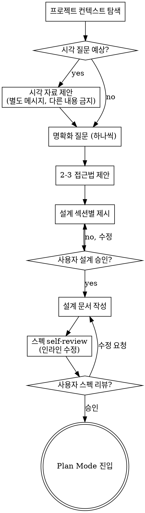

# interview — brainstorm 모드

> Adapted from [obra/superpowers](https://github.com/obra/superpowers) `brainstorming` skill — MIT License, © 2025 Jesse Vincent.
> 생태계 바인딩 4곳만 atelier 로 치환: writing-plans → Plan Mode / browser visual companion → AskUserQuestion·markdown 다이어그램 / 체크리스트 → TaskCreate / 문서 위치 → 프로젝트 spec 컨벤션.

아이디어를 자연스러운 협업 대화를 통해 완전한 설계와 스펙으로 발전시킨다. 현재 프로젝트 컨텍스트를 이해하는 데서 출발해, 질문을 한 번에 하나씩 던져 아이디어를 다듬는다. 무엇을 만드는지 이해되면 설계를 제시하고 사용자 승인을 받는다.

<HARD-GATE>
설계를 제시하고 사용자가 승인하기 전까지는 어떤 구현 스킬도 호출하지 말고, 코드를 쓰지 말고, 프로젝트를 스캐폴딩하지 말고, 어떤 구현 행동도 하지 마라. 체감 난이도와 무관하게 모든 프로젝트에 적용된다.
</HARD-GATE>

## 안티패턴: "이건 너무 단순해서 설계가 필요 없다"

모든 프로젝트가 이 프로세스를 거친다. todo 리스트, 함수 하나짜리 유틸, 설정 변경 — 전부 다. **"단순한" 프로젝트야말로 미검증 가정이 가장 큰 낭비를 만드는 곳이다.** 설계는 짧아도 된다(정말 단순하면 몇 문장이면 충분하다). 하지만 반드시 제시하고 승인을 받아야 한다.

## 체크리스트

아래 각 항목을 **TaskCreate 로 task 로 만들고 순서대로 완료**한다:

1. **프로젝트 컨텍스트 탐색** — 파일, 문서, 최근 커밋 확인
2. **시각 자료 제안** (시각 질문이 예상될 때) — 다른 내용과 결합하지 않은 별도 메시지로. 아래 "시각 자료" 섹션 참조
3. **명확화 질문** — 한 번에 하나씩, 목적/제약/성공 기준 이해
4. **2–3개 접근법 제안** — trade-off 와 추천안 포함
5. **설계 제시** — 복잡도에 비례한 섹션 단위, 섹션마다 사용자 검증
6. **설계 문서 작성** — 프로젝트 spec 컨벤션 위치에 저장하고 커밋
7. **스펙 self-review** — placeholder·모순·모호함·스코프 인라인 점검
8. **사용자의 스펙 리뷰** — 작성된 문서를 사용자가 검토한 뒤 진행
9. **구현 전환** — Plan Mode 로 진입해 구현 계획 수립

## Process Flow

**종착 상태는 Plan Mode 진입이다.** 다른 어떤 구현 스킬도 호출하지 않는다. brainstorm 이후의 유일한 다음 단계는 Plan Mode 다.

## 프로세스

**아이디어 이해:**

- 현재 프로젝트 상태(파일, 문서, 최근 커밋)를 먼저 확인한다
- 상세 질문 전에 **스코프를 판정**한다: 요청이 여러 독립 서브시스템을 담고 있으면(예: "채팅 + 파일 저장 + 빌링 + 분석이 있는 플랫폼") 즉시 플래그한다. **분해가 먼저 필요한 프로젝트의 디테일을 다듬는 데 질문을 낭비하지 마라.**
- 단일 스펙에 담기엔 큰 프로젝트면 사용자와 함께 서브프로젝트로 분해한다: 독립적인 조각은 무엇인가, 서로 어떻게 연결되나, 어떤 순서로 만들어야 하나. 그 다음 첫 서브프로젝트를 정상 설계 플로우로 brainstorm 한다. 각 서브프로젝트는 자기만의 스펙 → 계획 → 구현 사이클을 가진다
- 적절한 스코프의 프로젝트는 질문을 한 번에 하나씩 던져 아이디어를 다듬는다
- 가능하면 객관식을 선호한다 (AskUserQuestion 활용) — 주관식도 괜찮다
- 메시지당 질문 하나 — 주제에 더 깊은 탐색이 필요하면 여러 질문으로 쪼갠다
- 이해의 초점: 목적, 제약, 성공 기준

**접근법 탐색:**

- 서로 다른 접근법 2–3개를 trade-off 와 함께 제안한다
- 대화체로 제시하되 추천안과 그 이유를 명시한다
- 추천안을 먼저 제시하고 왜인지 설명한다

**설계 제시:**

- 무엇을 만드는지 이해됐다고 믿으면 설계를 제시한다
- 각 섹션을 복잡도에 비례해 조절한다: 단순하면 몇 문장, 미묘하면 200–300단어까지
- 각 섹션 후 여기까지 맞는지 확인한다
- 다룰 것: 아키텍처, 컴포넌트, 데이터 흐름, 에러 처리, 테스트
- 뭔가 말이 안 되면 되돌아가 명확히 할 준비를 한다

**격리와 명료함을 위한 설계:**

- 시스템을 작은 단위로 쪼갠다. 각 단위는 하나의 명확한 목적을 갖고, 잘 정의된 인터페이스로 통신하며, 독립적으로 이해·테스트 가능해야 한다
- 각 단위에 대해 답할 수 있어야 한다: 무엇을 하는가, 어떻게 쓰는가, 무엇에 의존하는가
- 내부를 읽지 않고 단위가 뭘 하는지 이해할 수 있는가? 내부를 바꿔도 소비자가 깨지지 않는가? 아니라면 경계를 다시 잡아야 한다
- 작고 경계가 분명한 단위는 에이전트 자신에게도 유리하다 — 한 번에 컨텍스트에 담을 수 있는 코드를 더 잘 추론하고, 파일이 집중되어 있을수록 편집이 더 신뢰할 만하다. 파일이 커지고 있다면 너무 많은 일을 하고 있다는 신호인 경우가 많다
- 이 지향은 atelier 의 SOLID 원칙(`coding-style` skill)과 동일하다 — 설계 단계에서 SRP/ISP/DIP 를 미리 적용하는 것

**기존 코드베이스에서 작업:**

- 변경을 제안하기 전에 현재 구조를 탐색한다. 기존 패턴을 따른다
- 기존 코드의 문제가 이번 작업에 영향을 주는 경우(너무 커진 파일, 불분명한 경계, 얽힌 책임)에는 targeted improvement 를 설계에 포함한다 — 좋은 개발자가 자기가 작업하는 코드를 개선하는 방식으로
- 무관한 리팩터링은 제안하지 않는다. 현재 목표에 복무하는 것에 집중한다

## 설계 이후

**문서화:**

- 검증된 설계(스펙)를 프로젝트의 spec 컨벤션 위치에 작성한다 (컨벤션이 없으면 사용자에게 위치를 확인한다 — 사용자 선호가 항상 우선)
- frontmatter 에 **`related_paths`** 를 포함한다 — atelier `spec` 스킬(갭 분석·리뷰)이 이 문서를 그대로 소비할 수 있게 된다
- 설계 문서를 git 워크플로우 컨벤션에 따라 커밋한다

**스펙 self-review:**
스펙 문서를 쓴 뒤 새로운 눈으로 본다:

1. **Placeholder 스캔**: "TBD", "TODO", 미완성 섹션, 모호한 요구사항이 있는가? 고친다
2. **내부 일관성**: 섹션끼리 모순되는가? 아키텍처가 기능 설명과 일치하는가?
3. **스코프 점검**: 단일 구현 계획에 담길 만큼 집중되어 있는가, 분해가 필요한가?
4. **모호함 점검**: 두 가지로 해석될 수 있는 요구사항이 있는가? 있으면 하나를 골라 명시한다

발견한 문제는 인라인으로 고친다. 재리뷰는 불필요 — 고치고 넘어간다.

**사용자 리뷰 게이트:**
self-review 가 끝나면 진행 전에 사용자에게 작성된 스펙 리뷰를 요청한다:

> "스펙을 `<경로>` 에 작성하고 커밋했습니다. 구현 계획을 잡기 전에 검토하시고 수정할 부분이 있으면 알려주세요."

사용자의 응답을 기다린다. 수정 요청이 오면 반영하고 self-review 를 다시 돈다. 사용자가 승인한 뒤에만 진행한다.

**구현 전환:**

- **Plan Mode 로 진입**해 상세 구현 계획을 수립한다
- 다른 스킬을 호출하지 않는다. Plan Mode 가 다음 단계다. 아키텍처/다중 컴포넌트 스펙 작업으로 커졌으면 `spec:design` 으로 에스컬레이트한다

## 핵심 원칙

- **질문은 한 번에 하나** — 여러 질문으로 압도하지 않는다
- **객관식 선호** — 가능하면 주관식보다 답하기 쉽다 (AskUserQuestion)
- **가차없는 YAGNI** — 모든 설계에서 불필요한 기능을 제거한다
- **대안 탐색** — 정하기 전에 항상 2–3개 접근법을 제안한다
- **점진적 검증** — 설계를 제시하고 승인받은 뒤 다음으로 간다
- **유연하게** — 말이 안 되면 되돌아가 명확히 한다

## 시각 자료

brainstorm 중 목업·다이어그램·시각적 대안을 보여주는 도구다. **도구이지 모드가 아니다** — 사용자가 동의해도 모든 질문이 시각 자료를 거치는 게 아니라, 시각적 처리가 도움이 되는 질문에만 쓸 수 있게 되는 것이다.

**제안하기:** 앞으로의 질문에 시각 콘텐츠(목업, 레이아웃, 다이어그램)가 필요할 것 같으면 동의를 한 번 구한다. **이 제안은 반드시 별도 메시지여야 한다** — 명확화 질문, 컨텍스트 요약, 다른 어떤 내용과도 결합하지 않는다. 거절하면 텍스트로만 진행한다.

**질문별 판단:** 동의를 받았어도 **질문마다** 시각이냐 텍스트냐를 따로 결정한다. 기준: **읽는 것보다 보는 것이 이해에 더 나은가?**

- **시각으로**: 내용 자체가 시각적인 것 — 목업, 레이아웃 비교, 모듈 구조·의존성·흐름 다이어그램 → markdown 표 / ASCII / mermaid. 대안 2–3개를 나란히 비교시킬 땐 AskUserQuestion 의 preview
- **텍스트로**: 내용이 텍스트인 것 — 요구사항 질문, 개념 선택, trade-off 목록, 스코프 결정

UI 주제에 대한 질문이라고 자동으로 시각 질문인 건 아니다. "이 맥락에서 personality 가 무슨 뜻인가요?"는 개념 질문이라 텍스트로, "어느 wizard 레이아웃이 나은가요?"는 시각 질문이라 다이어그램으로 간다.
