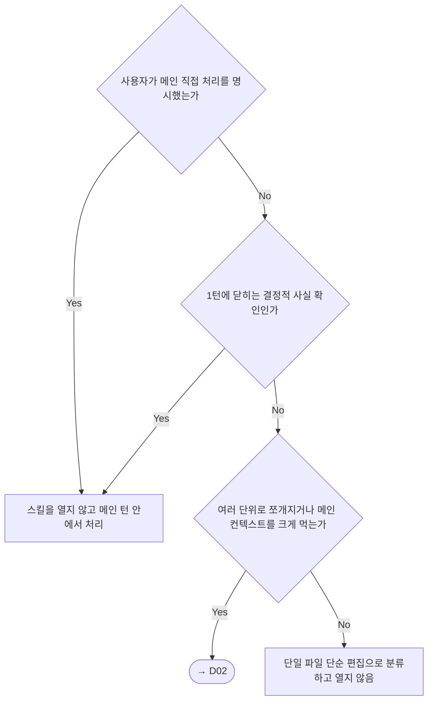
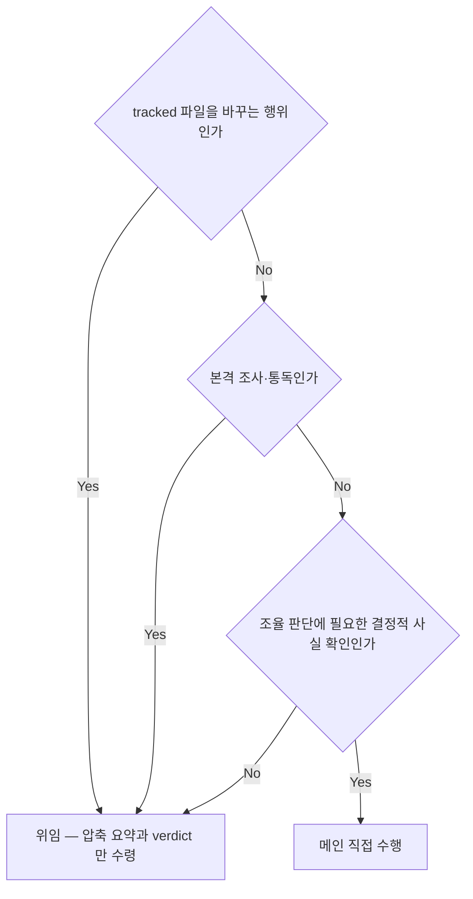
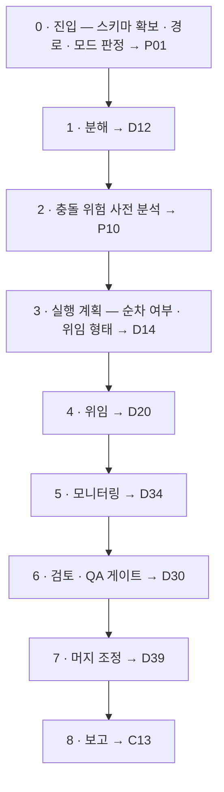

# Orchestrator Skill
<!-- owns: D01 D02 | P02 -->

여러 단위로 벌어지는 일을 분해 · 위임 · 통합하는 오케스트레이터의 라우터다. 판정 규칙은 각 항목이 소유하고, 이 파일은 진입 판정 둘과 단계 지도 하나만 갖는다.

## D01. 트리거 판정 (When to use)
<!-- needs: -->

**입력 신호**
- 요청이 여러 독립 단위로 쪼개지는가
- 자율 주행 · 위임 · 팀 · worktree 를 사용자가 명시했는가
- 산출물이 문서 · 리서치 · 조사인가 — read-only 도 대상에서 빠지지 않는다
- 메인이 지금 tracked 파일을 직접 고치려는 순간인가
- 규모 — 작업의 종류가 아니라 단위 수와 메인 컨텍스트 소모량

**종단별 행동 계약**
- 메인 턴 안에서 처리 → 스킬을 열지 않는다. 계획에 없던 tracked 편집이 뒤늦게 들어오면 이 판정으로 되돌아온다 (→ D07)
- 열지 않음(단일 파일) → 열지 않기로 한 근거를 한 줄 남긴다. 근거 없는 생략은 판정이 아니다
- → D02 → 진입 즉시 조율 도구 스키마부터 확보하고 (→ C01) 진입 절차로 넘어간다 (→ P01)

**근거**: 적용 범위는 작업의 종류가 아니라 규모로 갈린다 — 구현 · 문서 · 조사로 가르면 read-only 리서치가 부당하게 빠진다.

**후속**: → D02 → P01

## D02. 편집권 경계 (사고 모드)
<!-- needs: D01 -->

**입력 신호**
- 지금 하려는 행위가 tracked 파일을 바꾸는가 — 검증 테스트 추가 · 문서 작성 포함
- 본격 조사 · 통독인가 — 코드베이스 파악 · 영향 범위 · 방안 비교
- 조율 판단에 필요한 결정적 사실 확인인가 — 브랜치 · 상태 · 종료 코드 · 토폴로지
- 통합 검증 명령인가 (→ D49)

**종단별 행동 계약**
- 위임 → 원문 · 전체 diff · 리뷰 전문을 메인 컨텍스트로 끌어오는 것은 금지한다. 대신 작업 id · 변경 파일 목록 · verdict · 다음 행동만 받고 상세 근거는 기록 경로로만 보유한다 (→ C05 · → C13). 게이트가 붙이는 검증 테스트 추가도 편집이라 같은 경계를 받는다 (→ D30). 받은 쪽이 실패해도 편집권을 되찾지 않는다 — 대신 다시 위임하거나 (→ D33) 사용자에게 보고한다
- 메인 직접 수행 → 확인 범위를 조율 판단에 필요한 사실로 한정하고, 코드 본문 통독으로 번지는 순간 위임으로 되돌린다. 진입 시점 브랜치를 벗어나 다른 브랜치 · worktree 로 옮겨 가는 것은 금지한다 — 대신 격리는 위임 쪽에만 준다 (→ D20 · → D22). 통합 검증 명령만이 메인 직접 수행의 예외다 (→ D49)

**근거**: 메인이 원문을 쌓으면 루프가 길어질수록 컨텍스트가 포화되어 조율 판단 품질이 떨어진다.

**후속**: → P01 → P02

## 필수 로드

| 조건 | 파일 | 항목 |
|---|---|---|
| 진입 시 항상 | `references/entry-gates.md` | D03 D04 D45 |
| D03 종단이 무거운 경로인 순간 | `references/worktree-lifecycle.md` | D21 |
| D45 종단이 자율(기본)인 순간 | `references/autonomous-driving.md` | C04 |

이 세 파일 밖의 reference 를 진입 시 일괄로 여는 것은 금지한다 — 대신 결정 라우팅 표가 지목하는 결정에 도달한 순간 그 파일만 연다.

## P02. 표준 절차
<!-- needs: D01 D02 -->

단계 이름과 그 단계를 소유한 항목만 둔다. 경로 · 모드에 따른 단계의 유지 · 생략은 → D03 · → D45 가 정한다.

**근거**: 각 단계 안의 분기는 지목된 항목이 소유한다 — 여기에 규칙을 한 줄이라도 다시 적으면 그것이 두 번째 사본이 된다.

## 디스패치 전 게이트 인덱스

| 게이트가 발동하는 순간 | 항목 | 파일 |
|---|---|---|
| spec 입력 구현 dispatch 전 **(hard stop)** | **D11** | `autonomous-driving.md` |
| implementer dispatch 전 | D10 | `architect-council.md` |
| 테스트 작성 포함 dispatch 전 | D24 | `review-gates.md` |
| 조사 · 리서치 dispatch 전 | D23 | `investigation.md` |
| 모든 dispatch 시 (기대 완료 시간) | D34 | `agent-monitor.md` |
| 보고 수용 전 (증거 · 중복) | D37 D36 | `investigation.md` · `agent-monitor.md` |
| 매 dispatch 직후 · 완료 알림 직후 **(hard stop)** | **D21 D22** | `worktree-lifecycle.md` |
| 루프 중 상시 **(hard stop)** | **D47 D49** | `autonomous-driving.md` |

## 결정 라우팅

| 지금 무엇을 정하려는가 | 결정 | 계약 · 절차 | 파일 |
|---|---|---|---|
| 이 요청이 위임 대상인가 / 메인이 직접 할 수 있는 일인가 | D01 D02 | P02 | (이 파일) |
| tracked 변경을 만드는가 / 왕복 조율이 되는가 / 자율인가 HITL 인가 / Task 로 쪼갤 것인가 | D03 D04 D06 D07 D45 D54 | C01 C16 P01 | `references/entry-gates.md` |
| 분해를 협의체에 맡길 것인가 / 설계가 승인됐는가 / 재분해할 것인가 | D08 D09 D10 D12 D57 | C08 C09 C14 P04 | `references/architect-council.md` |
| 병렬인가 순차인가 / 단발인가 team 인가 / 격리할 것인가 / prompt 에 무엇을 넣는가 | D05 D13 D14 D18 D19 D20 D25 D56 | C02 C03 P10 | `references/dispatch-planning.md` |
| 조사를 몇 갈래로 벌릴 것인가 / 어떤 축으로 팔 것인가 / 보고를 수용할 것인가 | D15 D16 D17 D23 D37 | — | `references/investigation.md` |
| 이 dispatch 의 tier 는 / 상위 tier 자문을 부를 것인가 | D26 D27 D28 D29 | C07 C15 P05 | `references/model-routing.md` |
| worktree 가 실제로 생겼는가 / 메인이 제자리인가 / worktree 를 정리할 것인가 | **D21** **D22** D51 | P06 P09 | `references/worktree-lifecycle.md` |
| 보고가 중복인가 / 무보고를 언제 끊는가 / 재위임할 것인가 / 어떻게 보고하는가 | D33 D34 D35 D36 D38 D46 D55 | C13 | `references/agent-monitor.md` |
| 게이트를 몇 차원으로 세우는가 / verdict 를 어떻게 합치는가 | D24 D30 D31 D32 | P11 | `references/review-gates.md` |
| 언제 · 어떤 순서로 머지하는가 / 충돌을 어떻게 / 끝났다고 선언해도 되는가 | D39 D40 D41 D42 D43 D44 D52 | C10 C11 C12 P07 P08 | `references/merge-coordinator.md` |
| 예산은 / spec 이 확정됐는가 / 멈출 것인가 / 끝났는가 | **D11** **D47** D48 **D49** D50 D53 D58 | C04 C05 C06 P03 | `references/autonomous-driving.md` |
