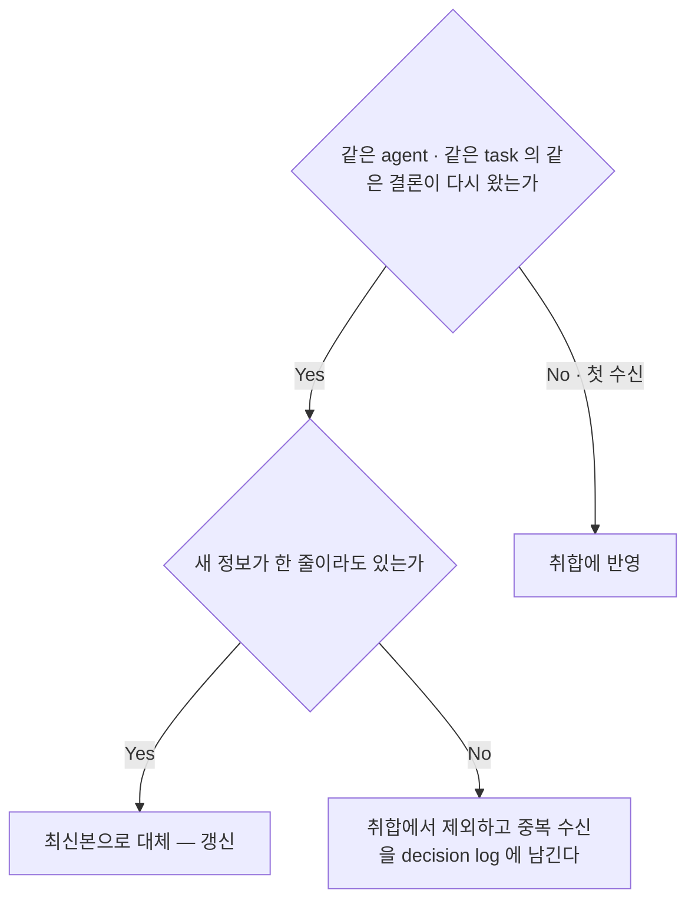
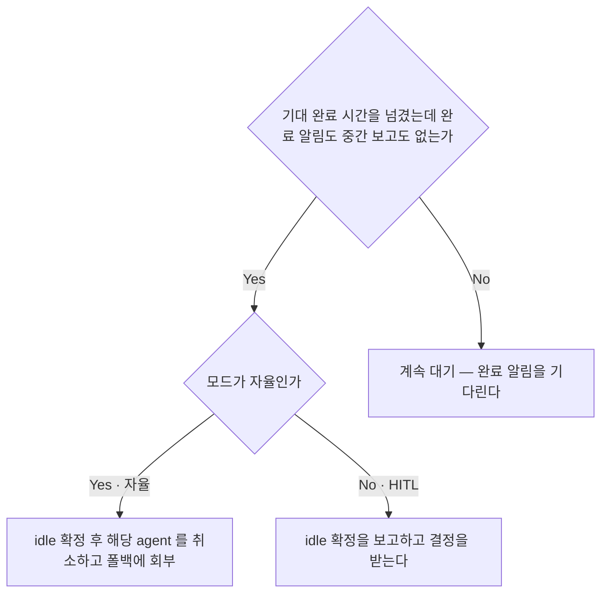
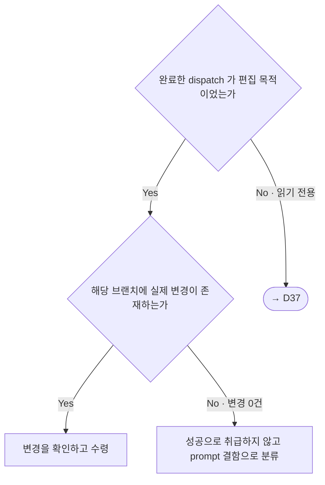
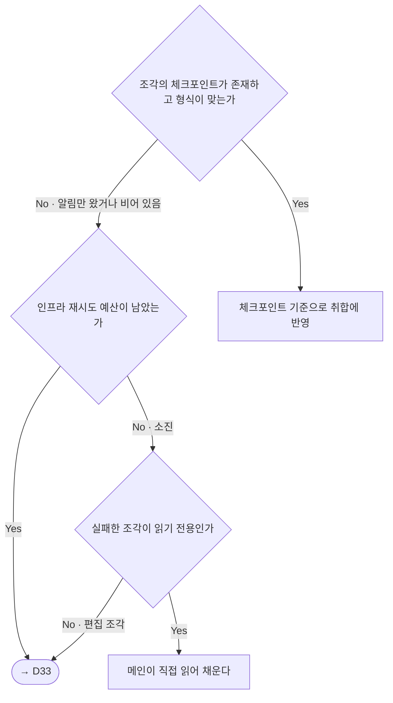
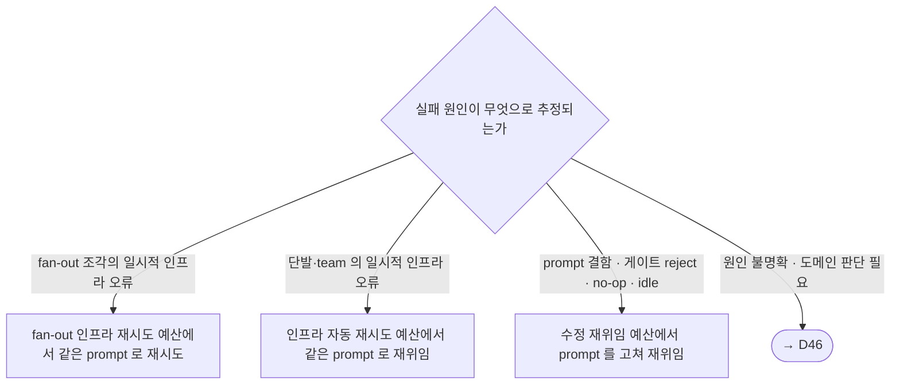
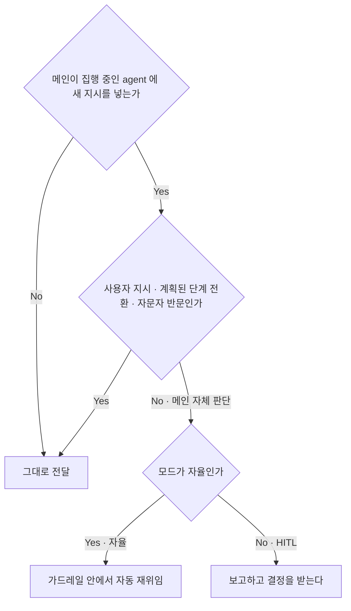
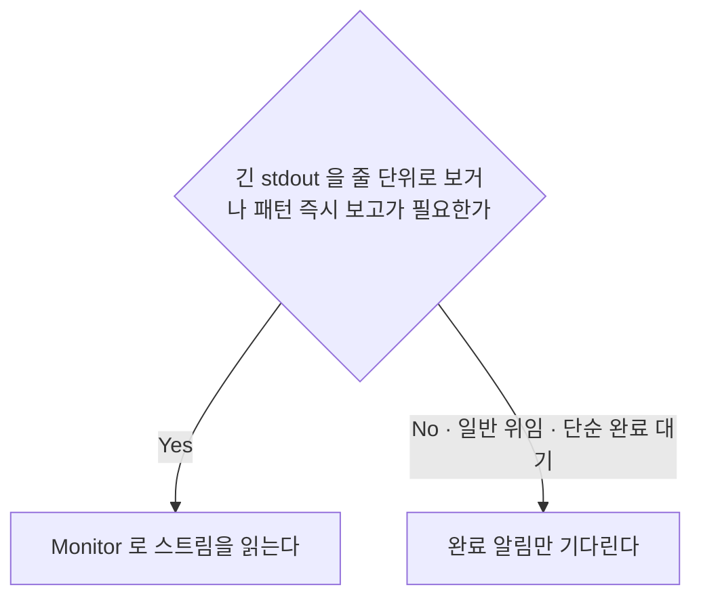

<!-- owns: D33 D34 D35 D36 D38 D46 D55 | C13 -->
<!-- needs: D04 D14 D18 D20 D45 -->

# Agent Monitor

위임한 sub-agent · team 의 진행을 추적하고 보고를 수령하는 국면의 항목을 소유한다. 항목 하나는 `## D##.` / `## C##.` 블록 하나이며, 그 블록이 해당 항목의 유일한 소유처다. 진행 추적 중 일감을 Task 로 등록할지의 판정은 → D54, 필드·의존성·owner 사용법은 → C16 이 소유한다.

## D36. 중복 보고 판정 (dedup)
<!-- needs: -->

**입력 신호**
- 같은 agent(`agentId` 또는 `name`) + 같은 task 의 보고인가
- 결론이 앞서 취합한 것과 실질적으로 같은가
- 새 정보가 한 줄이라도 있는가 · 같은 agent 에서 같은 일이 반복되는가

**종단별 행동 계약**
- 취합에 반영 → 편집 목적 보고면 수령 검증을 함께 돈다(→ D35). 증거 계약 판정은 → D37
- 갱신 → 앞 수신을 최신본으로 덮고, 두 벌을 함께 세지 않는다
- 취합에서 제외 → 중복 수신은 취합 대상이 아니라 이상 신호다. 같은 agent 에서 반복되면 prompt 결함으로 회부한다(→ D33). 기록 위치는 → C05

**근거**: 같은 내용을 두 번 취합하면 수치·상태가 이중 계산된다.

**후속**: → D35 → D33

## D34. idle 판정 (무보고 대기의 한도)

<!-- needs: D18 D45 -->

**입력 신호**
- dispatch 시점에 기대 완료 시간을 정해 기록에 남겼는가(→ C05) — 정하지 않은 채 dispatch 하지 않는다
- 경과 시간이 그 한도를 넘겼는가 · 완료 알림·중간 보고가 하나라도 왔는가 (완료 알림은 agent 별로 따로 도착한다 — team 이면 `name` 으로 식별)
- 모드가 자율인가 HITL 인가 (→ D45)

**종단별 행동 계약**
- 계속 대기 → `sleep` · 폴링 루프는 금지한다 — 대신 완료 알림을 기다린다(→ D55)
- idle 확정·취소 → 중단 수단이 없으면 결과를 기다리지 않기로 확정하는 폐기로 갈음한다. 폴백 회부는 → D38. 취소한 조각이 편집 조각이었으면(→ D20) 그 브랜치를 머지 후보에서 제외하고 폐기 대상으로 표시해 넘긴다(→ D41) — 방치하면 "변경 있음 → 머지 후보" 규칙이 버려진 브랜치를 주워 간다. 재위임 전에 원 agent 가 실제로 멈췄는지 확인해 같은 파일을 둘이 편집하지 않게 한다(→ D33). 뒤늦게 도착한 보고는 → D36 으로 판정한다
- 보고 후 결정 → 형식은 → C13. 취소·폴백 사실은 종료 보고에도 명시한다(→ C13)

**근거**: 한도를 dispatch 시점에 정해 두면 idle 이 추정이 아니라 판정이 된다.

**후속**: → D38 → D33

## D35. no-op run 감지 판정 (수령 검증)

<!-- needs: D20 -->

**입력 신호**
- 완료한 dispatch 가 편집 목적이었는가(→ D20) · 보고가 성공을 주장하는가
- 해당 브랜치에 실제 변경이 있는가 — `git diff --stat <base>...<branch>` 또는 보고에 실린 커밋 해시의 실존

**종단별 행동 계약**
- 수령 → 완료 알림 직후의 토폴로지 가드는 → D22
- prompt 결함으로 분류 → 검증 기준·범위를 보강해 재위임한다(→ D33)
- → D37 → 읽기 전용 보고의 수용은 증거 계약이 판정한다

**근거**: 보고 내용만으로 성공을 단정하면 변경 0건인 실패가 성공으로 취합된다.

**후속**: → D33 → D22

## D38. fan-out 복원력 판정 (체크포인트 · 재시도 · 폴백)

<!-- needs: D14 D33 D34 -->

**입력 신호**
- 대규모 fan-out 인가 (규모 임계는 → C04) · 완료 알림에 대응하는 체크포인트 파일이 있고 형식이 맞는가
- 실패가 gateway time-out · API 오류 등 일시적 인프라 오류인가 · fan-out 인프라 재시도 예산이 남았는가 (값은 → C04)
- 실패한 조각이 읽기 전용인가 편집 조각인가 (→ D20)

**종단별 행동 계약**
- 취합에 반영 → 체크포인트는 agent 자신이 완료 직전에 저장하고, 메인은 완료 알림 수신 즉시 존재와 형식을 확인한다. 전체 완료를 기다렸다가 한꺼번에 수집하지 않는다 — 나중 조각의 실패가 앞선 성공을 잃게 만들지 않기 위해서다. 저장 요구는 prompt 에 싣는다(→ C02). 경로는 산출 경로 계약 안에서 repo 밖으로 지정해(→ D56) worktree 정리·머지와 무관하게 보존한다
- 메인이 직접 읽어 채운다 → 읽기·보고는 메인의 허용 범위다(→ D02). 그래도 채울 수 없으면 조각을 "미완(사유 포함)"으로 명시해 취합에 포함한다 — 조용한 누락은 금지한다
- → D33 → 어느 예산에서 어떤 형태로 다시 위임할지는 재위임 판정이 정한다. 격리 재사용 제약도 그쪽 공통 계약을 따른다

**근거**: 실패한 조각이 조용히 누락되면 최종 취합 리포트의 수치 일관성이 깨진다.

**후속**: → D33 → C13

## D33. 재위임 판단 기준 (실패 원인 → 액션)

<!-- needs: D34 D35 D38 D45 -->

**입력 신호**
- 실패 원인 추정 — 일시적 인프라 오류 / prompt 결함 / 게이트 reject / no-op(→ D35) / idle(→ D34) / 원인 불명확·도메인 판단
- 실패한 것이 fan-out 조각인가 단발·team dispatch 인가 (→ D38 · → D14)
- 해당 축의 예산이 남았는가 — 예산 이름은 인프라 자동 재시도 · 수정 재위임 · fan-out 인프라 재시도, 값은 전부 → C04
- 모드가 자율인가 HITL 인가 (→ D45)

**종단별 행동 계약**
- fan-out 인프라 재시도 → 조각 단위로만 소모한다. 예산을 넘기면 폴백으로 넘긴다(→ D38)
- 인프라 자동 재시도 → 원인이 외부 환경으로 특정될 때만 쓴다. 예산을 넘기면 → D46
- 수정 재위임 → 이전 실패 정보(어디까지 진행됐고 무엇이 실패했는지)를 새 prompt 에 싣는다(→ C02). 게이트 reject 후 재위임의 verdict 판정은 → D31. idle 로 취소한 조각의 조건 바꿔 재위임도 이 예산을 소모한다. idle 판정은 "원인 불명확" 보다 우선한다(→ D34)
- → D46 → 반응은 모드가 가른다. 임의 추정으로 prompt 를 고치는 것은 본래 의도와 어긋날 위험이 있어 금지한다 — 대신 추정 원인과 선택지를 보고에 싣는다(→ C13)
- 공통 → 격리 worktree 는 재사용할 수 없으므로 재위임은 언제나 새 격리 dispatch 다(→ D20). 직전 실패 맥락이 그 agent 에 남아 있고 원인이 외부 환경이면 `agentId` 로 같은 agent 를 다시 깨워 이어간다(→ D46). 시도 횟수와 실패 사유는 기록에 남기고(→ C05) 최종 보고에도 싣는다(→ C13)

**근거**: 원인 축이 다르면 소모하는 예산이 다르다 — 축을 섞으면 한 축의 소진이 다른 축의 재위임까지 막는다.

**후속**: → D46 → C13

## D46. 명령 주입 · 정체 시 반응 판정

<!-- needs: D04 D45 -->

**입력 신호**
- 방향 — 메인이 집행 중인 agent 에 새 지시를 넣는 것인가, agent → 메인 보고인가, dispatch prompt 의 채널 지시인가
- 상황 — 사용자 지시 / team 내 계획된 단계 전환 / 자문자 반문 / 메인 자체 판단
- 모드가 자율인가 HITL 인가(→ D45) · 지목 수단이 확보돼 있는가 — `name` 또는 `agentId` (→ D04)

**종단별 행동 계약**
- 그대로 전달 → agent → 메인 보고와 prompt 의 보고 채널 지시는 이 판정의 대상이 아니다. 채널 계약은 → C03. 자문자 반문이 예외인 것은 advisor 가 편집권도 결정권도 없어 진행 방향을 바꿀 수 없고 왕복이 자문 예산을 소모하기 때문이며, 그 근거가 없는 상대에게 같은 예외를 넓히지 않는다(→ D27)
- 가드레일 안 자동 재위임 → 형태와 예산은 → D33 의 인프라 자동 재시도·수정 재위임 축으로만 소모한다. 어느 축에도 해당하지 않거나 가드레일에 닿으면 멈춘다(→ D47)
- 보고하고 결정을 받는다 → 형식은 → C13. 결정 없이 지시를 주입하는 것은 금지한다 — 대신 추정 원인과 선택지를 보고에 싣고 결정을 기다린다

**근거**: 이 구분을 놓치고 주입 금지를 채널 금지로 읽으면 agent 가 답할 수단을 잃는다.

**후속**: → C13 → D47

## D55. Monitor 도구 사용 판정
<!-- needs: -->

**입력 신호**
- 긴 빌드·테스트의 stdout 을 줄 단위로 봐야 하는가 · 특정 패턴이 나타나는 즉시 보고해야 하는가 · 아니면 단순 완료 대기인가

**종단별 행동 계약**
- Monitor 사용 → 찾을 패턴을 미리 정해 두고, 그 dispatch 에만 건다
- 완료 알림 대기 → `sleep` · 폴링 루프는 금지한다 — 대신 도착하는 완료 알림을 받는다

**근거**: 위임한 agent 는 완료 알림으로 결과를 실어 보내므로 대부분의 위임에서 Monitor 는 컨텍스트만 늘린다.

**후속**: → D36

## 계약

## C13. 사용자 보고 형식

보고 채널·수단 계약은 → C03, 기록 위치는 → C05 가 소유한다. 이 계약은 사용자에게 나가는 보고의 시점과 담을 항목만 정한다. (→ D34 · D38 · D46 · D45 · D48 · D50 종단이 요구)

**시작 시 — 1회**
1. 분해된 작업 목록과 병렬·순차 판정 (→ D14)
2. 자율 계약 1회 보고 — 종료 조건 · 예산 · hard stop · 결정 기록 위치 (→ C04)
3. 경로 판정 결과와 근거 (→ D03)

**진행 중 — 침묵이 기본**
4. 정상 루프는 보고하지 않는다 — 결정은 기록에 계속 남긴다 (→ C05)
5. 에스컬레이션·hard stop 은 모드와 무관하게 즉시 보고한다 (→ D47)
6. 정체·실패 보고에 담을 것: 어떤 작업이 어떤 상태인가 · 추정 원인 · 가능한 다음 액션(같은 prompt 재위임 / prompt 수정 후 재위임 / 폐기 / 사용자 직접 처리) · 결정 요청
7. fan-out 이면 조각별 상태 표 — 조각 · 상태 · 비고. 취합 수치는 체크포인트 파일 기준으로 계산하고, 폴백으로 채운 조각은 신뢰도가 다를 수 있음을 함께 적는다 (→ D38)

**종료 시**
8. 종료 사유 — 완료 / 예산 소진 / 에스컬레이션
9. 3분류 판정 요약 — DONE / BLOCKED / NOT-STARTED 건수
10. 핸드오프 파일 경로 (→ C06)
11. 머지 결과 — 성공 / 실패(충돌 파일과 성격) / 보류 후보 목록 · 남은 worktree 경로 · 다음 액션 제안
12. 최종 통합 검증 게이트 — HEAD sha · 전체 스위트 결과. red 면 완료 선언을 보류하고 원인과 재위임 계획을 함께 적는다. 가드 불변식 목록은 → C12
13. 원격 최신화 상태 — push 완료 / 열린 PR 없음 / 위임
14. 의사결정 요약 — 총 결정 수 · 주요 분기 · 전체 기록 경로 (→ C05)
15. 취소·폴백·미완 조각 (→ D34 · D38)

**한 줄 근거**
- 6·7·11·12·15 — 실패한 건을 빼거나 수치를 agent 의 말로 세면 사용자가 보는 완료율과 실제 산출물이 어긋나고, 머지 결과를 후보 단위로 적지 않으면 보류된 브랜치가 조용히 사라진다.
