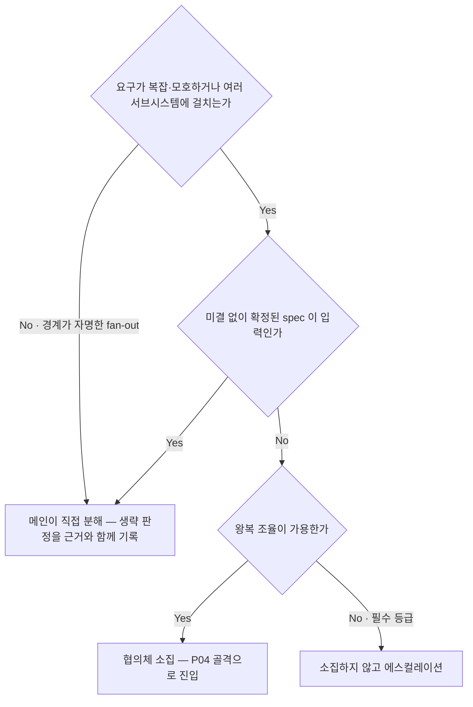
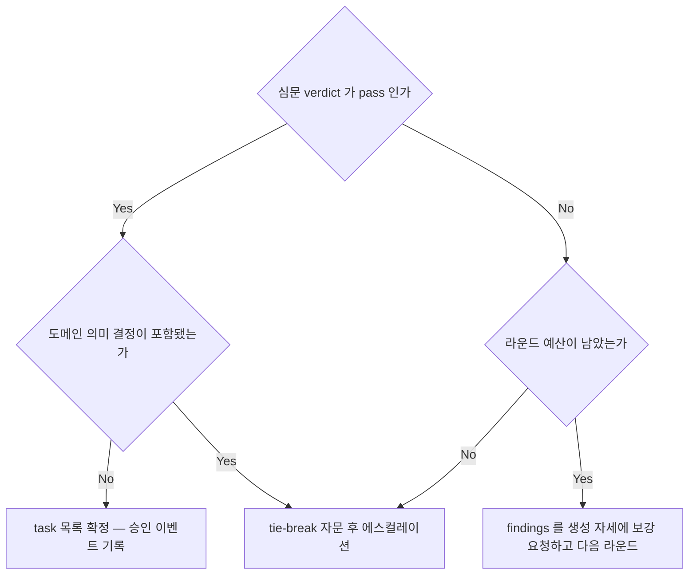
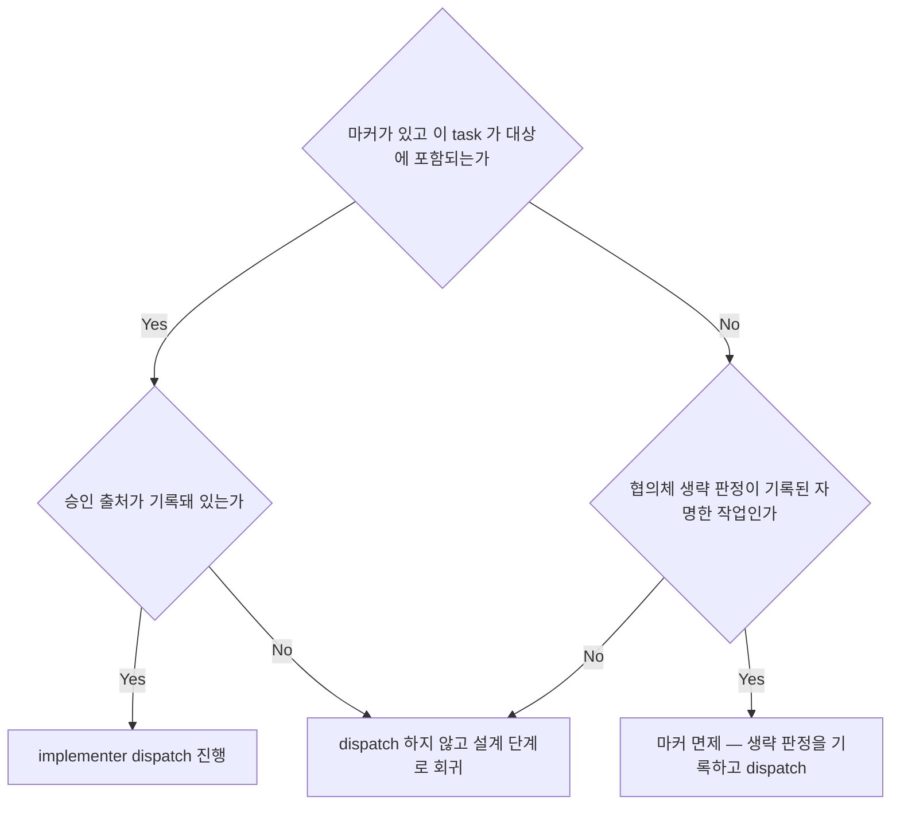
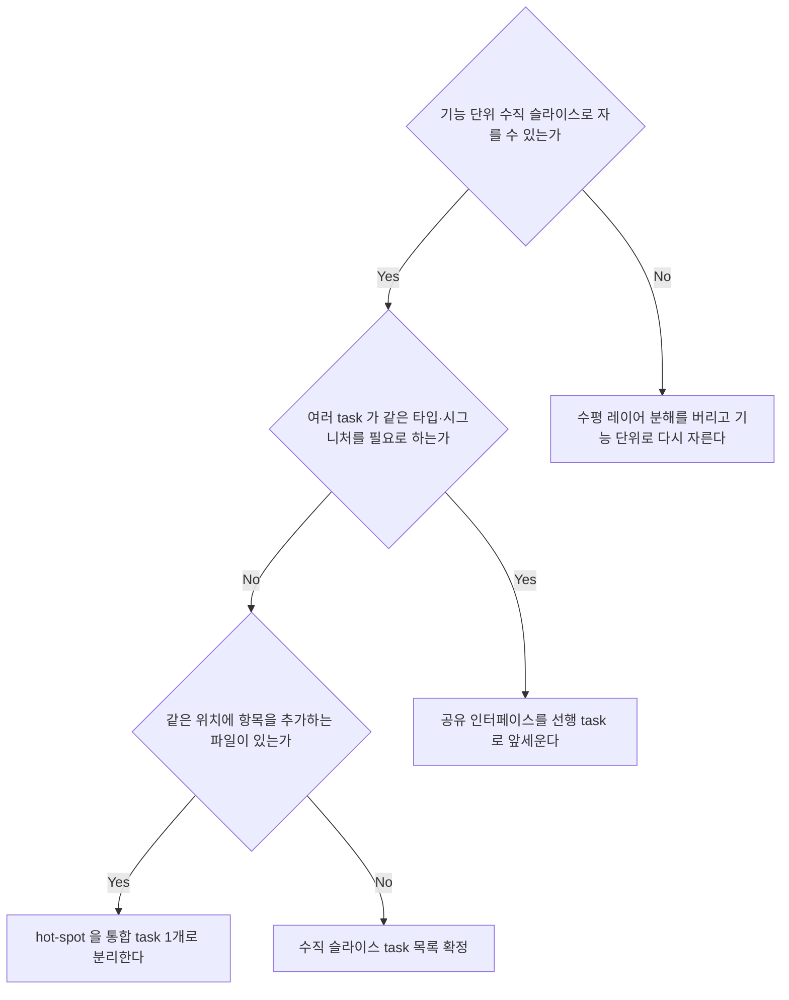
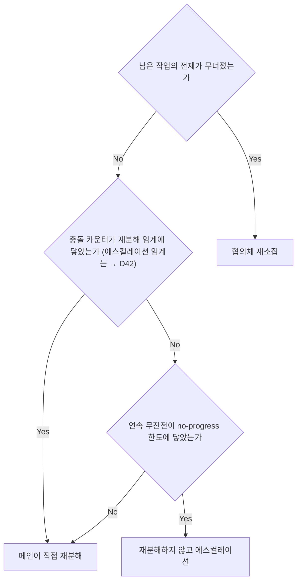

<!-- owns: D08 D09 D10 D12 D57 | C08 C09 C14 | P04 -->
<!-- needs: D01 D04 D42 D48 -->

# Architect Council (아키텍트 협의체)

분해(Decompose)를 세우고 검증하는 국면의 항목을 소유한다. 항목 하나는 `## D##.` / `## C##.` / `## P##.` 블록 하나이며, 그 블록이 해당 항목의 유일한 소유처다.

## D08. 협의체 소집 여부

<!-- needs: D01 D04 -->

**입력 신호**
- 요구가 복잡·모호한가 · 여러 서브시스템에 걸치는가 · 작업 경계가 자명한 단순 fan-out 인가
- 미결 없이 확정된 spec 이 입력으로 있는가 (미결 판정은 → D11)
- 왕복 조율(team) 이 가용한가 (→ D04) · 자율 루프의 첫 분해인가 · 루프 중이라면 전제가 무너졌는가 (→ D57)



**종단별 행동 계약**
- 메인 직접 분해 → 분해 방식은 → D12. 확정 spec 이 입력이면 분해는 spec 을 따르고 게이트 구성은 특수화된다 (→ D32). "설계가 필요 없다"는 판정 자체를 근거와 함께 기록한다 (→ C05) — 마커 면제도 같은 기록에 얹는다 (→ D10)
- 협의체 소집 → 골격은 → P04, task 산출 형식은 → C08, 라운드 종료는 → D09
- 소집 없이 에스컬레이션 → 협의체는 왕복 조율이 필수 등급이다 (등급 판정은 → D19). 단발 위임으로 조용히 폴백하는 것은 금지한다 — 대신 비가용 사유와 함께 멈추고 보고한다 (→ D47)

**근거**: 검증 없는 분해는 스웜 전체를 잘못된 방향으로 밀기 때문에, 소집 생략 자체가 기록되는 판정이어야 한다.

**후속**: → P04 → D09

## D09. 협의체 라운드 종료 판정

<!-- needs: D08 -->

**입력 신호**
- 심문 verdict 가 pass 인가 reject 인가 · 직전 라운드 findings 가 보강으로 닫혔는가
- verdict 에 도메인 의미 결정이 포함됐는가 · `max_council_rounds` 라운드 예산이 남았는가 (값은 → C04)



**종단별 행동 계약**
- task 목록 확정 → 산출 형식은 → C08. 승인 출처 `council pass` 로 마커를 남긴다 (→ D10 · → C09)
- 다음 라운드 → 라운드가 예산을 소모한다 (→ C04). pass 까지 예산 없이 반복하는 것은 금지한다 — 소진 종단으로 닫는다
- 에스컬레이션 → tie-break 자문 소집은 → D27. 자문 권고는 협의체 pass 를 대체하지 않는다 — 검증되지 않은 분해로 dispatch 하지 않고 미해소 findings 와 도메인 결정을 함께 올린다 (→ D47)

**근거**: 예산 소진은 통과가 아니라 정지이며, 그 구분이 없으면 무한 심문과 무검증 통과 중 하나로 무너진다.

**후속**: → D10 → C08

## D10. 설계 승인 마커 (implementer dispatch 게이트)

<!-- needs: D08 D09 -->

**입력 신호**
- 승인 마커 파일이 존재하고 이 task 가 `대상 task` 목록에 포함되는가 (위치·필드는 → C09)
- 승인 출처가 council pass · grill 합의 · 사용자 승인 중 하나로 기록됐는가
- 협의체 생략 판정이 기록된 자명한 작업인가, 곧 마커 면제 대상인가 (→ D08)



**종단별 행동 계약**
- dispatch 진행 → 마커의 필수 필드와 기록 위치는 → C09
- 설계 단계로 회귀 → 승인 이벤트 없이 마커만 만드는 자기 승인은 금지한다(마커가 통과 의례가 된다) — 대신 협의체(→ D08) 또는 `grill` 심문으로 돌아가 승인 이벤트를 만든다
- 마커 면제 → 판정한 생략과 빠뜨린 생략이 사후에 구분되어야 하므로 면제 판정을 근거와 함께 기록한다 (→ C05)

**근거**: design-first 가 문서로만 존재하면 재량으로 우회되므로 승인을 검사 가능한 상태로 남긴다.

**후속**: → C09

## D12. 분해 방식 판정

<!-- needs: D08 -->

**입력 신호**
- 기능 단위(수직)로 자를 수 있는가, 레이어(수평)로 자르게 되는가 · task 후보는 → C08
- 여러 task 가 같은 타입·시그니처를 필요로 하는가
- 같은 위치에 항목을 추가하게 되는 파일이 있는가 (판정은 → D13)



**종단별 행동 계약**
- 기능 단위로 재분해 → 레이어 수평 분해는 금지한다(작업마다 같은 파일을 훑어 disjoint 가 나오지 않는다) — 다시 자른 뒤 이 판정을 통과시킨다
- 선행 task → 그 정의를 먼저 확정·머지한 뒤 나머지를 띄운다. 의존성은 task 필드에 (→ C08)
- 통합 task 분리 → hot-spot 판정 기준은 → D13. 통합 task 밖의 편집 금지 계약을 prompt 에 싣는다 (→ C02)
- 수직 슬라이스 확정 → hot-spot 판정을 거쳐 병렬/순차 판정으로 넘긴다 (→ D13 → D14)

**근거**: 병렬 이득은 사후 필터인 병렬/순차 판정이 아니라 분해에서 결정된다 — 분해가 충돌을 만들면 판정은 전부 순차로 떨어진다.

**후속**: → D13 → D14

## D57. 재분해 트리거 판정

<!-- needs: D08 D42 D48 -->

**입력 신호**
- 남은 작업 재계산의 진전 측정 — 머지된 브랜치 수 · 통과 테스트 수 · 종료 조건 충족 항목 수 (→ D48)
- 남은 작업의 전제가 무너졌는가 · 분해 자체를 사용자에게 보고할 국면인가
- 같은 파일 충돌 카운터가 재분해 임계에 닿았는가 (→ D42 · 값은 → C04)
- 연속 무진전이 no-progress 한도에 닿았는가 (값은 → C04)



**종단별 행동 계약**
- 협의체 재소집 → 소집 판정으로 회귀한다 (→ D08). 재소집은 남은 작업의 전제가 무너졌을 때만이다
- 메인이 직접 재분해 → 분해 방식은 → D12. 첫 협의체 산출물을 기준선으로 삼고, 재분해 자체를 사용자 보고에 싣는다 (→ C13)
- 재분해 없이 에스컬레이션 → 진전 없는 재분해 반복은 금지한다 — 대신 진전 측정값과 남은 작업을 함께 올린다 (→ D47)

**근거**: 무진전은 분해가 틀렸다는 신호이지 더 돌리라는 신호가 아니므로, 재계산 결과가 트리거를 결정해야 한다.

**후속**: → D08 → D12

## 계약

## C08. Task 도출 계약

확정된 task 목록의 각 항목은 dispatch prompt 의 재료가 되므로 다음을 반드시 포함한다 (→ D09 종단이 요구).

```
- id / 목적: 무엇을 달성하는가
- 범위: 무엇을 하고 무엇을 하지 않는가
- 예상 변경 파일: disjoint 판정(→ D12 · → D13 · → D14)의 입력. prompt 에 실리는 형태는 → C02
- 의존성: 선행 task
- 위험도: 모델 배정(→ D26) · 계획 우선 게이트(→ D25) 판정의 입력
- 검증 기준: 완료를 판정할 결정적 명령 또는 조건
- DB 접촉 여부: 스키마·마이그레이션·쿼리·ORM 모델 변경 포함 여부. 게이트 구성 판정(→ D30)의 트리거이므로 값 없이 확정하지 않는다 — 비면 게이트가 조용히 빠진다
```

## C09. 설계 승인 마커 필수 필드

승인을 검사 가능한 상태로 남기는 계약이다 (→ D10 종단이 요구).

- **기록 시점**: 승인 이벤트가 발생했을 때 메인이 기록한다 — 협의체 검증 pass · `grill` 심문 종료 시의 합의 · 사용자의 명시적 설계 승인 중 하나다.
- **기록 위치**: `<log_dir>/design-approval.md` (→ C04) — repo 밖이므로 커밋 대상이 아니다.
- **필수 필드** — 승인 출처가 비면 마커는 성립하지 않는다(출처 없는 마커는 자기 승인과 구분되지 않는다):

  ```
  ## <ISO timestamp> · 설계 승인
  - 승인 출처: council pass | grill 합의 | 사용자 승인
  - 대상 task: <task id 목록>
  - 근거 경로: <협의체 결과 또는 합의 요약이 있는 위치>
  ```

## C14. 대화 스킬의 자율 어댑테이션

주입되는 두 자세는 원래 **사용자와의 대화**를 전제한다. 협의체에는 사용자가 없으므로 다음으로 치환한다 (→ P04 골격이 요구).

- **사용자 질문 → 코드베이스 탐색**: 질문이 코드·git 이력·spec 문서로 답해지면 직접 탐색해 해소한다.
- **탐색으로 답할 수 없는 질문 → 명시적 가정**: "가정: X (근거: Y)" 형태로 산출물에 남기고, 심문 검증이 그 가정의 위험도를 판정한다.
- **도메인 의미 결정 → 에스컬레이션 후보**: 틀리면 데이터·의미가 오염되는 결정은 가정으로 덮지 않고 에스컬레이션 항목으로 표시한다 (판정은 → D47).
- **spec 이 미결로 선언한 항목 → 가정 금지**: spec 의 미결은 사용자가 내릴 결정이다. 협의체가 가정으로 덮거나 대신 확정하면 위반이고, 산출물에 그 항목이 나타나는 순간 회부한다 (판정은 → D11).
- **심문 자세의 "미결 0"(`grill` `SKILL.md §미결·의문 해소 게이트`) → 탐색으로 닫지 못한 항목이 전부 명시적 가정 또는 에스컬레이션 항목으로 기록된 상태**: 되물을 사용자가 없으므로 재질문이 아니라 앞의 두 치환으로 닫는다.
- **설계 생성 자세의 HARD-GATE(승인 전 구현 금지)** → 협의체에서는 검증 pass 전 dispatch 금지로 대응된다 (→ D09 · → D10).

## 절차

## P04. 협의체 루프 골격

과정의 **골격은 고정**하고, 그 자리에 들어갈 **역할은 런타임 주입**한다.

**고정 — 어겨선 안 되는 것**
1. 생성 자세와 검증 자세를 모두 거친다. 하나라도 빠지면 협의체가 아니다.
2. 검증자와 생성자는 서로 다른 agent 다 — 자기 설계를 자기가 심문하지 않는다.
3. 검증 pass 전에는 dispatch 하지 않는다 (→ D09 · → D10).
4. 라운드 예산 소진 시 멈추고 보고한다 (→ D09 · 값은 → C04).
5. 왕복 조율은 필수 등급이며 폴백하지 않는다 (→ D08 · 등급은 → D19 · 가드는 → D05 · → C05).

**주입 — 문제에 따라 정하는 것**: 역할의 이름·개수(2명이어야 할 이유는 없다 — 생성 1 + 검증 1은 최소 구성일 뿐이다) · 관점 조합 · 모델 tier(→ D26). 자세의 출처는 `grill` 스킬의 `references/design-generation.md`(설계 생성)와 `SKILL.md`(심문 검증)이고, 주입 시 → C14 의 치환 규칙을 함께 싣는다.

두 자세 모두 read-only 분석이라 격리 인자가 필요 없다 (→ D20). 산출물 전문은 기록에 남기고(→ C05), 메인은 task 목록과 가정·에스컬레이션 요약만 컨텍스트에 유지한다.

```
require(team_available); round = 0   # 비가용이면 폴백 없이 에스컬레이션 (고정 5)
design = Agent({name: "<설계 생성 역할>", prompt: "<요구사항 + 생성 자세 + C14 치환 + 출력 계약>"})
assert_teammate_spawned(design)      # 필수 등급 가드 — 아니면 1회 재판정 후 에스컬레이션
while round < max_council_rounds:    # 예산 값은 계약이 소유 (→ C04)
    verdict = Agent({name: "<심문 검증 역할>", prompt: "<design 전문 + 심문 자세 + 관점 + findings 형식>"})
    if verdict.pass: break
    round += 1
    SendMessage({to: "<설계 생성 역할>", message: "<findings — 보강 요청>"})
    design = await_revision()
verdict_gate(verdict)                # pass 아니면 여기서 종료 (판정은 → D09)
tasks = design.tasks                 # 형식은 → C08
log_decision("협의체 분해", design, verdict, 실행_형태="teammate", 판정_근거="<왕복|env>")  # → C05
```
