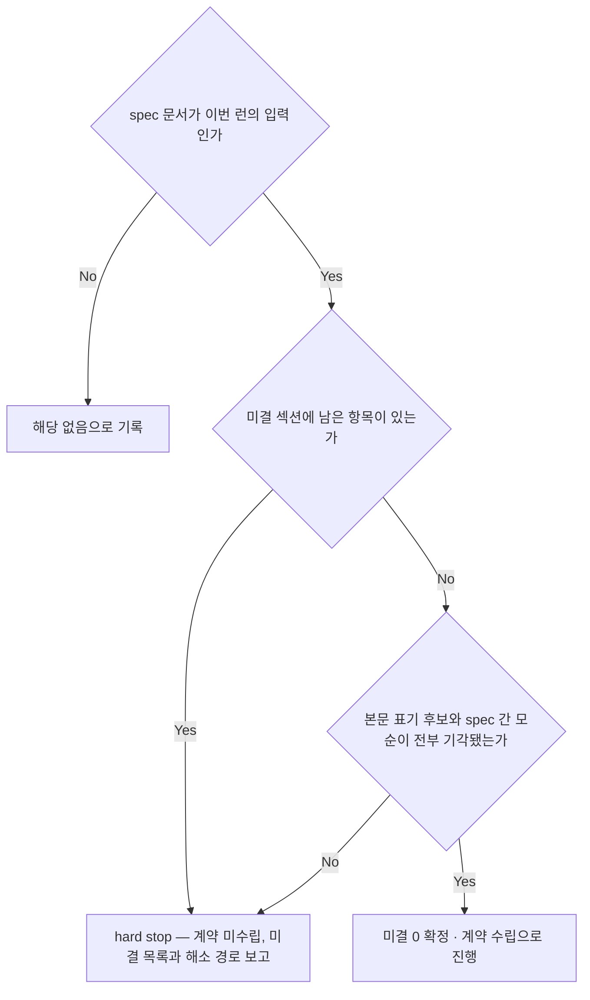
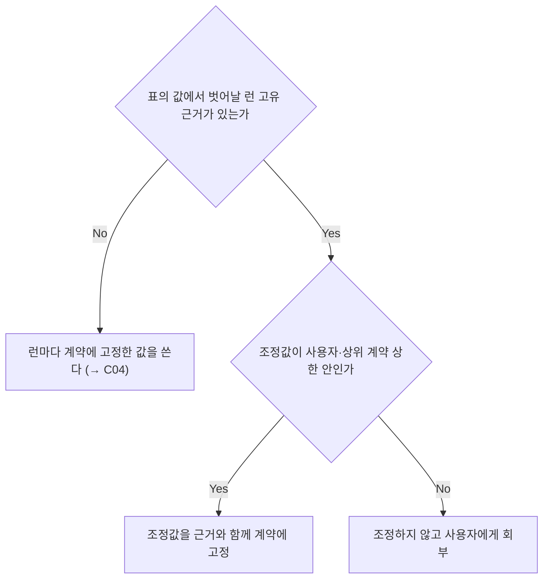
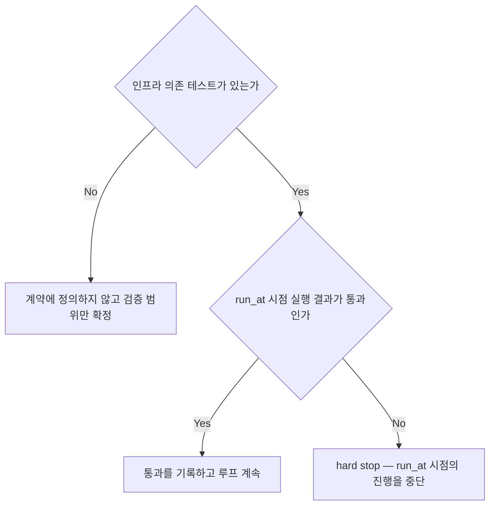
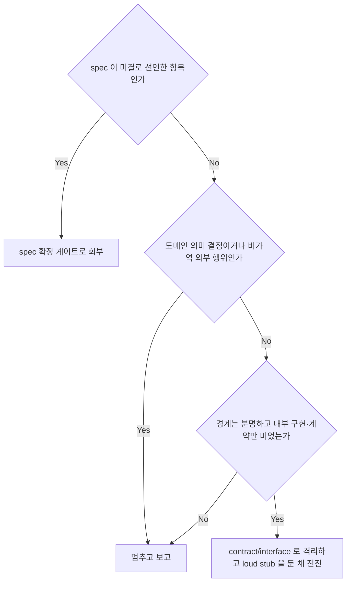
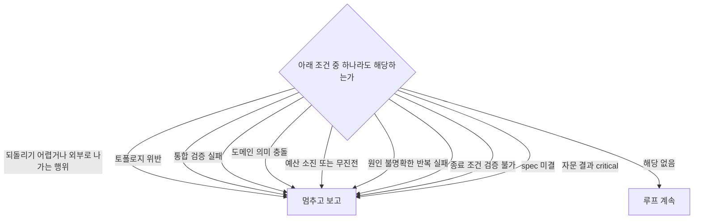
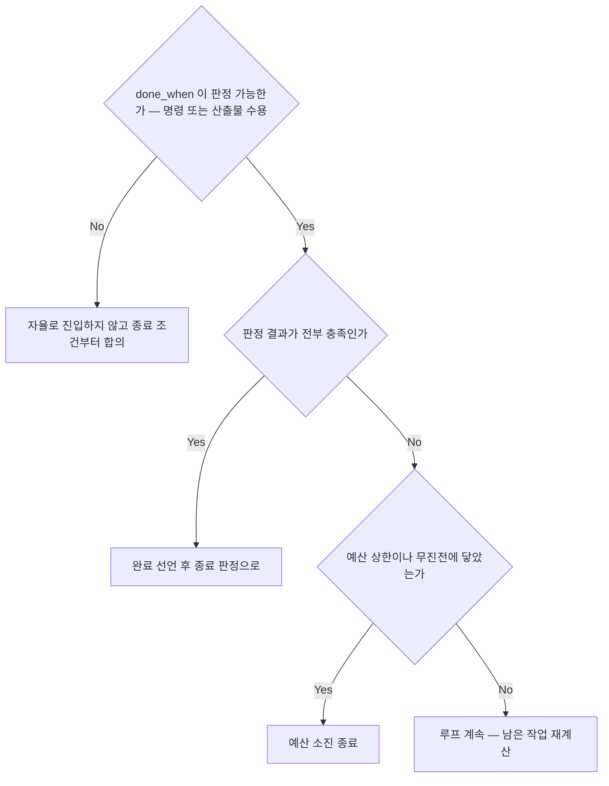
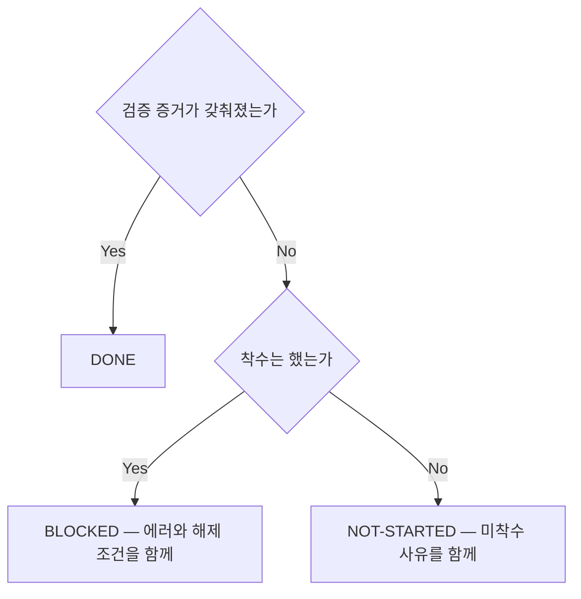

<!-- owns: D11 D47 D48 D49 D50 D53 D58 | C04 C05 C06 | P03 -->

# Autonomous Driving (자율 실행 루프)

**자율 모드로 도는 런**의 계약 수립·정지·종료 국면을 소유한다. C04·D48·D58 등 자율 루프 항목은 자율 전용이고, C05(결정 기록)·C06(핸드오프)·D47(에스컬레이션)·D11(spec 게이트)은 모드 무관이라 HITL 런도 그대로 쓴다. 모드 판정과 그 밖의 HITL 규칙은 → D45 가 소유하며 여기에 없다. 항목 하나는 `## D##.` / `## C##.` / `## P##.` 블록 하나이고, 그 블록이 그 항목의 유일한 소유처다.

## D11. spec 확정 게이트 (hard stop)
<!-- needs: D31 -->

**입력 신호**
- spec 문서가 이번 런의 입력인가 — 입력 집합은 사용자 지정 또는 메인의 진입 보고 경로 목록이고, 기본값은 spec 디렉토리 전체다
- 미결 섹션(`## 미결 사항`·`## 미결정 사항`·`## TBD`)에 `없음`이 아닌 항목이 있는가 — 해석이 필요 없는 결정적 신호
- 본문 표기(`TBD`·`미정`·`미확정`·`확정본 아님`·`추후 결정`·`?`)와 spec 간 모순을 전부 수집해 각각 미결·기각을 판정했는가 — 루프 중이면 게이트 verdict `spec-unresolved` 가 같은 입력이다 (→ D31)

**종단별 행동 계약**
- 해당 없음 → 결정 기록에 `해당 없음`을 명시로 남긴다 (→ C05). 자율 계약을 세우는 런이면 `spec_resolved` 필드도 같은 값이다 (→ C04). 생략은 판정이 아니다
- 미결 0 확정 → 스캔한 spec 경로 목록과 모든 후보의 처분(표기·위치·판정·한 줄 근거)을 `spec_resolved` 와 결정 기록에 남긴다 (→ C04 · → C05). 기각 하나하나가 사후 감사 가능해야 "사소해 보인다"가 기록 없이 통과하지 못한다
- hard stop → 예산과 무관하게 멈추고 미결 목록 + 현재 상태 + 남은 작업 + 해소 경로(`grill` 로 미결·의문이 0 이 될 때까지 심문해 결정 → `spec-write` 로 본문에 반영 → 재진입)를 한 번에 보고한다 (→ C13). 그 작업은 `BLOCKED` + 해제 조건 = 미결 목록으로 남긴다 (→ C06). 미결을 가정·loud stub(→ D53)·협의체나 자문의 확정(→ D08 · → D27)으로 메우는 것은 금지한다 — 대신 사용자에게 회부한다. 입력 spec 집합을 좁히거나 "이 task 는 그 미결을 건드리지 않는다"로 부분 진입하는 것도 금지한다 — 무관 판정이 메인의 재량이 되면 그것이 곧 게이트의 우회 경로이고, 문서를 목록에서 빼면 그 미결은 스캔되지 않은 채 게이트가 통과한 것처럼 보인다. 좁히는 것은 사용자 결정이며 그 자체가 결정 기록 항목이다 (→ C05). spec 이 갱신되면 같은 판정을 다시 돌려 미결 0 을 확인한 뒤에만 재진입한다

**근거**: 미결이 남은 spec 은 아직 규격이 아니라서, 그 위에서 자율로 구현하면 사용자가 내려야 할 판단이 코드 안에서 조용히 굳는다.

**후속**: → D58 → C04

## D58. 예산·가드레일 값 결정
<!-- needs: D03 D04 D45 -->

**입력 신호**
- 런 규모·리스크, 그리고 사용자나 상위 계약이 이미 준 상한
- 경로 판정 결과 (→ D03, 경량이면 머지·토폴로지 계열 예산이 빠진다) 와 왕복 조율 가용 판정 결과 (→ D04, 자문 예산의 값을 가른다)

**종단별 행동 계약**
- 계약에 고정 → 값의 출처는 → C04 한 곳이며, 표가 기본값을 주지 않는 예산은 런마다 근거와 함께 정해 채운다. 다른 블록에서 같은 예산의 수치를 다시 적는 것은 금지한다 — 대신 이름만 쓰고 → C04 를 붙인다
- 조정값 고정 → 조정 근거를 결정 기록에 남긴다 (→ C05). 예산은 조정 가능이지 생략 가능이 아니므로 어떤 예산도 계약에서 비워 두지 않는다
- 사용자 회부 → 상한을 넘기는 조정은 사용자 결정이므로 자율 런이 대신 정하지 않는다

**근거**: 같은 예산을 여러 문서가 따로 적기 시작하면 값이 갈라지고, 그 순간 폭주를 막는 상한이 사실상 사라진다.

**후속**: → C04

## D49. integration_verify 판정 (hard stop)
<!-- needs: D45 D58 -->

**입력 신호**
- 격리 worktree 에서 접근할 수 없는 인프라 의존 테스트(내부 자격증명·live DB·외부 서비스 토큰)가 있는가
- 계약의 `run_at` 이 `before_merge` 인가 `after_merge` 인가, 그 시점에 메인이 직접 돌린 실행 결과가 통과인가

**종단별 행동 계약**
- 미정의 → 인프라 의존 테스트는 처음부터 격리 worktree 의 검증 범위에서 제외하고 그 사실을 prompt 에 싣는다 (→ C02)
- 통과 → 실행 주체는 메인이며 epic 브랜치 working tree 에서 직접 확인 명령으로 돌린다 (편집이 아니므로 → D02 경계에 걸리지 않는다). `done_when` 평가에 이 통과를 포함한다 (→ D48)
- hard stop → `before_merge` 면 그 머지를, `after_merge` 면 후속 루프를 진행하지 않고 그대로 → D47 로 간다. 계약에 정의됐는데 통과하지 않은 채 완료를 선언하는 것은 금지한다 — 대신 미통과 상태를 그대로 보고한다

**근거**: 접근할 수 없는 환경의 테스트를 격리 worktree 검증에 섞으면 환경 실패 noise 가 검증 신뢰도를 떨어뜨린다.

**후속**: → D47 → D48

## D53. 모호한 seam 처리 판정
<!-- needs: D11 D47 -->

**입력 신호**
- 모호함이 spec 이 명시적으로 미결로 선언한 항목인가, spec 이 침묵하는 엣지인가 (→ D11)
- 틀리면 데이터·의미가 조용히 오염되는 도메인 의미 결정이거나 되돌리기 어려운 외부 행위인가 (→ D47), 아니면 경계(seam)는 분명하고 내부 구현이나 외부 계약만 비어 있는가

**종단별 행동 계약**
- spec 확정 게이트로 회부 → 판정은 → D11 이 우선한다. 미결로 선언된 항목은 seam 이 아니라 결정 대기 상태이므로 stub 으로 격리해 전진하지 않는다
- 멈추고 보고 → 보고 형태는 → D47 을 그대로 쓴다. seam 이 아니라 의미 결정이면 stub 으로 가릴 수 없다
- 격리 후 전진 → stub 은 inert `Noop` 또는 `throw NotImplemented` 로 드러낸다. silent fallback 은 금지한다 — 조용히 기본값으로 동작하는 척하면 스펙 불일치를 숨겨 디버깅을 망치므로, 대신 드러내고 보고한다. 계약 형태까지 추측해야 하면 minimal contract 만 "확정본 아님" 표시와 함께 둔다. 나머지 골격은 green 으로 끝까지 만들고 미결 seam 은 결정 기록과 종료 보고에 깃발로 남긴다 (→ C05 · → C13)

**근거**: 채우면 되는 빈자리 하나로 슬라이스 전체를 멈추는 것은 과한 대응이고, 그 반대편의 조용한 stub 은 불일치를 숨긴다.

**후속**: → D47

## D47. 에스컬레이션 판정 (hard stop)
<!-- needs: D11 D22 D42 D49 D58 -->

**입력 신호**
- 이번 행위가 epic 브랜치 경계를 넘는가 (force push · main 브랜치 머지 · 배포 · 외부 서비스 호출 · 데이터 삭제)
- 가드나 검증이 실패 신호를 냈는가 (토폴로지 위반 → D22 · 통합 검증 → D49), 예산이 소진됐거나 진전이 없는가 (→ C04 · → D57)
- 코드로 판정할 수 없는 신호가 있는가 (의도가 갈리는 머지 충돌 → D42 · 종료 조건 검증 불가 → D48 · spec 미결 → D11 · 자문 결과 `critical` → D29)

**종단별 행동 계약**
- 멈추고 보고 → 예산이 남아 있어도 즉시 멈추고 현재 상태 + 남은 작업 + 막힌 지점 + 선택지를 한 번에 보고한다 (형식은 → C13). 토폴로지 위반이면 복구(→ D22) 후 즉시 보고한다. 자문이 가용하면 보고 직전에 상위 tier 권고를 한 번 받아 볼 수 있으나(→ D27) 조건 자체는 그대로 유지된다 — 자문으로 멈추는 판단을 대체하는 것은 금지하고, 권고는 보고에 실을 근거로만 쓴다
- 루프 계속 → 판정했다는 사실과 근거를 결정 기록에 남긴다 (→ C05)

**근거**: 자율은 epic 브랜치 안에서만 자율이고, 그 경계를 넘거나 되돌릴 수 없는 행위는 애초에 자동화 대상이 아니다.

**후속**: → D50

## D48. 종료 조건 충족 판정 (done_when)
<!-- needs: D31 D44 D49 D58 -->

**입력 신호**
- 계약이 정한 판정 형태의 결과 — 테스트·빌드·lint 명령 결과와 git 상태, 또는 지정 경로의 산출물 존재와 보고 수용 결과 (→ D36 · → D37). 메인의 체감은 입력이 아니다
- 머지된 모든 작업이 게이트를 통과했는가 (→ D31), 계약에 통합 검증이 있으면 통과했는가 (→ D49)
- epic 브랜치에 열린 PR 이 있으면 원격 최신화(ahead 0)가 끝났는가 (판정 명령은 `git` skill `SKILL.md` §열린 PR 최신화 원칙이 단일 출처다), 루프 상한이나 무진전 신호에 닿았는가 (→ C04)

**종단별 행동 계약**
- 종료 조건부터 합의 → 자율은 판정 가능한 `done_when` 없이 계약을 세우고 진입하는 것을 금지한다 — 대신 판정 형태까지 사용자와 합의한 뒤 진입한다 (→ C04). HITL 이면 루프 종료 판정을 사용자 확인으로 대체하고 그대로 → D50 으로 간다
- 완료 선언 → 종료 판정(→ D50)과 핸드오프 기록(→ C06)으로 넘긴다
- 예산 소진 종료 → 보고 형태는 → D47 을 그대로 쓴다
- 루프 계속 → 남은 작업을 재계산하고 진전을 수치로 측정한다. 무진전이면 재분해나 협의체 재소집으로 되돌린다 (→ D57)

**근거**: 매 루프 끝을 판정 결과로 재평가하지 않으면 "다 된 것 같다"가 그대로 환각 종료가 된다.

**후속**: → D50

## D50. 3분류 종료 판정 (DONE / BLOCKED / NOT-STARTED)
<!-- needs: D47 D48 -->

**입력 신호**
- 작업 단위마다 검증 증거(테스트·빌드·lint 결과, 커밋·머지 링크, 열린 PR 이면 push 된 HEAD sha — 원격 반영 여부는 `git` skill `SKILL.md` §열린 PR 최신화 원칙, 편집 산출이 없는 런이면 보고 수용 결과와 지정 경로 산출물 → D36 · → D37)가 있는가
- 증거가 없다면 정확한 에러 메시지와 해제 조건이 있는가, 아니면 착수하지 못한 이유가 있는가

**종단별 행동 계약**
- DONE → 증거를 그대로 핸드오프에 싣고 건수 요약을 종료 보고에 넣는다 (→ C06 · → C13)
- BLOCKED → 해제 조건이 없으면 판정으로 인정하지 않는다 — 대신 무엇이 갖춰지면 재개되는지를 채운다. spec 미결로 멈춘 작업의 해제 조건은 미결 목록이다 (→ D11)
- NOT-STARTED → 미착수 사유를 남긴다. 사유 없는 미착수는 판정이 아니다

**근거**: 세 판정의 차이는 상태 이름이 아니라 다음 행동을 정하는 데 필요한 정보가 서로 다르다는 것이다.

**후속**: → C06

## 계약

## C04. 자율 계약 — 필드와 예산·가드레일 표

진입 시 한 번 수립해 보고하고(→ C13) 그 뒤로는 계약 범위 안에서 보고 없이 진행한다. 계약을 벗어나는 순간(예산 소진 또는 hard stop)에만 멈춘다. **모든 예산·가드레일 수치의 유일한 소유처가 이 표다** — 다른 블록은 이름만 쓰고 → C04 를 붙인다.

| 필드 · 예산 | 값 | 도달 시 |
|---|---|---|
| `done_when` | 판정 가능한 종료 조건 — 명령(테스트·빌드·lint·git 상태) 또는 산출물 수용(보고 수용 완료 → D36 · → D37, 지정 경로의 산출물 존재) (→ D48) | 판정할 수 없으면 진입하지 않는다 |
| `path` | 경량 \| 무거운 — 진입 시 1회 판정 (→ D03) | — |
| `spec_resolved` | 스캔한 spec 경로 목록 + 미결 0, spec 입력이 아니면 `해당 없음` (→ D11) | 생략은 판정이 아니다 |
| `integration_verify` | (선택) `command` + `run_at` (`before_merge` \| `after_merge`) (→ D49) | — |
| `hard_stops` | 멈추는 조건 (→ D47). spec 입력 런이면 "spec 미결 발견"이 기본 포함 | 예산과 무관하게 즉시 |
| `log_dir` | repo 밖 세션 scratchpad `<scratchpad>/orchestrator/<run-id>/` — run-id 는 epic 이름 또는 경량 런 식별자 (→ C05) | — |
| `max_loops` (+ 가능하면 시간·턴 상한) | 런마다 계약에 고정 (고정 기본값 없음) | 멈추고 보고 |
| fan-out 규모 임계 — 복원력 규칙이 켜지는 선 | agent 15개 이상 | 체크포인트·재시도·폴백 적용 (→ D38) |
| 인프라 자동 재시도 — 일반 실패 / fan-out 일시적 오류 | 1 / agent 당 3 | 폴백 또는 보고 (→ D33 · → D38) |
| `max_redispatch_per_task` — 실패와 게이트 reject 후 수정 재위임 | 2~3 | 해당 작업 hard stop (→ D33) |
| `max_council_rounds` | 2 | 협의체 종료 후 보고 (→ D09) |
| `max_advisory_consults` — 단위는 자문 패킷 1건 | 왕복 조율 가용이면 2, 비가용이면 0 | 자문 없이 에스컬레이션 (→ D27) |
| 탐색 예산 | agent 당 30 | 중간 산출물과 함께 보고 (→ D23) |
| 충돌 카운터 — 파일 단위 | 같은 파일 2회 / 3회 | 2회 재분류·직렬화, 3회 에스컬레이션 (→ D42) |
| no-progress | 연속 N 루프 무진전 | 멈추고 보고 (→ D57) |

- 재시도 예산 셋은 서로 다른 축이다 — 인프라 원인 자동 재시도, 게이트 reject 후 수정 재위임, fan-out 조각의 일시적 인프라 오류 재시도. 한 축의 소진이 다른 축을 소진시키지 않는다.
- 충돌 카운터는 `max_redispatch_per_task` 와 별개이고 task 를 갈아치워도 리셋되지 않는다 — 조정 가능이 곧 생략 가능은 아니므로 두 축 모두 계약에 채운다. 자문 예산 0 은 "트리거에 도달해도 쓸 수 있는 것이 없다"는 뜻이라 폴백 여지를 남기지 않는다 (→ D27). 진전 측정은 결정적 신호로 한다 — 머지된 브랜치 수, 통과 테스트 수, 종료 조건 충족 항목 수 (→ D57).

## C05. 의사결정 기록

기록 없이 자율 주행하면 사용자가 "왜 그렇게 했는지"를 복원할 수 없다. 자율 결정은 참고한 근거와 함께 남겨 사후 검토 가능해야 한다.

- **위치**: `log_dir` (→ C04). repo 밖이므로 커밋 대상이 아니다 — 자율 런의 휘발성 산출물이라 메인 워킹 트리 clean 판정(→ D21 · → D22)도 건드리지 않는다. append-only `log.md` 또는 결정별 `NNNN-<slug>.md` 로 두고, 런마다 디렉토리를 분리해 기록이 섞이지 않게 한다.
- **참고 소스**: 결정 전에 대화(요구·제약·우선순위), `CLAUDE.md`(설계 최우선·책임 경계·SOLID/TDD·품질 게이트), `.claude/rules/*`(결정적 규칙), spec·설계 문서, 코드·git 상태를 본다. 무엇을 봤는지도 함께 적는다.
- **append 시점**: 분해(→ D12) · 병렬과 순차 및 위임 형태(→ D14 · → D18) · 재위임 판단(→ D33) · 머지 순서와 자동 충돌 해결(→ D40 · → D42) · 권고의 채택·부분채택·기각(→ D29) · 에스컬레이션 판단(→ D47) · 종료 조건 충족 판정(→ D48) · 예산 조정(→ D58) 이 발생할 때마다 append 한다.
- **형식** (한 결정 = 한 항목): `## <ISO timestamp> · <결정 요약>` 아래 상황 / 참고 / 결정 / 근거 / 대안 / 영향. 상세 근거는 `log_dir` 과 worktree 에 남기고 메인은 경로만 보유한다 (→ D02).
- **필수 등급 경로의 추가 필드**: 자문·협의체 기록에는 `실행 형태: teammate | subagent` 와 `판정 근거: 왕복(name) | 왕복(agentId) | env` 를 반드시 더한다 — 두 필드가 없으면 폴백 여부를 사후에 판별할 수 없어 필수 등급 경로의 기록으로 인정하지 않는다.
- **완료 시 공유**: 총 결정 수 · 주요 분기 · 전체 로그 경로를 종료 보고에 싣는다 (→ C13). 로그는 repo 밖에 있으므로 경로를 안내해 사용자가 직접 열 수 있게 한다.

## C06. 종료 핸드오프 기록

종료 상태는 대화가 아니라 기록으로 남는다 — 다음 세션은 이번 대화를 보지 못하므로, 대화로만 보고하고 끝내면 재개하는 쪽이 상황을 처음부터 복원해야 한다. 완료·에스컬레이션·예산 소진·환경 블록 어느 쪽으로 끝나도 동일하게 남긴다.

- **위치·시점**: `<log_dir>/HANDOFF.md` (→ C04) — repo 밖이므로 커밋 대상이 아니고 worktree 정리(→ P09)로도 사라지지 않는다. 매 루프가 아니라 종료 시점에 한 번 쓴다.
- **책임 분리**: 결정 기록은 "왜 그렇게 했는가"(과정), 핸드오프는 "지금 어디이고 무엇이 막았는가"(상태)다. 한 파일에 섞지 않는다 (→ C05). **작성 주체**는 repo 밖 경로에 쓰는 sub-agent 다 — 격리는 필요 없다. 메인이 직접 쓰는 것은 금지한다 — 대신 판정 목록과 근거를 prompt 에 실어 보낸다 (→ D02 · → C02). 경량 경로는 파일 대신 종료 보고에 같은 항목을 싣는다 (→ C13).
- **내용**: 작업 단위마다 → D50 의 판정과 그 판정이 요구하는 정보(증거 / 해제 조건 / 미착수 사유). 미해결 항목과 남은 worktree 처리 상태(→ D51)도 함께 남긴다.
- **성립 기준**: 다음 세션이 이 기록만 읽고 "어디서 멈췄는지 / 무엇이 막았는지 / 무엇이 갖춰지면 재개되는지"를 알 수 있어야 한다. 대화를 봐야 이해되는 문장이 하나라도 있으면 아직 핸드오프가 아니다.

## 절차

## P03. 자율 실행 루프

자율 모드의 한 런은 아래 순서로 돈다. 각 단계의 판정은 지목한 항목이 소유하며 여기서 다시 서술하지 않는다.

1. spec 확정 게이트 — spec 입력 런이면 미결 스캔부터. 미결이 있으면 계약도 세우지 않는다 (→ D11)
2. 예산·가드레일 값을 정하고 자율 계약을 수립해 1회 보고 (→ D58 · → C04 · → C13)
3. 분해 — 복잡·모호하면 협의체, 자명하면 메인이 직접 (→ D08 · → D12). 기록 (→ C05)
4. 실행 계획 — 병렬과 순차, 위임 형태, 격리, 모델 배분 (→ D14 · → D18 · → D20 · → D26). 기록 (→ C05)
5. 위임과 진행 추적 — 완료 알림 수령 (→ D34 · → D36). 무거운 경로면 dispatch 직후 생성 가드와 완료 알림 수령 직후 토폴로지 가드 (→ D21 · → D22)
6. 결과 처리 — 실패면 재위임 판정 (→ D33), 아니면 검토·QA 게이트 (→ D30 · → D31). 게이트가 spec 미결을 드러내면 재위임이 아니라 hard stop (→ D11)
7. 머지 조정 — 무거운 경로만. 순서·충돌·머지 직후 토폴로지 가드 (→ D40 · → D42 · → D22)
8. 통합 검증 — 계약에 있으면 `run_at` 시점에 실행 (→ D49)
9. 남은 작업 재계산과 진전 측정 후 종료 조건 재평가 (→ D57 · → D48). 미충족이고 예산이 남으면 3 으로 되돌아간다
10. 종료 — 3분류 판정과 핸드오프 (→ D50 · → C06), 종료 보고 (→ C13)

- 어느 단계에서든 에스컬레이션 조건에 닿으면 그 즉시 10 으로 간다 (→ D47). 완료를 기다릴 때 `sleep` 이나 polling 을 쓰는 것은 금지한다 — 대신 완료 알림 수령으로 진행한다 (→ D34).
- 자율 모드가 바꾸는 것은 두 가지다. 실패·충돌을 만나도 사용자에게 묻지 않고 가드레일 안에서 스스로 처리한다는 점, 그리고 모든 자율 결정을 사후 검토 가능하게 기록한다는 점 (→ C05).
