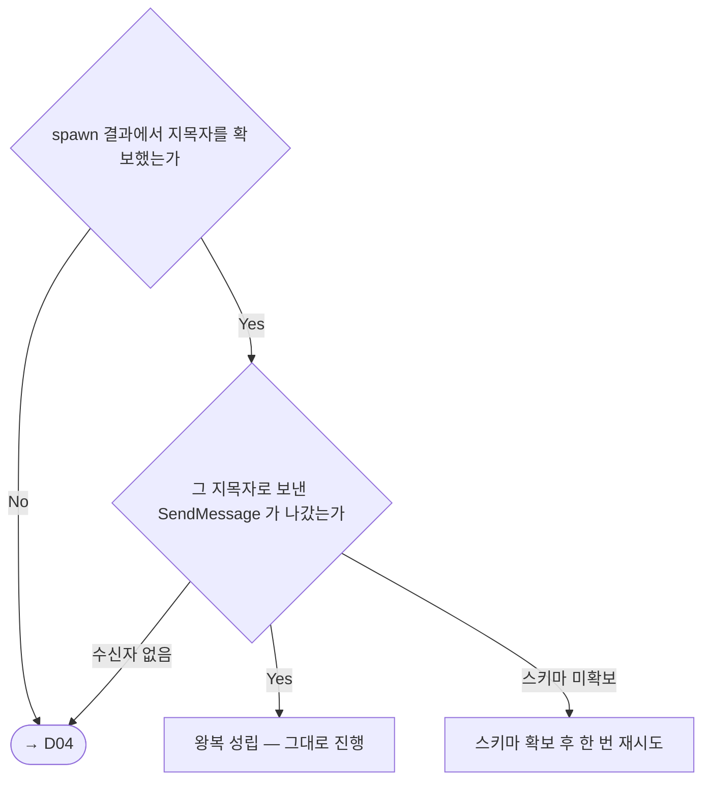
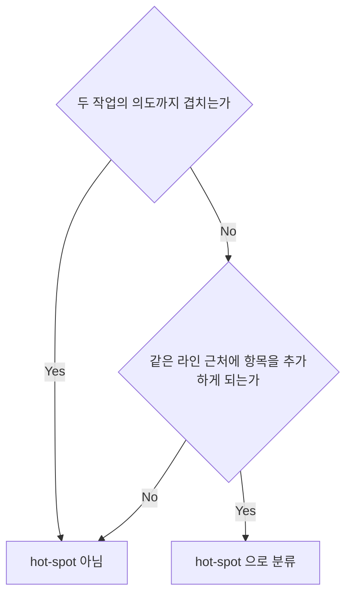
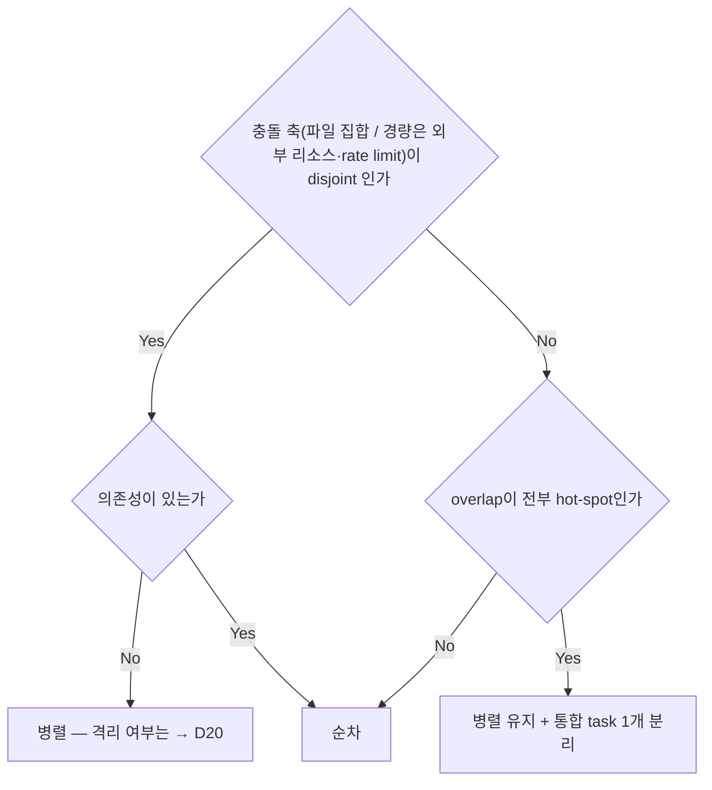
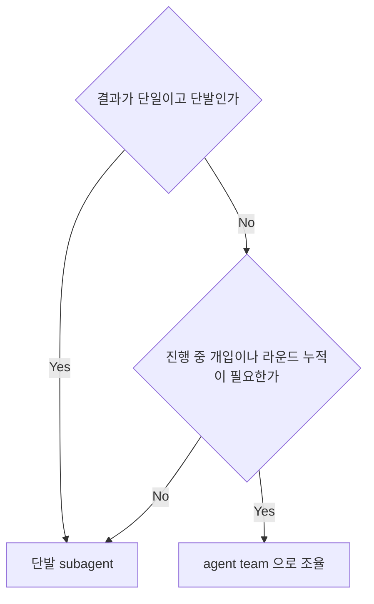
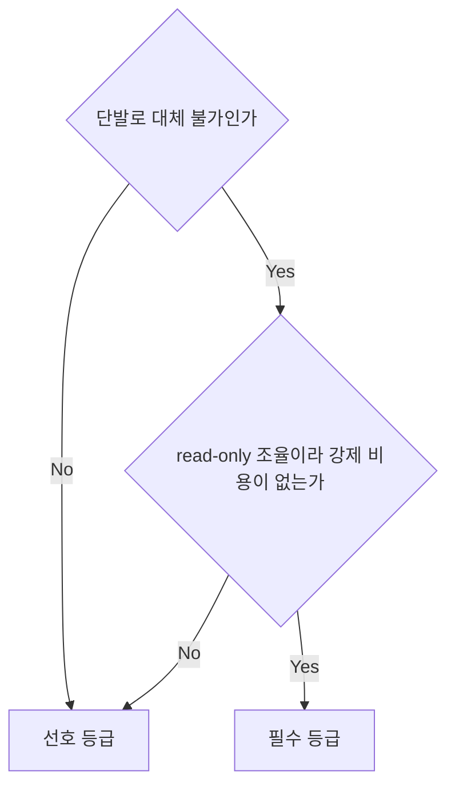
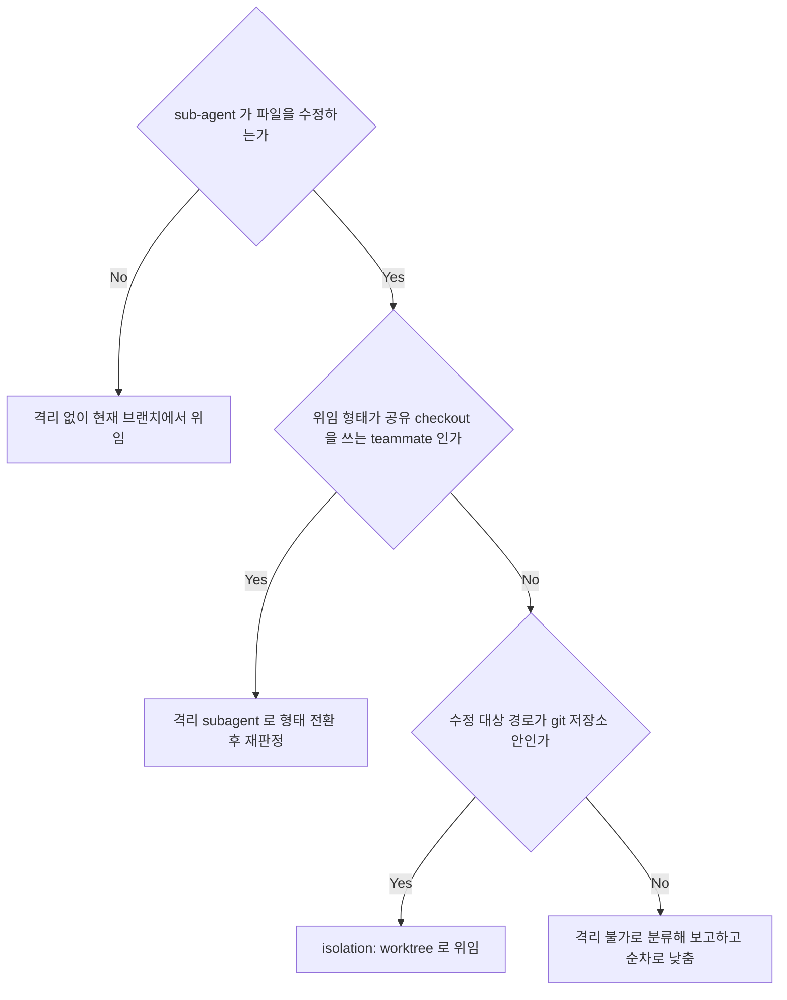
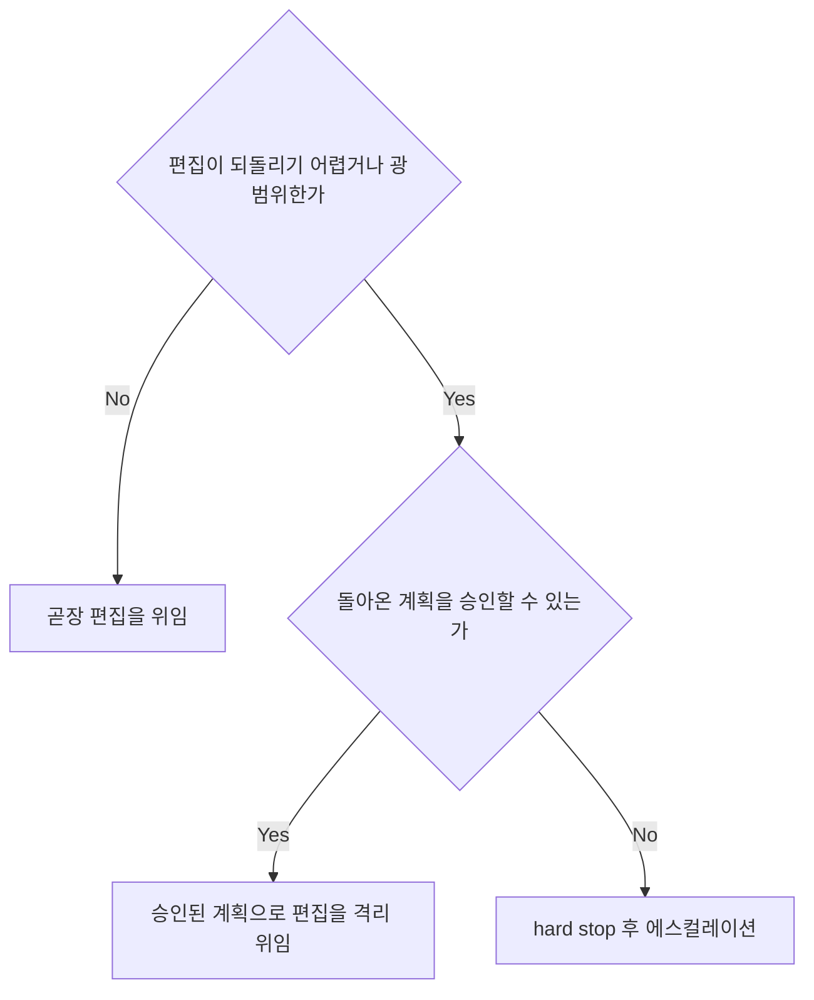
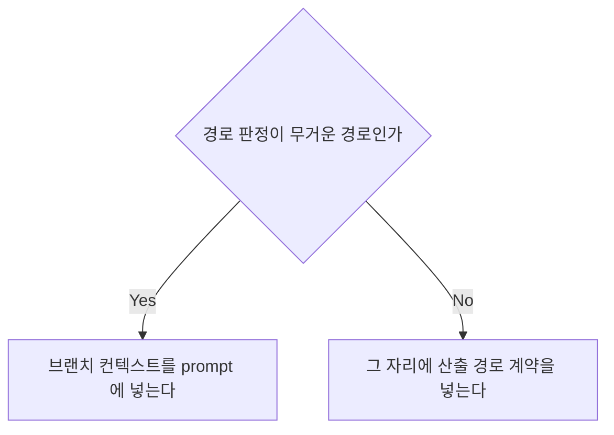

<!-- owns: D05 D13 D14 D18 D19 D20 D25 D56 | C02 C03 | P10 -->

# Dispatch Planning

메인이 작업을 sub-agent 또는 agent team 에 넘기기 직전의 국면을 소유한다. 병렬/순차·위임 형태·강제 등급·격리·prompt 계약을 한 호흡에 정하는 자리이며, 항목 하나는 블록 하나이고 그 블록이 유일한 소유처다.

## D05. spawn 확인
<!-- needs: D04 D19 -->

**입력 신호**
- 필수 등급 경로의 첫 spawn 직후인가 (→ D19)
- spawn 결과에서 지목자를 확보했는가 — `name`, 없으면 반환된 `agentId` 중 하나면 확보다
- 그 지목자로 보낸 `SendMessage` 한 번이 성공했는가, 어떤 에러인가

**종단별 행동 계약**
- 왕복 성립 → 이 한 번의 발신이 첫 조율 지시를 겸한다. 확인용 빈 메시지를 따로 보내지 않는다
- 스키마 확보 후 재시도 → 에러가 `InputValidationError` 면 스키마 미확보다 (→ C01). 확보한 뒤 다시 보내는 것은 한 번으로 끝낸다
- → D04 → 지목자를 못 얻었거나 수신자가 없으면 지목자가 틀린 것이므로 다시 보내지 않는다. 진입 판정을 다시 하고, 가용이면 재소집, 비가용이면 폴백을 금지한 채 경로별 비가용 처리로 간다 (→ D19)

**근거**: 확인을 건너뛰면 단발 왕복이 필수 등급 경로의 결과로 기록되고, 사전 장치가 이것뿐이라 사후 탐지만 남는다.

**후속**: → C05

## D13. hot-spot 판정
<!-- needs: D12 -->

**입력 신호**
- 겹치는 파일 집합 S 를 구했는가 (→ P10)
- S 의 각 파일이 의도는 안 겹치는데 같은 라인 근처에 항목을 추가하게 되는가
- 전형은 lock 파일 · 모듈 re-export · 라우트·DI·플러그인 등록 지점 · 마이그레이션 시퀀스 · i18n·전역 상수·피처플래그다 — 전형 사례이지 고정 목록이 아니므로 판정은 정의로 한다

**종단별 행동 계약**
- hot-spot → 병렬 작업 prompt 에 그 파일을 목록으로 명시해 편집을 금지하고 보고 출구를 짝짓는다 (→ C02 12번). 모든 병렬 결과를 머지한 뒤 통합 task 1개를 순차로 위임한다. lock 파일은 편집이 아니라 재생성이므로 패키지 매니저 명령 한 번으로 만들고 수동 병합은 금지한다
- hot-spot 아님 → 내용 충돌로 다루어 병렬/순차 판정에 그대로 넘긴다 (→ D14)

**근거**: 이 분기가 없으면 등록 한 줄 때문에 fan-out 전체가 순차로 떨어져 병렬 이득을 통째로 잃는다.

**후속**: → D14

## D14. 병렬 vs 순차 판정
<!-- needs: D03 D12 D13 -->

**입력 신호**
- 변경 파일 집합을 추정했는가 (→ P10 산출 · 무거운 경로만)
- 집합이 disjoint 인가 · 작업 간 의존성이 있는가 · overlap 이 전부 hot-spot 인가 (→ D13)
- 경량 경로면 축이 파일 집합이 아니라 외부 리소스·rate limit 이다 (→ D03)

**종단별 행동 계약**
- 병렬 — 격리 여부는 → D20 · 위임은 한 메시지에 하나로 직렬화한다 (→ D21)
- 순차 → 순서 근거를 기록에 남긴다 (→ C05)
- 병렬 + 통합 task → 통합 task 의 편집 금지 계약을 prompt 에 싣는다 (→ C02 12번 · → D13)

**근거**: 병렬의 이득은 시간이고 비용은 사람이 풀어야 하는 머지 충돌이라, 불확실할 때의 손해가 비대칭이다 — 의심스러우면 순차다.

**후속**: → D20 → D21

## D18. 위임 형태 결정
<!-- needs: D04 -->

**입력 신호**
- 작업이 단순 단발이고 결과가 단일인가
- 진행 중 개입·라운드 누적이 필요한가 — review→fix 반복이 예상되는가, 결과물이 여러 단계로 쌓이는가
- 왕복 조율이 이번 세션에서 가용한가 (→ D04)

**종단별 행동 계약**
- 단발 subagent → 병렬 fan-out 도 단발 여러 개다. 재위임 금지와 그 출구를 prompt 에 넣는다 (→ C02 8번). 위임 계층은 오케스트레이터에서 작업 agent 까지 한 단계다
- agent team → 편집 격리는 team 이 주지 않는다. 파일 편집은 teammate 가 직접 하지 않고 격리 subagent 에 한 단계만 위임한다 (→ D20). 지목자를 보관하고 배경으로 띄우며, 답신 채널은 저절로 생기지 않는다 (→ C03). teammate 권한은 도구로 좁힐 수 없으므로 계약으로 금지하고 토폴로지 가드로 사후 탐지한다 (→ D22). team 은 세션 종료 시 자동 정리되어 별도 정리 단계를 만들지 않는다. 강제 등급은 → D19, spawn 확인은 → D05

**근거**: team 의 실질은 직전 라운드를 기억하는 상대와의 왕복이고, 단발은 매 왕복마다 패킷을 재합성해야 해서 라운드가 늘수록 손해가 커진다.

**후속**: → D19 → D20

## D19. team mode 강제 등급
<!-- needs: D04 D18 -->

**입력 신호**
- 경로의 본질이 왕복 대화라 단발로 대체 불가인가 — 단발은 직전 라운드를 기억하지 못한다
- 경로가 read-only 조율이라 강제해도 비용이 없는가 — 편집이 개입하면 공유 checkout 오염 위험이 생긴다

**종단별 행동 계약**
- 필수 → 가드 둘이 함께 붙는다: spawn 확인 (→ D05) 과 기록의 `실행 형태`·`판정 근거` 필드 (→ C05). 가용인데 단발로 대체하면 위반이므로 결과를 채택하지 않고 위반을 기록한다. 비가용이면 폴백을 금지한다 — 자문 경로는 자문을 생략하고 원래 하려던 에스컬레이션으로, 협의체 경로는 즉시 에스컬레이션으로 간다 (→ D47)
- 선호 → 단발 폴백을 허용한다. 검증 차원은 단발 여러 개로 유지된다 (→ D18). 선호의 "의심스러우면 단발" 기본값을 필수 등급으로 옮기지 않는다 — 거기서 단발은 경로의 실질 자체를 없앤다

**근거**: team 을 "쓰면 좋다"로 두면 폴백이 사실상 기본값이 되어 team 전제 경로가 조용히 사라진다.

**후속**: → D05

## D20. isolation 유무
<!-- needs: D03 D18 -->

**입력 신호**
- sub-agent 가 파일을 수정하는가, 읽기 전용 분석인가
- 위임 형태가 공유 checkout 을 쓰는 teammate 인가 (→ D18)
- 수정 대상 경로가 git 저장소 안인가 — `git rev-parse --show-toplevel`

**종단별 행동 계약**
- isolation: worktree → 경로는 worktree 기준이다. `Edit`/`Write` 의 `file_path` 는 worktree 절대경로만 허용한다. 부모 repo 절대경로는 `Bash` cwd 와 별개로 판정되어 격리를 우회하므로 금지한다 — worktree 경로로 재지정한다. prompt 에 실을 요소는 → C02 7·9번, 생성 직후 가드는 → D21
- 격리 없음 → 읽기 전용이므로 tracked 변경이 생기지 않도록 산출 경로 계약을 싣는다 (→ D56)
- 격리 불가 → 저장소 밖 편집은 경계 케이스 판정을 따른다 (→ D03). 격리 불가로 확정되면 보고하고 fan-out 을 순차로 낮춘다 (→ D14)
- 형태 전환 → teammate 는 이 인자로 격리되지 않는다. 편집을 격리 subagent 로 옮긴 뒤 이 판정을 다시 한다 (→ D18)

**근거**: 메인이 epic 브랜치를 점유한 상태에서 같은 working tree 를 편집하면 메인 상태가 오염되고, 오염은 브랜치 전환까지 번진다.

**후속**: → C02 → D21

## D25. 계획 우선 게이트
<!-- needs: D18 D20 -->

**입력 신호**
- 편집이 되돌리기 어렵거나 광범위한가 — 스키마 변경 · 광범위 리팩토링 · 공개 API 변경
- task 도출 계약이 매긴 위험도 값 (→ C08)

**종단별 행동 계약**
- 곧장 위임 → 저위험 작업에는 이 게이트를 쓰지 않는다. 왕복 비용만 늘어난다. 형태는 → D18, 격리는 → D20
- 승인된 계획으로 위임 → 계획 요청은 편집 금지 read-only 로 내고 바꿀 파일·함수, 순서, 회귀 위험, 검증 방법을 받는다. 편집 위임 prompt 에는 "계획을 벗어나면 중단하고 보고"를 넣는다 (→ C02 4번). `mode` 같은 파라미터에 의존하지 않으므로 런타임 차이와 무관하다
- hard stop → 자율 모드면 정지하고 에스컬레이션한다 (→ D47)

**근거**: worktree 를 다 고쳐놓고 방향이 틀렸음을 발견하는 비용이 계획 왕복 한 번보다 크다.

**후속**: → D20 → C02

## D56. 산출 경로 계약 vs 브랜치 컨텍스트
<!-- needs: D03 -->

**입력 신호**
- 경로 판정이 무거운 경로인가 경량 경로인가 (→ D03)
- 이번 위임이 tracked 경로에 파일을 남길 계획인가

**종단별 행동 계약**
- 브랜치 컨텍스트 → 필수 포함 요소 3·7·9번을 그대로 싣는다 (→ C02). 격리는 → D20
- 산출 경로 계약 → "결과는 응답 텍스트로 반환하고 파일을 만들지 마라"를 넣고, 파일이 꼭 필요하면 "산출 경로는 repo 밖 scratchpad 로 한정하라"를 출구로 짝짓는다 (→ C02 10번)

**근거**: 계약을 빼면 sub-agent 가 리포트를 tracked 경로에 써서, 경량으로 판정한 런이 사후에 머지 대상을 갖게 된다.

**후속**: → C02

## 계약

## C02. Prompt 필수 포함 요소

sub-agent 는 메인 대화 히스토리를 보지 못하므로 prompt 는 자기완결적이어야 한다. 아래 번호는 안팎에서 "필수 포함 요소 N번"으로 참조된다 (→ D18 · D20 · D25 · D56 종단이 요구).

1. **목적** — 무엇을 달성해야 하는가
2. **컨텍스트** — 작업 배경, 관련 파일의 전체 경로, 이미 알려진 제약
3. **브랜치 또는 산출 경로 계약** — 무거운 경로는 base epic 브랜치 이름, 경량 경로는 산출 경로 계약 (→ D56)
4. **범위** — 무엇을 하고 무엇을 하지 말 것
5. **출력 형식** — 결과를 어떤 형태로 돌려줄지. 어떤 채널로 돌려줄지는 11번이 따로 규정한다
6. **검증 기준** — 완료를 무엇으로 확인할지
7. **worktree 격리 준수** — 격리 위임 시 필수. 매 호출 전 `file_path` 와 cwd 가 자기 worktree 안인지 검증하고, 부모 repo 를 직접 고치지 말 것. 이미 만든 변경은 직접 reset·checkout 하지 말고 stash 로 보존한 뒤 보고할 것 (→ D20)
8. **재위임 금지** — 다른 agent 에게 넘기지 말고 직접 수행하고, 막히면 실패 사유와 함께 종료할 것. 단 teammate 가 편집을 격리 subagent 에 넘기는 한 단계는 예외다 (→ D18)
9. **base 확인 + 규약 브랜치 생성** — 격리 위임 시 필수. worktree 의 base 가 위임 시점 epic HEAD 라는 보장이 없으므로 시작 전 확인해 뒤처져 있으면 맞춘 뒤, `<epic>-t<task-id>-<slug>` 를 만들고 그 위에서만 커밋할 것 (→ C10)
10. **금지에는 출구를 함께 준다** — 금지 계약에는 "대신 무엇을 하라"를 반드시 짝짓는다. 금지만 주면 sub-agent 는 그 상황에서 뭐라도 해야 하므로 위반이 재발한다
11. **보고 채널** — 배경 위임 시 필수 (→ C03)
12. **hot-spot 편집 금지 + 출구** — 겹치는 hot-spot 이 있으면 필수. 파일을 목록으로 명시해 금지하고 필요한 항목을 보고하라는 출구를 준다 (→ D13)
13. **증거 계약** — 조사·탐색·감사 위임 시 필수. 모든 claim 에 실행한 명령 원문과 `file:line` 근거를 붙이고, 못 찾으면 `NOT FOUND — searched with <명령>` 형식으로 보고할 것 (→ D37)

## C03. 보고 채널 계약

배경 위임의 응답 채널을 규정한다 (→ C02 11번과 D18 team 종단이 요구).

- sub-agent 가 그냥 출력한 텍스트는 메인에 보이지 않는다. 메인에게 말하는 유일한 채널은 `SendMessage({to: "main", ...})` 다.
- prompt 에 명시할 문구 — "진행 보고·질문·부분 결과는 `SendMessage({to: "main", summary: "<한 줄 요약>", message: "<내용>"})` 로 보내라. 그냥 출력하면 메인에 전달되지 않는다."
- 채널 지시는 spawn prompt 안에 있어야 한다. 띄운 뒤에 붙일 수 없다.

**근거**: 최종 완료 알림에는 마지막 출력이 실려 오므로 짧은 단발은 채널이 없어도 성공한 것처럼 보이고, 조용히 유실되는 것은 완료 이전의 진행·질문·부분 결과 전부다.

## 절차

## P10. 충돌 위험 사전 분석

무거운 경로 전용 — 경량 경로는 → D03. 병렬 가능성을 판정할 입력, 곧 겹치는 파일 집합 S 를 만드는 조사다. 메인이 epic 브랜치에서 직접 수행하고 산출은 → D13 · → D14 가 쓴다.

1. Glob 으로 작업 영역을 추정한다 — "auth 관련 작업"이면 `src/auth/**`, `tests/auth/**`
2. Grep 으로 cross-reference 를 식별한다 — 작업 A 가 건드릴 함수가 작업 B 영역에서 import 되는가
3. `git log --stat <default-branch>..<epic>` 으로 epic 누적 변경 영역을 확인한다 — 같은 파일이 반복 수정되는 영역인가
4. 의존성 그래프를 추정한다 — import 체인이 작업 간에 얽혀 있는가

**근거**: 짧고 결정적인 조사라 위임할 가치가 없다.
