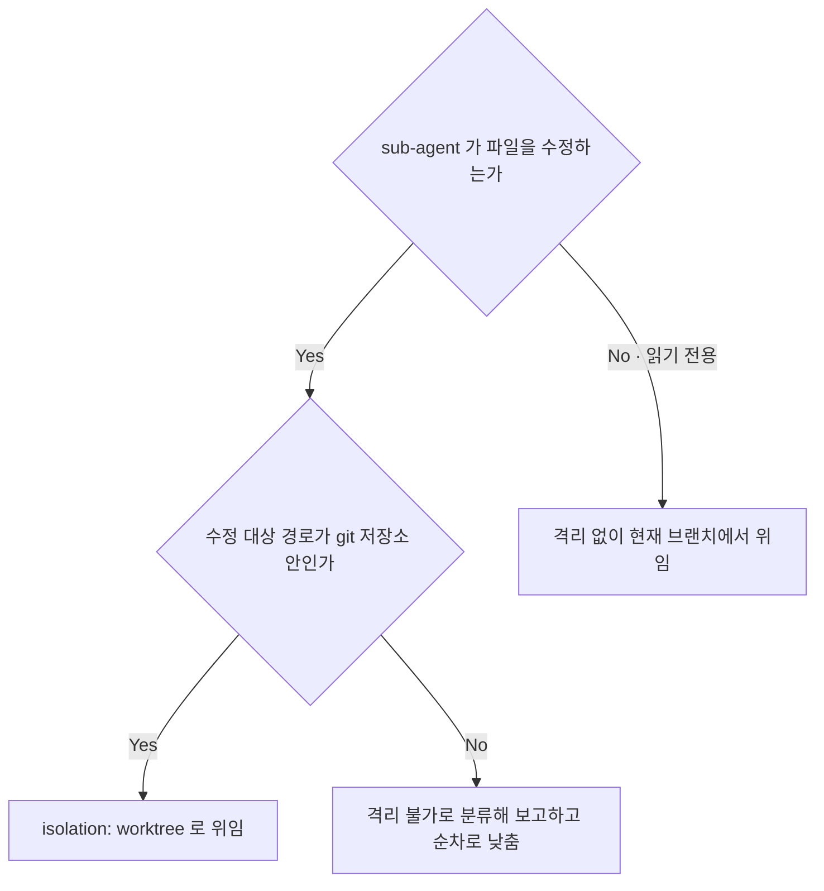

<!-- owns: D20 -->

# Dispatch Planning

실행 계획을 세우고 위임 형태를 정하는 국면의 항목을 소유한다. 항목 하나는 `## D##.` / `## C##.` / `## P##.` 블록 하나이며, 그 블록이 해당 항목의 유일한 소유처다.

## D20. isolation 유무

<!-- needs: D03 D18 -->

**입력 신호**
- sub-agent 가 파일을 수정하는가, 읽기 전용 분석인가
- 수정 대상 경로가 git 저장소 안인가 (`git rev-parse --show-toplevel`)
- 위임 형태가 단발 subagent 인가, 공유 checkout 을 쓰는 teammate 인가 (→ D18)
- 경로 판정이 무거운 경로인가 경량 경로인가 (→ D03)

**종단별 행동 계약**
- isolation: worktree → 경로는 worktree 기준. `Edit` 는 `Bash` cwd 와 별개로 경로를 판정한다 — 부모 repo 절대경로 `file_path` 는 격리를 우회한다. prompt 에 실을 요소는 → C02, 생성 직후 가드는 → D21. teammate 는 공유 checkout 이라 이 인자로 격리되지 않으므로, 편집이 필요하면 격리 subagent 로 형태를 바꾼다 (→ D18)
- 격리 없음 → 읽기 전용이므로 tracked 변경이 생기지 않도록 산출 경로 계약을 prompt 에 싣는다 (→ C02 · → D56)
- 격리 불가 → 사용자에게 보고하고 fan-out 을 순차로 낮춘다 (→ D14)

**근거**: 메인이 epic 브랜치를 점유한 상태에서 같은 working tree 를 편집하면 메인 상태가 오염되고, 오염은 브랜치 전환까지 번진다.

**후속**: → C02 → D21
