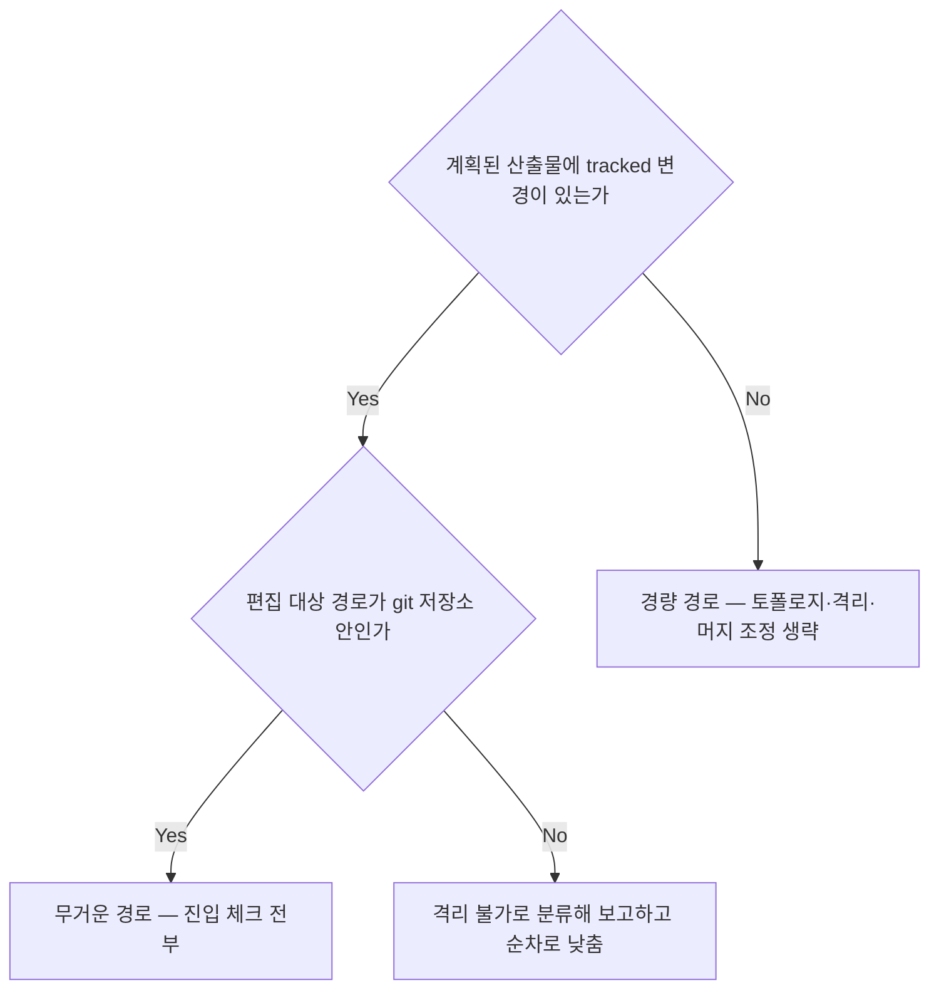
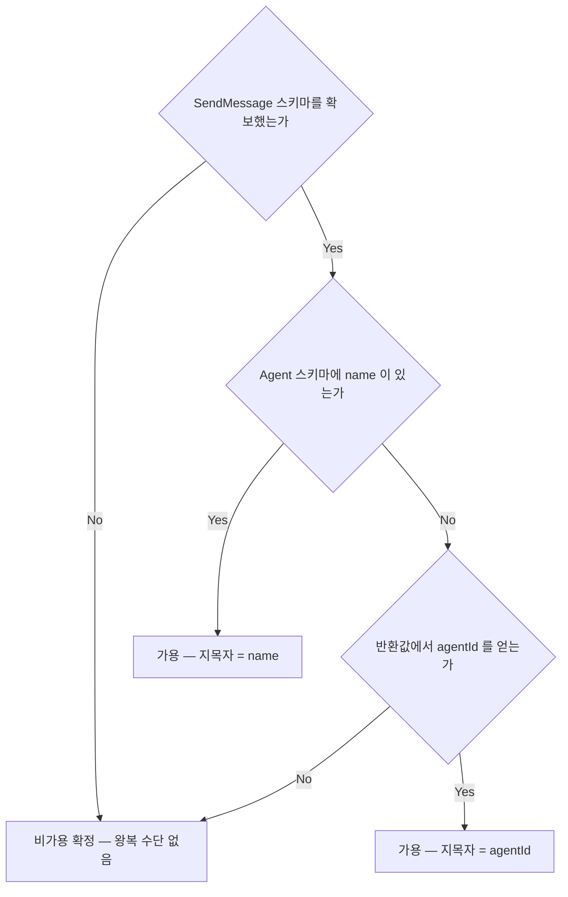
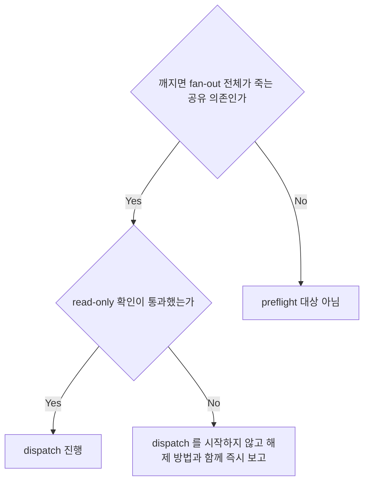
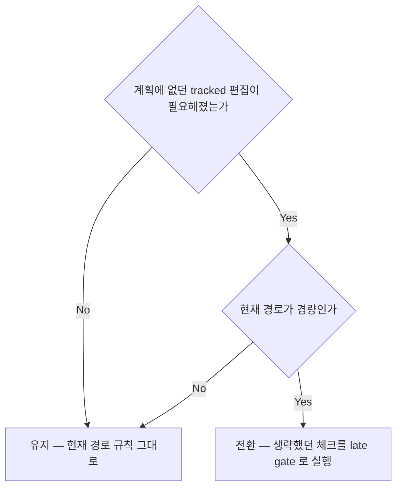
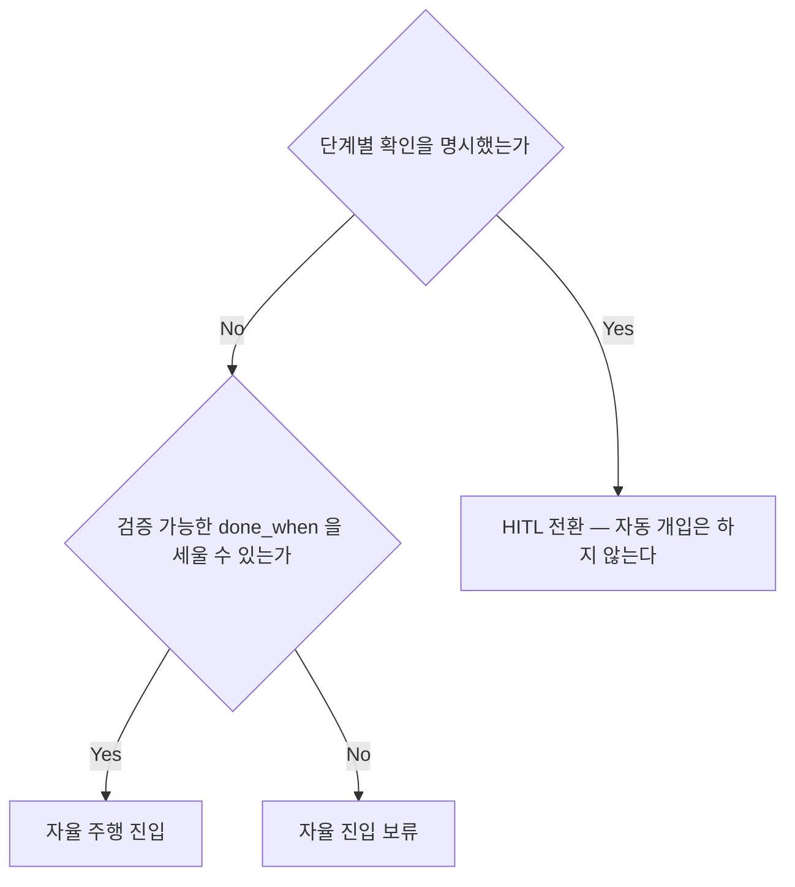
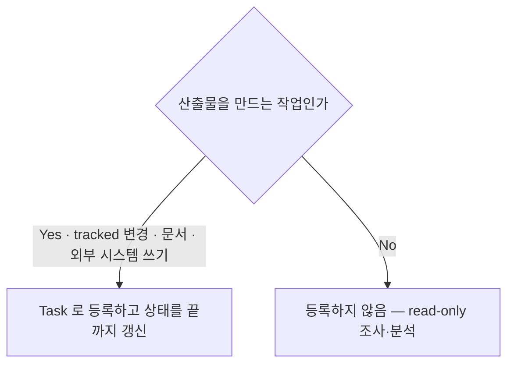

<!-- owns: D03 D04 D06 D07 D45 D54 | C01 C16 | P01 -->

# Entry Gates

진입 즉시 확정하는 게이트를 소유한다. 항목 하나는 `## D##.` / `## C##.` / `## P##.` 블록 하나이며, 그 블록이 해당 항목의 유일한 소유처다. 게이트를 밟는 순서는 P01 이 갖는다.

## D03. 경로 판정 게이트 (경량 vs 무거운)

<!-- needs: C01 -->

**입력 신호**
- 이번 런의 **계획된** 산출물에 tracked 파일 변경이 있는가 — "git 레포 안인가"가 아니다
- 산출물이 외부 시스템 쓰기뿐인가 (이슈 등록·PR 코멘트·배포)
- 편집이 필요한 대상 경로가 git 저장소 안인가
- 계획이 바뀌면 판정도 다시 한다 — 실제로 무엇을 썼는지가 아니라 무엇을 쓰기로 했는지를 본다

**종단별 행동 계약**
- 무거운 경로 → 토폴로지 확인(→ D22)과 격리 판정(→ D20)을 실행하고 머지 조정까지 유지한다. base 브랜치·격리·base 확인 요소를 prompt 에 싣는다 (→ C02 3·7·9번)
- 경량 경로 → 생략되는 것은 토폴로지 가드·격리·머지 조정뿐이다. 조율 도구 확보(→ C01)·왕복 조율 판정(→ D04)·Task 등록 판정(→ D54)·preflight(→ D06)·복원력(→ D38)·취합 보고(→ C13)는 그대로 유지하고 리뷰·QA 는 쓰기 전 검토로 축소한다 (→ D30). **산출 경로 계약을 prompt 에 싣는다** (→ D56). 경량 경로에는 epic 브랜치가 없으므로 기록 위치의 `<epic>` 자리는 런 식별자로 대체한다 — 산출 경로·체크포인트 범위는 → D56, 기록 형식은 → C05 · → C06. 외부 시스템 쓰기만 하는 런도 되돌림 비용이 있으므로 preflight 와 에스컬레이션(→ D47)은 유지한다
- 격리 불가 → 경량으로 낮추는 것은 금지한다 — 사용자에게 보고하고 fan-out 을 순차로 낮춘다 (→ D14)

**근거**: 축은 파일을 쓰는지가 아니라 그 산출물이 머지 경로에 올라타는지다.

**후속**: → D45 → D04

## D04. 왕복 조율(team) 가용 판정

<!-- needs: C01 -->

**입력 신호**
- `SendMessage` 스키마를 확보했는가 (→ C01)
- spawn 결과로 그 상대를 다시 지목할 수 있는가 — `Agent` 스키마의 `name`, 없으면 반환값의 `agentId`
- (보조) `printenv CLAUDE_CODE_EXPERIMENTAL_AGENT_TEAMS` — `Bash` 는 메인과 다른 프로세스라 단독 근거가 못 되므로 1차 신호를 확인할 수 없을 때만 참고한다
- 판정 시점은 진입 1회다. 트리거 시점 재확인은 하지 않는다

**종단별 행동 계약**
- 가용(name) → 이름은 세션 안에서 유니크해야 한다. 필수 등급 경로의 첫 spawn 은 왕복 성립을 확인하고(→ D05), 성립하지 않으면 1회만 재판정한다
- 가용(agentId) → `name` 부재를 비가용으로 처리하는 것은 금지한다 — 반환값의 `agentId` 를 보관해 같은 왕복을 세운다. 반환값을 버리면 그 상대와 다시 대화할 수단이 사라진다. 이후 처리는 name 종단과 같다 (→ D05)
- 비가용 → 보조 신호 하나로 단정하는 것은 금지한다 — 1차 신호를 확인할 수 없을 때만 보조 신호를 본다. 경로별 반응은 강제 등급(→ D19)이 정하고, team 을 전제하는 자문 경로는 차단된다 (→ D27)

**근거**: 필수 등급이 요구하는 실질은 직전 라운드를 기억하는 상대와의 왕복이고, 그것을 주는 것은 `name` 이라는 파라미터가 아니라 `SendMessage` 라는 채널이다.

**후속**: → D18 → D19

## D06. 공유 전제 preflight

<!-- needs: C01 D03 -->

**입력 신호**
- 깨졌을 때 fan-out 전체가 죽는 공유 의존인가 — 작업 하나만 죽이는 의존은 대상이 아니다
- 이번 런의 파이프라인이 **실제로 거치는** 의존인가 (위임·머지 경로가 쓰는 CLI 인증, 필수 외부 서비스 도달)
- 확인이 read-only 인가 — 로그인 시도·토큰 갱신·리소스 생성은 preflight 가 아니다
- 고정된 명령 목록을 따르지 않는다 — 레포마다 파이프라인 의존이 다르고 목록은 곧 stale 해지므로 이번 런의 계획에서 도출한다

**종단별 행동 계약**
- 진행 → 이후 개별 실패는 preflight 가 아니라 복원력·재위임 경로가 처리한다 (→ D38 · → D33)
- 즉시 보고 → 부분 dispatch 로 밀어붙이는 것은 금지한다 — 무엇을 확인하다 실패했는지와 해제 방법(예: 로그인 명령)을 함께 내고, 전제가 복구된 뒤 다시 진입한다
- 대상 아님 → preflight 를 넓히는 것은 금지한다 — 진입만 무거워지고 정작 공유 전제가 묻힌다. 게이트·재위임 경로로 넘긴다 (→ D33)

**근거**: 이 부류의 실패는 dispatch 뒤에 드러나면 이미 진행한 작업까지 함께 잃고, 같은 확인이 런 시작 시점에 가장 싸다.

**후속**: → D14

## D07. 경로 전환 판정 (경량 → 무거운)

<!-- needs: D03 -->

**입력 신호**
- 계획에 없던 tracked 파일 편집이 필요해진 순간인가
- 현재 경로 판정 결과가 경량인가 (→ D03)
- 편집 대상 경로가 git 저장소 안인가

**종단별 행동 계약**
- 전환 → 편집 dispatch 를 먼저 시작하는 것은 금지한다 — 토폴로지(→ D22)와 격리(→ D20)를 late gate 로 먼저 세운다. 기존 Task 는 유지하고 재분해하지 않는다 (→ C16). 전환 사유와 시점을 decision log 에 남긴다 (→ C05). 이후 dispatch 는 전부 무거운 경로 규칙이며, 편집 대상이 git 저장소 밖이면 격리 불가 종단으로 간다 (→ D03)
- 유지 → 역방향(무거운 → 경량) 전환은 없다. 한 번 올라간 경로는 런이 끝날 때까지 유지한다

**근거**: 선-dispatch 후-체크는 격리 없이 쓴 변경을 이미 남긴 뒤라, 늦은 게이트라도 편집 전에 서야 한다.

**후속**: → D22 → D20

## D45. 자율 주행 vs HITL 모드 판정

<!-- needs: D01 -->

**입력 신호**
- 사용자가 단계별 확인을 명시했는가 — "확인받으면서", "단계마다 물어봐", "babysit", "자동으로 머지하지 마"
- 검증 가능한 종료 조건(`done_when`)을 세울 수 있는가
- 기본값은 자율 주행이며, 판정은 진입 1회 확정이다

**종단별 행동 계약**
- HITL → 정체·실패·충돌은 보고하고 결정을 기다린다. 집행 중인 상대에 대한 명령 주입(→ D46)·자동 머지(→ D40)·자동 충돌 해결(→ D42)·자동 재위임(→ D33)·worktree 정리(→ D51)는 각 항목의 HITL 분기를 따른다 — 모드는 그 항목들의 판정 입력이며, 이 블록이 별도의 무조건 금지를 두지 않는다
- 자율 주행 → 자율 계약을 한 번 보고하고 시작한다 (→ C04 · → C13). 자동 개입은 예산을 소모하고, 소진되거나 hard stop 에 닿으면 그 즉시 멈춘다 (→ C04). 에스컬레이션 조건은 자율에서도 무시하지 않는다 (→ D47)
- 진입 보류 → 종료 조건 없이 자율로 들어가는 것은 금지한다 — 먼저 사용자와 `done_when` 을 합의하고, 합의 전까지는 HITL 종단 규칙으로 진행한다

**근거**: 모드는 자동 개입 허용 범위를 정하는 유일한 축이라, 진입에서 1회 확정해 두지 않으면 개입할 때마다 재해석되어 규칙이 갈린다.

**후속**: → C04 → D46

## D54. Task 시스템 적용 판정

<!-- needs: D01 -->

**입력 신호**
- 이 런이 **산출물을 만드는 작업**인가 — tracked 변경 · 문서 · 외부 시스템 쓰기
- 산출물 없이 읽고 판단만 하는 조사·분석인가
- 판정 축은 dispatch 수나 작업 횟수가 아니라 산출물 유무다

**종단별 행동 계약**
- 등록 → 산출물 개수와 무관하게 등록한다. 필드·의존성·owner 는 → C16 을 따르고, 상태는 dispatch 시 `in_progress`, 머지·완료 시 `completed` 로 갱신한다. ad-hoc 메모로 대체하는 것은 금지한다 — 대신 등록된 Task 의 상태를 갱신한다
- 등록하지 않음 → 조사 결과가 산출물로 이어지기로 바뀌는 순간 이 판정을 다시 한다. 경로 판정도 함께 다시 본다 (→ D07)

**근거**: 기준을 횟수로 두면 무엇을 한 건으로 세느냐에 따라 의무가 흔들리므로, 관찰 가능한 산출물 유무를 축으로 둔다.

**후속**: → C16

## 계약

## C01. 조율 도구 스키마 확보

1. 진입 즉시, 다른 어떤 체크보다 먼저 조율 도구의 스키마를 확보한다 — `ToolSearch({query: "select:SendMessage,Monitor,TaskCreate,TaskList,TaskGet,TaskUpdate"})`.
   - 근거: 이 도구들은 deferred 라 스키마 확보 전에는 존재하지 않는 것과 같고, 이름만 보고 부르면 `InputValidationError` 로 실패한다.
2. 세션당 1회만 한다. 확보된 스키마는 세션 내내 유효하다.
3. 결과 목록에 없는 도구는 이 런타임에 없는 것이다 — 이름을 추측해 호출하는 것은 금지한다. 없는 경로는 폴백으로 대체한다.
4. `SendMessage` 미확보의 결과는 → D04 의 첫 노드가 판정한다.
5. 이 체크는 공유 전제 판정의 한 사례다 — 조율 경로 전체가 이것 하나에 걸려 있어 다른 모든 체크보다 앞선다 (→ D06).
6. 경량 경로에서도 생략하지 않는다 (→ D03).

## C16. Task 시스템 사용법

등록 여부의 판정은 → D54 가 갖는다. 이 절은 등록하기로 한 뒤의 필드·의존성·owner 사용법을 갖는다.

1. **등록**: `TaskCreate({subject, description})` — `description` 에 범위와 검증 기준을 넣는다. 생성 상태는 `pending`.
2. **의존성**: `TaskUpdate({taskId, addBlockedBy})` 로 순차 의존을 표현한다. blocked task 는 선행이 완료되기 전에는 claim 되지 않는다.
3. **소유권**: dispatch 한 상대를 `owner` 로 표시한다 (`TaskUpdate({taskId, owner})`).
4. **조회**: `TaskList()` 는 pending·미소유·non-blocked 를 작업 가능으로 보여 주고, `TaskGet({taskId})` 는 전체 요구사항과 `blockedBy` 를 준다.
5. **상태 전이**: dispatch 시 `in_progress`, 머지·완료 시 `completed`. 완료는 blocked task 를 자동 해제한다.
6. **추적 범위**: Task 는 작업 상태(분배·의존성·소유권)를 추적하고 산출 내용은 추적하지 않는다.
   - 근거: `TaskOutput`/`.output` 파일은 deprecated 이고, 추적에 쓰면 전체 transcript symlink 가 메인 컨텍스트를 넘긴다 — 결과는 완료 알림과 결과 본문으로 받는다.

## 절차

## P01. 진입 절차

1. **조율 도구 스키마 확보** → C01. 다른 모든 단계보다 먼저 온다.
2. **경로 판정** → D03. 무거운 경로면 3·4 를, 경량 경로면 5 로 바로 간다.
3. **토폴로지 확인** (무거운 경로만) — 현재 브랜치가 epic 브랜치이고, 메인이 worktree 가 아니라 메인 working tree 에서 clean 한가 → D22.
4. **격리 판정** (무거운 경로만) — 저장소 안 편집은 격리 위임으로 간다 → D20.
5. **모드 판정** → D45.
6. **왕복 조율 가용 판정** → D04.
7. **공유 전제 preflight** → D06. dispatch 직전 마지막 확인이다.
8. **일감 등록 판정** → D54, 등록하면 → C16.
9. 각 단계의 **판정 결과와 사용한 신호**를 진입 보고 1줄과 decision log 에 남긴다 (→ C13 · → C05). 근거 없는 생략은 판정이 아니다 — 생략하려면 그 판정을 먼저 남긴다.

런 도중 계획에 없던 tracked 편집이 필요해지면 → D07 로 되돌아온다. 진입 이후의 단계 순서는 → P02 가 갖는다.
