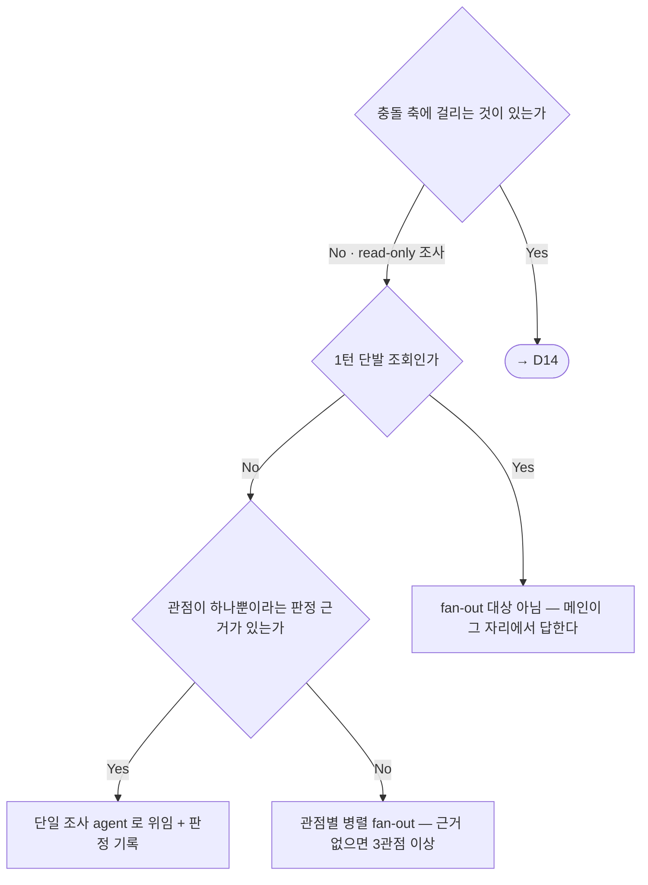
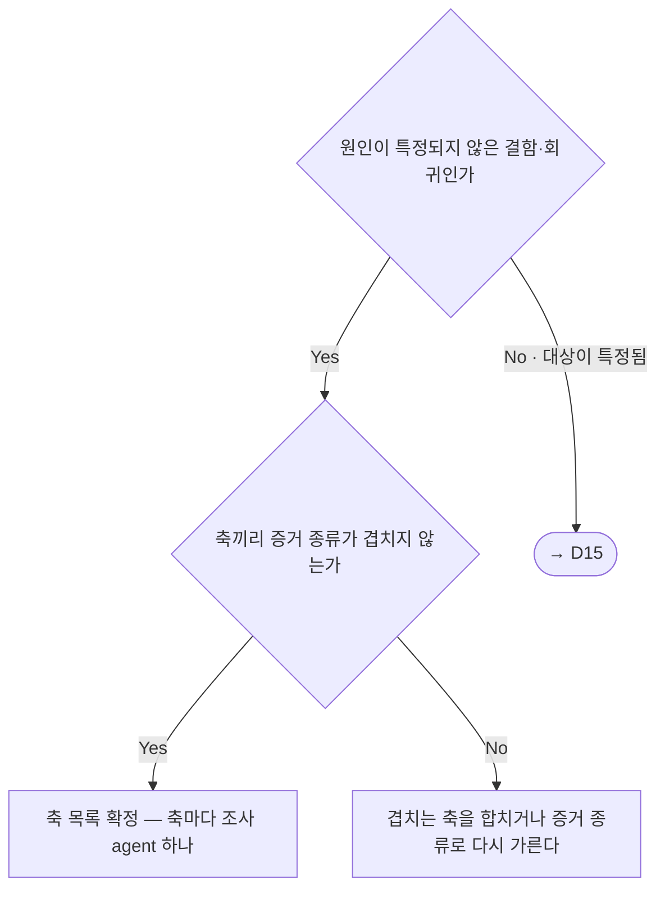
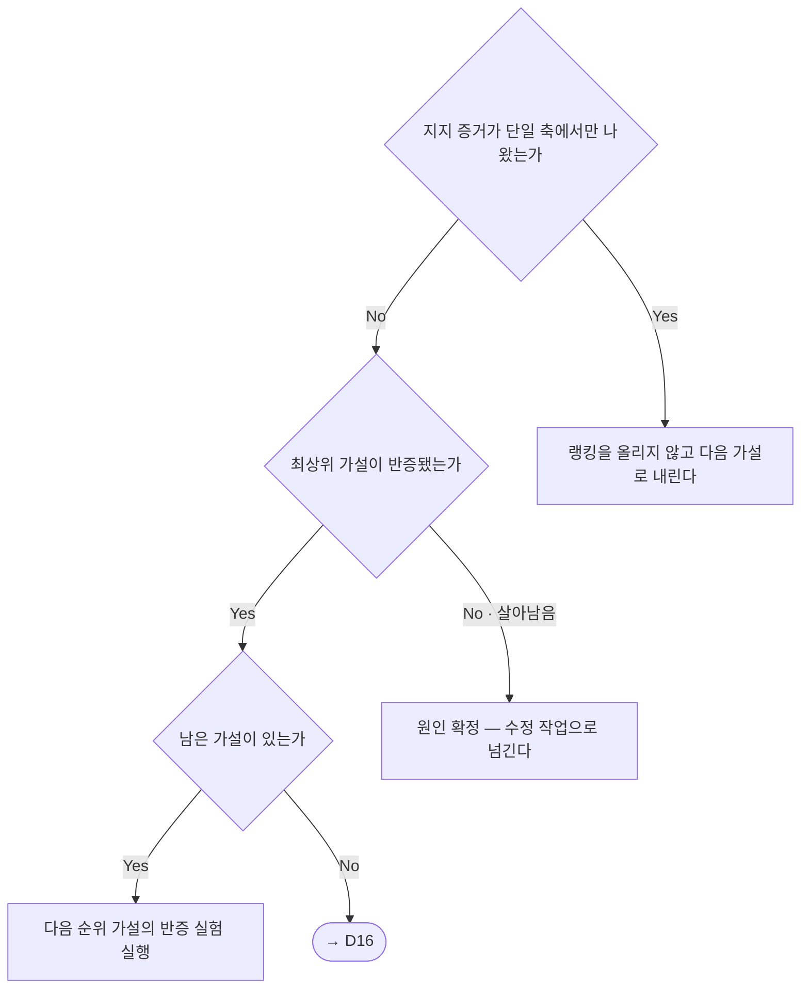
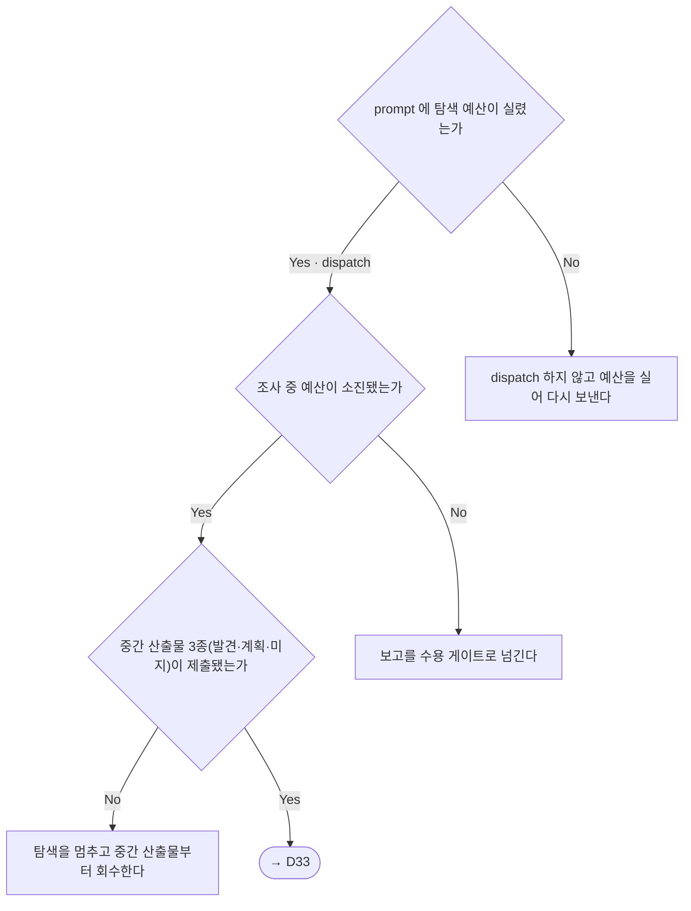
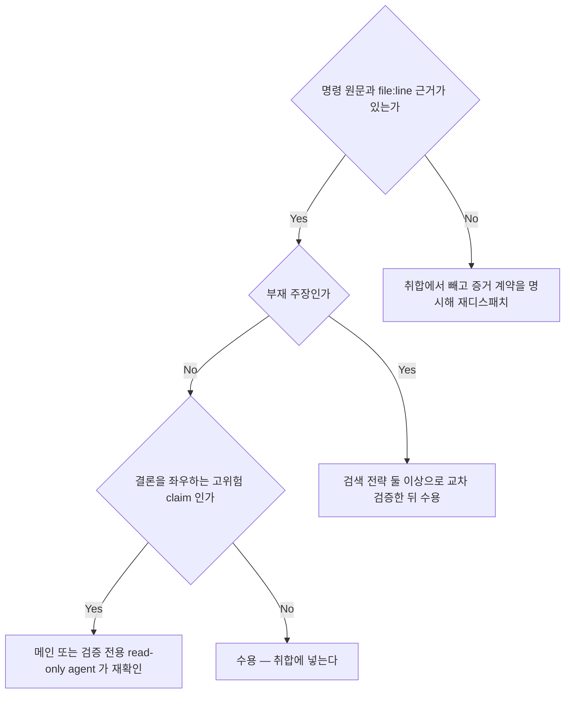

<!-- owns: D15 D16 D17 D23 D37 -->
<!-- needs: D14 D18 -->

# Investigation

read-only 조사를 설계하고 그 보고를 수용하는 국면의 항목을 소유한다. 항목 하나는 `## D##.` 블록 하나이며, 그 블록이 해당 항목의 유일한 소유처다.

## D15. 조사·감사 작업의 병렬 fan-out 기본값 + 관점 수 결정

<!-- needs: D14 -->

**입력 신호**
- 충돌 축(변경 파일 집합 · 외부 리소스 · rate limit)에 걸리는 것이 있는가
- 1턴 단발 조회인가 (→ D01 의 트리거하면 안 되는 상황)
- 관점(모듈 · 레이어 · 가설 · 이력)이 하나뿐이라는 판정 근거가 있는가

**종단별 행동 계약**
- 병렬 fan-out → 관점 수 판정 근거를 decision log 에 남긴다(→ C05). 각 조사 prompt 에 탐색 예산(→ D23)·보고 채널·산출 경로 계약을 싣는다(→ C02 · → D56). read-only 조사는 산출물을 만들지 않으므로 Task 등록 대상이 아니다(→ D54)
- fan-out 대상 아님 → 조사 dispatch 를 만들지 않는다. 여기서 결정적 사실 확인 이상으로 파고들면 그것이 조사 착수이므로 위 판정으로 되돌아온다
- 단일 agent → 그 판정을 decision log 에 남긴다(→ C05). 기록 없이 메인이 순차 탐색으로 조사를 시작하는 것은 금지한다 — 판정을 기록하거나 fan-out 으로 벌린다
- → D14 → 충돌 비용이 있는 작업이므로 "의심스러우면 순차"가 그대로 적용된다

**근거**: 순차의 근거는 충돌 비용인데 read-only 조사에는 그 비용이 없어 기본값이 뒤집힌다.

**후속**: → D23 → D16

## D16. 근본원인 swarm 축 분해 판정

<!-- needs: D15 -->

**입력 신호**
- 원인이 특정되지 않은 결함·회귀인가 (재현은 되는데 원인 지점이 안 잡히는가)
- 후보 축끼리 보는 **증거의 종류**가 겹치지 않는가
- 기본 4축(현재 상태 · 변경 이력 · 환경 차이 · 선례)이 이 대상에 유효한가 — 기본 분해이지 고정 목록이 아니다

**종단별 행동 계약**
- 축 목록 확정 → 축마다 증거 계약을 prompt 에 싣는다(→ C02 13번). 축 특수화는 둘이다 — 근거를 못 붙인 것은 "추정"으로 표시해 결론에서 빼고, 원문이 아니라 압축 요약으로 반환한다. 수용 규칙은 → D37
- 축 재분해 → 겹친 축을 그대로 dispatch 하는 것은 금지한다 — 같은 증거를 둘이 보면 병렬이 아니라 중복이므로 증거 종류로 다시 가른 뒤에 보낸다
- → D15 → 축이 아니라 관점으로 벌리는 일반 조사이므로 fan-out 판정으로 돌아간다

**근거**: 혼자 파면 처음 눈에 띈 신호에 고착되고 고착은 시도를 늘려서 풀리지 않는다 — 탐색 공간을 넓히는 것이 유일한 출구다.

**후속**: → D17

## D17. 가설 랭킹·반증 진행 판정

<!-- needs: D16 -->

**입력 신호**
- 축별 요약의 각 주장에 `file:line` 또는 명령 출력이 붙어 있는가 (→ D37)
- 지지·반박 증거가 어느 축에서 나왔는가
- 최상위 가설의 최저비용 반증 실험 결과

**종단별 행동 계약**
- 랭킹 보류 → 단일 신호를 근거로 순위를 올리는 것은 금지한다 — 다른 축의 교차 증거가 나온 뒤에 올린다
- 원인 확정 → 확정 근거를 decision log 에 남기고(→ C05) 수정은 편집 위임으로 넘긴다(→ D18 · → D20)
- 다음 순위 실행 → 반증된 가설에 조건을 덧붙여 살리는 것은 금지한다 — 순위를 내리고 다음으로 넘어간다. 실험은 최저비용부터 고르며 "고쳐보고 되는지 본다"는 반증 실험이 아니다
- → D16 → 전부 반증됐으면 빠진 축이 있다는 뜻이므로 축 분해로 되돌아간다

**근거**: 반증되지 않는 가설은 랭킹이 아니라 고착이며, 고착은 축을 늘려야만 풀린다.

**후속**: → D18

## D23. 탐색 예산 결정·소진 처리

<!-- needs: D15 D18 -->

**입력 신호**
- 위임 형태가 정해진 뒤의 조사형 dispatch 인가 (→ D18)
- read/search 류 도구 호출로 진행되는 read-only discovery 인가 (→ D15)
- prompt 에 탐색 예산이 값과 함께 실렸는가 (값은 → C04)

**종단별 행동 계약**
- 예산 없이 dispatch → 금지한다. 값은 → C04 가 소유하고, prompt 에는 그 값을 자기완결적으로 싣는다(→ C02) — sub-agent 는 이 문서를 읽지 않는다. 기본값에서 조정했으면 조정 근거를 decision log 에(→ C05)
- 수용 게이트로 → 증거 계약을 먼저 통과시킨다 (→ D37)
- 중간 산출물 회수 → 발견 사항 · 구체 계획(파일 경로 포함) · 미지 항목을 먼저 받는다. 산출물 제출 전 탐색 연장은 금지한다 — 출구는 재위임 요청이다
- → D33 — 미지 항목을 재위임 판단의 입력으로 넘긴다. 재위임하면 예산을 새로 실어 보내고(→ C02) 판단을 decision log 에 남긴다(→ C05)

**근거**: 읽기만 하고 산출물이 없는 루프는 상한이 없으면 스스로 끝나지 않는다.

**후속**: → D37

## D37. 증거 계약 수용 판정 (보고 수용 게이트)

<!-- needs: -->

**입력 신호**
- claim 에 실행 명령 원문과 `file:line` 근거가 붙어 있는가 (이 게이트는 조사·리서치 보고에 적용한다 — 편집 보고 수용은 → D36)
- 부재 주장(negative claim)인가 — "X 가 없다"
- 결론을 좌우하는 고위험·단일 출처 claim 인가

**종단별 행동 계약**
- 재디스패치 → 재디스패치 예산을 소모한다(→ C04). 예산이 남지 않으면 무한 재위임 대신 "미완(사유 포함)"으로 명시해 취합한다(→ D33)
- 교차 검증 → 같은 전략의 반복은 교차 검증이 아니므로 금지한다 — 검색 축을 바꾼다(패턴 검색 → 이름 기반 탐색 → 추적 목록 조회). 다른 게이트가 내놓는 `NOT FOUND` 보고도 부재 주장이므로 이 경로를 탄다(→ D24)
- 재확인 → 모든 보고를 메인이 재실행하는 것은 비용이 커서 유지되지 않는다. 재확인 주체는 편집을 겸하지 않는다(→ D20)
- 수용 → 조사 축 적용형이 swarm 반환 계약이다(→ D16). 결함·가설 조사면 수용한 증거를 가설 랭킹에 넣고(→ D17), 아니면 취합 보고로 넘긴다(→ C13)

**근거**: 증거 없는 claim 하나가 취합을 통과하면 그 뒤의 판정이 전부 그 위에 쌓인다.

**후속**: → D17 · → C13
