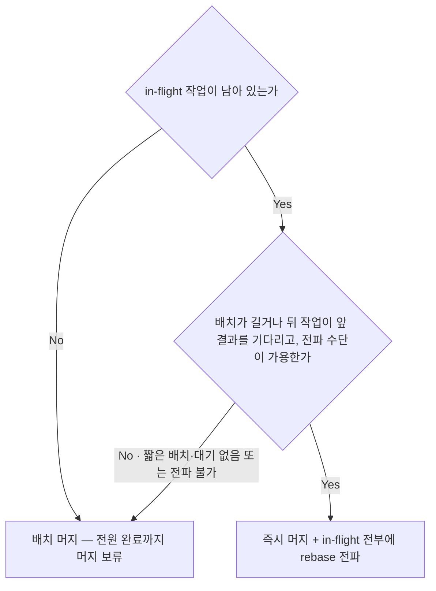
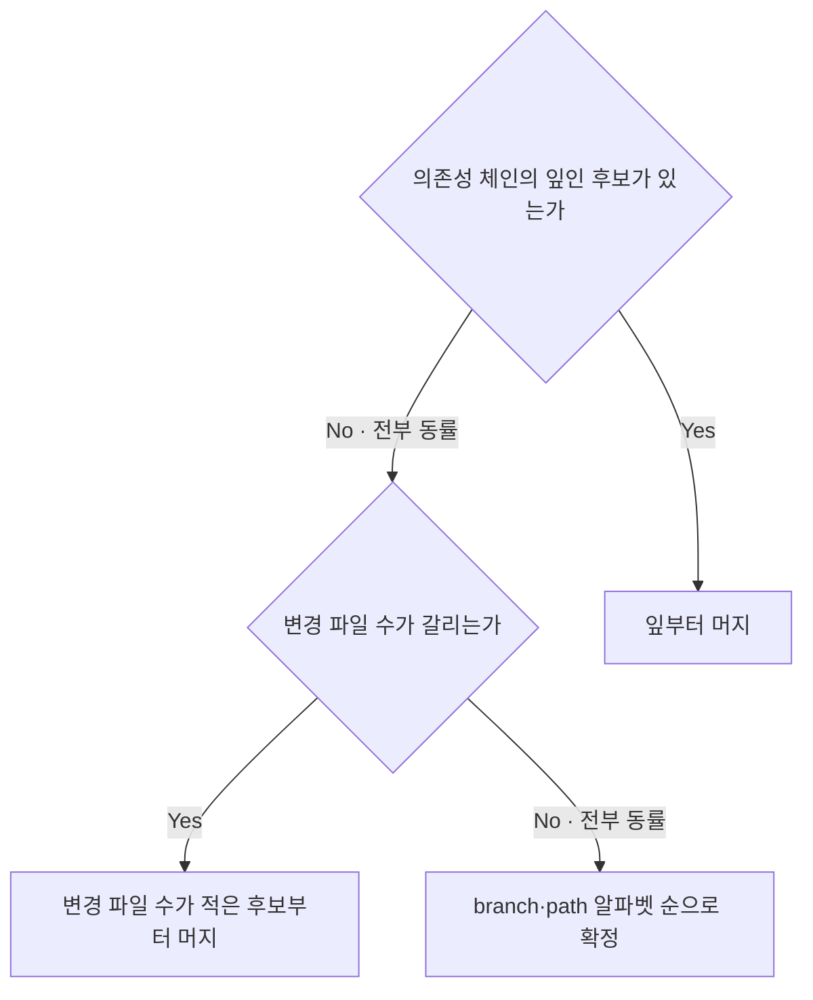
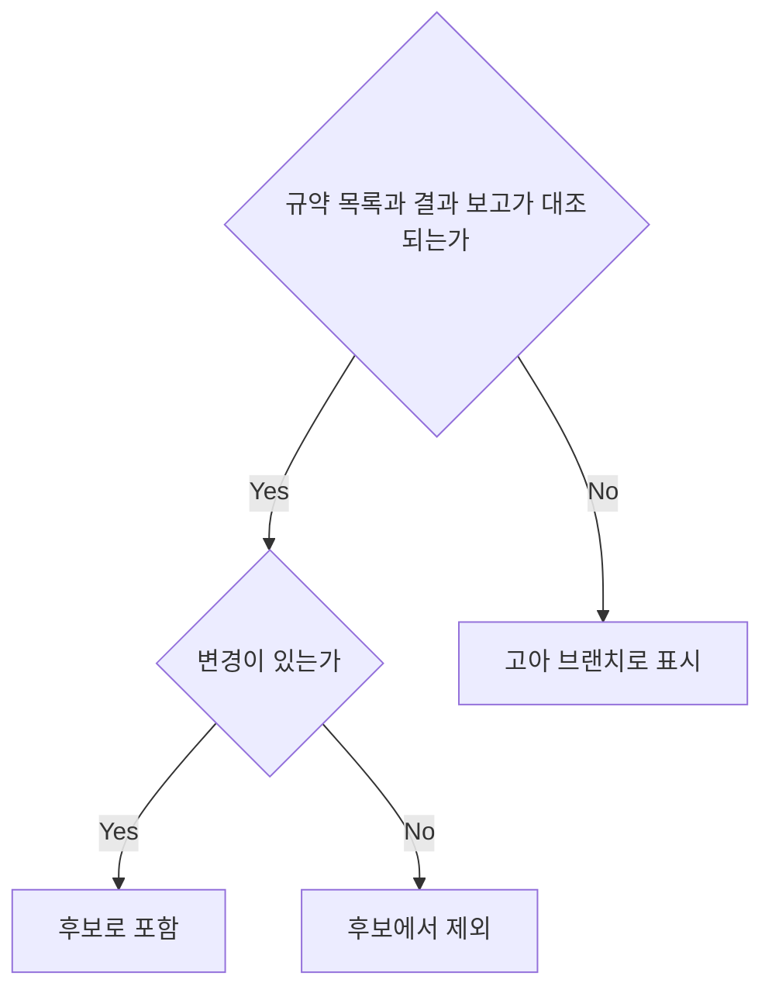
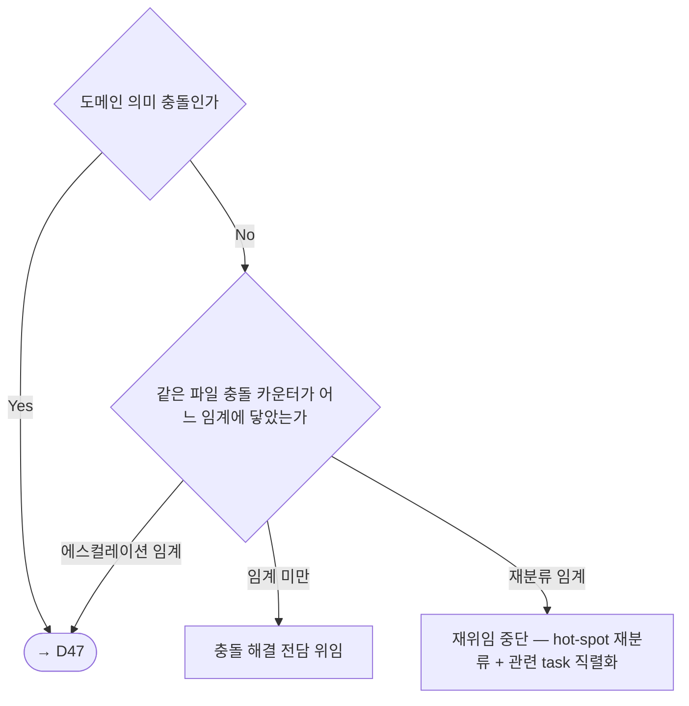
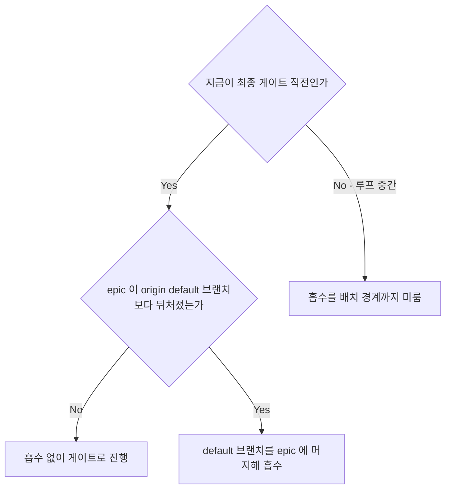
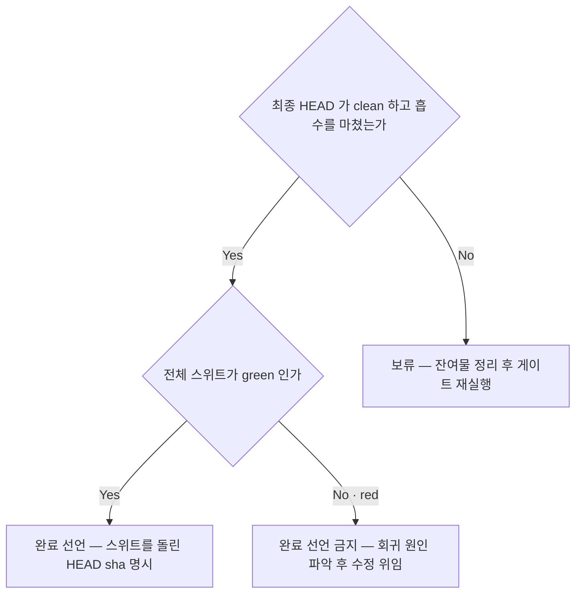
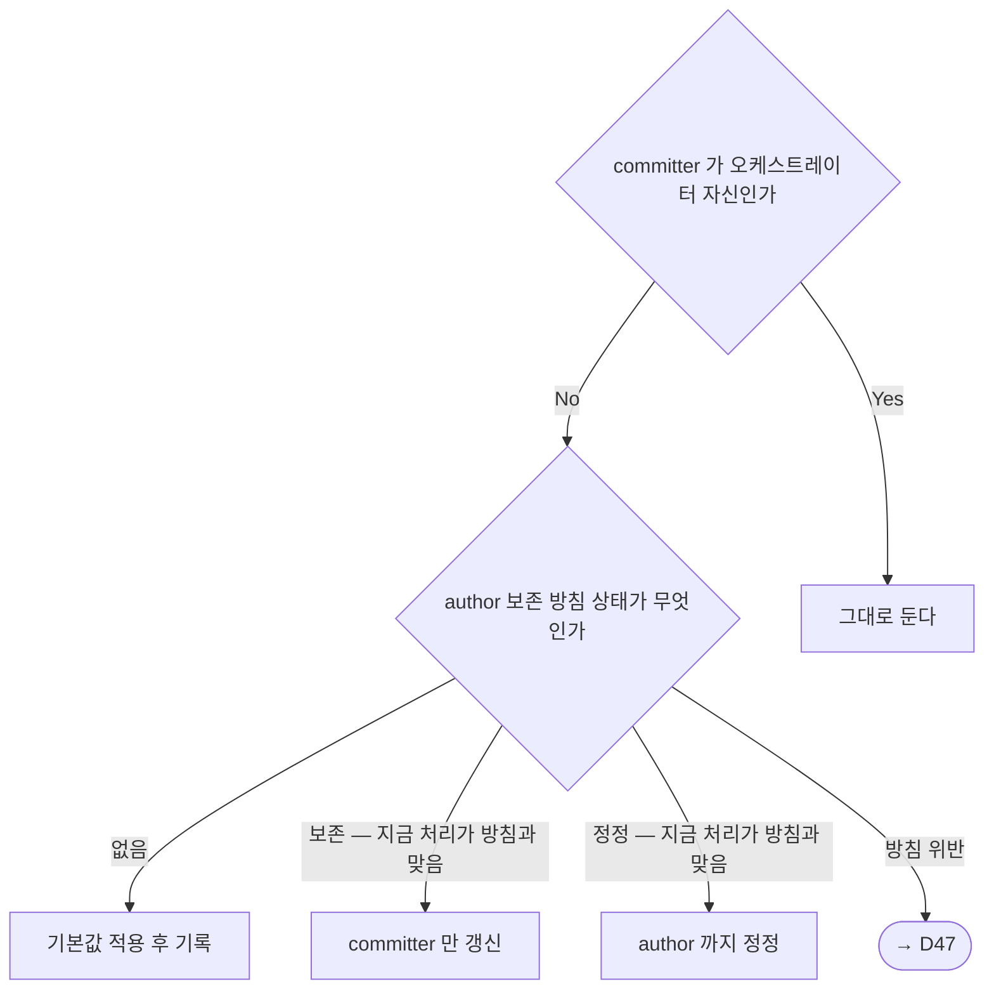

<!-- owns: D39 D40 D41 D42 D43 D44 D52 | C10 C11 C12 | P07 P08 -->

# Merge Coordinator

## 머지 대상: epic 브랜치

이 파일은 위임 결과를 합류시키는 국면의 항목을 소유하며 전체가 무거운 경로 전용이다 (→ D03). 머지 target 은 항상 **현재 epic 브랜치**이고 main 이 아니다 — 아래에서 `base` 는 모두 현재 epic 브랜치를 가리키고, epic → main 통합은 이 스킬 범위 밖이다. 메인은 순서·가드·검증을 정할 뿐 충돌을 직접 편집하지 않으며 (→ D42), 머지를 보고 없이 진행할지는 모드가 정한다 (→ D45). 작업 브랜치는 PR 을 만들지 않고 이 브랜치로 수렴한 뒤 삭제된다 (→ C10).

## D39. 머지 시점 정책 판정 (배치 vs 즉시 + 전파)
<!-- needs: D03 D04 -->

**입력 신호**
- 같은 배치의 in-flight 작업이 남아 있는가
- 배치가 긴가 · 뒤에 올 작업이 앞 결과를 base 로 기다리는가 · 전파 메시지 수단이 가용한가 (→ D04)

**종단별 행동 계약**
- 배치 머지 → in-flight 가 하나라도 남아 있는 동안 머지하지 않는다. 게이트(리뷰·QA)까지 미루는 것은 금지한다 — 완료 즉시 돌리고 머지만 미룬다 (→ P07)
- 즉시 머지 + 전파 → 머지 직후 in-flight **전부**에 새 epic HEAD 기준 재동기화를 지시한다. 전파 대상을 겹침 추정으로 좁히거나 전파를 생략하는 것은 금지한다 — 겹치지 않는 worktree 의 rebase 는 무비용이고, 전파 수단이 없으면 배치 머지로 되돌린다. 어느 쪽을 골랐든 정책과 근거를 진입 보고와 decision log 에 남긴다 (→ C05 · → C13)

**근거**: 머지해놓고 전파하지 않으면 drift 한 worktree 가 이미 머지된 수정을 되돌린 결과를 다음 머지에서 조용히 통과시킨다.
**후속**: → P07 → D41

## D40. 머지 순서 결정
<!-- needs: D39 D41 -->

**입력 신호**
- 후보 간 의존성(다른 후보가 이 결과를 base 로 기다리는가) · 각 후보의 변경 파일 수 · branch·path 문자열

**종단별 행동 계약**
- 잎부터 머지 → 결과를 기다리는 후보는 앞 후보의 통합이 끝난 뒤로 미룬다
- 변경 파일 수가 적은 후보부터 머지 → 큰 변경이 뒤에 들어와 작은 변경의 충돌을 흡수하게 둔다
- 알파벳 순 확정 → 세 종단 공통으로, 확정한 순서와 근거를 decision log 에 남기고 (→ C05) 순서대로 한 후보씩 통합한다. 전 후보 동시 머지는 금지한다 — 한 후보씩 통합하며 매 머지 직후 가드를 돈다 (→ C12)

**근거**: 이 순서는 충돌이 터졌을 때 사람이 처리할 양을 최소화하는 휴리스틱이고, 알파벳 순 종단이 같은 입력에 같은 순서를 보장한다.

**후속**: → P07 → D42

## D41. 머지 후보 수집·제외 판정
<!-- needs: D39 D34 -->

**입력 신호**
- `git branch --list '<epic>-t*'` 결과와 결과 보고의 worktree 경로·브랜치명이 대조되는가 (→ C10)
- 각 후보의 변경 유무 · `git merge-base <epic> <branch>` 가 현재 epic HEAD 인가 · idle 로 취소한 편집 조각의 브랜치인가 (→ D34)

**종단별 행동 계약**
- 후보로 포함 → merge-base 가 뒤처졌으면 최신 HEAD 기준 유효성을 먼저 재확인하고, 유효하지 않으면 rebase 를 위임한다 (→ C11). 확인 뒤 순서 판정으로 넘긴다 (→ D40)
- 후보에서 제외 → 변경이 없거나 idle 로 취소된 편집 조각이면 정리 대상으로 넘긴다 (→ D34 · → D51)
- 고아 브랜치 → 중단·취소된 작업물이 남아 있을 수 있으므로 삭제하지 않는다 — 대조 결과를 함께 보고한다 (→ C13)

**근거**: 수집이 결정적인 것은 네이밍 규약 덕이라, 규약이 깨지면 이 판정 전체가 무너진다 (→ C10).
**후속**: → D40

## D42. 충돌 처리 판정
<!-- needs: D40 D45 D13 -->

**입력 신호**
- 충돌 성격(단순 라인 겹침 / 구조 변경 / 도메인 의미 충돌) · 충돌 해결 위임의 성공·실패 · 모드가 자율인가 HITL 인가 (→ D45) · 같은 파일의 충돌 카운터(파일 단위이며 task 예산과 별개 — task 를 갈아치워도 파일이 같으면 이어진다, → C04)

**종단별 행동 계약**
- 충돌 해결 전담 위임 → 메인은 충돌 부분을 직접 편집하지 않는다. 해결 전략은 `git` skill 의 `references/conflict-resolution.md` 가 단일 출처이고, 패킷에는 base(현재 epic 브랜치)·target 브랜치·"해결 후 epic 위로 rebase, 완료 후 변경 파일과 커밋 해시 보고"를 싣는다 (→ C02). 모드가 HITL 이면 위임 전에 보고하고 결정을 받는다 (→ D45). 위임이 실패해 같은 파일이 다시 충돌하면 그 파일의 카운터를 올리고 이 판정을 다시 돈다
- 재분류 + 직렬화 → 그 파일을 hot-spot 으로 재분류하고 (→ D13) 관련 task 를 순차로 내린다. 임계는 조정 가능하되 생략은 불가이며, 조정한 값과 재분류·직렬화 사실을 decision log 에 남긴다 (→ C04 · → C05)
- → D47 → 자율 모드라도 진행하지 않는다. 부분 머지 상태(머지된 후보·미머지 후보)를 함께 보고한다 (→ C13)

**근거**: 같은 파일이 반복 충돌하면 개별 작업의 실패가 아니라 분해가 틀린 것이라, 재위임을 반복하면 예산만 태우고 같은 자리로 돌아온다.
**후속**: → C12 → D43

## D43. epic ← main 역방향 drift 흡수 판정
<!-- needs: D44 -->

**입력 신호**
- `git rev-list --count <epic>..origin/<default-branch>` 가 0인가
- 지금이 최종 통합 검증 게이트 직전인가, 루프 중간인가 (→ D39)

**종단별 행동 계약**
- 흡수 없이 진행 → 확인 결과를 게이트 입력으로 남긴다 (→ P08)
- 흡수 → merge 로 흡수한다. epic 을 rebase 해 흡수하는 것은 금지한다 — epic 은 worktree 들의 공유 base 다 (→ C11). 흡수 충돌의 위임 패킷은 "이것은 merge 다 — epic 브랜치를 rebase 하지 말 것"을 명시해 rebase 전제 패킷과 구분하고, 도메인 의미 충돌이면 자율 모드라도 에스컬레이션한다 (→ D42). 흡수 후 전체 스위트를 다시 돌리고 보고하는 HEAD sha 도 흡수 후의 것으로 한다 (→ P08)
- 배치 경계까지 미룸 → 중간 흡수는 in-flight 전부에 재동기화를 유발하므로 배치 경계에서만 한다 (→ D39)

**근거**: 흡수하지 않으면 최종 게이트가 green 이어도 default 브랜치 기준으로는 깨진 상태로 완료를 선언하게 된다.
**후속**: → P08 → D44

## D44. 최종 통합 검증 게이트 / 완료 선언 판정
<!-- needs: D43 D42 -->

**입력 신호**
- epic 최종 HEAD 의 `git status` 가 clean 인가 · 역방향 drift 흡수를 마쳤는가 (→ D43)
- 전체 테스트 스위트 1회 실행 결과(변경 파일 한정·부분 실행은 입력으로 쓰지 않는다) · 미머지·보류 후보가 남아 있는가 (→ D42)

**종단별 행동 계약**
- 완료 선언 → 절차는 → P08, 보고 형식은 → C13. 개별 worktree 나 중간 브랜치의 green 만으로 선언하는 것은 금지한다 — 전제는 최종 HEAD 의 green 과 그 HEAD sha 명시다. 인프라 의존 검증은 이 게이트와 별개 대상이다 (→ D49)
- 보류 → 미커밋 변경·untracked 잔여물을 정리한 뒤 게이트를 처음부터 다시 돈다 (→ P08)
- 완료 선언 금지 → 메인이 직접 편집해 green 을 만드는 것은 금지한다 — 회귀 원인을 파악해 수정을 위임하고 (→ D42) 남은 미머지·보류 후보와 함께 보고한다 (→ C13)

**근거**: 각 worktree 가 개별로 green 이어도 머지 결합 지점(인터페이스·전역 상태·실행 순서)에서 회귀가 난다.
**후속**: → D52 → D51

## D52. Authorship(committer) 정정 판정
<!-- needs: D40 -->

**입력 신호**
- committer 가 오케스트레이터 자신인지(`git log --format='%H %cn %ce'`, 통합 커밋 1개·여러 개) · author 보존 방침이 있는지, 있다면 보존·정정 중 무엇을 요구하며 지금 처리가 그 요구와 어긋나는지 — 방침 확정 자체는 이 문서가 하지 않는다

**종단별 행동 계약**
- 그대로 둔다 → committer 가 이미 오케스트레이터 자신이면 다음 후보의 통합으로 진행한다 (→ P07)
- 기본값 적용 후 기록 → 방침이 없으면 committer·author 를 유지하고 trailer(`Co-Authored-By` 등)로 저작자 표시를 보존하는 기본값을 적용한다. 방침 부재와 적용 사실을 decision log 에 남긴다 (→ C05)
- committer 만 갱신 → 단일 커밋은 `git commit --amend --no-edit`, 여러 커밋은 `git rebase --exec 'git commit --amend --no-edit' <base>` 다. author 는 건드리지 않는다. 아이덴티티 값은 프로젝트·환경의 git 설정을 따른다
- author 까지 정정 → 같은 명령에 `--reset-author` 를 더해 author 도 정정한다
- → D47 → 방침을 지금 처리로 지킬 수 없으면(예: 보존 방침인데 통합 커밋 원저작자가 여럿이라 committer 갱신만으로 방침을 지킬 수 없는 경우) 임의로 진행하지 않고 에스컬레이션한다

**근거**: 통합 이력이 실제 수행자와 어긋나면 원격에서 서명·계정 매칭이 안 돼 Unverified 로 남는다.
**후속**: → C12

## 계약

## C10. 브랜치 네이밍 규약

- `<epic>` 은 (→ P01) 이 확보한 브랜치의 **전체 이름**이다 — `epic/foo` 든 `claude/xyz` 든 확보한 이름을 그대로 쓰고 접두 형태를 요구하지 않는다. 그 브랜치를 메인이 점유하고, 작업 브랜치는 그 이름에 `-t` 접미를 붙인 `<epic>-t<task-id>-<slug>` 다 — `t<task-id>` 는 Task 의 id 와 같은 값으로 둬 어느 브랜치가 어느 Task 것인지 조회가 필요 없게 한다 (→ C16)
- 격리 인자가 자동 생성하는 브랜치 이름은 agent 식별자라 작업 단위와 연결되지 않는다. **첫 커밋 전에** `git switch -c <epic>-t<task-id>-<slug>` 로 전환하라는 지시를 prompt 에 싣는다 (→ C02). `<slug>` 는 영소문자·하이픈 3~5 단어이며, 커밋 메시지 규약(`.claude/rules/git-workflow.md`)과 달리 type prefix 를 붙이지 않는다
- 작업 브랜치는 PR 을 만들지 않고 epic 브랜치로 수렴한 뒤 삭제되므로 브랜치명이 PR 타이틀이 되지 않는다 — 외부로 나가는 PR 단위는 `git` skill `SKILL.md §PR 단위 원칙`이 단일 출처다
- **근거**: 확보한 이름에 `-t` 접미를 붙이면 `git branch --list '<epic>-t*'` 하나로 후보 수집이 결정적이 되고 고아 브랜치가 대조로 드러난다 (→ D41). 계층 `<epic>/…` 는 `<epic>` ref 가 존재하는 동안 만들 수 없다

## C11. 머지 방식 — rebase 후 `--ff-only`

작업 브랜치 → epic 브랜치 통합은 rebase 후 fast-forward 로 고정한다. 판정하지 않는다.

- worktree 쪽에서 `git -C <worktree> rebase <epic>`(충돌은 위임 → D42) 후, epic 브랜치의 메인 working tree 에서 `git merge --ff-only <epic>-t<id>-<slug>` — 메인은 그 자리에 그대로 머무른다 (→ D22)
- **근거**: 그냥 `git merge` 면 rebase 를 빠뜨려도 머지 커밋으로 조용히 통과해 이 계약이 지켜졌는지 사후에 알 수 없고, 충돌 해결 정책의 단일 출처(`git` skill `references/conflict-resolution.md`)도 rebase 전제라 방식을 섞으면 그 문서가 절반의 경우 틀린 지침이 된다
- **epic 브랜치 자체는 rebase 하지 않는다** — 공유 base 라 히스토리를 바꾸면 in-flight worktree 가 전부 깨진다. 역방향 흡수를 merge 로 하는 것도 같은 이유다 (→ D43). 이미 push 된 작업 브랜치를 rebase 하면 히스토리가 바뀌며, 그때 push 정책은 `git` skill `§force-push 정책`이 단일 출처다. 통합은 로컬에서 수행하며, 작업 브랜치는 PR 을 만들지 않으므로 `gh pr merge` 를 쓰지 않는다 (→ C10)

## C12. 머지 직후 가드 불변식 목록

매 머지 직후 아래를 확인한다. 생략은 금지한다 — 실행 시점은 → P07 5단계다.

- current branch == epic 브랜치 · working tree clean → 어긋나면 → D22 (복구 절차 → P09)
- HEAD == 방금 통합한 후보의 tip (ff-only 결과, → C11) → 어긋나면 → D47
- author 방침 판정을 거쳤다 → 어긋나면 → D52
- in-flight worktree 가 epic 최신 HEAD 기준 → 어긋나면 → D39
- 새 불변식이 생기면 이 목록에 한 줄을 추가한다. 단계를 신설하는 것은 금지한다 — **근거**: 단계를 늘리면 번호가 밀려 교차 참조까지 함께 고쳐야 한다

## 절차

## P07. 머지 표준 절차

1. 머지 시점 확인 — 지금 머지해도 되는 시점인가 (→ D39)
2. 후보 수집·제외 (→ D41). 변경 파일 overlap 을 `git diff --name-only <epic>...<branch>` 로 다시 대조해 순서 판정의 입력으로 넘긴다 (→ D40)
3. 머지 순서 결정 (→ D40)
4. 순서대로 한 후보씩 통합 (→ C11). 충돌이 나면 (→ D42)
5. 머지 직후 가드 (→ C12) — 매 머지 직후, 생략 금지
6. 정리 대상 worktree 를 정리 판정으로 넘긴다 (→ D51)
7. 최종 통합 검증 게이트 (→ P08)
8. 머지 결과를 보고한다 — 성공·실패·보류 후보, 남은 worktree, 다음 액션 제안 (→ C13)

## P08. 최종 통합 검증 게이트

1. epic 최종 HEAD 에서 `git status` clean 확인 — 미커밋 변경·untracked 잔여물이 있으면 먼저 정리하고 재확인한다
2. 역방향 drift 흡수 (→ D43): `git fetch origin <default-branch>` → `git rev-list --count <epic>..origin/<default-branch>`
3. 전체 테스트 스위트 1회 실행 — 변경 파일 한정·부분 실행 금지. 인프라 의존 테스트(DB·외부 서비스 등)는 이 게이트와 별개의 검증 대상이다 (→ D49)
4. `git rev-parse HEAD` 로 HEAD sha 기록(흡수 후의 HEAD 여야 한다) 후 green·red 판정과 완료 선언 여부 (→ D44), 결과 보고 (→ C13)
