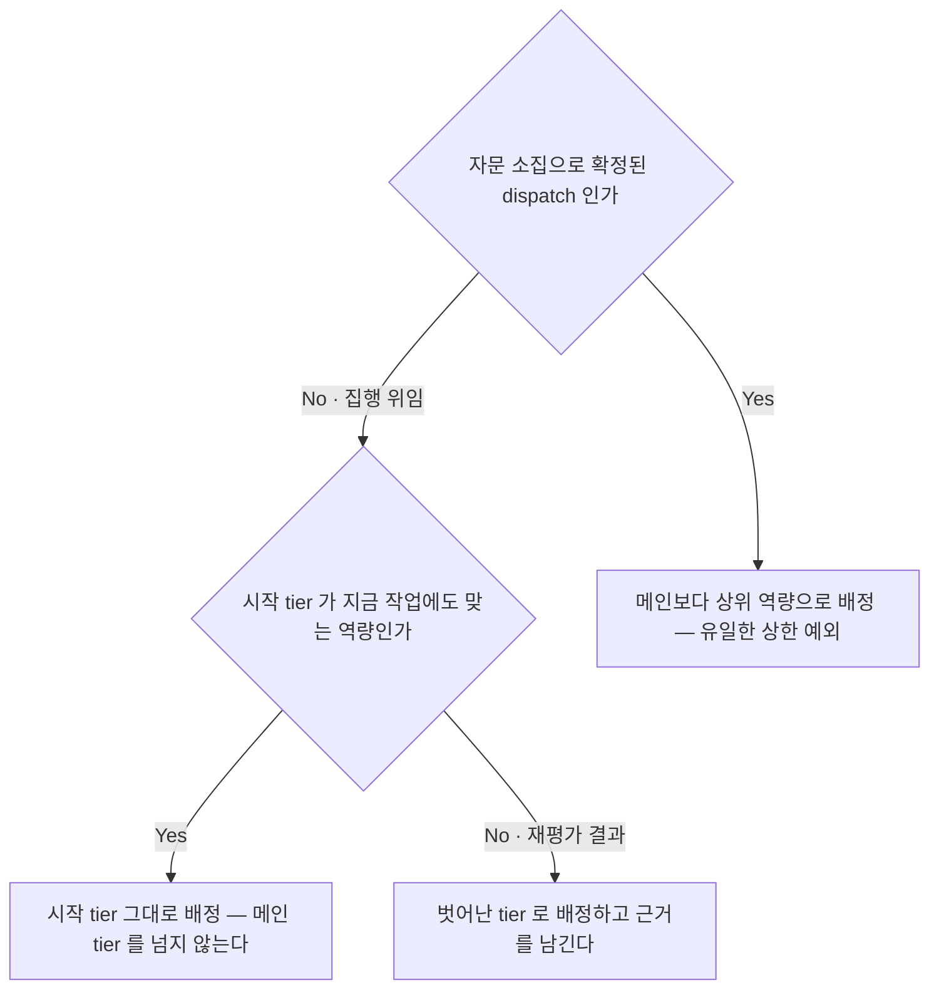
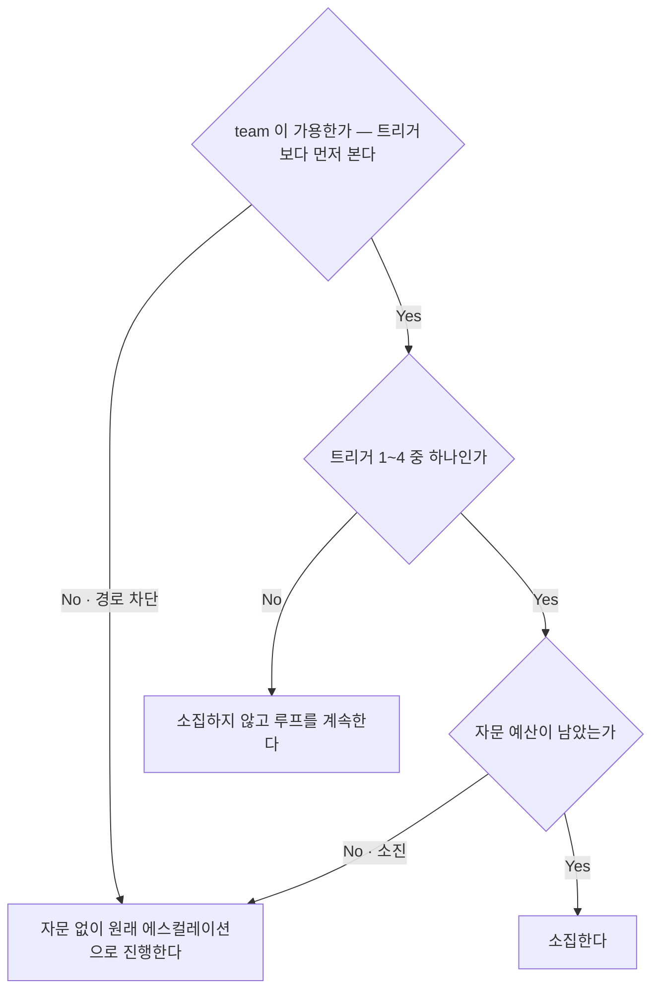
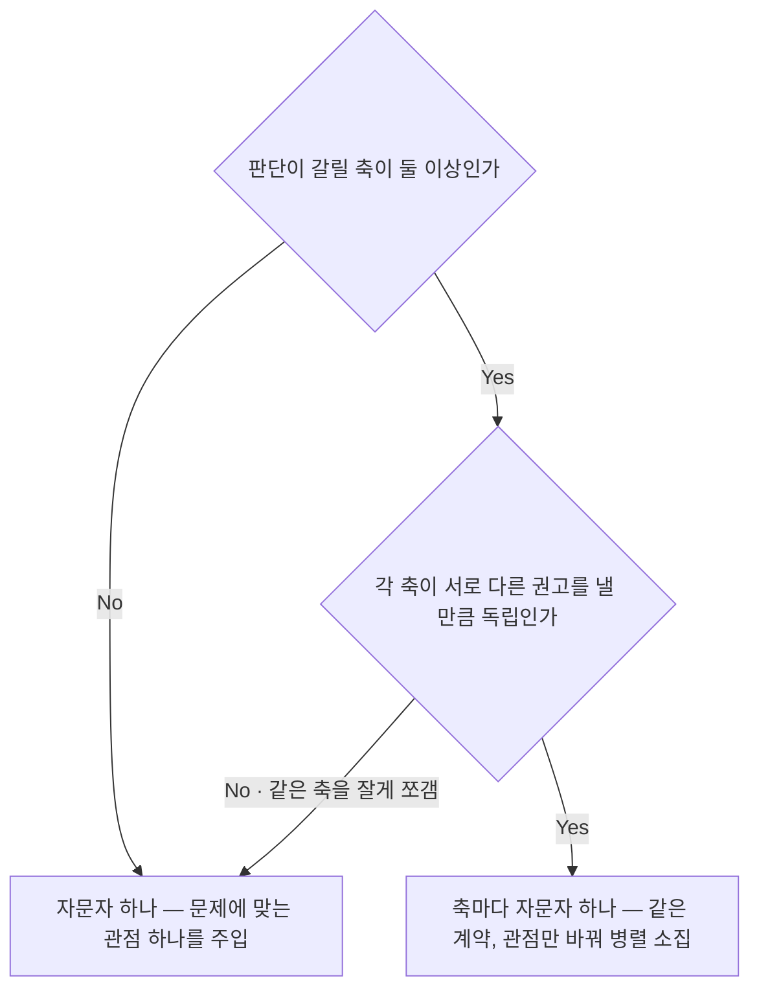
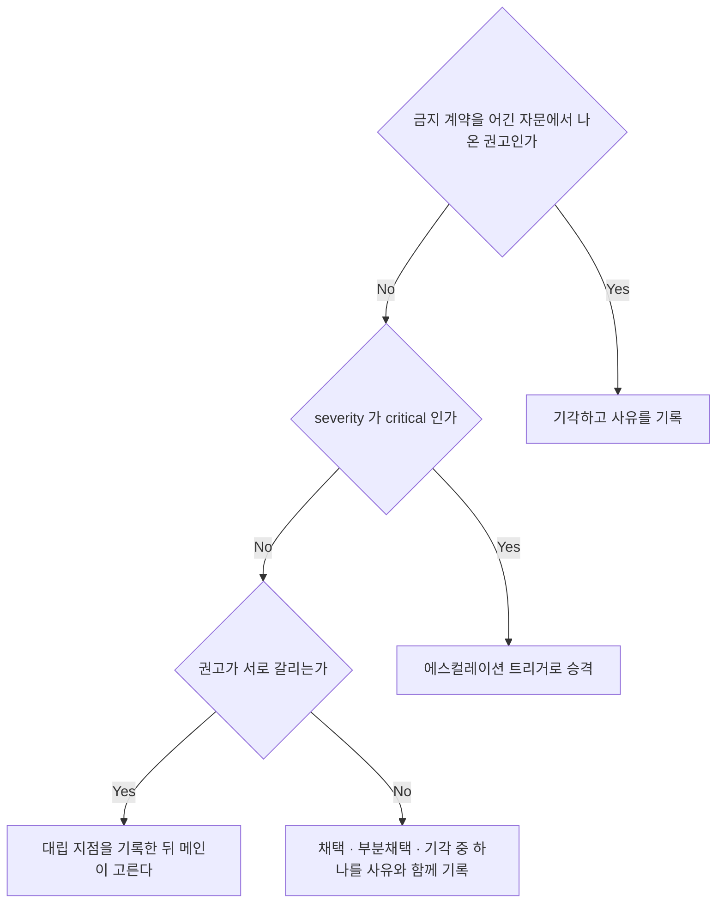

# Model Routing (모델 라우팅)

<!-- owns: D26 D27 D28 D29 | C07 C15 | P05 -->
<!-- needs: D04 D09 D18 D31 D47 -->

tier 배분과 자문 국면의 항목을 소유한다 — **모델 배정 기준과 재평가 절차는 orchestrator 가 canonical 이다.**
항목 하나는 `## D##.` / `## C##.` / `## P##.` 블록 하나이며, 그 블록이 해당 항목의 유일한 소유처다.

## D26. 집행 tier 선택 (작업유형 → 시작 tier)

<!-- needs: D18 D27 -->

**입력 신호**
- 자문 소집으로 확정된 dispatch 인가 (→ D27) · 역할을 지목한 모델 제약이 있는가 (→ C07)
- 이 dispatch 가 스웜 결과의 상한을 정하는가 — 분해·위임·조율·머지 판단은 메인이 한다. 작업 유형은 시작 tier 목록의 어느 줄인가

**종단별 행동 계약**
- 상위 역량 → 자문 경로 전용이다. 집행 위임에는 이 예외가 없다. 소집 절차는 → P05
- 시작 tier 그대로 → `model` 을 매 dispatch 명시한다(상속 금지). 문서에는 모델명 대신 역량 수준만 쓴다. 실행 형태와 격리 유무는 tier 와 별개이며 → D20 이 정한다. **집행 위임은 자문의 여집합이다** — 구현·문서·조사·분석·리뷰·게이트·충돌 해결이 모두 포함되고, 산출물이 파일이냐 요약이냐로 가르지 않는다. 시작 tier 는 고정값이 아니라 매 dispatch 재평가하는 heuristic 이며 작업 유형이 정한다
  - 요구사항 분해·설계 심문(아키텍트 협의체 → D08) · 복잡한 설계 · 어려운 디버깅 · 아키텍처 판단 → **최상위**
  - 일반 구현 · 코드 리뷰 · 테스트 작성 → **중간**
  - 리서치·조사(discovery) — 코드베이스 파악 · 영향 범위 수집 · 자료 조사 → **경량**에서 시작. 판단이 섞이면(방안 비교, 설계 함의 해석) 중간. 최상위로 올리지 않는다 — 범위와 병렬성이 결과를 좌우하고, 해석에서 막히면 그때 자문 경로를 쓴다 (→ D27)
  - 단순 분류 · 포맷 변환 · 짧은 추출 → **경량**
- 벗어난 tier → 단순 작업에 최상위를 쓰는 것은 비용 낭비다 — 금지하고, 벗어난 선택은 근거와 함께 기록한다 (→ C05)

**근거**: `model` 을 상속에 맡기면 메인의 tier 가 그대로 번져 배분 자체가 무의미해진다.

**후속**: → C07 → D20

## D27. 자문 소집 여부

<!-- needs: D04 D09 D31 D47 -->

**입력 신호**
- team 가용 판정 — 진입 시 1회 확정한 것을 그대로 쓴다 (→ D04)
- 트리거 1: 협의체 라운드 소진으로 pass 못 함, 에스컬레이션 직전 tie-break (→ D09) · 트리거 2: 게이트 reject 후 재위임이 같은 자리를 맴도는 루프 (→ D31)
- 트리거 3: 되돌리기 비용이 큰 결정(스키마 마이그레이션 · 공개 API 변경 · 토폴로지 변경)의 계획 승인 전 · 트리거 4: 사용자 명시 요청 — 즉시
- 자문 예산 잔여량 (→ C04)

**종단별 행동 계약**
- 소집 → 소모 단위는 **자문 패킷 1건(문제 정의 1건)**이다. 같은 패킷 안의 왕복은 소모하지 않고, 새 문제 정의면 새 패킷으로 하나를 소모한다. 값은 → C04. 재위임이 아니므로 재위임 쪽 예산은 건드리지 않는다. team member 전용이며 단발 폴백은 금지한다 — 등급 기준은 → D19. 절차는 → P05. 결정권은 메인에 100% 남는다 — 떠나는 순간 상한을 올린다는 예외의 근거가 무너진다
- 소집 안 함 → 상시 자문은 금지한다 — 트리거 없이 소집하면 비용·지연이 늘고 메인 컨텍스트가 탄다. 트리거 지점까지 그대로 진행한다
- 자문 없이 에스컬레이션 → 단발 대체도 메인이 상위 tier 관점을 흉내 내는 것도 자문이 아니다 — 금지한다. 대신 그 시점의 판단을 메인 자신의 판단으로 명시하고 판정 근거를 함께 기록한 뒤(→ C05) 원래 하려던 에스컬레이션으로 간다 (→ D47). 사용자가 명시 요청해도 같다 — 원한 것은 상위 tier 의 관점이지 자문했다는 서술이 아니므로, 흉내 내지 말고 불가능함을 보고한다

**근거**: 트리거를 가용성보다 먼저 보면 "지금이 딱 자문할 자리"라는 압력이 생기고, 그 압력이 단발 폴백·자기 판단 포장으로 새는 입구가 된다.

**후속**: → D28 → P05

## D28. 자문자 관점 분할

<!-- needs: D27 -->

**입력 신호**
- 문제의 성격 — 어떤 렌즈가 필요한가 (성능 · 보안 · 마이그레이션 안전성 등)
- 지난 소집과 같은 조합·인원을 그대로 쓰고 있지는 않은가
- 관점을 나눴을 때 권고가 실제로 갈릴 것인가

**종단별 행동 계약**
- 자문자 하나 → 관점·이름·인원·질문 범위·모델은 런타임에 정한다. 고정하는 것은 금지 계약·출력 계약·결정권 없음뿐이다 (→ C15)
- 축마다 하나 → 같은 패킷 계약에 관점만 바꿔 병렬로 소집한다. 권고가 갈리는 지점 자체를 판단 재료로 쓴다 (→ D29). 자문자 수가 늘어도 소모는 패킷 1건 그대로다 (→ D27)

**근거**: 관점을 잘게 쪼개 무의미하게 늘리면 비용만 늘고, 고정 조합을 답습하면 문제마다 다른 렌즈가 필요하다는 사실을 놓친다.

**후속**: → C15 → P05

## D29. 자문 권고 처리 판정

<!-- needs: D27 D28 -->

**입력 신호**
- 권고의 severity(critical / important / optional) 와 확신도
- 권고 간 대립 여부 · 소집 전후 토폴로지 가드가 계약 위반을 탐지했는가 (→ C15)

**종단별 행동 계약**
- 기각(계약 위반) → 권고의 신뢰도 자체가 깨진 것이다. 결과를 채택하지 않고 위반 사실을 함께 기록한다 (→ C05 · → C15)
- critical 승격 → 자문자는 게이트가 아니라 자동 머지를 막지 못한다. 중대 지적은 사람에게 올려 판단받는다 (→ D47)
- 대립 기록 → 임의로 평균 내는 것은 금지한다 — 갈린다는 사실 자체가 정보이므로 대립 지점을 남기고 그것을 근거로 고른다
- 채택 · 부분채택 · 기각 → 셋 다 사유와 함께 남긴다 (→ C05). 채택한 권고의 실행은 평소대로 집행 위임이며(→ D26), 자문자도 메인도 편집하지 않는다 (→ D02)

**근거**: 상위 tier 라는 이유로 검토 없이 채택하면 메인이 고무도장이 되고 실질 오케스트레이터가 자문자로 넘어간다.

**후속**: → C05 → D47

## 계약

## C07. 역할별 모델 제약

(→ D26 종단이 요구)

- **지시로 받는다.** "이 모델은 리뷰어로 쓰지 마라" 같은 제약은 사용자 지시로 받아 런 내내 일관되게 적용하고, 근거와 함께 기록한다 (→ C05).
- **역할을 지목한 제약은 그 역할에만 적용된다** — 다른 역할의 기본값이 되지 않는다. 특히 자문 tier 가 discovery·조사·구현으로 번지는 것은 흔한 오적용이다. 제약을 다른 역할로 넓히려면 사용자에게 확인받는다.
  - 근거: 상위 tier 예외가 전역 기본값이 되면 집행 위임의 tier 상한이 무너지고 비용도 폭증한다.
- **설정 파일 규약을 두지 않는다.** 강제력 없는 규약에 파일을 붙이면 강제력이 있는 것처럼 보이기만 한다.
  - 근거: 파싱·검증하는 코드가 없는 설정 파일은 오타·스키마 위반을 조용히 삼켜 "걸린 줄 알았는데 안 걸린" 상태를 만든다.
- **세션을 넘겨 유지할 제약은 이미 로드되는 문서**(프로젝트 `CLAUDE.md`, `.claude/rules/*`)에 적는다 — 실제로 읽히는 경로에만 규약을 얹는다.
- **제약은 tier 선택 범위만 좁힌다.** 어떤 제약도 tier 상한을 뒤집지 못한다 — 메인이 집행 위임보다 낮은 tier 로 내려가거나 `model` 미지정으로 상속하는 배정은 허용하지 않는다.
- **표준 tier 를 쓸 수 없으면 인접 tier 로 대체한다** — 판정 품질이 게이트인 역할(리뷰어·QA·DBA)은 인접 상위 우선, 그 외는 인접 하위 우선. 대체는 벗어난 선택이므로 근거와 함께 기록한다 (→ D26).

## C15. 자문 계약 — 역할 제한 · 패킷 · 출력 · 수명

(→ D27 소집 종단 · → D28 · → P05 가 요구)

**역할 제한은 계약이지 도구 보장이 아니다.** 자문자는 teammate 이고 teammate 는 도구 권한을 제한할 수단이 없다. 다음 셋은 전부 프롬프트 계약이며, 위반은 소집 전후 토폴로지 가드로 **사후 탐지**한다 (→ D22).
- 편집 금지 — 어기면 공유 checkout 오염을 가드가 탐지하고 복구 후 에스컬레이션한다
- 다른 teammate 에게 지시 금지 — 조율 창구는 메인 하나다. 자문자는 메인하고만 대화한다
- 능동적 스코프 확장·재위임 금지 — 어기면 출력 계약 위반으로 처리하고 권고를 기각한다 (→ D29)
- 근거: 왕복 조율(자문의 실질)과 도구 보장은 현재 동시에 얻을 수 없고 이 경로는 왕복을 택했다 — 없는 보장을 있다고 적지 않는다.

**입력 패킷은 자기완결적이어야 한다.** 자문자는 메인 대화를 보지 못한다. 필드: 관점 / 배경(목표 1~2문장) / 막힌 지점(트리거 번호 포함) / 질문(모호한 "봐주세요" 금지) / 제약(바꿀 수 없는 조건) / 근거 자료 경로 / 기대 출력 / 금지 계약.
- 금지 계약은 패킷에서 생략하지 않는다 — 도구로 막을 수 없으므로 이 문구가 유일한 사전 장치다
- 긴 근거는 전문 대신 경로로 넘긴다(자문자가 직접 읽는다). 질문이 여럿이면 우선순위를 매겨 스코프가 자문자 손에 넘어가지 않게 한다

**출력 계약**: 요약 한 문장 / 권고(각각 근거 + severity: critical | important | optional + 택하지 않은 대안) / 질문 자체에 대한 지적(있을 때만) / 확신도(높음·보통·낮음 + 판단을 흔드는 미확인 사실).
- 권고와 근거만 넣는다. 명령형 지시, `pass`/`reject` 판정, 다른 teammate 에 대한 작업 지시는 금지한다 — 넣는 순간 결정권이 메인을 떠난다 (→ D29)
- 확신도가 낮으면 낮다고 쓴다 — 상위 tier 라도 틀리며 가중치는 메인이 정한다

**수명**: 자문 세션 단위로 띄우고, 협의체 tie-break 이면 협의체 팀과 함께 끝난다. team 은 session 종료 시 자동 정리되므로 별도 정리 단계가 없다. 끝난 뒤 메인은 권고 요약과 채택 판단만 컨텍스트에 유지하고 전문은 기록에 둔다 (→ C05).

## 절차

## P05. 자문 소집 절차

(→ D27 소집 종단이 진입)

1. 가용 판정을 확인한다 (→ D04) — 진입 시 1회 확정한 것을 그대로 쓰고 트리거 시점에 다시 확인하지 않는다. 예외는 4단계의 1회 재판정뿐이다.
2. 소집 전 기준선으로 토폴로지 가드를 실행한다 (→ D22) — 무거운 경로만. 가드 범위와 무관하게 자문 경로 자체는 두 경로 모두에서 쓴다.
3. 관점을 정하고(→ D28) 관점마다 자문자를 하나씩 띄운다. 이름은 세션 내 유니크하게, 모델은 메인보다 상위 역량으로 명시하며(→ D26, 사용자 제약이 있으면 → C07 이 우선), 배경 실행으로 서로 기다리지 않게 한다. 패킷은 → C15.
4. 첫 자문자가 뜬 직후 실행 형태를 확인한다 (→ D05). teammate 가 아니면 1회 재판정하고, 그래도 아니면 폴백 없이 자문을 생략한 뒤 원래 에스컬레이션으로 간다 (→ D27).
5. 완료 알림을 받아 권고를 모은다. 반문이 필요하면 같은 패킷 안에서 왕복한다 — 같은 문제 정의인 한 소모가 늘지 않는다 (→ D27).
6. 소집 후 토폴로지 가드를 다시 실행해 계약 위반(편집)을 탐지한다 (→ D22) — 무거운 경로만.
7. 채택 판단을 내린다 (→ D29).
8. 기록한다 (→ C05) — 자문 항목은 C05 의 필수 등급 추가 필드(실행 형태 · 판정 근거)를 포함한다.
