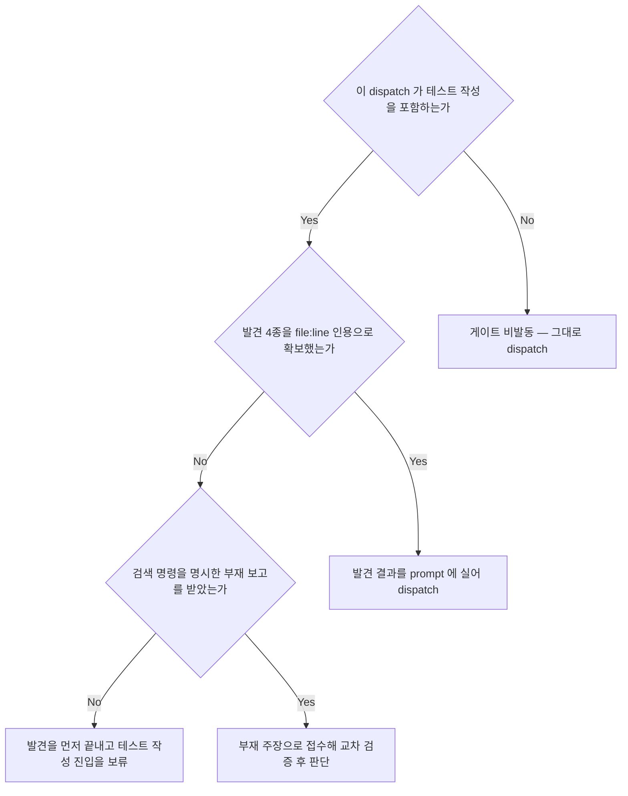
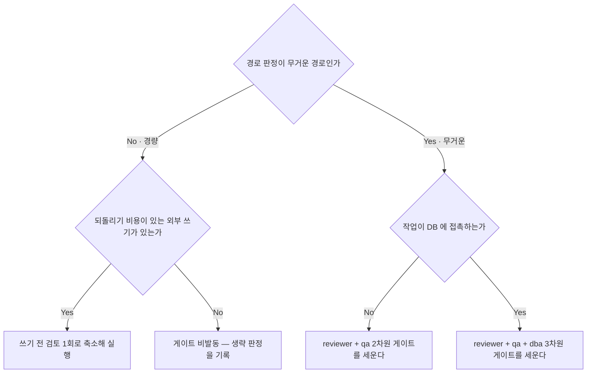
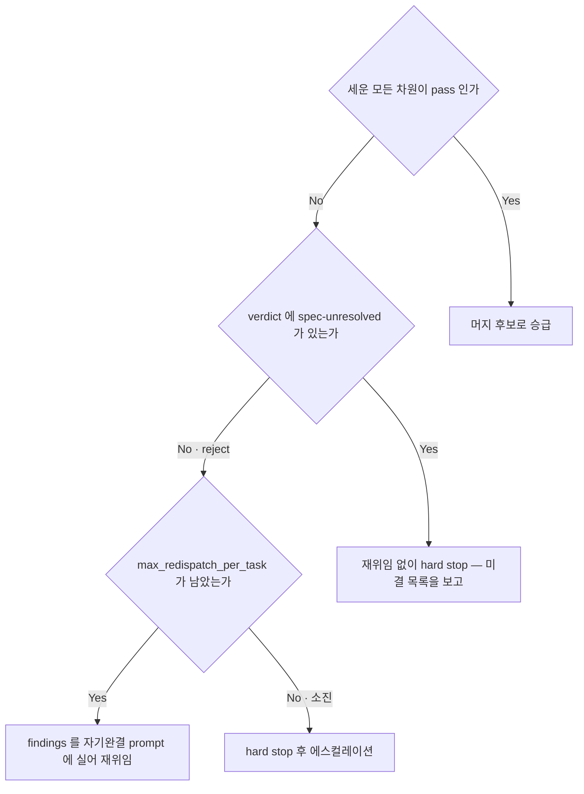
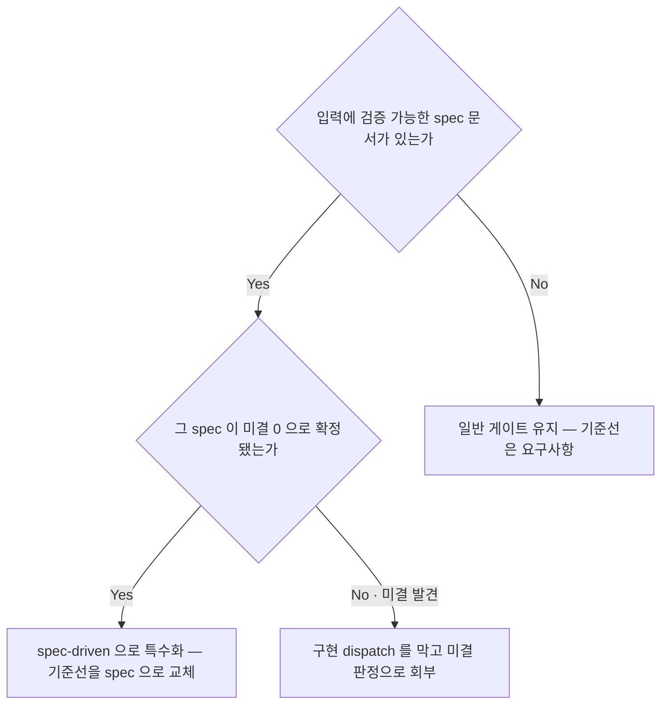

<!-- owns: D24 D30 D31 D32 | P11 -->
<!-- needs: D03 D08 D11 D20 -->

# Review Gates

머지 전 검증 게이트를 세우고 닫는 국면의 항목을 소유한다. 항목 하나는 `## D##.` / `## P##.` 블록 하나이며, 그 블록이 해당 항목의 유일한 소유처다.

이 파일의 계약은 **모드 무관**이다 — 자율인지 HITL 인지는 게이트를 세우느냐를 가르지 않고, reject 이후 처리에서만 갈린다 (→ D31).

## D24. 테스트 인프라 발견 게이트 (테스트 작성 포함 dispatch 전)

<!-- needs: D20 -->

**입력 신호**
- 이 dispatch 가 테스트 작성·보강을 포함하는가
- 러너·실행 명령 / 픽스처·헬퍼·팩토리 / 통합 하네스 / 유사 기존 테스트 2건 이상을 `file:line` 인용으로 확보했는가
- 확보하지 못했다면 어떤 검색 명령까지 돌린 결과인가

**종단별 행동 계약**
- 비발동 → 테스트를 만들지 않는 dispatch 이므로 이 게이트를 세우지 않는다. 게이트 구성 판정으로 넘긴다 (→ D30)
- prompt 에 실어 dispatch → 발견 결과를 dispatch prompt 의 컨텍스트와 검증 기준 양쪽에 넣는다 — 발견해 놓고 prompt 에 싣지 않으면 없던 일이 된다 (→ C02)
- 진입 보류 → 인용이 확보되기 전에는 테스트 작성 단계에 진입시키는 것을 금지한다 — 대신 read-only 발견 sub-agent 를 먼저 두거나 구현 prompt 의 1단계로 발견을 지시한다 (→ D20)
- 부재 접수 → `NOT FOUND — searched with <명령>` 형식으로 받는다. 부재 주장이므로 교차 검증을 거쳐 수용을 판정한다 (→ D37)

**근거**: 발견을 구현 dispatch 뒤로 미루면 가장 비싼 시점인 QA 차원에서야 하네스 미사용이 reject 로 걸린다.

**후속**: → D30

## D30. 리뷰·QA·DBA 게이트 적용 범위와 구성

<!-- needs: D03 D08 D20 -->

**입력 신호**
- 경로 판정 결과 — 무거운 경로인가 경량 경로인가 (→ D03)
- 이 작업이 되돌리기 비용이 있는 외부 쓰기를 만드는가
- DB 접촉 신호 — task 도출 시의 DB 접촉 플래그(→ C08) · 게이트 시점의 변경 파일 검사(마이그레이션 디렉토리 · `.sql` · 스키마 정의 · ORM 모델 · 쿼리 빌더 호출부)

**종단별 행동 계약**
- 축소 검토 1회 → 쓰기 직전 한 번만 돌고 반복 루프를 세우지 않는다. verdict 합성은 → D31
- 비발동 → 판정된 생략이므로 근거와 함께 decision log 에 남긴다 (→ C05). 보고 수용 판정은 그대로 돈다 (→ D37)
- 2차원 → reviewer(요구사항 ↔ 구현 · 초과 구현 · 회귀 · 설계원칙 · 품질 게이트 위반) + qa(요구사항·flow·엣지케이스 ↔ 검증 테스트 · 빈 assert·항상 통과 아닌지 · 기존 하네스 사용 여부)를 병렬로 돌린다. 구현 agent 가 게이트 역할을 겸하거나 한 agent 가 두 차원을 겸하는 것은 금지한다 — 대신 차원마다 다른 agent 를 병렬로 세운다. QA 의 테스트 추가·보강도 편집이므로 격리 subagent 에 맡긴다 (→ D20). spec 입력이면 기준선 교체 여부는 → D32
- 3차원 → dba(스키마 변경의 하위 호환·락·롤백 경로 · 인덱스·N+1·풀스캔 · 제약조건 정합성)를 세 번째 차원으로 추가한다. 메인의 체감으로 생략하는 것은 금지한다 — 대신 플래그와 파일 검사 중 하나라도 걸리면 dba 차원을 붙인다. spec 입력이면 기준선 교체 여부는 → D32

**근거**: 구현 sub-agent 의 자기 신고에 머지를 맡기면 자기 검증 편향이 그대로 머지된다.

**후속**: → D26 → D31

## D31. 게이트 verdict 판정 (AND 승급)

<!-- needs: D11 D30 -->

**입력 신호**
- 각 차원의 verdict — `pass` · `reject` · `spec-unresolved`
- 세운 게이트 차원 수 (→ D30)
- `max_redispatch_per_task`(수정 재위임 예산)의 잔여 (→ C04)

**종단별 행동 계약**
- 승급 → 머지 조정으로 넘긴다 (→ D40). 인프라 의존 동작 검증은 별개 게이트이며 둘 다 통과해야 머지한다 (→ D49). 메인은 verdict + 압축 요약만 받는다 — 상세 findings·diff 는 게이트 에이전트 컨텍스트에 남긴다. 세운 모든 차원의 pass 를 종료 조건 평가에 포함한다 (→ D48)
- hard stop → 재위임이 아니므로 `max_redispatch_per_task`(수정 재위임 예산)를 소모하지 않는다 (→ C04). 게이트 에이전트가 미결을 스스로 해석해 pass 로 판정하는 것은 금지한다 — 대신 spec 위치와 무엇이 정해져 있지 않은지를 실어 미결 판정으로 회부한다 (→ D11)
- 재위임 → 자율 모드는 findings 를 실어 자동으로 다시 위임하고(→ D33), HITL 모드는 findings 를 보고하고 결정을 받는다(→ D45). "더 잘 지켜라" 류 모호한 지시는 금지한다 — 대신 `요구사항·spec 위치 ↔ 파일:라인` 으로 지목한다. 소모 단위는 → C04
- 에스컬레이션 → 예산 소진을 사유로 실어 에스컬레이션한다 (→ D47)

**근거**: 한 차원이라도 OR 로 통과시키면 요구사항 미충족이나 테스트 공백이 그대로 머지된다.

**후속**: → D40

## D32. spec 입력 특수화 진입 판정

<!-- needs: D11 D30 -->

**입력 신호**
- 입력에 검증 가능한 spec 문서(`spec/DESIGN.md` · `spec/concerns/*` · `spec/flows/*` 또는 동등)가 있는가
- 그 spec 이 미결 0 으로 확정됐는가 (→ D11)
- 게이트 차원 구성이 정해졌는가 (→ D30)

**종단별 행동 계약**
- 일반 게이트 유지 → spec 이 없다고 QA 차원을 생략하는 것은 금지한다 — 대신 기준선을 요구사항·flow·엣지케이스로 두고 검증 테스트를 그대로 추가·검증한다 (→ D30)
- 특수화 → 바뀌는 것은 두 차원의 검증 기준선뿐이다. 검토자는 spec ↔ 구현을, QA 매니저는 spec ↔ 테스트를 본다. 역할별 검증 질문과 루프 절차는 → P11. DBA 조건부 차원은 spec 모드에서도 생략되지 않는다 (→ D30)
- 회부 → 미결이 남은 spec 은 이 게이트에 들어오지 못한다. 미결 목록과 해소 경로를 실어 hard stop 으로 넘긴다 (→ D11)

**근거**: 미결이 남은 spec 을 기준선으로 삼으면 "spec 대로"의 기준 자체가 비어 있어 판정이 성립하지 않는다.

**후속**: → P11 → D31

## 절차

## P11. spec-driven continuous review → improve 루프

머지 전까지 두 차원이 통과할 때까지 검증·개선을 반복한다. 진입 판정은 → D32, verdict 합성은 → D31 이 소유한다.

| 역할 | 입력 | 검증 질문 | 출력 |
|---|---|---|---|
| 검토자 (spec-reviewer) | spec 문서 + worktree diff (epic base 기준) | 구현이 spec 의 요구사항·flow·제약을 빠짐없이·과하지 않게 충족하는가? 회귀 위험·설계 원칙 위반은? | `pass`/`reject`/`spec-unresolved` + `spec 항목 ↔ 파일:라인` 매핑, 미충족·초과 구현 목록 |
| QA 매니저 (qa-manager) | spec 문서 + worktree 테스트 코드 | spec 의 각 flow·concern·엣지케이스에 대응하는 테스트가 있는가? 테스트가 spec 의도를 검증하는가(빈 assert·항상 통과 아님)? | `pass`/`reject`/`spec-unresolved` + `spec flow ↔ 테스트:라인` 커버리지 표, 누락 케이스 목록 |

1. 구현을 격리 subagent 에 맡긴다 (→ D20).
2. 검토자와 QA 매니저를 병렬로 돌린다 — 서로 독립이라 기다릴 이유가 없고, 한 agent 가 두 차원을 겸하면 관심사가 섞여 둘 다 얕아진다.
3. 두 verdict 를 합성한다 (→ D31). 승급·hard stop·재위임의 분기는 그 블록이 소유한다.
4. reject 면 `spec 위치 ↔ 코드 위치` 로 구체화한 findings 를 실어 1번으로 되돌아간다.
5. 거부 사유와 재위임 판단을 decision log 에 append 한다 (→ C05).
6. 메인은 verdict + 압축 요약만 받는다 — 상세 findings·diff 는 게이트 에이전트 컨텍스트에 남긴다.
7. 종료 조건 평가에 "머지된 모든 spec 작업이 검토자·QA 매니저 둘 다 pass" 를 포함한다 (→ D48).

**team 형태** — 이 절차는 team mode 강제 등급의 선호 등급이다 (→ D19). team 이 가용하면 두 검증 차원을 teammate 로 상주시키고, 비가용이면 단발 subagent 2개 폴백으로 같은 두 차원을 돈다. 어느 형태든 편집은 teammate 가 아니라 격리 subagent 가 한다 (→ D20).

**근거**: 게이트의 본질은 team 이 아니라 구현과 분리된 두 검증 차원이므로, team 이 없어도 폴백으로 본질이 유지된다.
