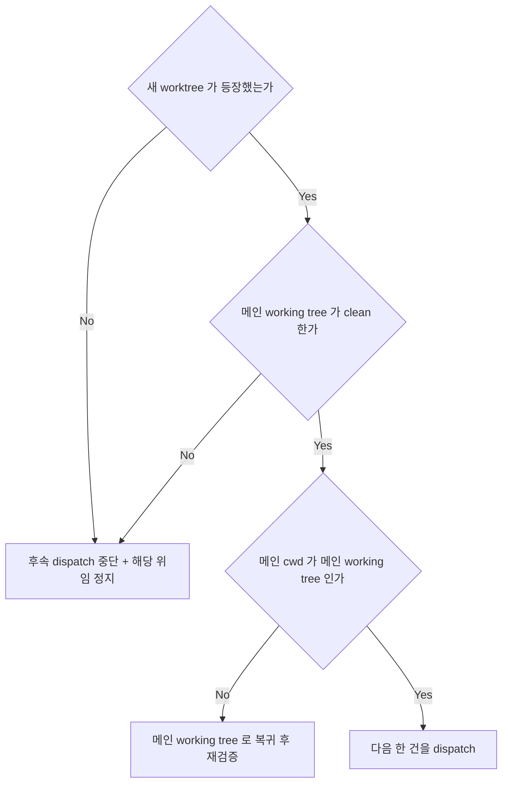
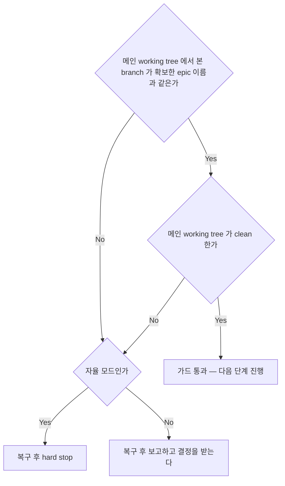
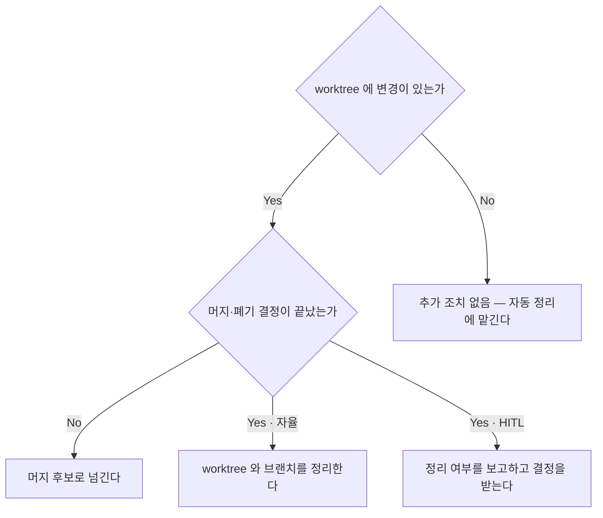

<!-- owns: D21 D22 D51 | P06 P09 -->
<!-- needs: D03 D14 D20 D42 D45 -->

# Worktree Lifecycle

worktree 격리를 실제로 거는 국면의 항목을 소유한다. 항목 하나는 `## D##.` / `## P##.` 블록 하나이며, 그 블록이 해당 항목의 유일한 소유처다. 이 파일 전체가 무거운 경로 전용이다 (→ D03).

## D21. worktree dispatch 생성 가드

<!-- needs: D14 D20 -->

**입력 신호**
- dispatch 직후 `git worktree list --porcelain` 스냅샷에 새 worktree 가 등장했는가
- `git status --short` — 메인 working tree 가 clean 한가
- `git rev-parse --show-toplevel` — 메인 shell cwd 가 메인 working tree 인가
- 가드 실행 조건: 세 명령을 메인 working tree 에서 실행했는가 — worktree 안에서 실행하면 결과가 그 worktree 것으로 바뀌어 가드가 무의미해진다. 규약 브랜치(`<epic>/t*`) 존재는 판정 기준이 아니다 — 작업 시작 후 스스로 전환하므로 dispatch 직후에는 아직 없을 수 있다



**종단별 행동 계약**
- 중단 + 정지 → 격리 없이 도는 위임을 멈추고 메인 오염 여부를 확인한다. 변경은 버리지 않고 보존한다 — worktree 로 갔어야 할 산출물일 수 있다. 복구는 → P09. 토폴로지 위반이므로 자율이면 hard stop 후 에스컬레이션(→ D47), HITL 이면 보고하고 결정을 받는다(→ D45)
- 복귀 후 재검증 → 메인 working tree 로 돌아온 뒤 세 명령을 다시 실행한다. 재검증도 실패하면 중단 종단으로 간다
- 다음 한 건 → 직렬 dispatch 를 이어간다 (→ P06). 통과 전에 다음 건을 싣는 것은 금지한다 — 대신 생성 확인 후에 싣는다

**근거**: 완료 알림 시점의 토폴로지 가드는 유출이 이미 커밋된 뒤라 늦다.

**후속**: → P06 → D22

## D22. 토폴로지 가드 (완료 알림 직후 · 머지 직후)

<!-- needs: D03 -->

**입력 신호**
- 방금 무엇이 끝났는가 — 완료 알림 수신 직후인가, 머지 직후인가
- `git branch --show-current` 가 epic 브랜치인가
- `git status --short` 가 clean 인가 (메인은 편집하지 않는다) · `git rev-parse --show-toplevel` 이 메인 working tree 인가 — worktree 안에서 실행하면 그 worktree 의 branch·status 를 보게 된다
- 현재 모드가 자율인가 HITL 인가 (→ D45)
- epic 브랜치 확보는 → P01 — 이 가드는 확보된 이름을 전제로 런 중에 돈다. 판정 기준은 → P01 이 확보한 이름과의 일치이며 `epic/` 접두 여부가 아니다



**종단별 행동 계약**
- 통과 → 완료 알림 직후였으면 결과 처리로(→ D51), 머지 직후였으면 다음 머지 후보로(→ D41) 넘어간다
- 복구 후 hard stop → 복구는 → P09. 가드 실패를 자율 재량으로 넘기는 것은 금지한다 — 대신 루프를 멈추고 발생 지점을 붙여 에스컬레이션한다 (→ D47 · → C13). 다만 epic 이름이 아직 확보되지 않은 상태면 hard stop 대신 → P01 로 되돌아간다
- 복구 후 보고 → 복구는 → P09. 복구 결과와 보존한 변경을 보고하고 결정을 받는다 (→ D45 · → C13). 다만 epic 이름이 아직 확보되지 않은 상태면 보고 대신 → P01 로 되돌아간다

**근거**: 오염된 HEAD 위에서는 후속 dispatch 의 worktree base 가 잘못 잡히고 머지 경로가 어긋난다.

**후속**: → D51

## D51. 결과 수령 후 처리

<!-- needs: D42 D45 -->

**입력 신호**
- 각 결과의 worktree 상태 — 변경이 있는가 없는가 (변경이 있으면 결과가 worktree 경로·브랜치명을 준다)
- 아직 in-flight 인 위임이 남아 있는가
- 머지·폐기 결정이 끝난 결과인가 (→ D42)
- 현재 모드가 자율인가 HITL 인가 (→ D45)



**종단별 행동 계약**
- 추가 조치 없음 → 변경 없는 worktree 는 회수 시점에 정리되므로 삭제 명령을 따로 돌리지 않는다
- 머지 후보로 넘긴다 → 성공·실패와 무관하게 변경이 있는 결과를 머지 단계로 인계한다 (→ D41). in-flight 가 남아 있으면 여기서 바로 머지하지 않는다 — 머지 시점 정책은 → D39, 재위임 여부는 → D33
- 정리한다 → 정리 절차는 → P09
- 보고하고 결정을 받는다 → 보류·폐기 판단을 받는다 (→ D45 · → C13). 보류면 worktree 를 그대로 둔다 — 임의 삭제는 금지하고, 대신 결정이 올 때까지 보존한다. 폐기 결정이 오면 정리 절차는 → P09

**근거**: 변경 유무는 결과 회수 시점에 이미 확정된 사실이라, 여기서 인계와 정리를 가르지 않으면 어느 쪽도 주인이 없어져 worktree 가 누수된다.

**후속**: → D41

## 절차

## P06. worktree 사용과 직렬 dispatch

worktree 는 항상 epic 브랜치 위의 격리 수단이고, 메인은 epic 브랜치의 메인 working tree 에 머문다.

```
main
  └─ <epic>     ← 메인 (read + dispatch + report)
       ├─ worktree A → <epic>/t1-<slug>   (base = <epic>)
       ├─ worktree B → <epic>/t2-<slug>   (base = <epic>)
       └─ worktree C → <epic>/t3-<slug>   (base = <epic>)
```

1. 진입 확인 — `git branch --show-current` 가 epic 브랜치, `git rev-parse --show-toplevel` 이 메인 working tree (→ D22)
2. 병렬 가능 여부와 격리 형태를 확정한다 (→ D14 · → D20)
3. `git worktree list --porcelain` 스냅샷을 뜬다
4. 격리 위임 **한 건만** 이번 메시지에 싣는다. 브랜치 이름 규약은 → C10, prompt 에 실을 요소는 → C02
5. 생성 가드를 돌린다 (→ D21). 통과 전에는 다음 건을 싣지 않는다
6. 남은 건이 있으면 3 으로 돌아간다
7. 메인은 epic 브랜치에서 다음 일을 진행한다. 완료 알림은 자동 도착하므로 sleep/poll 은 금지한다 — 대신 알림을 기다린다
8. 완료 알림 수신 직후 토폴로지 가드 (→ D22)

**근거**: 직렬화되는 것은 dispatch 행위뿐이라 병렬성은 잃지 않는다 — background 위임은 dispatch 가 직렬이어도 동시에 돈다.

**금지**: 메인이 직접 worktree 로 진입(`EnterWorktree`)하는 것은 금지한다 — 메인은 편집하지 않아 진입이 불필요하고 진입하면 dispatch 토폴로지가 깨진다. 대신 `git -C <worktree-path> ...` 로 읽거나 read-only 위임으로 확인한다.

## P09. 토폴로지 복구와 worktree 정리

**복구** (→ D21 · → D22 가 불일치를 잡았을 때) — 메인 로컬을 원격에 맞추는 것이지 epic 히스토리를 재작성하는 것이 아니다.

1. 메인 working tree 로 복귀한다 — 복구 명령을 worktree 안에서 실행하면 엉뚱한 체크아웃을 고치게 된다
2. 의도치 않은 변경이 있으면 `git stash push -u` 로 보존한다 — worktree 로 갔어야 할 산출물일 수 있어 버리지 않는다
3. 진행 중인 rebase 가 있으면 `git rebase --abort` 로 중단한 뒤 복구를 시작한다
4. `git checkout <epic>` (이름은 → P01 이 확보한 것)
5. `git pull --ff-only origin <epic>`
6. 5 가 non-ff 로 거부되면 **hard stop 후 보고**한다. 갈라짐 자체가 토폴로지 위반의 증거이므로 epic 히스토리를 다시 쓰는 것은 금지한다 — 대신 갈라진 상태 그대로 보고한다 (자율이면 → D47, HITL 이면 → D45)
7. 잘못 switch 된 브랜치가 로컬에 남았으면 `git branch -D <브랜치>`
8. 어떤 명령 직후 발생했는지와 working tree 가 clean 했는지를 붙여 보고한다 (→ C13)

**정리** (→ D51 이 정리 종단을 냈을 때)

| 상태 | 정리 |
|---|---|
| 머지 성공 | worktree 디렉토리 삭제 + 머지된 브랜치 삭제(선택) |
| 머지 실패 · 보류 결정 | 그대로 둔다 |
| 머지 실패 · 폐기 결정 | worktree + 브랜치 삭제 |

정리는 `atelier git` 또는 `git worktree remove` 로 수행한다. 변경이 없어 위험이 낮으므로 메인이 직접 해도 되고 위임해도 된다.
