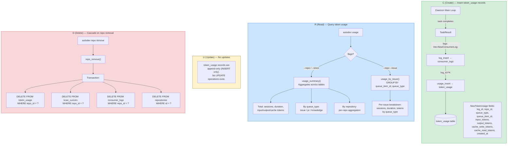
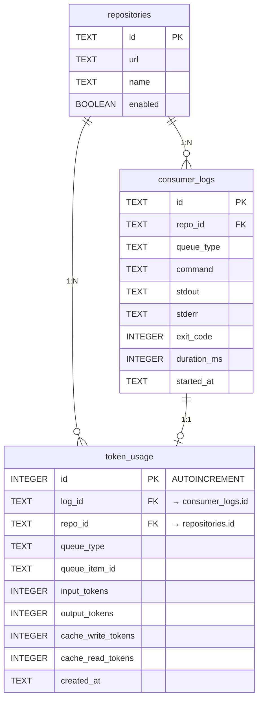

# 토큰 사용량 추적 (Token Usage Tracking)

> autodev 데몬이 소비하는 Claude API 토큰을 세션 단위로 기록하고, CLI로 조회하는 기능

## CRUD Data Flow



## Schema



## CRUD 요약

| Op | Method | Trigger | 비고 |
|---|---|---|---|
| **C** | `usage_insert()` | 데몬 루프 — consumer task 완료 후 Claude API 응답의 토큰 카운트 저장 | Append-only, `consumer_logs`와 1:1 (log_id FK) |
| **R** | `usage_summary()` | `autodev usage [--repo] [--since]` | `token_usage` + `consumer_logs` + `repositories` JOIN, queue_type/repo별 집계 |
| **R** | `usage_by_issue()` | `autodev usage --repo X --issue N` | repo + issue 필터, queue_type별 그룹핑 |
| **U** | _(없음)_ | — | 레코드는 삽입 후 불변 |
| **D** | `repo_remove()` | `autodev repo remove <name>` | 트랜잭션 내 cascade: token_usage → scan_cursors → consumer_logs → repositories |

## CLI 사용법

```bash
# 전체 요약
autodev usage

# 특정 레포 필터
autodev usage --repo org/repo-name

# 기간 필터
autodev usage --since 2026-03-01

# 특정 이슈의 토큰 사용량
autodev usage --repo org/repo-name --issue 42
```

## 입력 검증

| 파라미터 | 검증 | 에러 메시지 |
|---|---|---|
| `--since` | `chrono::NaiveDate::parse_from_str(s, "%Y-%m-%d")` | `invalid --since format: expected YYYY-MM-DD` |
| `--repo` | `chars().all(alphanumeric \| / \| - \| _ \| .)` | `invalid repo name: {name}` |

## 관련 파일

| 파일 | 역할 |
|---|---|
| `cli/src/queue/schema.rs` | `token_usage` 테이블 DDL |
| `cli/src/domain/models.rs` | `NewTokenUsage`, `UsageSummary`, `UsageByQueueType`, `UsageByRepo`, `UsageByIssue` |
| `cli/src/domain/repository.rs` | `TokenUsageRepository` trait |
| `cli/src/queue/repository.rs` | SQLite 구현 (insert, summary, by_issue, cascade delete) |
| `cli/src/client/mod.rs` | `usage()` 리포트 포맷팅 |
| `cli/src/main.rs` | `Commands::Usage` CLI 진입점 |
