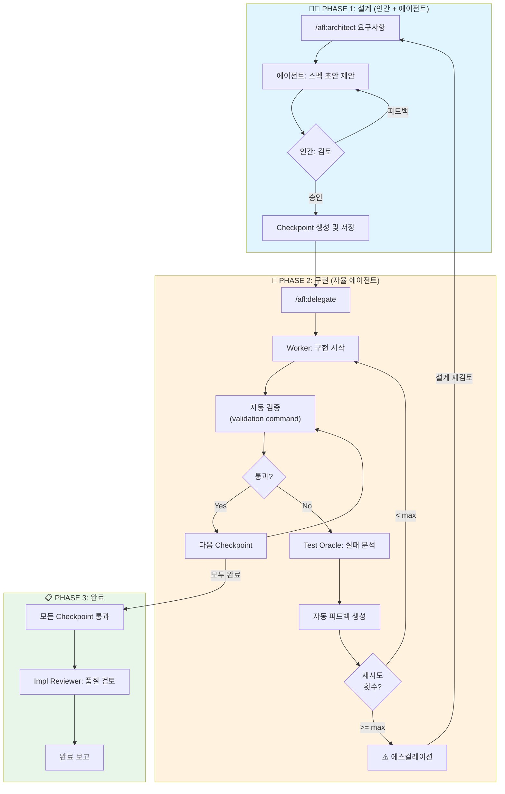
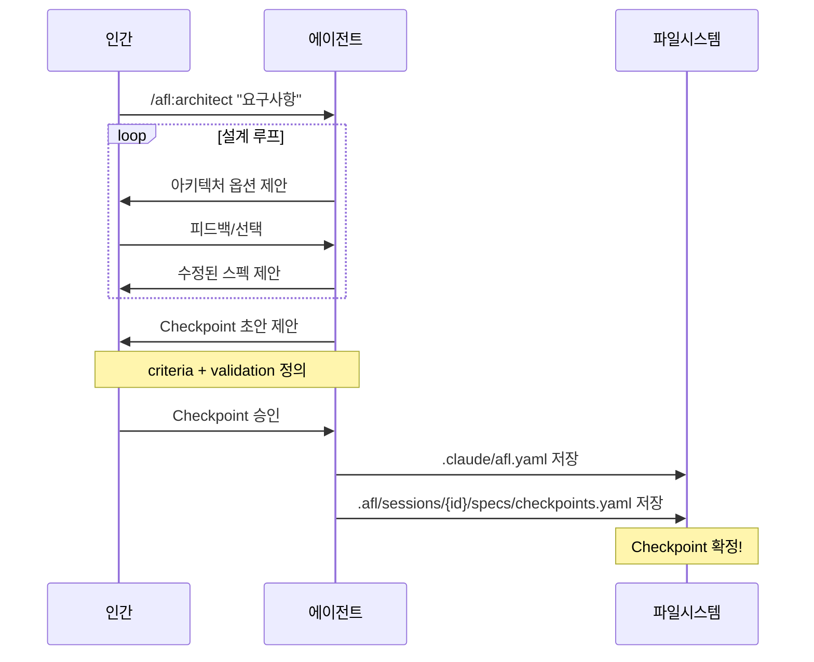
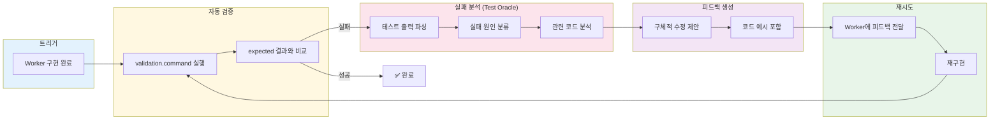
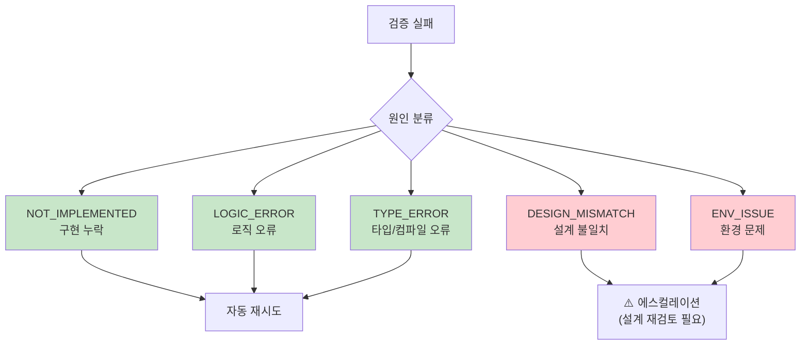
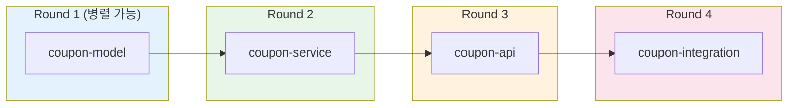
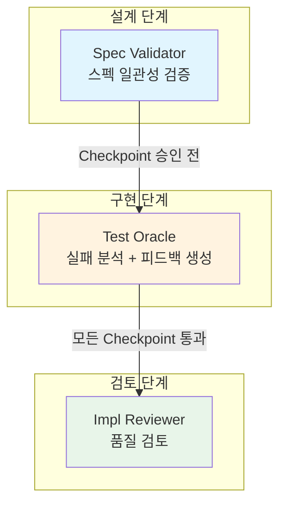
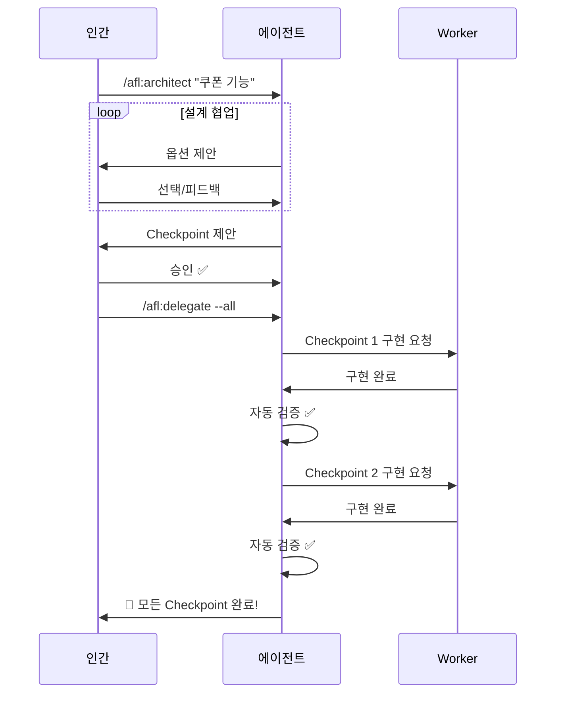
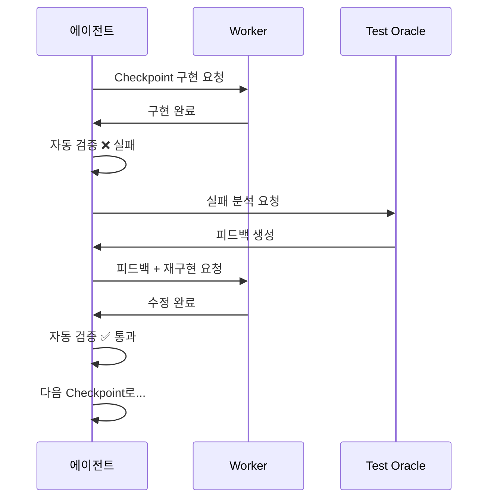
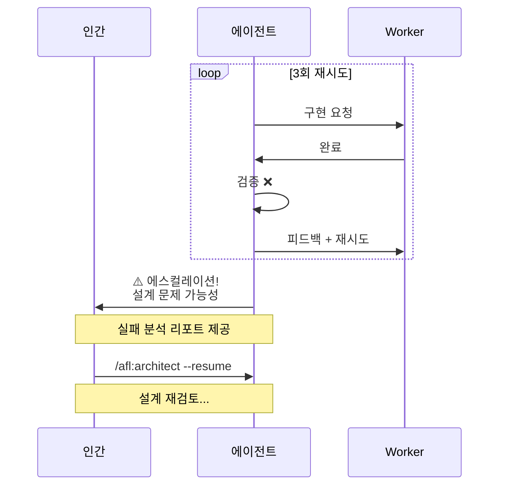

# Automated Feedback Loop Plugin

자동화된 피드백 루프를 통한 인간-에이전트 협업 시스템

## Quick Start

```bash
# 1. 초기화 (프로젝트 분석)
/afl:init

# 2. 설계 시작 (인간-에이전트 협업)
/afl:architect "쿠폰 할인 기능 개발"

# 3. 구현 위임 (자율 에이전트)
/afl:delegate --all

# 4. 상태 확인
/afl:loop-status
```

---

## 전체 워크플로우



---

## Checkpoint 생명주기

### 언제 생성되나?



### 저장 위치

```
.claude/
└── afl.yaml                    # 전역 설정

.afl/
└── sessions/
    └── {session-id}/
        ├── meta.json           # 세션 정보
        ├── specs/
        │   ├── architecture.md # 아키텍처 설계
        │   ├── contracts.md    # 인터페이스 정의
        │   └── checkpoints.yaml # ⭐ Checkpoint 정의
        └── delegations/
            └── {checkpoint-id}/
                ├── status.json
                └── iterations/
                    └── {n}/
                        ├── result.json
                        └── feedback.md
```

---

## 자동 피드백 루프 상세

### 어떻게 동작하나?



### 실패 원인 분류



---

## Checkpoint 구조

```yaml
# .afl/sessions/{session-id}/specs/checkpoints.yaml

session: abc12345
created_at: 2024-01-15T10:00:00Z
approved_at: 2024-01-15T11:30:00Z

checkpoints:
  - id: coupon-model
    name: "쿠폰 도메인 모델"
    type: implementation
    dependencies: []              # 의존성 없음 = 먼저 실행
    criteria:                     # 성공 기준 (사람이 정의)
      - "Coupon 엔티티 생성"
      - "CouponRepository 구현"
    validation:                   # 자동 검증 방법
      command: "pytest tests/test_coupon_model.py"
      expected: "passed"
      timeout: 30000

  - id: coupon-service
    name: "쿠폰 서비스 로직"
    type: implementation
    dependencies: [coupon-model]  # coupon-model 완료 후 실행
    criteria:
      - "validate() 구현"
      - "apply() 구현"
      - "중복 적용 방지"
    validation:
      command: "pytest tests/test_coupon_service.py"
      expected: "3 passed"
      timeout: 30000

  - id: coupon-api
    name: "쿠폰 API"
    type: api
    dependencies: [coupon-service]
    criteria:
      - "POST /coupons/validate - 200/400"
      - "POST /coupons/apply - 200/409"
    validation:
      command: "pytest tests/test_coupon_api.py -v"
      expected: "passed"
      timeout: 60000
```

---

## 실행 순서 (의존성 기반)



---

## 명령어 요약

| 명령어 | 용도 | 인간 개입 |
|--------|------|----------|
| `/afl:init` | 프로젝트 분석, 설정 생성 | 초기 1회 |
| `/afl:config` | 설정 조회 및 변경 | 필요시 |
| `/afl:setup` | 대화형 설정 변경 | 필요시 |
| `/afl:architect` | 설계 루프 (스펙, Checkpoint 정의) | **적극 참여** |
| `/afl:delegate` | 구현 위임 | 시작만 |
| `/afl:checkpoint` | Checkpoint 관리 | 필요시 |
| `/afl:loop-status` | 피드백 루프 상태 확인 | 모니터링 |

---

## 에이전트 역할



| 에이전트 | 역할 | 호출 시점 |
|----------|------|----------|
| **Spec Validator** | 스펙 문서 일관성 검증 | Checkpoint 승인 전 |
| **Test Oracle** | 테스트 실패 분석, 피드백 생성 | 검증 실패 시 |
| **Impl Reviewer** | 구현 품질 검토 | Checkpoint 통과 후 |

---

## 설정 파일

```yaml
# .claude/afl.yaml

project:
  language: python              # 자동 감지
  framework: fastapi
  test_command: pytest
  build_command: poetry build

feedback_loop:
  mode: auto                    # auto | semi-auto | manual
  max_iterations: 5             # 최대 재시도 횟수

validation:
  method: test                  # test | script | manual
  timeout: 120000

notification:
  method: system                # system | slack | none

agents:
  spec_validator: true
  test_oracle: true
  impl_reviewer: true
```

---

## 사용 시나리오

### 정상 플로우



### 실패 → 자동 재시도 플로우



### 실패 → 에스컬레이션 플로우



---

## 핵심 원칙

| 원칙 | 설명 |
|------|------|
| **인간은 "무엇"과 "왜"** | 스펙, 아키텍처, 성공 기준 정의 |
| **에이전트는 "어떻게"** | 구현, 테스트, 자동 검증 |
| **명시적 Checkpoint** | 모호한 "완료"를 검증 가능한 기준으로 |
| **자동 피드백 루프** | 실패 시 자동 분석 + 재시도 |
| **적절한 에스컬레이션** | 설계 문제는 인간에게 |
