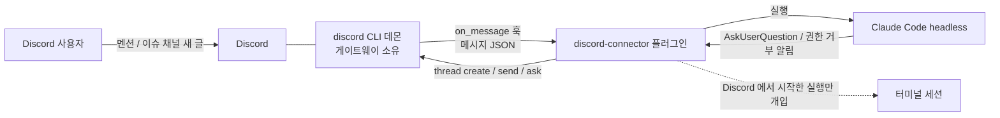

# DESIGN

> **Date**: 2026-10-05
> **Status**: Approved

## 목표

Discord 에서 봇을 멘션하거나 이슈 채널에 글을 올리면, 그 글을 Claude 에게 일로 넘기고 결과를 같은 스레드에 답장해요. 터미널을 열지 않고도 Discord 대화만으로 Claude 와 작업을 이어갈 수 있게 하는 게 목표예요.

## 설계 철학

### 1. 트리거 하나당 Claude 실행 하나
- 메시지 하나가 조건에 맞으면 Claude 를 새로 한 번 실행하고, 한 턴이 끝나면 종료해요.
- 왜: 상주 Claude 세션은 모든 스레드가 한 세션에 섞이고, 죽으면 전부 멈춰요.

### 2. 스레드 하나 = 대화 하나
- 스레드마다 Claude 대화가 하나 이어져요. 다음 멘션은 이전 대화를 이어받아요.
- 왜: Discord 사용자는 스레드 단위로 맥락을 기대해요.

### 3. 연결은 CLI, 실행은 플러그인
- Discord 와의 모든 통신은 `discord` CLI 가 맡고, 플러그인은 Claude 실행만 맡아요.
- 왜: 같은 봇 토큰으로 게이트웨이(실시간 연결)를 둘 이상 열면 버튼 응답이 서로 경쟁해요. 또 CLI 가 Claude 에 묶이면 다른 용도로 재사용할 수 없어요.

### 4. Discord 에서 시작한 일만 다뤄요
- 터미널에서 띄운 Claude 세션에는 아무 영향이 없어요.
- 왜: 같은 플러그인이 설치돼도 평소 터미널 작업이 달라지면 안 돼요.

### 5. 실패는 숨기지 않아요
- 오류는 스레드에 드러내고, 기본값으로 덮지 않아요. 상세는 [failure-policy](concerns/failure-policy.md).

### 6. 쓰기는 스레드 안에만, 봇 멘션은 무력화해서
- 플러그인이 올리는 모든 메시지가 다시 트리거가 되는 무한 루프를 막아요. 상세는 [conversation-session](concerns/conversation-session.md) 의 "게시 규칙".

## 전체 구조

- 데이터 흐름: 메시지 → CLI 가 필터 → 플러그인 실행 → Claude 결과 → CLI 로 스레드에 게시.
- 점선: 터미널 세션에는 개입하지 않아요.

## 관심사 분리

| 레이어 | 책임 | 하지 않는 것 |
|--------|------|--------------|
| `discord` CLI (외부 저장소 `areum-lab-tools/tools/discord`) | Discord 연결, 메시지 감지·필터, 작업 디렉토리 선택, 훅 호출, 스레드·전송·버튼 질문 | Claude 실행 |
| discord-connector 플러그인 | 스레드↔Claude 대화 매핑, 동시성 제어, 실행 중 질문 중계, 실패 알림 | Discord 직접 접속 |
| Claude Code | 작업 수행 | Discord 를 모름 |

## 확장 가능 지점

- 이슈 채널 추가: CLI 설정만 바꿔요. 플러그인 변경 없음.
- 채널별 작업 디렉토리: CLI 설정에 매핑을 추가해요. 플러그인 변경 없음.
- 권한 승인 버튼: 범위 밖. 필요해지면 별도 설계예요.

## 버린 선택지

| 선택지 | 버린 이유 |
|--------|-----------|
| 플러그인이 `discord listen` 을 상주 구독 | 상주 프로세스가 하나 더 생겨요 |
| CLI 데몬이 Claude 를 직접 실행 | CLI 가 Claude 에 묶여요 |
| 상주 Claude 세션이 트리거까지 처리 | 세션에 프롬프트를 넣는 방법이 미확인이고, 스레드가 한 세션에 섞이고, 단일 장애점이 돼요 |
| `Stop` hook 으로 턴 사이를 붙잡고 대기 | 다음 멘션까지 몇 시간이 걸릴 수 있고, 데몬 재시작에 끊기고, 연속 block 한도가 있어요 |
| 런처를 Rust CLI 로 구현 | CLI 작업은 discord CLI 쪽에서 맡기로 했어요 |
| 권한 승인 버튼 (default 모드 또는 거부 후 재승인) | auto 모드에서는 승인 지점이 없고, default 모드는 쓰기마다 버튼이 떠요. 대신 거부 알림 + 다음 멘션으로 재지시 |

## 범위 밖

- `discord` CLI 자체의 변경
- 권한 승인 버튼
- 터미널에서 띄운 세션의 Discord 알림

## 사용자 시나리오

| # | 상황 | 결과 |
|---|------|------|
| 1 | 아무 채널에서 봇을 멘션 | 스레드가 만들어지고 Claude 가 그 스레드에 답해요 |
| 2 | 이슈 채널에 새 글 | 멘션 없이도 스레드가 만들어지고 Claude 가 답해요 |
| 3 | 스레드 안에서 봇을 멘션 | 이전 대화를 이어서 답해요 |
| 4 | 스레드 안에서 멘션 없는 글 | 무반응이에요 (사람끼리 대화) |
| 5 | Claude 가 실행 중 질문 | 스레드에 버튼(multiSelect 는 선택 메뉴)으로 올라가고, 요청자의 답으로 실행이 이어져요 |
| 6 | 실행 중에 같은 스레드에서 또 멘션 | "이전 작업이 끝난 뒤 다시 멘션해 주세요" 안내가 올라와요 |
| 7 | auto 모드가 도구를 거부 | 거부된 도구와 사유가 스레드에 알림으로 올라와요 |
| 8 | 터미널에서 직접 Claude 사용 | 플러그인이 아무것도 하지 않아요 |

## 미결정 사항

없음

## 상세 문서

| 문서 | 설명 |
|------|------|
| [concerns/discord-cli-contract.md](concerns/discord-cli-contract.md) | `discord` CLI 와의 계약 (훅 입력, 필터, 의존 명령, JSON 형식) |
| [concerns/claude-code-dependencies.md](concerns/claude-code-dependencies.md) | Claude Code 쪽에 의존하는 동작 (2.1.289 실험 기준) |
| [concerns/conversation-session.md](concerns/conversation-session.md) | 프롬프트 내용, 대화 이어가기, 작업 디렉토리 고정, 동시성 정책 |
| [concerns/failure-policy.md](concerns/failure-policy.md) | 실패를 다루는 정책 |
| [flows/01-trigger-to-reply.md](flows/01-trigger-to-reply.md) | 트리거 → 실행 → 답장 |
| [flows/02-question-during-run.md](flows/02-question-during-run.md) | 실행 중 질문 |
