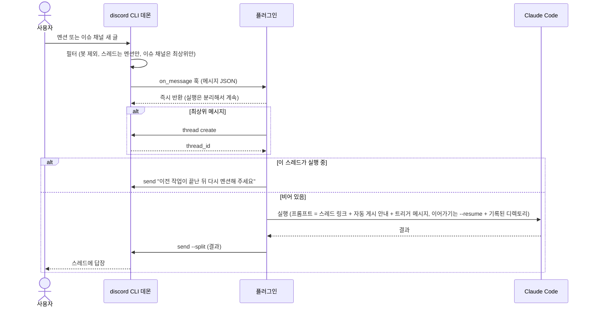

# Flow 01: 트리거 → 실행 → 답장

> 멘션이나 이슈 채널 새 글이 스레드의 Claude 답장이 되기까지의 흐름이에요.

## 흐름 다이어그램

## 단계별 설명

| # | 단계 | 결과 |
|---|------|------|
| 1 | CLI 가 메시지를 걸러서 훅을 호출해요 | 조건에 맞는 메시지만 플러그인에 도착 |
| 2 | 플러그인은 입력을 받자마자 실행을 시작하고 훅 호출을 끝내요 | 데몬 재시작과 무관하게 계속 실행돼요 |
| 3 | 최상위 메시지면 스레드를 만들어요 | 이후 모든 게시는 이 스레드 안으로만 |
| 4 | 스레드 잠금을 잡아요. 이미 실행 중이면 대기 안내만 올리고 끝내요 | 같은 스레드의 실행은 동시에 하나 |
| 5 | 스레드 링크, 최종 답 자동 게시 안내, 트리거 메시지만 프롬프트에 넣어 Claude 를 실행해요. 이력은 Claude 가 필요하면 직접 읽어요 | [conversation-session](../concerns/conversation-session.md) |
| 6 | 첫 실행이면 훅의 `cwd`, 이어가기면 기록된 디렉토리에서 실행해요 | 세션 이어가기가 깨지지 않아요 |
| 7 | 종료 후 `session_id` 와 디렉토리를 기록하고, 봇 멘션을 무력화한 결과를 `send --split` 으로 올려요. `--reply-to` 는 쓰지 않아요 | 다음 멘션이 이어갈 수 있어요. 결과가 다시 트리거되지 않아요 |
| 8 | 잠금을 풀어요 | 다음 트리거 처리 가능 |

## 실패 경로

- 단계 3 `thread create` 실패: 알릴 스레드가 없어요. 실행하지 않고 플러그인 상태 디렉토리의 로그에 기록해요.
- 스레드 생성 후 Claude 실행 전 실패: 스레드를 지우지 않고 그 스레드에 오류를 올려요.
- 단계 6 기록된 디렉토리가 없어짐: 기본값으로 대체하지 않고 오류를 올려요.
- 단계 6 Claude 비정상 종료·결과 해석 실패: 실패 유형과 원인 마지막 20줄 이내를 코드블록으로 올리고 잠금을 풀어요.
- 단계 7 게시 실패: 잠금을 풀고 종료해요.

## 엣지 케이스

- 이슈 채널 새 글과 멘션이 동시에 해당하면 훅은 메시지당 한 번만 호출돼요.
- 스레드 안 멘션 없는 글은 단계 1에서 걸러져요.
- `trigger_bots` 에 든 봇의 메시지도 `author.bot: true` 로 도착해요. 같은 단계로 처리해요.
- 실행 중 Claude 가 백그라운드 실행을 시도하면 막고 포그라운드로 다시 하게 해요. 왜: 턴이 끝나면 프로세스가 종료돼 백그라운드 결과가 돌아오지 않아요 ([claude-code-dependencies](../concerns/claude-code-dependencies.md)).
- 결과 게시 규칙(스레드 안에만, 답장 미사용, 봇 멘션 무력화)은 [conversation-session](../concerns/conversation-session.md) 의 "게시 규칙"이에요. 왜: 결과가 다시 트리거되는 무한 루프를 막아요.

## 관련 문서

| 문서 | 관계 |
|------|------|
| [DESIGN.md](../DESIGN.md) | 전체 구조 |
| [discord-cli-contract](../concerns/discord-cli-contract.md) | 훅 입력과 명령 |
| [conversation-session](../concerns/conversation-session.md) | 이어가기·동시성 |
| [failure-policy](../concerns/failure-policy.md) | 실패 처리 |
