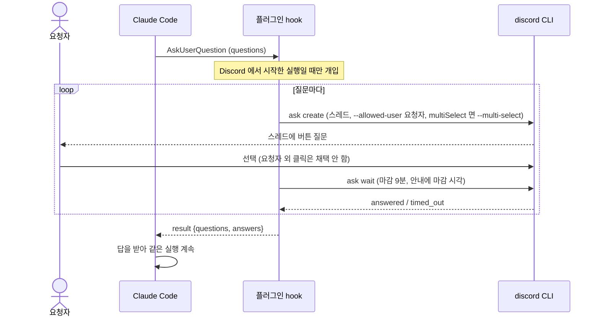

# Flow 02: 실행 중 질문

> Claude 가 실행 중 사용자에게 질문하면 스레드에 버튼으로 올리고, 요청자의 답으로 같은 실행을 이어가요.

## 흐름 다이어그램

## 단계별 설명

| # | 단계 | 결과 |
|---|------|------|
| 1 | Claude 가 질문 도구를 호출해요 | hook 이 가로채요 |
| 2 | 질문마다 스레드에 버튼을 올려요. 허용 사용자는 요청자 한 명이에요 | 다른 사람의 클릭은 무시 |
| 3 | 응답을 기다려요 (마감은 9분, 안내에 마감 시각을 표시) | 답 또는 시간 초과 |
| 4 | 모은 답을 `{result:{questions, answers}}` 로 돌려줘요 | Claude 가 이어서 일해요 |

- 왜 요청자만: 다른 사람이 눌러서 작업 방향이 바뀌면 안 돼요.
- 왜 마감 9분: Claude Code 가 hook 대기를 10분에서 끊어요 ([claude-code-dependencies](../concerns/claude-code-dependencies.md)).

## 실패 경로

- 마감 지남(`timed_out`) 또는 `ask wait` 실패: "Discord에서 시간 안에 답이 없었어요" 를 그 질문의 답으로 돌려주고, 이후 판단은 Claude 에 맡겨요.
- `ask create` 실패: 스레드에 알리고 같은 미응답 답을 돌려줘요 ([failure-policy](../concerns/failure-policy.md)).

## 엣지 케이스

- 터미널에서 띄운 세션의 질문은 hook 이 개입하지 않아요. 터미널에서 사용자가 직접 답해요.
- multiSelect 질문: `--multi-select` 선택 메뉴로 올려요. `multi_choice` 결과(라벨 배열)는 라벨들을 하나의 답 문자열로 합쳐 돌려줘요 ([discord-cli-contract](../concerns/discord-cli-contract.md)).
- 요청자 외 사용자가 클릭하면 그 사람에게만 안내가 가고 질문은 계속 pending 이에요.
- 질문 본문도 봇 멘션 무력화 대상이에요 ([conversation-session](../concerns/conversation-session.md) 의 "게시 규칙").
- 질문 대기 중에도 같은 스레드의 잠금은 유지돼서 새 멘션은 대기 안내를 받아요.
- auto 모드가 도구를 거부해도 질문과는 별개예요. 거부는 알림으로만 올라가요.

## 관련 문서

| 문서 | 관계 |
|------|------|
| [DESIGN.md](../DESIGN.md) | 사용자 시나리오 5 |
| [discord-cli-contract](../concerns/discord-cli-contract.md) | `ask` 명령 |
| [claude-code-dependencies](../concerns/claude-code-dependencies.md) | hook 응답 형식·마감 |
| [conversation-session](../concerns/conversation-session.md) | 잠금 |
