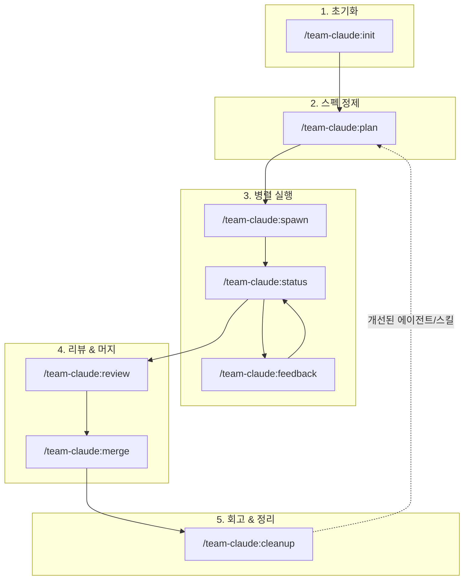
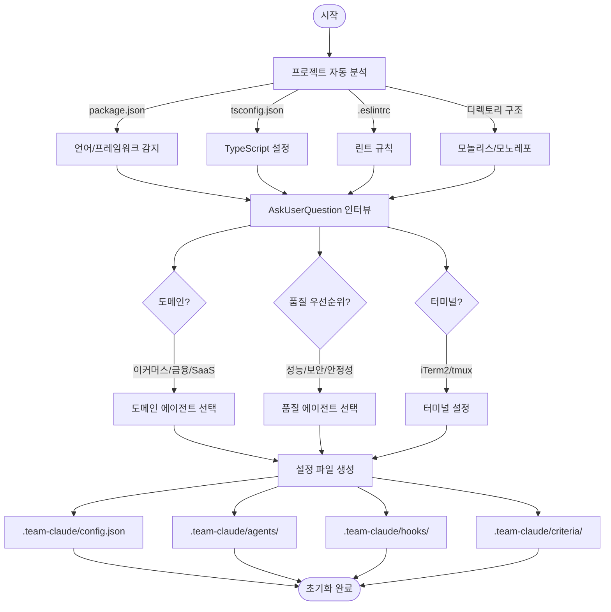
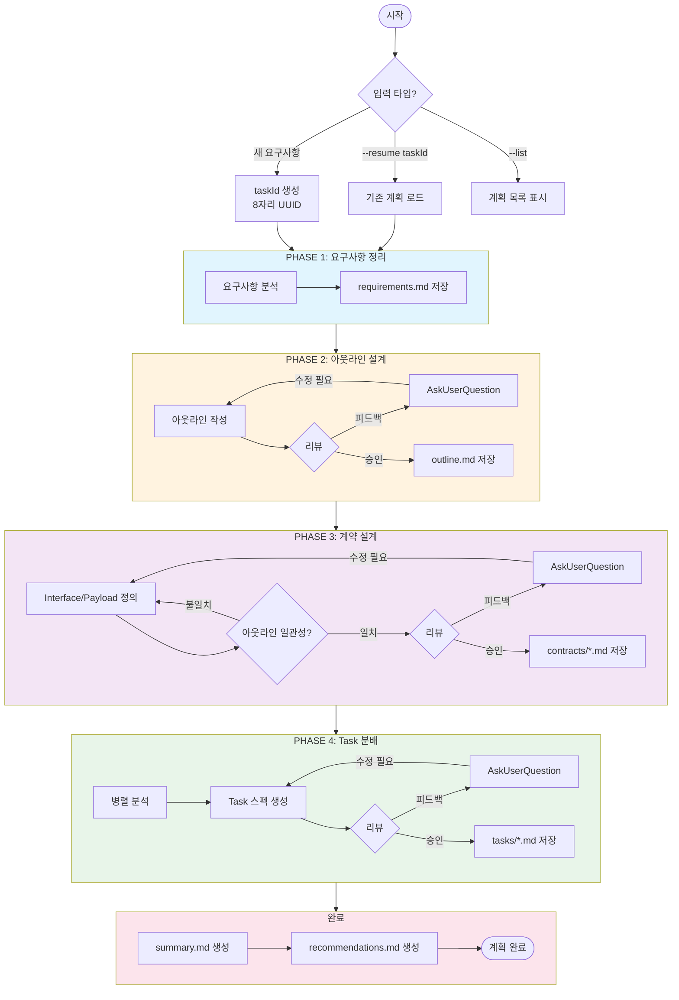
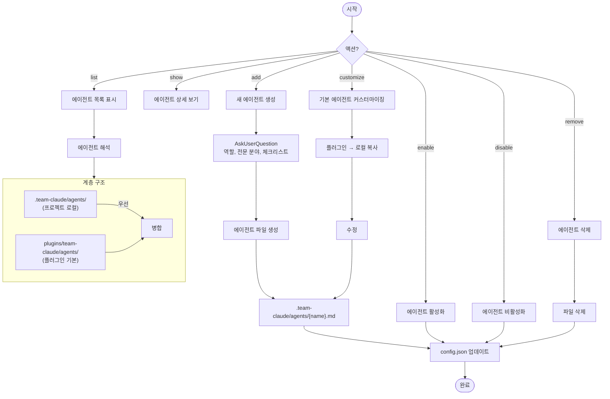
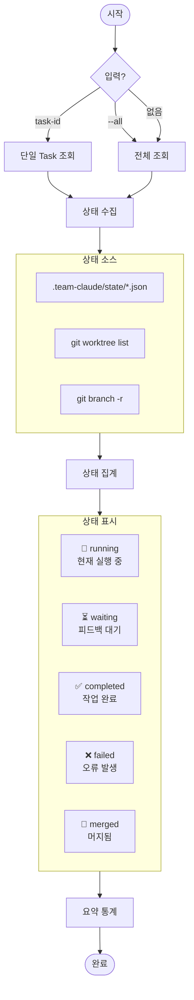
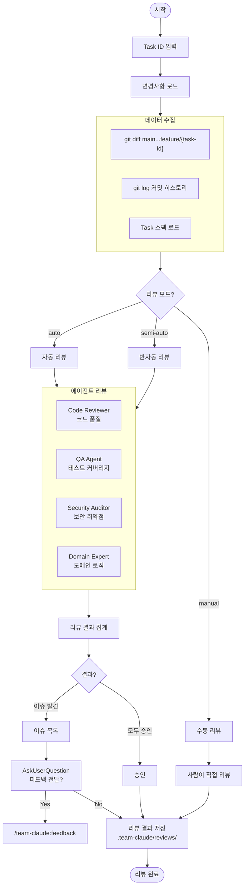
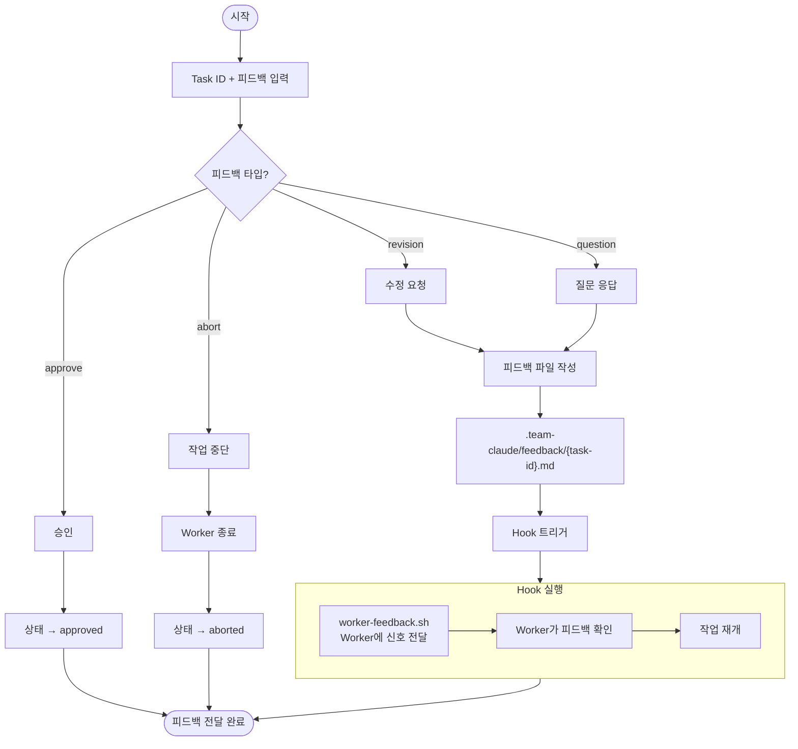
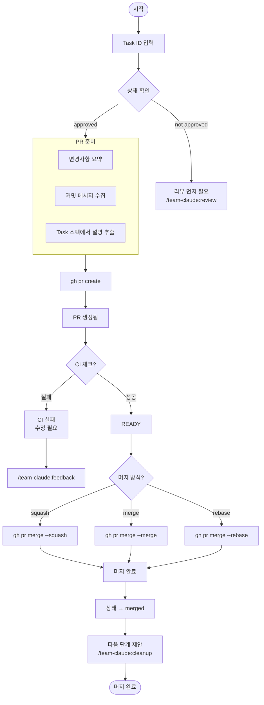
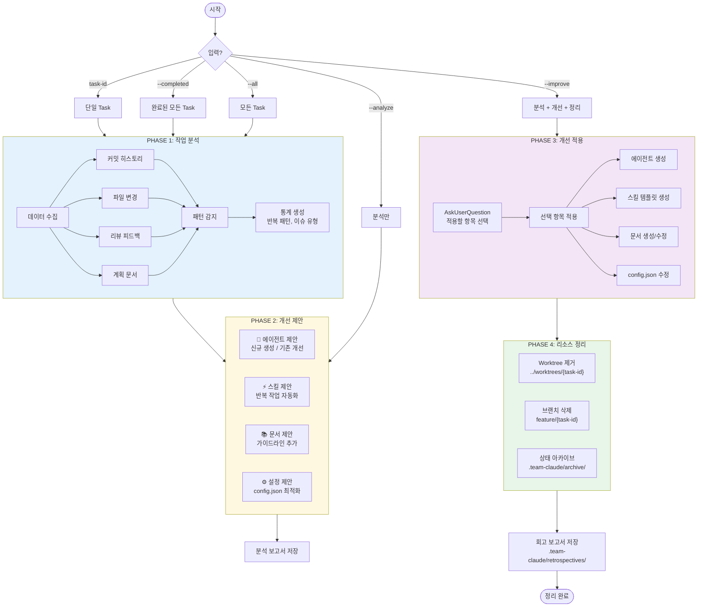
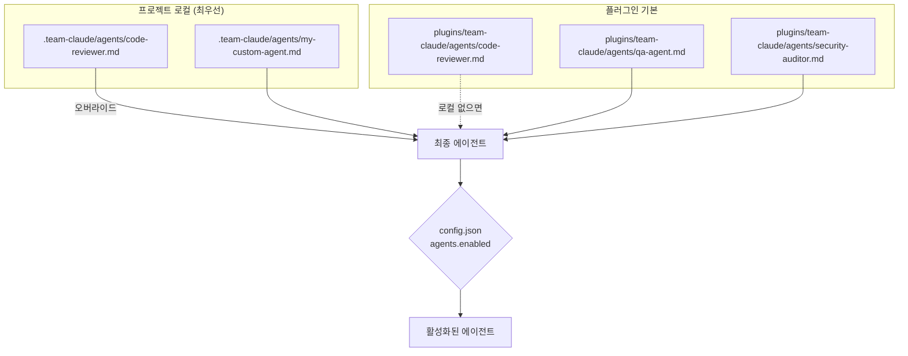

# Team Claude Plugin

멀티 에이전트 협업 시스템 - Claude Code 플러그인으로 구현하는 병렬 개발 파이프라인

## 핵심 가치

| 가치 | 설명 |
|------|------|
| **컨텍스트 엔지니어링** | 단순 프롬프트가 아닌, 지속적인 맥락 공유와 피드백 루프 |
| **적절한 개입** | 모호한 부분은 사람이 판단, 명확한 부분은 AI가 실행 |
| **병렬 실행** | Contract 기반으로 독립적인 Task를 동시에 진행 |
| **시각적 확인** | Worker 진행 상황을 터미널에서 실시간 확인 |
| **지속적 개선** | 회고를 통해 에이전트/스킬/문서를 점진적으로 개선 |

## Commands

| Command | 설명 |
|---------|------|
| `/team-claude:init` | 프로젝트 초기 설정 |
| `/team-claude:setup` | 설정 변경 위자드 |
| `/team-claude:config` | 개별 설정 조회/수정 |
| `/team-claude:agent` | 에이전트 관리 (추가/활성화/커스터마이징) |
| `/team-claude:plan` | 요구사항 → 스펙 정제 (taskId 기반) |
| `/team-claude:spawn` | Worker 생성 및 실행 |
| `/team-claude:status` | Worker 상태 조회 |
| `/team-claude:review` | 완료된 Task 리뷰 |
| `/team-claude:feedback` | Worker에 피드백 전달 |
| `/team-claude:merge` | PR 머지 |
| `/team-claude:cleanup` | 회고 분석 및 Worktree 정리 |

---

## 전체 워크플로우



---

## 커맨드별 워크플로우

### /team-claude:init

프로젝트 분석 및 Team Claude 환경 초기화



---

### /team-claude:plan

요구사항을 스펙으로 정제하는 반복 워크플로우 (taskId 기반 관리)



---

### /team-claude:agent

에이전트 관리 (계층화된 구조)



---

### /team-claude:spawn

Worker 생성 및 Git Worktree 기반 병렬 실행

```mermaid
flowchart TD
    START([시작]) --> INPUT[Task ID 입력]
    INPUT --> LOAD[Task 스펙 로드<br/>.team-claude/plans/*/tasks/]

    LOAD --> VALIDATE{스펙 검증}
    VALIDATE --> |실패| ERROR([스펙 오류])
    VALIDATE --> |성공| PREPARE

    subgraph PREPARE["준비 단계"]
        BRANCH[브랜치 생성<br/>feature/{task-id}]
        WORKTREE[Git Worktree 생성<br/>../worktrees/{task-id}/]
        HOOKS[Worker용 hooks.json 복사]
        BRANCH --> WORKTREE --> HOOKS
    end

    PREPARE --> TERMINAL{터미널 타입?}

    TERMINAL --> |iTerm2| ITERM[새 탭에서 실행]
    TERMINAL --> |tmux| TMUX[새 pane에서 실행]
    TERMINAL --> |manual| MANUAL[명령어 출력]

    ITERM & TMUX & MANUAL --> EXECUTE

    subgraph EXECUTE["Worker 실행"]
        CLAUDE["claude --worktree<br/>Task 스펙 + Contract 전달"]
        CLAUDE --> WORKING[작업 수행]
        WORKING --> |Hook: PreToolUse| NEEDS_HELP{도움 필요?}
        NEEDS_HELP --> |Yes| NOTIFY_HELP[Main에 알림]
        NEEDS_HELP --> |No| WORKING
        WORKING --> |Hook: Stop| COMPLETE[작업 완료]
        COMPLETE --> NOTIFY_DONE[Main에 완료 알림]
    end

    NOTIFY_DONE --> STATE[상태 저장<br/>.team-claude/state/]
    STATE --> DONE([Spawn 완료])
```

---

### /team-claude:status

Worker 상태 실시간 조회



---

### /team-claude:review

완료된 Task 에이전트 리뷰



---

### /team-claude:feedback

Worker에 피드백 전달 (Hook 기반)



---

### /team-claude:merge

PR 생성 및 머지



---

### /team-claude:cleanup

회고 분석 및 리소스 정리



---

## 에이전트 계층 구조

에이전트는 `.claude` 파일처럼 계층화된 구조로 관리됩니다:



### 커스텀 에이전트 추가

```bash
# 새 에이전트 생성 (대화형)
/team-claude:agent add payment-expert

# 기본 에이전트 커스터마이징 (로컬 복사)
/team-claude:agent customize code-reviewer

# 에이전트 활성화/비활성화
/team-claude:agent enable domain-expert
/team-claude:agent disable security-auditor

# 에이전트 목록
/team-claude:agent list
```

---

## 디렉토리 구조

```
.team-claude/
├── config.json                 # 메인 설정
├── agents/                     # 로컬 에이전트 (오버라이드)
├── criteria/                   # 완료 기준
├── hooks/                      # Worker Hook 설정
├── plans/                      # 계획 문서 (taskId별)
│   ├── index.json
│   └── {taskId}/
│       ├── meta.json
│       ├── requirements.md
│       ├── outline/
│       ├── contracts/
│       ├── tasks/
│       └── completion/
├── state/                      # Worker 상태
├── reviews/                    # 리뷰 결과
├── feedback/                   # 피드백 파일
├── retrospectives/             # 회고 보고서
└── archive/                    # 아카이브

../worktrees/                   # Git Worktree (프로젝트 외부)
└── {task-id}/
```

---

## 사전 요구사항

- Git worktree 지원
- iTerm2 / tmux (터미널 분할용)
- macOS (알림용, 선택사항)

## 빠른 시작

```bash
# 1. 프로젝트 초기화
/team-claude:init

# 2. 요구사항 정제 및 Task 분해
/team-claude:plan "결제 시스템에 쿠폰 할인 기능 추가"

# 3. Worker 병렬 실행
/team-claude:spawn task-coupon-service task-coupon-api

# 4. 상태 확인
/team-claude:status

# 5. 리뷰 및 머지
/team-claude:review task-coupon-service
/team-claude:merge task-coupon-service

# 6. 회고 및 정리 (에이전트/스킬 개선 제안)
/team-claude:cleanup task-coupon-service --improve
```

---

## 라이선스

MIT
