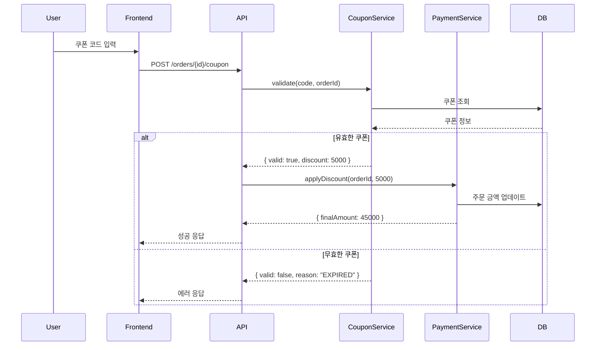
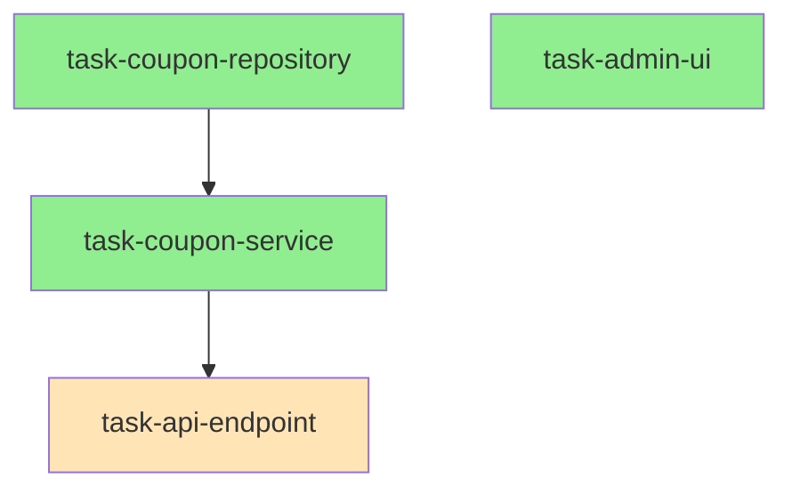

# Team Claude 플래닝 커맨드

요구사항을 분석하여 구조화된 스펙으로 정제하고 병렬 실행 가능한 Task로 분해합니다.

## 워크플로우

```
User: "결제 시스템에 쿠폰 할인 기능 추가해줘"
        │
        ▼
┌───────────────────────────────────────┐
│   STEP 1: Outline 구조화              │
│   ↕ UserAskQuestion (모호한 부분)     │
└───────────────────────────────────────┘
        │
        ▼
┌───────────────────────────────────────┐
│   STEP 2: Flow 도식화 (Mermaid)       │
└───────────────────────────────────────┘
        │
        ▼
┌───────────────────────────────────────┐
│   STEP 3: Contract 정의               │
│   ↕ UserAskQuestion (상세 스펙)       │
└───────────────────────────────────────┘
        │
        ▼
┌───────────────────────────────────────┐
│   STEP 4: Spec Review (에이전트)      │
└───────────────────────────────────────┘
        │
        ▼
┌───────────────────────────────────────┐
│   STEP 5: QA 테스트 항목 도출          │
└───────────────────────────────────────┘
        │
        ▼
┌───────────────────────────────────────┐
│   STEP 6: Task 분해 및 병렬성 분석     │
└───────────────────────────────────────┘
```

---

## STEP 1: Outline 구조화

요구사항을 계층적 구조로 정리합니다.

### 분석 항목

1. **핵심 기능** - 무엇을 구현해야 하는가?
2. **관련 도메인** - 어떤 비즈니스 영역에 속하는가?
3. **기존 코드 영향** - 어떤 파일/모듈이 수정되는가?
4. **의존성** - 다른 기능과의 연결점은?

### 모호함 감지 및 질문

요구사항에서 다음과 같은 모호함이 발견되면 `AskUserQuestion`으로 명확화:

| 모호한 표현 | 질문 예시 |
|------------|----------|
| "쿠폰 기능" | 쿠폰 유형은? (정률/정액/무료배송) |
| "할인" | 중복 할인 허용? 최대 할인 금액? |
| "추가" | 기존 결제 플로우 어디에 삽입? |
| "관리" | 관리자 UI도 필요? |

### Outline 출력 형식

```markdown
# 쿠폰 할인 기능 Outline

## 1. 쿠폰 관리
  ### 1.1 쿠폰 생성
  ### 1.2 쿠폰 목록/조회
  ### 1.3 쿠폰 수정/삭제

## 2. 쿠폰 적용
  ### 2.1 쿠폰 코드 검증
  ### 2.2 할인 금액 계산
  ### 2.3 결제 금액 반영

## 3. 쿠폰 사용 이력
  ### 3.1 사용 기록 저장
  ### 3.2 중복 사용 방지

## 4. (선택) 관리자 UI
  ### 4.1 쿠폰 생성 폼
  ### 4.2 사용 통계 대시보드
```

---

## STEP 2: Flow 도식화

핵심 플로우를 Mermaid 다이어그램으로 시각화합니다.

### Sequence Diagram



### 저장 위치

`.team-claude/specs/flows/coupon-apply.mermaid`

---

## STEP 3: Contract 정의

컴포넌트 간 인터페이스를 정의합니다. Contract가 확정되면 병렬 작업이 가능해집니다.

### Interface Contract

```typescript
// .team-claude/specs/contracts/coupon-service.ts

/**
 * 쿠폰 서비스 계약
 *
 * 구현 Task: task-coupon-service
 * 사용 Task: task-api-endpoint
 */
export interface ICouponService {
  /**
   * 쿠폰 유효성 검증
   * @throws CouponExpiredError - 만료된 쿠폰
   * @throws CouponUsedError - 이미 사용된 쿠폰
   * @throws CouponNotFoundError - 존재하지 않는 쿠폰
   */
  validate(code: string, orderId: string): Promise<CouponValidation>;

  /**
   * 쿠폰 적용 (사용 처리)
   */
  apply(code: string, orderId: string, userId: string): Promise<ApplyResult>;
}

export interface CouponValidation {
  isValid: boolean;
  discountType: "percent" | "fixed";
  discountValue: number;
  maxDiscount?: number;
  minOrderAmount?: number;
}

export interface ApplyResult {
  success: boolean;
  discountAmount: number;
  couponId: string;
}

// 에러 타입
export class CouponExpiredError extends Error {}
export class CouponUsedError extends Error {}
export class CouponNotFoundError extends Error {}
```

### API Contract

```typescript
// .team-claude/specs/contracts/api-endpoints.ts

/**
 * POST /api/orders/:orderId/coupon
 */
export interface ApplyCouponEndpoint {
  params: { orderId: string };
  body: { couponCode: string };
  response: {
    success: true;
    data: {
      discountAmount: number;
      finalAmount: number;
    };
  } | {
    success: false;
    error: {
      code: "COUPON_EXPIRED" | "COUPON_USED" | "COUPON_NOT_FOUND" | "MIN_ORDER_NOT_MET";
      message: string;
    };
  };
}
```

### 추가 질문

Contract 정의 시 모호한 부분은 `AskUserQuestion`으로 확인:

- "할인 상한이 있나요?" (percent 타입일 때)
- "최소 주문 금액 제한이 있나요?"
- "쿠폰 중복 적용이 가능한가요?"

---

## STEP 4: Spec Review (에이전트)

정의된 스펙을 설정된 에이전트들로 리뷰합니다.

### 리뷰 실행

```
Task(subagent_type="spec-reviewer", prompt=SPEC_CONTENT, run_in_background=true)
```

### 리뷰 항목

| 에이전트 | 검토 내용 |
|---------|----------|
| Domain Expert | 도메인 용어 일관성, 비즈니스 로직 완전성 |
| Security Agent | 인증/권한, 입력 검증, rate limiting |
| QA Agent | 엣지 케이스, 에러 시나리오 |

### 리뷰 결과 예시

```
🔍 Spec Review 결과

Domain Expert:
  ✅ 결제 도메인 용어 일관성
  ⚠️ 쿠폰 만료 처리 로직 명시 필요

Security Agent:
  ⚠️ brute force 방지 필요 (rate limiting)
  ⚠️ 쿠폰 코드 예측 방지 (랜덤 생성 규칙)

QA Agent:
  ✅ 기본 시나리오 커버됨
  ⚠️ 동시 적용 시나리오 추가 필요
```

---

## STEP 5: QA 테스트 항목 도출

리뷰 결과를 반영하여 테스트 케이스를 도출합니다.

### 테스트 분류

```markdown
# QA 테스트 항목

## 정상 케이스
- [ ] 유효한 쿠폰 적용 → 할인 반영
- [ ] 정률 할인 계산 (10% → 5000원)
- [ ] 정액 할인 계산 (3000원)

## 예외 케이스
- [ ] 만료된 쿠폰 → COUPON_EXPIRED 에러
- [ ] 사용된 쿠폰 → COUPON_USED 에러
- [ ] 존재하지 않는 쿠폰 → COUPON_NOT_FOUND 에러
- [ ] 최소 주문 금액 미달 → MIN_ORDER_NOT_MET 에러

## 엣지 케이스
- [ ] 동시 적용 시도 → 하나만 성공
- [ ] 최대 할인 금액 제한 적용
- [ ] 쿠폰 코드 대소문자 처리

## 보안 케이스
- [ ] 1분 내 10회 이상 시도 → rate limit
- [ ] 다른 사용자의 쿠폰 적용 시도 → 권한 에러
```

### 저장 위치

`.team-claude/specs/qa/test-cases.md`

---

## STEP 6: Task 분해 및 병렬성 분석

### Task 분해 기준

1. **기능적 독립성** - 다른 Task 없이 구현 가능한가?
2. **Contract 의존성** - Interface만 있으면 시작 가능한가?
3. **적절한 크기** - 1-2시간 내 완료 가능한 범위인가?

### Task 목록

```markdown
## Task 분해 결과

### task-coupon-service
- 범위: CouponService 구현
- 파일: src/services/coupon.service.ts
- 의존: 없음 (독립)
- Contract: ICouponService

### task-coupon-repository
- 범위: 쿠폰 DB 모델 및 리포지토리
- 파일: src/repositories/coupon.repository.ts
- 의존: 없음 (독립)

### task-api-endpoint
- 범위: 쿠폰 적용 API 엔드포인트
- 파일: src/routes/orders.ts
- 의존: task-coupon-service (Interface)

### task-admin-ui (선택)
- 범위: 관리자 쿠폰 관리 UI
- 파일: src/admin/pages/coupons.tsx
- 의존: 없음 (독립)
```

### 병렬성 분석

```
┌────────────────────────────────────────────────────────────┐
│                    병렬 실행 계획                           │
├────────────────────────────────────────────────────────────┤
│                                                            │
│  Round 1 (병렬 실행 가능):                                  │
│    ├── task-coupon-service ─────┐                          │
│    ├── task-coupon-repository ──┼── Interface 확정         │
│    └── task-admin-ui ───────────┘                          │
│                                                            │
│  Round 2 (Round 1 완료 후):                                │
│    └── task-api-endpoint                                   │
│                                                            │
└────────────────────────────────────────────────────────────┘
```

### 의존성 그래프



---

## 최종 출력

```
📋 스펙 정제 완료

생성된 문서:
  .team-claude/specs/
  ├── outline.md
  ├── flows/
  │   └── coupon-apply.mermaid
  ├── contracts/
  │   ├── coupon-service.ts
  │   └── api-endpoints.ts
  ├── qa/
  │   └── test-cases.md
  └── tasks/
      ├── task-coupon-service.md
      ├── task-coupon-repository.md
      ├── task-api-endpoint.md
      └── task-admin-ui.md

📊 병렬 실행 계획:
  Round 1: [task-coupon-service, task-coupon-repository, task-admin-ui] 동시 시작
  Round 2: [task-api-endpoint] (Round 1 완료 후)

시작하시겠습니까?
  /team-claude:spawn task-coupon-service task-coupon-repository task-admin-ui
```

---

## Task 스펙 문서 형식

각 Task는 다음 형식으로 생성됩니다:

```markdown
# Task: task-coupon-service

## 개요
CouponService 구현 - 쿠폰 검증 및 적용 로직

## Contract (구현해야 할 것)
- `ICouponService` interface (contracts/coupon-service.ts)

## 의존 Contract (사용할 것)
- 없음 (독립 모듈)

## 파일 위치
- src/services/coupon.service.ts (신규)
- src/services/coupon.service.test.ts (신규)

## 완료 조건
- [ ] ICouponService 모든 메서드 구현
- [ ] validate() - 만료/사용/미존재 에러 처리
- [ ] apply() - 동시성 처리
- [ ] 단위 테스트 커버리지 80% 이상
- [ ] lint/typecheck 통과

## 테스트 항목
1. validate() - 유효한 쿠폰
2. validate() - 만료된 쿠폰 → CouponExpiredError
3. validate() - 사용된 쿠폰 → CouponUsedError
4. validate() - 미존재 쿠폰 → CouponNotFoundError
5. apply() - 정상 적용
6. apply() - 동시 적용 → 하나만 성공

## 참고 자료
- Contract: .team-claude/specs/contracts/coupon-service.ts
- Flow: .team-claude/specs/flows/coupon-apply.mermaid
- QA: .team-claude/specs/qa/test-cases.md
```
