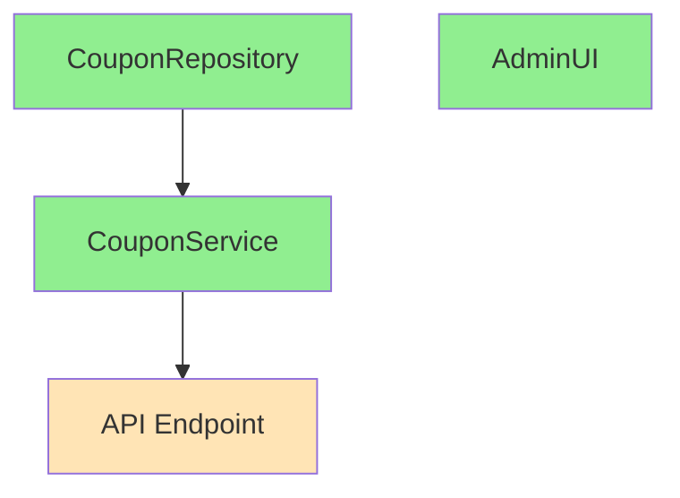

# Team Claude 플래닝 커맨드

요구사항부터 Task 분배까지 전체 스펙 정제 과정을 수행합니다.
각 단계마다 파일로 결과를 저장하고, 사용자 피드백을 통해 반복 개선합니다.

## 전체 워크플로우

```
┌─────────────────────────────────────────────────────────────────────────┐
│                     /team-claude:plan "요구사항"                         │
├─────────────────────────────────────────────────────────────────────────┤
│                                                                         │
│  ┌─────────────────────────────────────────────────────────────────┐   │
│  │  PHASE 1: 요구사항 정리 + Outline (아키텍처 설계)                │   │
│  │                                                                 │   │
│  │  1. 요구사항 구조화                                              │   │
│  │  2. Outline 작성 (큰 그림)                                       │   │
│  │  3. 리뷰 수행 (single/multi-llm)                                │   │
│  │  4. 리뷰 결과 → TODO 생성                                       │   │
│  │  5. UserAskQuestion으로 항목별 피드백                            │   │
│  │  6. 합의될 때까지 반복 ↻                                         │   │
│  │                                                                 │   │
│  │  저장: .team-claude/specs/outline/                              │   │
│  └─────────────────────────────────────────────────────────────────┘   │
│                              │                                          │
│                              ▼                                          │
│  ┌─────────────────────────────────────────────────────────────────┐   │
│  │  PHASE 2: 계약 설계 (Contract)                                   │   │
│  │                                                                 │   │
│  │  1. Outline 기반 Interface/Payload 정의                         │   │
│  │  2. 리뷰로 Outline과 일치 여부 검증                              │   │
│  │  3. UserAskQuestion으로 피드백                                   │   │
│  │  4. 합의될 때까지 반복 ↻                                         │   │
│  │                                                                 │   │
│  │  저장: .team-claude/specs/contracts/                            │   │
│  └─────────────────────────────────────────────────────────────────┘   │
│                              │                                          │
│                              ▼                                          │
│  ┌─────────────────────────────────────────────────────────────────┐   │
│  │  PHASE 3: Task 분배                                              │   │
│  │                                                                 │   │
│  │  1. 병렬 작업 가능성 분석                                        │   │
│  │  2. Task 분해 및 의존성 정리                                     │   │
│  │  3. UserAskQuestion으로 병렬 Task 확정                           │   │
│  │                                                                 │   │
│  │  저장: .team-claude/specs/tasks/                                │   │
│  └─────────────────────────────────────────────────────────────────┘   │
│                                                                         │
└─────────────────────────────────────────────────────────────────────────┘
```

---

## PHASE 1: 요구사항 정리 + Outline

### Step 1.1: 요구사항 구조화

사용자 입력을 분석하여 구조화합니다.

```markdown
# 요구사항 분석

## 원본 요구사항
"결제 시스템에 쿠폰 할인 기능 추가해줘"

## 핵심 기능
- 쿠폰 적용/검증
- 할인 금액 계산
- 결제 연동

## 모호한 부분 (UserAskQuestion으로 확인)
- 쿠폰 유형? (정률/정액/무료배송)
- 중복 적용 가능?
- 관리자 기능 필요?
```

**저장**: `.team-claude/specs/requirements/requirements-v1.md`

### Step 1.2: Outline 작성

큰 그림을 Outline으로 작성합니다.

```markdown
# 쿠폰 할인 기능 Outline

## 1. 쿠폰 관리
  ### 1.1 쿠폰 생성
  ### 1.2 쿠폰 조회/수정/삭제
  ### 1.3 쿠폰 통계

## 2. 쿠폰 적용
  ### 2.1 쿠폰 코드 검증
  ### 2.2 할인 금액 계산
  ### 2.3 결제 금액 반영

## 3. 사용 이력
  ### 3.1 사용 기록 저장
  ### 3.2 중복 사용 방지
```

**저장**: `.team-claude/specs/outline/outline-v1.md`

### Step 1.3: 리뷰 수행

설정에 따라 single 또는 multi-llm 리뷰를 수행합니다.

#### Single 모드 (기본)
```
Claude가 직접 리뷰 수행
- 완전성 검토
- 일관성 검토
- 누락 항목 확인
```

#### Multi-LLM 모드 (선택)
```
Task(subagent_type="outline-claude", run_in_background=true)
Task(subagent_type="outline-codex", run_in_background=true)
Task(subagent_type="outline-gemini", run_in_background=true)

→ 3개 관점 통합 리뷰
```

**저장**: `.team-claude/specs/outline/outline-review-v1.md`

### Step 1.4: 리뷰 결과 → TODO 생성

```markdown
# Outline 리뷰 TODO

## 필수 수정 (Blocking)
- [ ] 쿠폰 만료 처리 로직 추가 필요
- [ ] 동시 적용 시 우선순위 정의 필요

## 권장 사항 (Suggestion)
- [ ] 쿠폰 유형별 할인 계산 분리 권장
- [ ] 관리자 대시보드 스펙 보강 권장

## 확인 필요 (Question)
- [ ] 최대 할인 금액 상한선?
- [ ] 특정 상품 제외 기능?
```

### Step 1.5: UserAskQuestion 피드백

```
📋 Outline 리뷰 결과

━━━ 필수 수정 ━━━
1. 쿠폰 만료 처리 로직 추가 필요
2. 동시 적용 시 우선순위 정의 필요

━━━ 권장 사항 ━━━
3. 쿠폰 유형별 할인 계산 분리
4. 관리자 대시보드 스펙 보강

━━━ 확인 필요 ━━━
5. 최대 할인 금액 상한선?
6. 특정 상품 제외 기능?

각 항목에 대해 의견을 주세요:
  1. 동의 / 수정 의견 / 제외
  2. ...
```

### Step 1.6: 반복 또는 다음 단계

```
Outline 피드백 반영 완료

다음 단계를 선택하세요:
  1. ✅ Outline 확정 → Contract 단계로 이동
  2. 🔄 추가 리뷰 요청 (수정 후 재검토)
  3. ✏️ 직접 수정 (outline 파일 편집)
```

**최종 저장**: `.team-claude/specs/outline/outline-final.md`

---

## PHASE 2: 계약 설계 (Contract)

### Step 2.1: Contract 작성

확정된 Outline을 기반으로 Interface와 Payload를 정의합니다.

```typescript
// .team-claude/specs/contracts/coupon-service.ts

/**
 * 쿠폰 서비스 계약
 *
 * 관련 Outline: 2. 쿠폰 적용
 */
export interface ICouponService {
  validate(code: string, orderId: string): Promise<CouponValidation>;
  apply(code: string, orderId: string, userId: string): Promise<ApplyResult>;
  cancel(couponId: string, orderId: string): Promise<void>;
}

export interface CouponValidation {
  isValid: boolean;
  discountType: "percent" | "fixed" | "free_shipping";
  discountValue: number;
  maxDiscount?: number;
  minOrderAmount?: number;
  expiresAt: Date;
}
```

**저장**: `.team-claude/specs/contracts/contracts-v1.md`

### Step 2.2: Contract 리뷰 (Outline 일치 검증)

```markdown
# Contract 리뷰

## Outline 일치 검증

| Outline 항목 | Contract | 상태 |
|-------------|----------|------|
| 2.1 쿠폰 코드 검증 | ICouponService.validate | ✅ |
| 2.2 할인 금액 계산 | CouponValidation.discountValue | ✅ |
| 2.3 결제 금액 반영 | ICouponService.apply | ✅ |
| 3.2 중복 사용 방지 | ??? | ❌ 누락 |

## 발견된 이슈
- [ ] 중복 사용 방지 로직 Contract 누락
- [ ] 쿠폰 취소 시 환불 처리 명시 필요
```

**저장**: `.team-claude/specs/contracts/contracts-review-v1.md`

### Step 2.3: Contract 피드백 및 반복

```
📋 Contract 리뷰 결과

━━━ Outline 불일치 ━━━
1. ❌ 중복 사용 방지 로직 Contract 누락
2. ❌ 쿠폰 취소 시 환불 처리 명시 필요

━━━ 추가 권장 ━━━
3. ⚠️ 에러 타입 정의 추가

다음 단계를 선택하세요:
  1. 🔄 Contract 수정 후 재리뷰
  2. ✅ 현재 상태로 확정 → Task 분배로 이동
  3. ✏️ 직접 수정
```

**최종 저장**: `.team-claude/specs/contracts/contracts-final.md`

---

## PHASE 3: Task 분배

### Step 3.1: 병렬 작업 분석

```markdown
# 병렬 작업 분석

## 의존성 그래프



## 분석 결과

| Task | 의존성 | 병렬 가능 |
|------|--------|----------|
| task-coupon-repo | 없음 | ✅ Round 1 |
| task-coupon-service | repo Interface만 | ✅ Round 1 |
| task-admin-ui | 없음 | ✅ Round 1 |
| task-api-endpoint | service 구현 필요 | ⏳ Round 2 |
```

**저장**: `.team-claude/specs/tasks/parallel-analysis.md`

### Step 3.2: Task 분해

각 Task를 상세 스펙으로 분해합니다.

```markdown
# Task: task-coupon-service

## 개요
CouponService 구현 - 쿠폰 검증 및 적용 로직

## Contract (구현 대상)
- ICouponService (contracts/coupon-service.ts)

## 의존 Contract
- ICouponRepository (contracts/coupon-repository.ts)

## 완료 조건
- [ ] 모든 메서드 구현
- [ ] 단위 테스트 80% 이상
- [ ] lint/typecheck 통과

## 예상 파일
- src/services/coupon.service.ts
- src/services/coupon.service.test.ts
```

**저장**: `.team-claude/specs/tasks/task-coupon-service.md`

### Step 3.3: UserAskQuestion으로 Task 확정

```
📋 Task 분배 계획

━━━ Round 1 (병렬 실행) ━━━
  □ task-coupon-repo - 쿠폰 DB 모델/리포지토리
  □ task-coupon-service - 쿠폰 서비스 로직
  □ task-admin-ui - 관리자 쿠폰 관리 UI

━━━ Round 2 (Round 1 완료 후) ━━━
  □ task-api-endpoint - 쿠폰 API 엔드포인트

Task 분배를 확정하시겠습니까?
  1. ✅ 확정 → spawn 준비 완료
  2. 🔄 Task 조정 (분리/병합)
  3. ✏️ 직접 수정
```

---

## 파일 저장 구조

```
.team-claude/specs/
├── requirements/
│   └── requirements-v1.md        # 요구사항 정리
│
├── outline/
│   ├── outline-v1.md             # 초안
│   ├── outline-review-v1.md      # 리뷰 결과
│   ├── outline-v2.md             # 수정본 (반복 시)
│   ├── outline-review-v2.md      # 재리뷰 (반복 시)
│   └── outline-final.md          # 최종 확정본
│
├── contracts/
│   ├── contracts-v1.md           # 초안
│   ├── contracts-review-v1.md    # 리뷰 결과
│   └── contracts-final.md        # 최종 확정본
│
└── tasks/
    ├── parallel-analysis.md      # 병렬 분석
    ├── task-coupon-repo.md
    ├── task-coupon-service.md
    ├── task-admin-ui.md
    └── task-api-endpoint.md
```

---

## 설정에 따른 리뷰 모드

### planning.reviewers 설정

```json
{
  "planning": {
    "reviewers": {
      "mode": "single",        // "single" | "multi-llm"
      "providers": ["claude"]  // ["claude", "codex", "gemini"]
    },
    "autoSave": true,
    "maxIterations": 5
  }
}
```

### Single 모드 (기본)

- Claude만 사용하여 리뷰
- 외부 LLM 환경 설정 불필요
- 빠르고 간단

### Multi-LLM 모드

- Claude, Codex, Gemini 3개 관점 통합
- 다양한 시각에서 검토
- 외부 LLM CLI 설정 필요 (CODEX_API_KEY, GEMINI_API_KEY)

---

## 최종 출력

```
✅ 스펙 정제 완료

━━━ 저장된 파일 ━━━

  📁 .team-claude/specs/
  ├── requirements/requirements-v1.md
  ├── outline/outline-final.md
  ├── contracts/contracts-final.md
  └── tasks/
      ├── parallel-analysis.md
      ├── task-coupon-repo.md
      ├── task-coupon-service.md
      ├── task-admin-ui.md
      └── task-api-endpoint.md

━━━ 병렬 실행 계획 ━━━

  Round 1: [task-coupon-repo, task-coupon-service, task-admin-ui]
  Round 2: [task-api-endpoint]

━━━ 다음 단계 ━━━

  Worker 시작: /team-claude:spawn task-coupon-repo task-coupon-service task-admin-ui
```

---

## 중단 및 재개

Context가 길어지면 중간에 저장하고 재개할 수 있습니다.

### 현재 상태 저장

진행 중 언제든 상태가 자동 저장됩니다 (autoSave: true).

**저장**: `.team-claude/specs/.plan-state.json`

```json
{
  "phase": "contract",
  "iteration": 2,
  "lastFile": "contracts-v2.md",
  "timestamp": "2024-01-15T10:30:00Z"
}
```

### 재개

```
/team-claude:plan --resume
```

이전 Phase부터 계속 진행합니다.

---

## 에러 처리

### 설정 없음

```
❌ Team Claude가 초기화되지 않았습니다.

먼저 /team-claude:init 을 실행해주세요.
```

### 최대 반복 초과

```
⚠️ 최대 반복 횟수(5회)에 도달했습니다.

현재 상태:
  Phase: Outline
  Iteration: 5

선택하세요:
  1. 현재 상태로 강제 확정
  2. 반복 제한 늘리기 (/team-claude:config set planning.maxIterations 10)
  3. 취소
```
